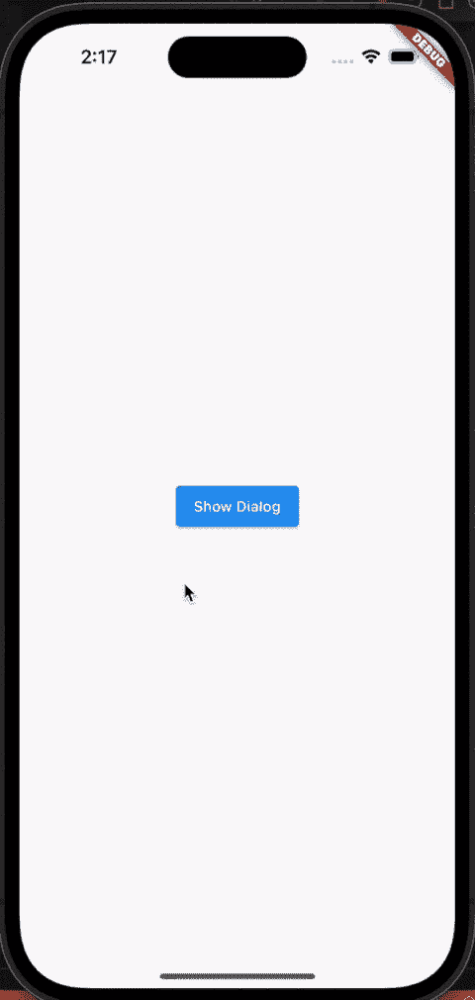
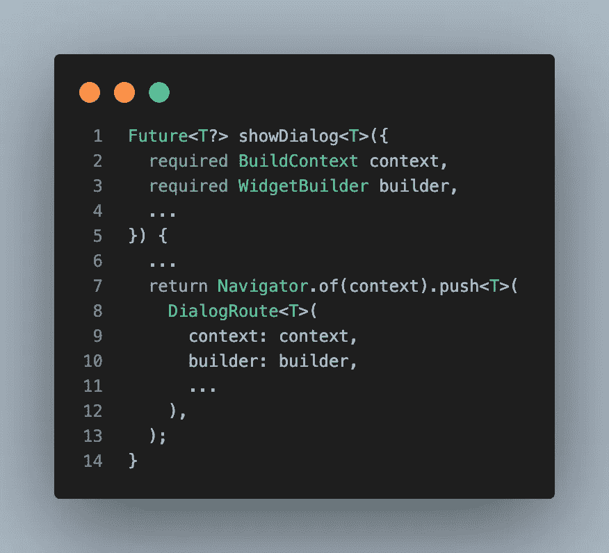
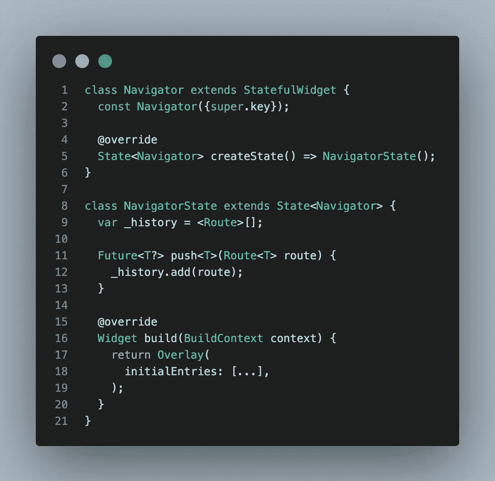
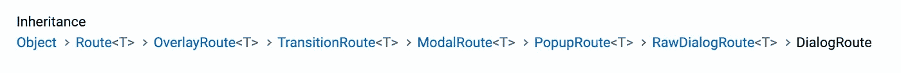

# 创建自己的对话框，不使用任何软件包！

> 原文：<https://itnext.io/create-your-own-dialog-without-using-any-packages-7bb303f62471?source=collection_archive---------1----------------------->

## 神奇的背后——颤动的路线

在这篇文章中，我们将学习如何创建我们自己的`showDialog()`函数，并理解真正发生了什么。

## 动机

先开始考察`showDialog`吧，看看里面有什么！

*showDialog 的过于简化版本*

如你所见，`showDialog()`所做的就是获取小部件并推送，就像`DialogRoute`使用`Navigator`一样。没什么特别的！

所以，如果我们想创建一个对话框，我们也应该使用`Navigator`和`Route`！

## 但是什么是导航器，为什么我们在对话中需要它？

*导航器的简化版本*

没错。`Navigator`也是一个`widget`！

> 毕竟，一切都是一个小部件，甚至是我，甚至是你，甚至是导航器本身——匿名 Flutter 开发者

本质上，`Navigator’s`的工作是管理一堆`Route`对象，并在`Overlay`小部件中可视化地切换小部件。

## 什么是叠加，为什么它很重要？

基本上，`Overlay`是一个有点特殊的`Stack`小部件，它将应用程序包装在`navigator`中。

(你可以在我之前的文章中找到详细的信息！)

 [## 创建自己的吐司不使用任何软件包！

### 在 Flutter 中，创建覆盖小部件非常容易，所以让我向您展示实现覆盖小部件有多容易！

itnext.io](/create-your-own-toast-without-using-any-packages-6d3828816f7c) 

正如你所猜测的，对话框只是 UI 上的小部件(就像 toast 小部件一样)，但是在这种情况下，`navigator`明智地使用`Routes`来控制它们。这就是为什么他们让我们感觉不一样。

是的，我们也可以使用`Overlay`小部件创建我们自己的小部件，但是我们也想与`navigator`交互，因为我们不想重新发明轮子！如果我们不使用`navigator`。我们必须处理所有的*转换、生命周期、后退按钮、可忽略的障碍、*等。

这就是为什么我们也应该知道路线！

记住，`showDialog()`使用`DialogRoute`也是有原因的。

## 但是`DialogRoute`有什么特别之处呢？

对话路由继承模式

从祖先那里获得超能力！让我告诉你怎么做！

让我们看看，在每一步，我们继承了什么！

## [路线](https://api.flutter.dev/flutter/widgets/Route-class.html) - >基本路线

" Route 是一个与导航器交互的基类."

## [重叠路由](https://api.flutter.dev/flutter/widgets/OverlayRoute-class.html) - >知道如何与重叠交互的路由

在[导航器](https://api.flutter.dev/flutter/widgets/Navigator-class.html)的[覆盖图](https://api.flutter.dev/flutter/widgets/Overlay-class.html)中显示部件的路线。"

## [过渡路线](https://api.flutter.dev/flutter/widgets/TransitionRoute-class.html) - >一条可以变魔术的路线

"有入口和出口转换的路线."

## 后面有障碍物的路线

"阻止与先前路由交互的路由。"

## [弹出](https://api.flutter.dev/flutter/widgets/PopupRoute-class.html) - >显示在当前路线上方的路线

"在当前路线上覆盖一个小部件的模态路线."

## [RawDialogRoute](https://api.flutter.dev/flutter/widgets/RawDialogRoute-class.html) - >预先配置好的对话路径

"一个通用的对话框路径，允许自定义弹出对话框."

## [对话路由](https://api.flutter.dev/flutter/material/DialogRoute-class.html) - >一个现成的、预先设计好的路由

具有材料进入和退出动画、模态屏障颜色和模态屏障行为的对话路径

*(句子均引用自* [*官方 api 文档*](https://api.flutter.dev) *)。)*

> 这里的教训是:当我们调用`showDialog()`时，它调用`navigator.push()`并且当`navigator`推动某物时，如果它是`PopupRoute`，它得到生命周期(从`Navigator`)、家庭(从`OverlayRoute`)、过渡(从`TransitionRoute`)、障碍(从`ModalRoute`)，并且出现在一条路线上(从它自己)。

无论如何，如果我们得到了主要的想法，让我们看看代码，学习如何创建我们自己的对话框！

# 对话示例

## 1.设计一个对话

创建你自己的对话框部件

## 2.创建您自己的对话框

在这个例子中，我将使用`PopupRoute`来进行我自己的配置。如果你想要预先配置的对话框，你可以使用`RawDialogRoute`或者`DialogRoute`，就像`showDialog()`所做的一样。

## 3.为可重用代码创建 showCustomDialog 方法

为了让事情变得更简单，我对它进行了扩展。

## 4.想用就用吧！

## GitHub 链接

您可以在这里获得完整的项目示例

 [## GitHub-rei-codes/custom _ dialog _ example

### 如何创建自己的自定义对话框，而不用从头开始使用任何软件包。

github.com](https://github.com/rei-codes/custom_dialog_example) 

# 感谢您的阅读！

请不要忘记点击👏按钮，并有一个美好的一天！