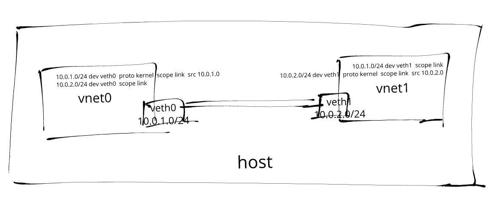

# 创建您自己的网络名称空间

> 原文：<https://itnext.io/create-your-own-network-namespace-90aaebc745d?source=collection_archive---------0----------------------->

两个不同网络名称空间中的一对 veth 接口

如果您一直在使用 Docker 和 Kubernetes 等容器虚拟化和编排软件，那么您可能听说过[网络名称空间](https://www.man7.org/linux/man-pages/man8/ip-netns.8.html)。

最近开始探索 Linux `[ip](https://linux.die.net/man/8/ip)` [命令](https://linux.die.net/man/8/ip)。在本文中，我将向您展示如何使用该命令通过一对`[veth](https://man7.org/linux/man-pages/man4/veth.4.html)`接口连接不同子网中两个不同网络名称空间中的进程。

# 关于网络命名空间

容器运行时使用[命名空间](https://www.man7.org/linux/man-pages/man7/namespaces.7.html)内核特性来划分系统资源，以实现某种形式的进程隔离，这样对一个命名空间中的资源的更改不会影响其他命名空间中的资源。此类资源的示例包括进程 id、主机名、用户 id、文件名和网络接口。

尤其是网络命名空间虚拟化了网络堆栈。每个网络名称空间都有自己的一组资源，如网络接口、IP 地址、路由表、隧道、防火墙等。例如，添加到网络命名空间的`iptables`规则只会影响进出该命名空间的流量。

# 命令语法

这篇文章剩余部分的一些`ip`命令最初看起来可能很复杂。但它们其实很简单。

一般来说，所有的`ip`命令都采用以下形式:

ip 命令语法

举个例子，

*   要添加新的网络接口，请使用`ip link add <interface-name> type <interface-type> <interface-arguments>...`
*   要为接口(设备)分配新的 IP 地址范围，请使用`ip addr add <ip-address-range> dev <device-name>`
*   要从路由表中删除一个路由条目，使用`ip route del <route-ip-range> dev <device-name>`

`-n`选项可以用来切换目标名称空间。例如，要将 10.0.1.0/24 IP 地址范围分配给`vnet0`网络名称空间中的接口`veth0`，请使用`ip -n vnet0 addr add 10.0.1.0/24 dev veth0`。

> 💡`-n`选项是`ip netns exec`的简称。

# 配置第一个网络命名空间

*执行所有后续命令需要 sudo 权限，已经在 Ubuntu 16.04.6 LTS 上测试。*

我们的第一个任务是使用`ip link add`命令创建一对新的`veth`接口`veth0`和`veth1`:

创建一对 veth 接口

`veth`接口通常被创建为互连对，其中在一端传输的数据在另一端被立即接收。这种类型的接口通常在容器运行时用于在不同的网络名称空间之间传输数据包。

让我们创建我们的第一个网络名称空间，`vnet0`。然后，我们可以将`veth0`接口分配给这个网络名称空间，并为其分配 10.0.1.0/24 IP 地址范围:

创建和配置 veth0 接口

如果我们试图从主机和网络名称空间都`ping`接口`veth0`会发生什么？

Pinging veth0 只能在 vnet0 中使用

请注意，从主机网络名称空间无法再访问`veth0`。

在进入下一步之前，让我们看看上面代码片段中的最后一个`ip netns exec`命令。这个命令允许我们在网络命名空间中执行任意命令。

它由两部分组成:

1.  `ip netns exec vnet0`标识目标网络名称空间
2.  `ping -c10 10.0.1.0`是要在目标名称空间中执行的命令

稍后我们将看到一个例子，这个命令被用来运行`tcpdump`来调试网络名称空间之间的一些路由问题。

# 配置第二个网络命名空间

我们将重用上面的命令来创建我们的第二个网络名称空间，`vnet1`。然后我们将`veth1`接口分配给这个网络名称空间，并将 10.0.2.0/24 IP 地址范围分配给这个接口:

创建和配置 veth1 接口

请注意，我们特意为`veth1`使用不同的子网 IP 范围，以便稍后建立路由调试会话。

与`veth0`接口类似，`veth1`接口不再可以从主机网络名称空间到达。`ping`仅适用于`vnet1`网络名称空间:

Pniging veth1 仅在 vnet1 中工作

# 配置子网之间的路由

H 然而，我们不能`ping`从它们的对等网络名称空间中选择任何一个`veth`对😟😟😟…

Ping 不能从对等网络命名空间中工作

由于两个接口都是`up`，并且`ping`在网络名称空间内工作，所以问题很可能与路由有关。

让我们使用`ip`命令进行一些调试！

我们可以通过使用`ip route get`命令来确定数据包采用的路由:

确定数据包将采用的路由

让我们检查两个网络名称空间中的路由表:

路由表中缺少路由条目

你能发现问题吗？

两个网络名称空间中的路由表仅具有用于它们各自子网 IP 范围的路由条目。它们没有通往其它子网的路由。我们可以使用`ip route add`命令将新的路由条目插入路由表:

使用对等网络的路由条目更新路由表

如果我们试图从对等网络名称空间再次与`ping`和`veth`接口…

对等接口之间的成功 pings

...有用！！🎉🎉🎉

我们还可以使用`tcpdump`来捕获在两个网络名称空间之间传输的数据包:

使用 tcpdump 捕获 vnet0 中的 ICMP 数据包

让我们通过测试 TCP 连接来结束这一部分。

使用`nc`命令在`vnet0`名称空间中的端口 7096 启动一个 TCP 服务器。然后从`vnet1`名称空间发起 TCP 握手连接:

启动 vnet0 和 vnet1 之间的 TCP 握手连接

一旦 TCP 连接建立，我们可以从`vnet1`向`vnet0`发送一条测试消息:

通过 TCP 连接发送消息

我们应该看到测试消息出现在`vnet0`网络名称空间中。

`tcpdump`还将获取在两个网络名称空间之间传输的所有数据包:

使用 tcpdump 捕获网络名称空间之间的流量

# 结论

在这篇文章中，我们看了不同的`ip`子命令，它们可以用来创建和配置网络名称空间、接口和路由。我们创建了一对`veth`接口。这些接口被分配给两个不同的网络名称空间，具有不同的子网 IP 地址范围。网络命名空间中的路由表配置了额外的路由，以支持两个子网之间的通信。

从主机网络命名空间无法访问两个`veth`接口。并且对它们的 IP 地址范围和路由表的更改被隔离到它们自己的网络名称空间。

我们使用`ip netns exec`命令运行类似`ping`和`tcpdump`的工具来调试网络名称空间之间的连接问题。

通过桥接接口将`veth`接口连接到主机网络名称空间将是未来文章的内容。