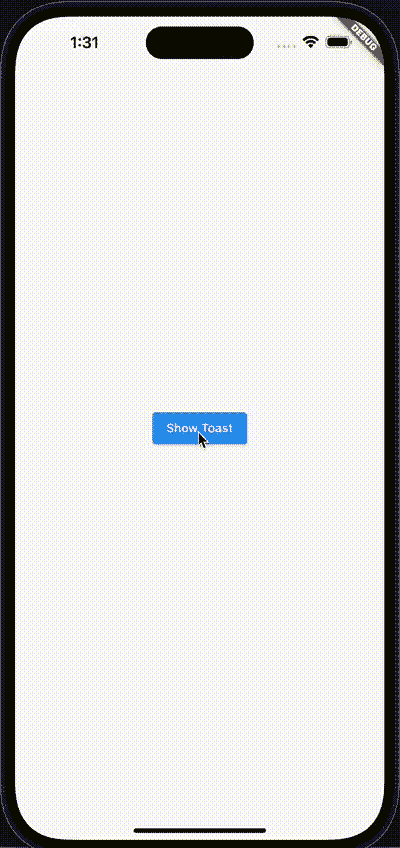
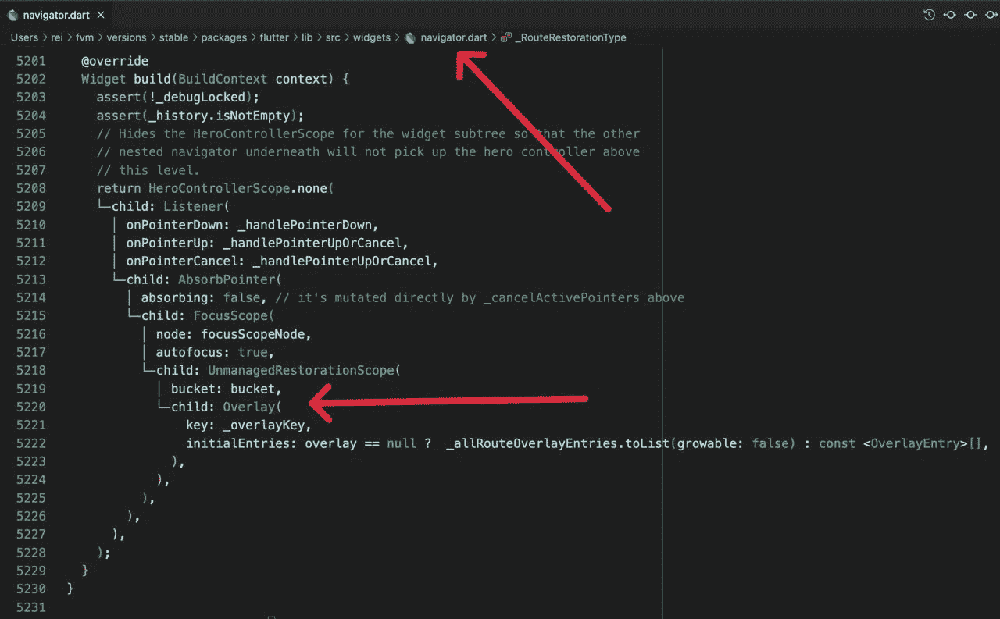
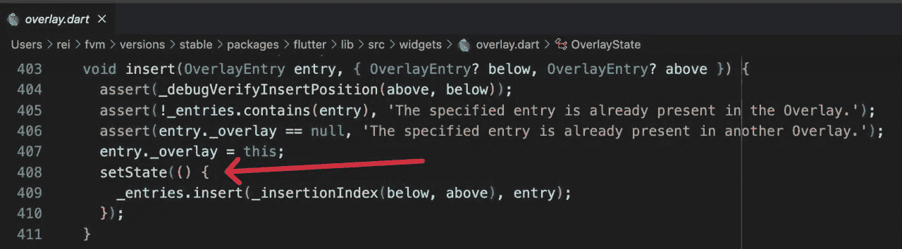
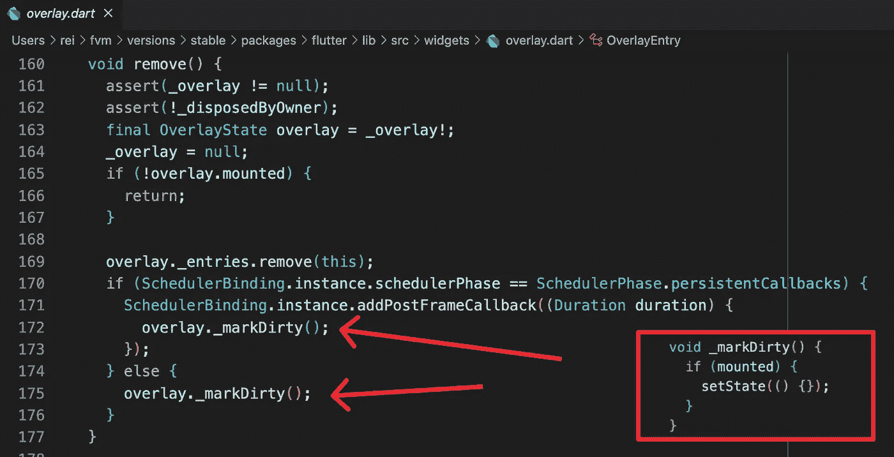
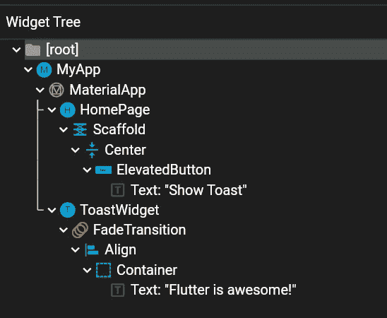

# 创建自己的吐司不使用任何软件包！

> 原文：<https://itnext.io/create-your-own-toast-without-using-any-packages-6d3828816f7c?source=collection_archive---------2----------------------->


## 魔术背后——覆盖

## 在 Flutter 中，创建覆盖小部件非常容易，所以让我向您展示实现覆盖小部件有多容易！

## 动机

```
context.showToast('Flutter is awesome!');
```



首先，要创建浮动小部件，我们需要使用`Overlay`小部件。但是，

## 什么是`Overlay`？

它只是一个像`Stack`一样的有状态窗口小部件，但是`Overlay`是用于管理应用程序中页面顶部的窗口小部件。就像一种特殊的`Stack`包装了整个应用程序。
(正好在`navigator`)



所以，基本上，如果我们添加一些东西到`Overlay`的堆栈中，它会以叠加的形式出现在 UI 上，如果我们移除它，它就会消失。
因为每当我们`insert`或者`remove`一个条目，`OverlayState`就会调用`setState`方法，即时更新 UI！



插入



去除

此外，最常见的是通过`Navigator` 间接使用`Overlay`，但直接使用也可以。*(稍后我还会做一篇*[](https://medium.com/itnext/create-your-own-dialog-without-using-any-packages-7bb303f62471)**)**

*现在，让我们把逻辑看作一个代码！*

## *1.用你的`CustomWidget`创造你的`OverlayEntry`*

*为了插入到`Overlay’s`堆栈中，我们需要首先创建一个`OverlayEntry`对象*

```
*final myEntry = OverlayEntry(builder: (_) => CustomWidget());*
```

## *2.将`OverlayEntry`插入`Overlay's`堆栈*

*当我们插入小部件时，`Overlay`将在 UI 上显示`myEntry`。*

```
 *Overlay.of(context)!.insert(myEntry);*
```

## *3.从`Overlay's`栈中移除 O `verlayEntry`！*

*当我们移除`myEntry`时，它会立即从用户界面上消失*

```
*myEntry.remove;*
```

*如果我们有了主要的想法，现在让我们做一个烤面包的小部件吧！*

# *吐司示例*

## *1-设计祝酒词*

*我还添加了一些定制的淡入淡出动画*

## *2.为可重用代码创建 showToast 方法*

*为了让事情变得更简单，我对它进行了扩展。*

## *3.使用方法显示任何地方的 toast 消息*

## *最后*

**

*小部件树*

*如你所见，`ToastWidget`并不依赖于`HomePage`或`ElevatedButton`。这就是为什么，它不会受到影响，即使他们被处置。*

## *GitHub 链接*

*您可以在这里获得完整的项目示例*

*[](https://github.com/rei-codes/overlay_example) [## GitHub-rei-codes/overlay _ example

### 一个新的颤振项目。这个项目是颤振应用的起点。一些帮助您入门的资源…

github.com](https://github.com/rei-codes/overlay_example) 

## 本文的第 2 部分

[](/create-your-own-dialog-without-using-any-packages-7bb303f62471) [## 创建自己的对话框，不使用任何软件包！

### 在本文中，我们将学习如何创建我们自己的 showDialog()函数，并了解在…

itnext.io](/create-your-own-dialog-without-using-any-packages-7bb303f62471) 

# 感谢您的阅读！

请不要忘记点击👏按钮，并有一个美好的一天！*