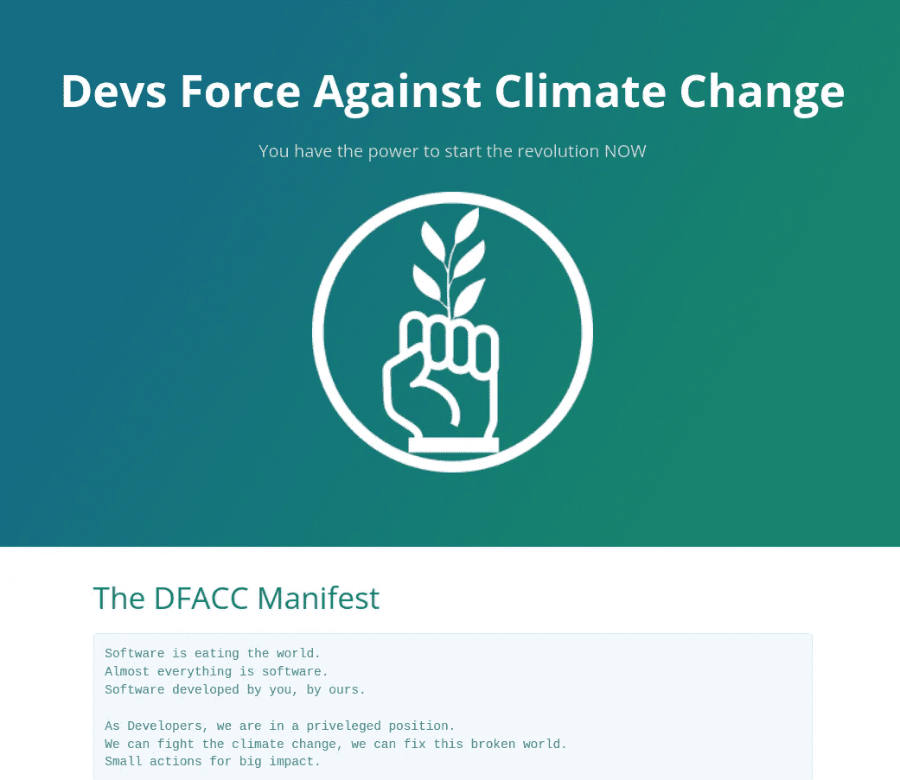
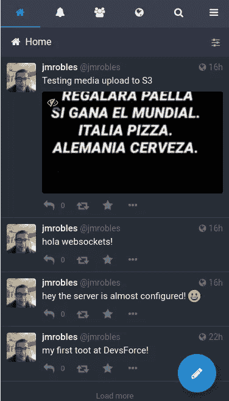

# 在 10 分钟内创建你自己的“推特”

> 原文：<https://itnext.io/create-your-own-twitter-in-10-minutes-271d26e7b186?source=collection_archive---------0----------------------->

**TL；你想像埃隆一样拥有自己的社交网络吗？加入联邦乳齿象微博。**


再见，再见推特！嗨乳齿象！

首先要做的是…

# 乳齿象是什么？

[**乳齿象**](https://mastodon.social/explore) 是一个开源的联合微博平台。等等，什么？

抱歉，让我换句话说。

你可能知道，埃隆·马斯克刚刚收购了 Twitter。

除了商业模式，他还想重新发明 Twitter。他未来的主要目标是:释放 Twitter 算法(我们不知道是全部，还是部分，在哪个许可中，..)

另一方面，前首席执行官兼联合创始人杰克·多西想要创建一个新的分布式“推特”，名为“蓝天”。分布式意味着没有一个大的数据中心来处理所有的信息，并且是在一个公司的控制之下(就像 Twitter 公司一样)。

但是你知道吗……已经有了一个(几乎)兼具这两个目标的社交网络。它的名字叫乳齿象，出生于 2016 年。

# 先决条件

可以想象，部署一个微博服务需要一些服务。

我们将所有建议用于生产环境。

以下是清单:

*   **Postgres** :存储用户数据、工具、设置等的数据库
*   **Redis** :用作缓存服务器和进程间通信
*   **SMTP 提供商**:用于电子邮件发送。
*   **弹性搜索**:对内容进行索引，支持全文搜索。
*   **Minio** (AWS S3 替代):存储和服务所有用户生成的媒体(你知道，很多迷因图片)。

我不会输入关于如何设置任何请求的服务的细节。

你可以关注我解释如何设置它们的那些帖子。

[](https://jmrobles.medium.com/fluentd-elasticsearch-kibana-your-on-premise-logging-platform-98822ab43e60) [## Fluentd + Elasticsearch + Kibana，您的本地登录平台

### 如何在 Kubernetes 上建立一个开源日志平台

jmrobles.medium.com](https://jmrobles.medium.com/fluentd-elasticsearch-kibana-your-on-premise-logging-platform-98822ab43e60) [](https://jmrobles.medium.com/how-to-create-a-kubernetes-cluster-with-rancher-on-hetzner-3b2f7f0c037a) [## 如何创建一个库伯内特集群与赫茨纳牧场主

### TL；DR:15 分钟内，你就可以有一个实验室集群准备好测试或部署你的项目，既便宜又容易。

jmrobles.medium.com](https://jmrobles.medium.com/how-to-create-a-kubernetes-cluster-with-rancher-on-hetzner-3b2f7f0c037a) 

然而，在启动我们的乳齿象实例之前，我将强调一些要执行的细节或步骤。

## 数据库准备

我们必须在数据库中创建一个用户(Postgres 角色)，并授予用户对数据库的所有权限。

连接到 Postgres 服务并执行以下语句:

```
CREATE USER mastodon WITH ENCRYPTED PASSSWORD 'a_very_good_secret';
CREATE DATABASE mastodon_production;
GRANT ALL PRIVILEGES ON DATABASE mastodon_production TO mastodon;
```

## SMTP 提供程序

嗯，你可以使用你喜欢的 SMTP 提供商。无论选择哪一个，您都必须验证发件人域，并为 SPF 和 DKIM 反垃圾邮件进程准备 TXT DNS 记录。

## AWS S3 或 Minio

这里的重点是访问策略。

您需要一个允许任何匿名用户读取的策略，但是只有经过身份验证的 mastodon 用户可以写入和管理这些文件。

这是我们针对`mastodon`桶的 AWS 政策。

# 基础设施

除了 SMTP 提供者，其余的都在集群中运行。

关于正确的乳齿象堆叠。我们将需要运行三个服务。

*   **乳齿象网**:核心服务器。一个 Ruby-on-Rails 应用程序。
*   **乳齿象流**。节点 WebSocket 服务器。这提供了“推送”功能。
*   **乳齿象 sidekiq** 。执行发送电子邮件和删除过期会话等任务的后台进程。

# YAML 电码

我创建了 [**这个库**](https://github.com/jmrobles/mastodon-kubernetes) ，其中包含了您需要的所有 K8S 定义，但是我将展示最相关的规范。

[](https://github.com/jmrobles/mastodon-kubernetes) [## GitHub-JM Robles/乳齿象-kubernetes:乳齿象在 kubernetes 上奔跑

github.com](https://github.com/jmrobles/mastodon-kubernetes) 

## 机密和配置

正如我之前所说的，我们有很多基础设施服务需要运行我们的乳齿象实例。

我把除用户名和密码之外的所有东西都放进了 Kubernetes `config`。

以下是一些评论:

*   SMTP :您必须确保您的邮件提供商允许使用`SMTP_FROM_ADDRESS`框。
*   **日志级别:**小心点，如果你加上`INFO`或者`DEBUG`，你可能很快就会遇到“没有可用空间”的问题。
*   带 MinIO 的媒体存储器:如果你使用 AWS S3，你可以避免这里介绍的许多设置。突出显示`S3_ENDPOINT`和`S3_OVERRIDE_PATH_STYLE`，如果你使用的是 MinIO 而不是 S3。

秘密

如您所知，每个数据值都必须用 base64 编码。您可以使用 shell 轻松地编写代码。即

```
$ echo -n "a_password" | base64
YV9wYXNzd29yZA==
```

关于自己的秘密:

*   `DB_PASS`是 Postgres 用户密码
*   `SMTP_LOGIN`和`SMTP_PASSWORD`是您的 SMTP 提供商的凭证。
*   `AWS_ACCESS_KEY_ID`和`AWS_SECRET_ACCESS_KEY`是常见的 AWS API 凭证。在我的例子中，我使用 Minio，但是如你所知，Minio 模仿 AWS S3 API。
*   最后但同样重要的是`SECRET_KEY_BASE`、`OTP_SECRET`、`VAPID_PRIVATE_KEY`和`VAPID_PUBLIC_KEY`。这些凭证是使用 Rake 命令创建的。
    在`SECRET_KEY_BASE`和`OTP_SECRET`的情况下，可以执行以下一次性 Docker 生成。两次跑步，两个不同的秘密。

```
docker run --rm -it tootsuite/mastodon:latest bundle exec rake secret
```

对于`VAPID_PRIVATE_KEY`和`VAPID_PUBLIC_KEY`，我们再次运行一个容器，但是使用不同的命令

```
docker run --rm -it tootsuite/mastodon:latest bundle exec rake mastodon:webpush:generate_vapid_key
```

在通过 B64 编码后，记下秘密 YAML 中的两个值(公共和私有)。

部署

关于部署清单的一些有趣的注释:

*   它创建了一个包含 3 个容器的部署。`mastodon`、`mastodon-sidekiq`和`mastodon-streaming`。
*   初始容器用于运行数据库迁移。
*   所有容器都使用`envFrom`直接从配置和机密中加载配置和机密。

最后一部分是入口(带有服务定义)。

# 结果:介绍 DevsForce.org 乳齿象实例

嗯，两个现实中的介绍。

[DevsForce.org](https://devsforce.org/)是一个开放的想法，关于世界各地的开发者如何组织起来对抗一个共同的敌人:**气候变化**。



一个登陆页面(由 Hugo static Go 框架支持)

正如我之前所说的，现在这只是一个“快乐的想法”…但是当我探索创建乳齿象实例的想法时，我认为在 devsforce.org 周围创建它是一个伟大的想法，所以它在这里…



mastodon.devsforce.org 跑了！

如果您是一名开发人员，并且对气候变化有一些担忧，请加入我们！我们在我们的乳齿象实例中等待您的:)

# 结论

关于技术解决方案，我认为现在运行一个乳齿象实例有点复杂。有了 Kubernetes，我们可以很容易地做到这一点，如你所知，如果你的社区规模扩大，很容易以同样的速度扩大。

我的 Kubernetes 方法处于非常早期的阶段。我们可能需要在入口执行更多的更改，以改进缓存、压缩或其他改进。

在哲学层面上，嗯，依我拙见，**我不喜欢像 Twitter 这样的人类工具只听命于一个公司**，或者更糟，只听命于一个亿万富翁。

我喜欢联盟的概念。有了乳齿象这样的东西，我们就有了分布式微博平台的机会，在这个平台上，许多实例一起工作，但它们没有集中式平台的问题。

另一方面，又出现了新的问题。如何维护一个实例？捐款？订阅？你将如何调节内容？在欧洲，必须审核内容，因为实例管理员是主要负责人。我们不能忘记饼干法，GDPR，…

我们正处在一个关于新互联网的有趣的时刻，在这里“联邦”是一个需要考虑的新概念。

你怎么想呢?“联邦宇宙”见。