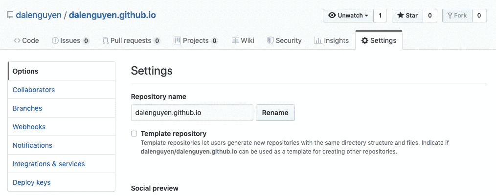
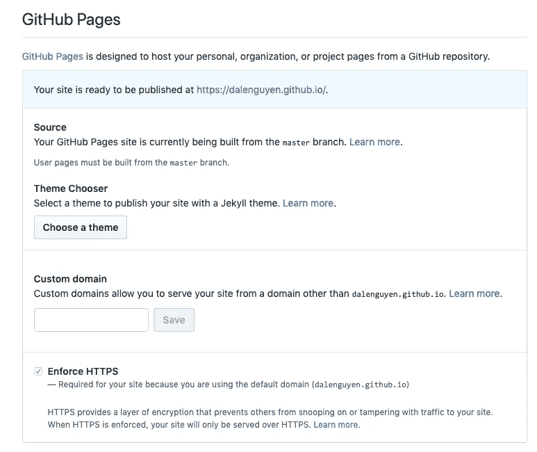
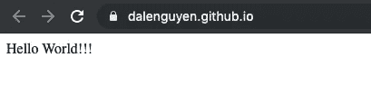
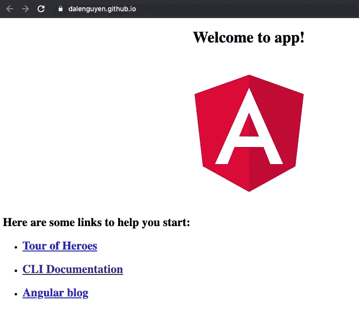
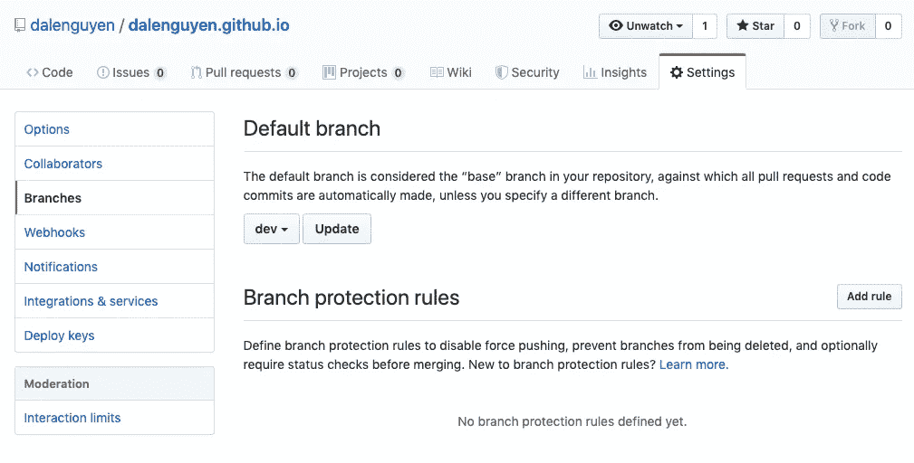

# 使用 Github 页面免费创建您的网站——Angular

> 原文：<https://itnext.io/create-your-website-for-free-with-github-pages-angular-4a932a2de309?source=collection_archive---------3----------------------->


Github 非常适合存储和共享项目。如果你可能不知道，Github 还可以托管你的网站——免费，但有一些限制。这就是为什么你不应该用它来运行在线业务或电子商务网站。

*   GitHub Pages 源代码库的[建议限制为 1GB](https://help.github.com/en/articles/what-is-my-disk-quota/#file-and-repository-size-limitations) 。
*   发布的 GitHub Pages 站点可能不超过 1 GB。
*   GitHub Pages 网站有一个每月 100GB 的*软*带宽限制。
*   GitHub Pages 站点有一个每小时 10 次构建的软限制。

这是一个用 HTML、CSS 和 JavaScript 构建静态网站的平台，所以我将从这个简单的帖子开始创建我的个人网站(Angular、Firebase、Github pages)。

**创建一个** [**的新资源库**](https://github.com/new)



之后，您可以将简单的 index.html 推送到您的主分支机构。

```
git clone [https://github.com/username/username.github.io](https://github.com/username/username.github.io)
cd username.github.io 
echo "Hello World!!!" > index.html// Push your file to github
git add --all 
git commit -m "Initial commit" 
git push -u origin master
```

**检查您的项目设置**



现在，您可以访问您的网站。是不是很迷人！！！



过了这一刻，就完全取决于你的想象力和技巧了——修改**index.html**文件并推回给 master → **DONE** 。

**用 Angular 项目构建 Github 页面**

现在，我们将利用 Angular 在 Github 页面上构建我们的网站。部署到 Github 需要 angular-cli-ghpages 。

```
npm install -g angular-cli-ghpages
```

该网站是在硕士，所以我们需要为开发过程创建一个开发分支。

```
git checkout -b dev
```

创建一个新的 Angular 项目，确保该项目位于 git 的根文件夹中。

```
ng new username-github-io
```

记得编辑 **angular.json** 文件，这样构建将在 **dist** 文件夹下，而不是 **dist/app** 下。

准备部署

```
ng build --prod --base-href 'https://username.github.io/'
```

将项目部署到主控形状

```
 ✔  ngh --message="Commit message"
 ✔  ngh —branch=master
 ✔  ngh --dry-run
 ✔  ngh> app@0.0.0 deploy
🚀 Successfully published via angular-cli-ghpages! Have a nice day!
```

耶，我的 angular 项目正在被部署到 Github 页面上！！！



这是最后一步，我们需要将默认分支更新为 dev，因为主分支将拥有生产文件。开发部门会让你更好地了解这个项目。



你可以看看我的 [Github](https://github.com/dalenguyen/dalenguyen.github.io) —真实项目可能还没更新:)