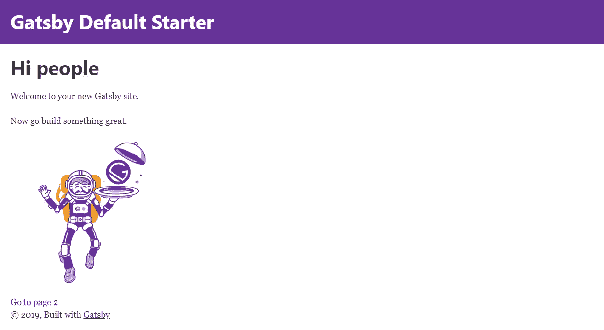
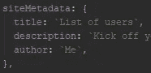
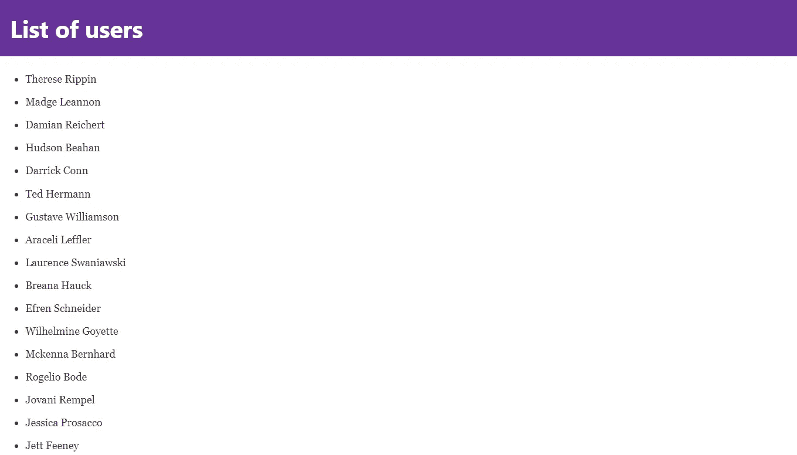

# 创建一个超快的盖茨比应用程序

> 原文：<https://itnext.io/creating-a-blazing-fast-gatsby-app-5ccbc9bef377?source=collection_archive---------7----------------------->


## 从头开始创建一个使用 API 数据的概述

Gatsby 是一个速度极快的静态站点生成器。这是一个基于 React 的开源框架，可用于构建网站和应用。在本文中，我将一步一步地向您展示如何使用 Gatsby 构建一个应用程序。我将使用一个 API 为我们的应用程序提供数据。我们将要使用的 API 是 [RandomAPI](https://randomapi.com/) ，它提供随机数据。我们将创建一个概述，列出我们将从 API 获取的数据。

## 先决条件

我假设您已经安装了 Node.js 和 npm。注意，Gatsby 支持的最低 Node.js 版本是 Node 8。要检查 Node.js 版本，您可以打开一个终端并输入命令`node -v`。

在我们开始之前，你最不需要的就是 Git。建立您的第一个 Gatsby 站点需要 Git。在安装 Gatsby starter 站点时，Gatsby 在后台使用 Git 来下载和安装您的 starter 所需的文件。如果你还没有安装 Git，请访问这个网站。

## 安装盖茨比

现在您已经具备了所有的先决条件，我们实际上可以从安装 Gatsby 开始。要全局安装 Gatsby，请使用以下命令:

`npm install -g gatsby-cli`

安装完 Gatsby 后，我们可以创建一个新项目。您可以随意命名您的项目。通过执行以下命令可以做到这一点。

`gatsby new *projectname*`

请注意，该命令将为您的项目创建一个文件夹。

## 查看项目文件夹

让我们进入项目文件夹，看看 Gatsby 已经安装了什么。你可以使用`cd *projectname*` 命令来完成。

要启动并运行一切，你可以使用`gatsby develop`命令。这将编译您的代码并启动一个服务器。您可以在 [http://localhost:8000/](http://localhost:8000/) 查看您的网站。

如您所见，Gatsby 生成了 starter 网站。



让我们看一下代码。该项目包含四个文件夹:

*   *。缓存*
    这个文件夹是 Gatsby 自动创建的内部缓存。此文件夹中的文件不允许修改。
*   *node_modules*
    这里是安装所有模块和包的地方。
*   *公共*
    这就是静态网站产生的地方。这个目录将包含所有与你将在网站前端看到的内容相关的代码。
*   这是所有代码的所在地。Src 的意思是源代码。

在项目根文件夹中也有很多文件，但是目前唯一相关的文件是 *gatsby-config.js* 。这是 Gatsby 站点的主要配置文件。这个文件包含一些关于网站的元数据，以及项目中使用的插件。默认安装了一些插件。

由于我们将创建一个概述来列出我们从 API 中检索的所有用户，我将把站点标题改为*用户列表*。您可以通过更改 *siteMetadata* 对象中的 *title* 属性来实现这一点。



现在切换回您的网站，注意页面会自动刷新。这是因为 Gatsby 的开发环境具有热重装功能。

## src 文件夹

如前所述，src 文件夹是代码所在的地方。该文件夹有三个子文件夹:

*   *组件*
    这个文件夹包含了所有可以用来构建页面的组件。
*   *图片*
    所有的图片都存储在这个文件夹中。
*   *页面*
    该文件夹中的组件自动变成页面，路径基于其文件名。

# 编码时间到了

为了从 API 获取数据，我们将创建一个源代码插件。源插件将远程或本地位置的数据“源”到节点中。

> 源插件将来自任何源的数据转换成 Gatsby 可以处理的格式。

你可以使用现有的插件，也可以自己创建一个，这就是我们将要做的。

## 创建插件

自定义插件放在*插件*文件夹中。我们必须创建该文件夹，因为它不是默认创建的。创建文件夹后，移动到文件夹中。

```
mkdir plugins
cd plugins
```

插件的基本要素是一个以你的插件命名的目录，其中包含一个 *package.json* 文件和一个 *gatsby-node.js* 文件。

```
|-- plugins
    |-- gatsby-source-randomapi
        |-- gatsby-node.js
        |-- package.json
```

我们的插件将被称为*Gatsby-source-random API*。创建文件夹并移入该文件夹。

```
mkdir gatsby-source-randomapi
cd gatsby-source-randomapi
```

接下来，我们创建一个 *package.json* 文件，它描述了你的插件和它可能依赖的任何第三方代码。Npm 有一个命令可以为您创建这个文件。

```
npm init --yes
```

在 *package.json* 文件被创建后，我们将安装一个插件需要从 API 获取数据的包:

```
npm install node-fetch --save
```

我们需要创建的最后一个文件是 *gatsby-node.js* 。该文件将包含从 API 检索数据的所有逻辑。

## 添加插件

要开始在您的项目中使用这个插件，您必须将它添加到 *gatsby-config.js* 文件中的*插件*数组中。将以下对象添加到*插件*数组中:

```
{
  resolve: `gatsby-source-randomapi`,
  options: {
    endpoint: `6de6abfedb24f889e0b5f675edc50deb`,
  },
},
```

注意，我添加了一个包含端点的*选项*对象。我这样做是为了让您可以轻松地替换掉 RandomAPI 端点。在本例中，我们将使用的端点是[https://randomapi.com/api/6de6abfedb24f889e0b5f675edc50deb](https://randomapi.com/api/6de6abfedb24f889e0b5f675edc50deb)。

## 获取数据

要开始从 API 获取数据，请将以下代码粘贴到您的 *gatsby-node.js* 文件中。

这段代码使用了我们之前安装的节点获取包。在第 9 行，我们将 Gatsby 配置中的端点变量存储到一个变量中。第 10 行构建了我们将要调用的完整 API URL。

在这个例子中，我们遍历从 API 检索的结果，并在控制台中记录每个用户的数据。

您可以通过在项目的根目录下打开一个新的终端并执行`gatsby develop`命令来测试这段代码。如果一切正常，您将看到如下内容:

```
[ 
  { first: 'Moriah',
    last: 'Kautzer',
    email: '[Moriah.Kautzer@yoshiko.biz](mailto:Moriah.Kautzer@yoshiko.biz)',
    address: '017 Langosh Lodge',
    created: 'January 11, 2011',
    balance: '$6,009.47' },
  { first: 'Rolando',
    last: 'Buckridge',
    email: '[Rolando.Buckridge@ryan.biz](mailto:Rolando.Buckridge@ryan.biz)',
    address: '414 Heathcote Ways',
    created: 'January 16, 2012',
    balance: '$9,526.45' },
  { first: 'Tianna',
    last: 'McCullough',
    email: '[bluerabbit83@gmail.com](mailto:bluerabbit83@gmail.com)',
    address: '25435 Lynch Glens',
    created: 'March 1, 2015',
    balance: '$5,941.26' },

    .... 
]
```

对于 API 响应，我们唯一要做的事情就是创建节点。在下面的例子中，我添加了一个助手函数，名为 *processUser* ，它返回一个节点对象。然后使用 *createNode* 函数创建这个节点对象。

在更新了 *gatsby-node.js* 代码之后，再次运行 *gatsby develop* 命令，并转到[http://localhost:8000/_ _ _ graph QL](http://localhost:8000/___graphql)来检查节点是否被正确存储。

执行以下查询:

```
query MyQuery {
  randomApiUser {
    internal {
      content
    }
  }
}
```

如果您已经正确地设置了一切，这个查询将返回用户对象的 JSON 数据。

## 构建概述

为了构建概述，我们需要在*组件*文件夹中创建一个新组件，名为 *overview.js* 。该组件将创建一个无序列表，显示每个用户的名和姓。

因为我们想在主页上显示概述，我们必须将组件添加到 *pages* 文件夹中的 *index.js* 文件中。我们刚刚创建的概述被添加到第 10 行。

现在我们已经准备好了一切，是时候检查最终结果了。



就是这样！您已经成功地创建了一个 Gatsby 应用程序，它从一个 API 获取数据并将结果放入一个概览中。如果您有任何反馈、问题或希望我写另一个与编程相关的主题，请随时留下您的评论。

感谢阅读！