# 在 AWS 上创建微服务和事件源的蓝图

> 原文：<https://itnext.io/creating-a-blueprint-for-microservices-and-event-sourcing-on-aws-291d4d5a5817?source=collection_archive---------1----------------------->


整个

## 使用 Kinesis，Lambda，S3，DynamoDB，API Gateway 和 Kubernetes

这是你寻求建筑圣杯的第三部分，在这里你已经无情地 [*扼杀了巨石*](/from-monoliths-to-microservices-b6b851ab43e3) 和勇敢的 [*战斗怪兽架构*](/microservices-the-event-sourcing-way-124a8a772680) 最终拥抱了 kubernetes 和微服务的容器编排的勇敢新世界。

现在是时候让自己进入这个故事的另一个令人兴奋的部分了，在这里，您将独自构建一个事件采购/CQRS/微服务架构以及您的单片应用程序，只需要您友好的社区云提供商 Amazon Web Services 的一点点帮助。

> 我需要在这里添加一个免责声明，以防止不必要的云战争:这是关于在 AWS 平台上构建这个架构，利用 AWS 特定的托管服务。虽然我不认为每个云提供商*都是平等的*，但我也认为其他两个顶级提供商 *Azure* 和 *GCP* 将为你提供足够的工具来构建一切，如果不是今天，肯定是明天。我只是碰巧知道 AWS *多一点*。

构建事件源/微服务架构已经有很多年的历史了，事实上这些概念都不是全新的，拥有大量资源的公司构建类似的系统已经有一段时间了。但直到今天，利用完全托管的云服务，构建它实际上已经足够简单，只需要更有限的资源和工作。

您将使用 *Kinesis 数据流*作为事件流， *Kinesis Firehose* 备份您的 S3 数据湖中的所有事件， *DynamoDB* 作为持久事件存储来克服 Kinesis 对消息保留的限制， *Lambda* 订阅 Kinesis 事件并实现简单的微服务， *API 网关*和/或*CloudFront**Lambda @ Edge*将请求路由到

如果您对 AWS *PaaS* (平台即服务)和 *FaaS* (功能即服务)产品感到有些犹豫和怀疑，如果您想知道利用所有这些托管服务是否会导致您受限于您的云提供商，那么答案当然是肯定的，您的担忧是有道理的。

不过，在我看来，如果你考虑在 AWS 上构建所有这些所需的工作量，然后如果你决定在 GCP 上再做一次，如果你不得不在 Azure 上再做一次，这仍然比你试图自己构建所有这些所需的工作量少，只是利用你的云提供商的 *IaaS* (基础设施即服务)产品。它只需要少得多的工作、专业知识，最终还需要钱。这不仅仅是利用服务，而是所有的监控和警报以及内置的安全性，您必须自己去实现。它不适合胆小的人。

而且，想想看，当你忙着逐步淘汰你的 monolith，同时给你的应用程序添加功能时，优秀的云计算人员会忙着给平台添加功能，准备好供你使用。

你是不是跳到页面底部写了一条下流的评论，说我一直在喝云库尔 aid？还没有？

然后，让我们开始看看您将需要的(托管)服务，以及您将如何一起使用它们，以及您需要注意什么。

# 写入事件流

你的 Monolith 和你的新兴微服务都将被赋予向事件流中写入事件的任务。系统整体状态的任何变化(突变)都会去流。记住，如果源应用程序状态在流中，就没有办法绕过它。

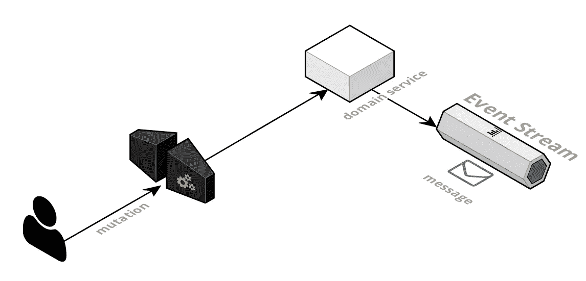

再简单不过了

假设突变是外部的，这意味着应用程序状态的任何突变都将从外部来源发送到您的 monolith 或特定于域的微服务。

使用 [*扼杀者模式*](https://www.martinfowler.com/bliki/StranglerApplication.html) 的路由将被实现为边缘服务，要么使用支持请求路由的 CDN，要么使用 AWS API 网关。更好的是，任何支持在边缘运行代码的东西，如 [*Fastly*](https://www.fastly.com/) 或[*CloudFront Lambda @ Edge*](https://docs.aws.amazon.com/AmazonCloudFront/latest/DeveloperGuide/lambda-at-the-edge.html)*将允许您根据用户的身份、省份或分割测试的结果，动态地决定将请求路由到哪里。*

*变异一旦被验证并可能转换成结果事件，将通过事件流传播到任何其他下游服务。*

*事件流是这个架构的核心，在 AWS 上选择是显而易见的:Kinesis 数据流。哪个不是 [*卡夫卡*](https://kafka.apache.org/) ，尽管两者都以 *K* 开头。*

# *Kinesis 数据流*

**

*由 [Unsplash](https://unsplash.com?utm_source=medium&utm_medium=referral) 播出的 [Alexander Redl](https://unsplash.com/@alexanderredl?utm_source=medium&utm_medium=referral) 拍摄的《一辆出租车穿过圣诞彩灯装饰的繁忙街道上的十字路口》*

> *Kίνησις的意思是*运动，动作*。我提到过我在学校学过古希腊语吗？我知道有一天它会有用的。*

*有很多文章和资源你可以 [*谷歌*](https://www.google.com/search?q=kinesis+vs+kafka) ，比较*Kinesis vs Kafka*的利弊。公平地说，你也可以使用许多 [*管理的 Kafka 产品*](https://www.google.com/search?q=managed+kafka) ，但最终很容易看出 Kafka 是你定制的越野车，车上有顶级的娱乐系统，而 Kinesis 是一辆黄色的出租车轿车(带有有点烦人的*出租车电视* ) *。*你会选择哪一个？*

*后者(Kinesis)会带你去你想去的地方，但如果你要求走捷径，垂直爬上悬崖(或者至少大多数人会这样做)，司机会礼貌地拒绝。前者(卡夫卡)将做你想做的一切，但有时它需要大量的维护，如果在与道路的一些有趣的碰撞后，你的对准被关闭，或者你的悬架因颠簸过多而受到影响，以及娱乐系统崩溃。*

*住在纽约，大多数时候，我只要坐出租车就很开心了。你也可以关掉出租车电视。*

*因为它就像一辆黄色出租车，有 [*明确记录的服务限制*](https://docs.aws.amazon.com/streams/latest/dev/service-sizes-and-limits.html) 限制你可以用 Kinesis 做什么，但这些限制*是为了保护你*，以便你可以保持在可以保证工作的限制内，而不是设计一些最终会占用你所有时间和资源来保持它运行的东西。*

*Kinesis 有两种类型的限制你需要处理:*架构*和*速率/吞吐量限制*。*

*一个理论上完美的事件流保证*消息的精确一次传递和排序*，以及无限的消息保留，但这不是你能轻易找到的东西。*

*用一条简单的微博解释了物理定律的不可饶恕性。*

**架构约束*使得 Kinesis 成为理想事件流的不完美(但接近)近似。消息有时可以被传递多次，并且排序保证带有一些警告。哦，如果您支付额外费用，您的信息最多可以保留 7 天。默认情况下，是 24 小时。*

*相反，*速率/吞吐量限制*约束是关于 API 请求速率限制和吞吐量的，但是不要因为它们而气馁，它们有很好的文档记录，并且在大多数情况下你可以在它们之内工作。*

> *顺便提一句，我记得有一次与一家知名云提供商的托管数据存储库打交道时，没有任何记录的吞吐量或延迟限制。支持工程师的回答只是:“*没有”*。因此，如果你在寻找一种可以突然以 0 毫秒的延迟推动每秒 10 亿字节的 googolplex，请问我使用哪一种。还有我正在出售的那座桥。*

*围绕这些约束设计您的系统是最重要的，但不用担心:您可以控制上下文、问题域和您在流中发送和接收的消息的性质，以及用于处理(或拒绝)它们的逻辑。知道这个感觉不好吗？*

## *速率/吞吐量限制*

*单个 Kinesis 流或碎片可能不足以处理应用程序所需的吞吐量。*

*Kinesis 流可以通过将其分成碎片来增加其吞吐量，每个碎片每秒可以支持多达 5 个读取请求，最大数据速率为每秒 2 兆字节。而且你每秒最多可以写 1000 条记录，每条记录不能大于 1mb，你的总写吞吐量不能超过 1mb 每秒。*

*理论上，如果您愿意，您可以在单个流上每秒处理万亿字节的数据。只是一点点，一点点，再一点点。但是分片确实带来了一些问题，特别是当涉及到排序担保时，我们将在后面看到。*

*这些是目前的限制。我认为未来 AWS 很可能会宣布限制更少的，但不要指望它，并开始在这些限制内设计你的系统，否则你可能必须等待虫洞和量子隐形传态成为一件事，然后才能让任何东西运行。*

## ***缺乏唯一性***

*在 Kinesis 中 [*不能保证消息*](https://docs.aws.amazon.com/streams/latest/dev/kinesis-record-processor-duplicates.html) *s* 的唯一性，你会在不期望的时候得到重复的消息。这可能是由于生产者或消费者方面的网络或应用程序错误而发生的。*

*这可能是要解决的最简单的约束，只需将事件的处理设计成*幂等:*每条消息应该表示事件发生时实体的*完整状态* *状态*，而不是之前状态和当前状态之间的差值。*

*让我们回到上一篇文章中的示例，以及*拍手*事件消息。*

*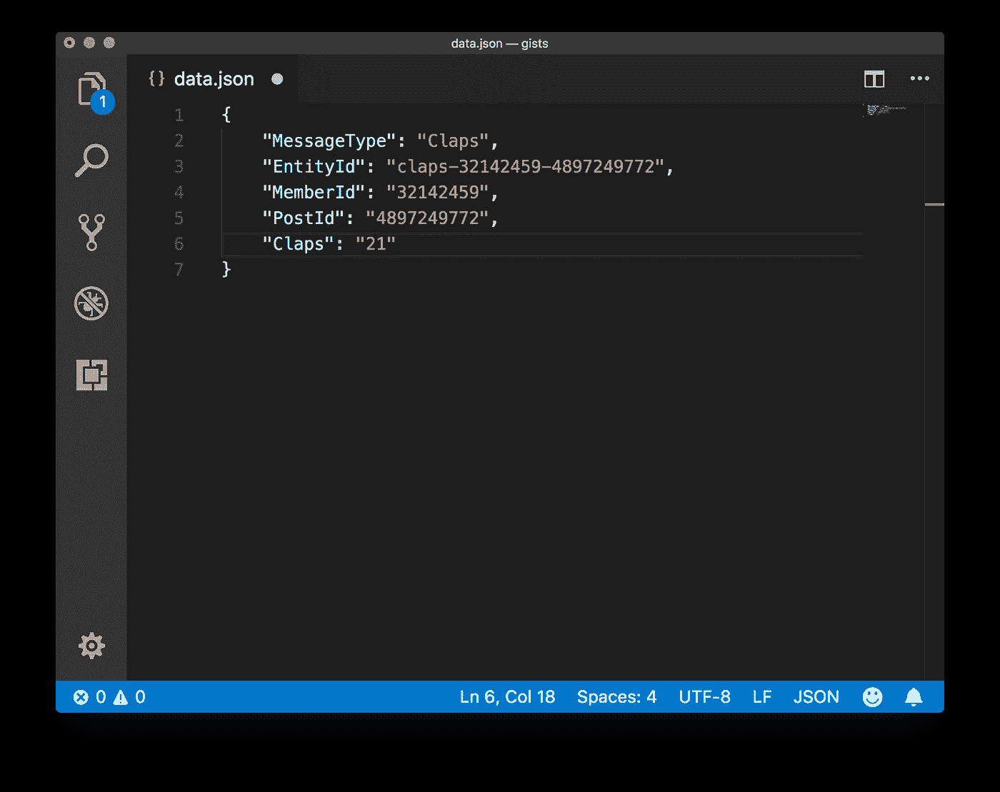*

*claps 事件的幂等性*

*该消息完整地捕获了来自用户`32142459`对帖子`4897249772`的鼓掌状态。鼓掌按钮被按了 21 次。或者，这位用户之前已经拍过 20 次了，然后她又回来拍过一次。这其实并不重要。产生它的应用程序(web 应用程序或移动应用程序)知道*的完整状态，为 post 捕获*并将其作为单个事件传输。即使这个消息被发送或接收了两次，这个用户对这个帖子的最终鼓掌数也是一样的，不会造成任何损害。*

*想想看，如果每一次鼓掌都是作为一个单独的事件发出的。一个复制品会有效地增加鼓掌的次数，而且没有人想要那个。*

*在某些方面，事件流是一种状态转移(罗伊，你在读这个吗？)在事件发出者和一个或多个事件订阅者之间。您需要对您的域进行建模，以便实体具有足够的粒度，它们的状态不会在不同的发射器之间共享。如果你能做到这一点，那么你就能相对容易地实现幂等性(以及严格的排序)。*

*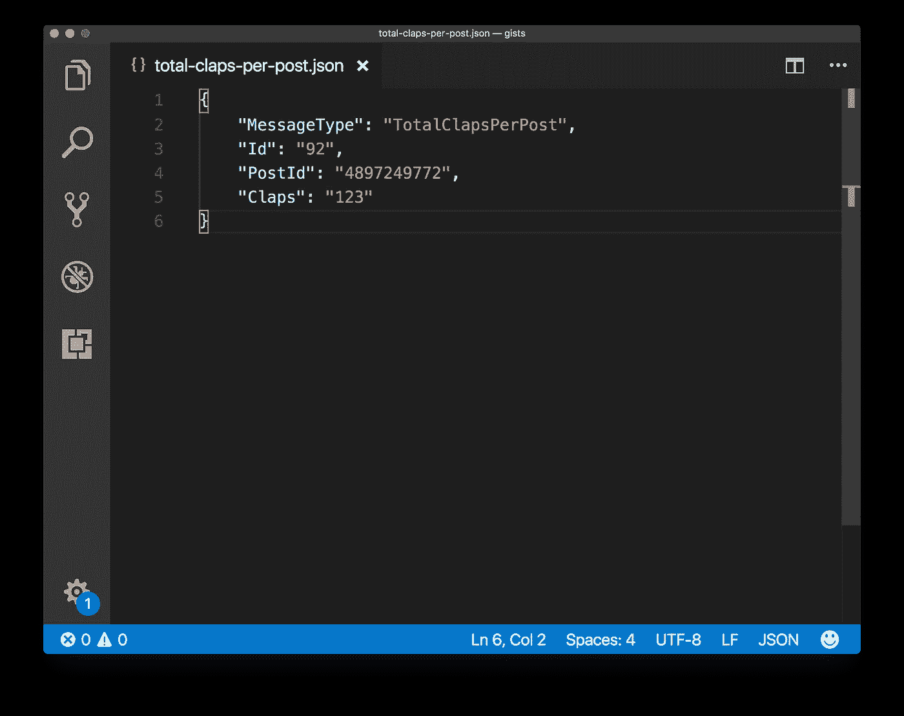*

*由 claps 服务发送的帖子的掌声计数*

*考虑实体 *TotalClapsPerPost* 。属于*岗位*实体。这个实体的完整状态在浏览器中是不确定的，因为浏览器不知道其他人是否也在为同一个故事鼓掌。想象一下，如果你的 *posts* 服务只是订阅 *claps* 事件，将它们作为部分更新，并在它们到达相应的帖子时对它们进行汇总，会发生什么。由于处理不是*等幂的*，重复将不可避免地再次增加总得分。*

*在您的应用程序域中，只需找到哪个代理是 e *发送器*就可以生成*实体的整个状态，*并监听它们的消息。在这个例子中，它是 c *laps* 服务。因此，对于帖子的每个 *clap* 事件， *claps* 服务是 *TotalClapsPerPost* 实体的权威发射器代理:它将查询自己的数据存储，并在您鼓掌或取消鼓掌时发出一个带有帖子鼓掌计数的事件。*

## *缺乏秩序*

*在 Kinesis 中，只有当您使用`[PutRecord](https://docs.aws.amazon.com/kinesis/latest/APIReference/API_PutRecord.html)` API 一次一条地按顺序放置记录，并指定可选参数`SequenceNumberForOrdering`时，才能保证碎片中消息的准确排序，但如果您使用更高效的`[PutRecord](https://docs.aws.amazon.com/kinesis/latest/APIReference/API_PutRecords.html)s`批量加载 API，则不能保证，因为数组中的单个记录可能会被拒绝，以后必须重试(因此是无序的)。*

*请注意，如果您使用类似于 [*Kinesis 聚合库*，](https://github.com/awslabs/kinesis-aggregation)的东西，它将多个用户记录打包在一个更大的记录中，您可以通过使用带有`SequenceNumberForOrdering`的顺序`PutRecord`调用来获得，并且仍然可以最大化您的吞吐量，而不会丢失单个分片上的顺序。还请注意，单独使用 [*Kinesis Producer 库*](https://docs.aws.amazon.com/streams/latest/dev/developing-producers-with-kpl.html) 不足以保证排序 *。**

*但是，如果您需要使用多个碎片推送更多数据，则很难有任何可靠的排序，因为 Kinesis 在消息中添加的`sequenceNumber`参数对于碎片来说是唯一的，并且当您从每个碎片读取数据时，您没有安全的方法来确定正确的时间顺序，因为每个碎片都是相互独立的，并且一个碎片可以“更快”地传递消息。*

*与缺乏唯一性相比，这种“某种程度上有序的”架构约束更成问题，尤其是当您认为我们将事件流定义为分类帐，而分类帐根据定义是有序的。*

*从好的方面来看，并不是所有类型的消息都需要按照严格的顺序传递。举例来说，如果你和我正在张贴两个故事，而它们的顺序是错的，这不一定是个问题。或者，如果我们为同一个故事鼓掌，你的和我的哪个信息先来并不重要。*

*所以在恐慌和放弃 Kinesis 之前，要记住的是，在许多情况下，缺乏排序并不重要。你真的必须考虑你的服务、消息和应用程序的领域，并且看到它是一个你需要解决的问题的上下文。*

*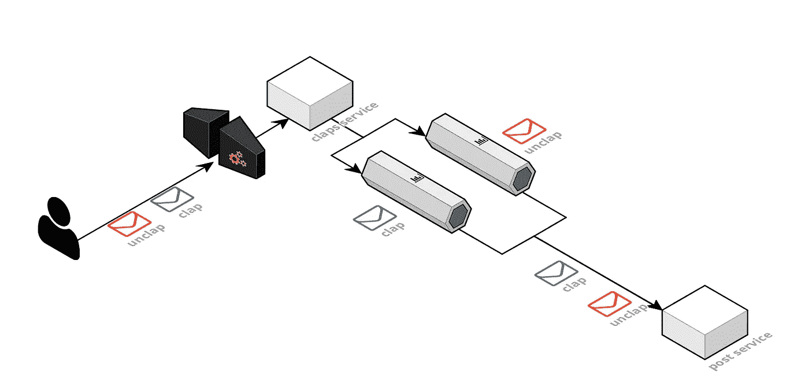*

*拍手，松开和碎片*

*通常，排序关系到与同一实体相关的两条消息。例如，你可以为这个故事鼓掌 21 次，但也决定迅速“松开”它。*

*是的， [*这样做很棘手但是有可能，*](https://help.medium.com/hc/en-us/articles/115011350967-Claps)*而且真的*对编剧不公平*。想想吧。**

**如果 Medium 在流中有两个或更多碎片，那么一旦您的 *claps* 服务将您的 claps 发送到下游服务，您的 claps 很可能会被乱序接收。假设 claps 服务发送了一个 *TotalClapsPerPost* 消息，而 *posts* 服务将订阅该消息。在这种情况下，将有两个事件，一个没有鼓掌，另一个有 21 次(假设其他人也没有鼓掌)。因此，邮政服务可能会为这个故事记录 21 次鼓掌，因为不鼓掌事件最先出现，另一个事件最后出现。这显然是一个排序很重要的例子。你希望能够改变你的想法，并使它在你松开时有价值！**

**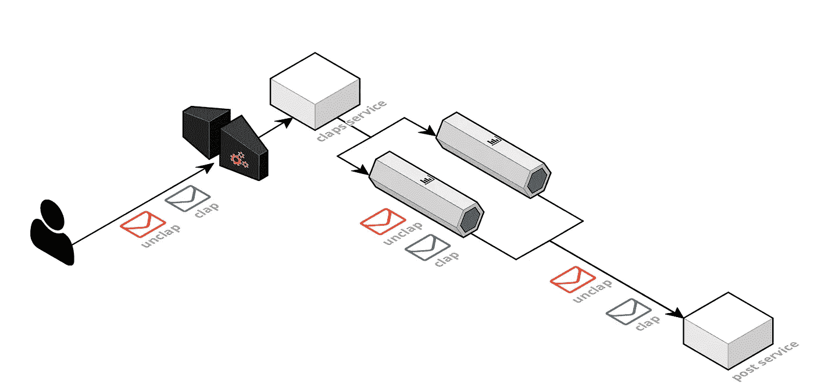**

**使用更好的分区键**

**您需要考虑订购要求中需要考虑的内容。在这个例子中，排序显然只对来自同一用户或同一帖子的消息有影响，因此您可以使用`PostId`或`MemberId`，或者两者都使用，并将它们组合在一起作为*分区键*。你的*拍手*和*松开*将会在同一个碎片中，并且顺序仍然会被保留。**

**[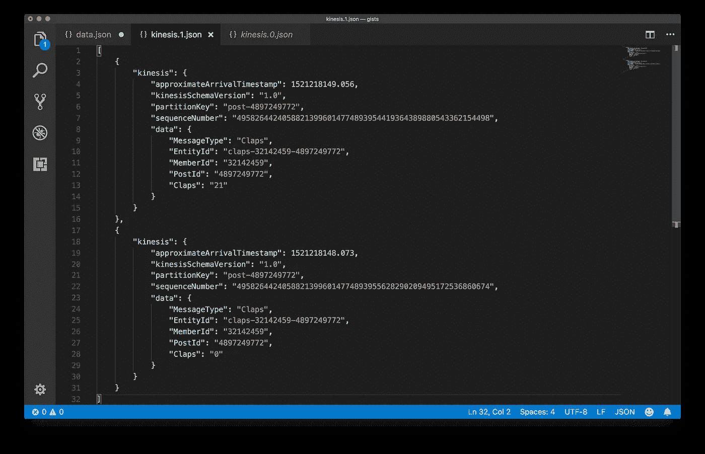](https://gist.github.com/alessandrobologna/f5d11f9879153b6d67f5a35c103492e6)

使用特定于域的分区密钥** 

**使用特定于域的分区键，并将`PutRecord`与`SequenceNumberForOrdering`一起使用，这是保证从流中的每个碎片中检索的记录严格排序的最简单的方法。使用其他东西，如应用程序特定的时间戳或 Kinesis 生成的`approximateArrivalTimestamp`字段，只会给你一个大概的顺序，这可能不足以满足你的一致性要求。**

**我知道，现在你感觉被骗了，因为我把它做得太简单了。如果同一个实体的状态变化量如此之大，以至于单个分片是不够的，那么向外扩展也不是一个解决方案，该怎么办呢？在你开始按下并保持按下拍手按钮看看会发生什么之前(在这里插入*邪恶的咧嘴笑*)，请考虑如果你超过了单个碎片 f *或单个实体*的吞吐量限制，也许你对问题的建模是错误的。**

**在无法通过向外扩展到多个碎片来解决问题之前，每个实体需要有 1，000 次状态变化或 1MB/秒的突变。那将是一个真正的*热*碎片。我确信这是一种可能性，但我也确信你也应该能够重新思考这个极其不稳定的实体所在的应用程序域，并使用不同的分区键和碎片将它分成许多子实体。**

# **读取事件流**

****

**吉尔博特·易卜拉希米在 [Unsplash](https://unsplash.com?utm_source=medium&utm_medium=referral) 上拍摄的照片**

**好了好了，现在你对如何在 Kinesis 数据流中产生幂等和有序事件有了一些想法，那么阅读呢？那应该更简单吧？**

**不对。**

**这并不像看起来那么简单，因为在事件源中，当订阅一个流时，*读取状态存储在订阅者*中，您需要跟踪从每个碎片中读取的最后一个事件。您需要以一种持久的方式做到这一点，以便如果您的应用程序在读取过程中死亡，您可以从您停止的地方开始，并且您还可以管理动态碎片分配，以确保当您的流被分成更多碎片时，您仍然可以订阅所有碎片。**

**你可以使用 [*Kinesis 客户端库*](https://github.com/awslabs/amazon-kinesis-client) ，它 [*会为你做所有的事情*](https://docs.aws.amazon.com/streams/latest/dev/developing-consumers-with-kcl.html) ，但前提是你要在 EC2(意味着在服务器上)上运行你的流订阅应用，并且你愿意花一些时间来正确地配置它。这当然没有错，而且您可以利用 Kubernetes 作为一个可伸缩的部署来做得很好。或者你可以只使用 [*Lambda Kinesis 订阅*](https://docs.aws.amazon.com/lambda/latest/dg/with-kinesis.html) 使用 [*事件-源映射*](https://docs.aws.amazon.com/lambda/latest/dg/API_CreateEventSourceMapping.html) 。**

## **Lambda Kinesis 订阅**

**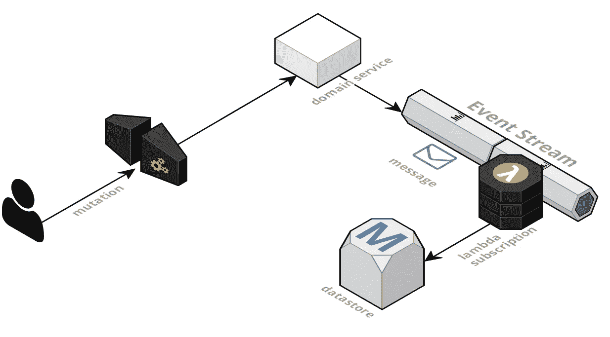**

**看，妈妈，它是无服务器的！**

**在这个模型中，AWS 将简单地为你处理基本上所有的事情。它会定期为流中的每个碎片调用一个 Lambda 函数，传递一个最多有`BatchSize`条记录的对象；它还将跟踪您在流中读取的最后一条记录，如果在函数处理过程中发生任何错误，它将从最后一个安全*检查点*重新开始，最后，它将跟踪新添加的碎片，并为每个碎片实例化函数的新副本。**

**就像魔法一样。太完美了。我实在想不出不使用它的理由。使用 Lambda 从 Kinesis 中读取数据在很大程度上是一种编码、部署和遗忘的体验。它只是工作。**

**直到它不存在。**

**但这不是 bug，这是特性。还记得我说过的速率限制吗？而 *5 每秒读取每片*是其中之一吗？这意味着，如果您只有 5 个函数订阅该流，并且您希望读取数据的频率超过每秒一次，因为您关心系统中的延迟，这是行不通的。此外，向流中添加碎片也没有帮助，因为对于每个碎片，您仍然有 5 个函数从它们那里读取，并且它们的组合读取速率仍然是每个碎片每秒最多 5 次读取。**

**如果您可以定义低延迟、“高优先级”功能(这些功能被更频繁地调用),而牺牲低优先级功能(由于一致性要求不太严格，低优先级功能可以承受更高的延迟),那么这个约束就不会那么严格了。**

**这就是*你认为*你为函数定义的`BatchSize`参数变得重要的地方。因为有更多记录要读取的函数会被更频繁地调用，所以您可以为有更多实时要求的函数设置较小的批处理大小，为那些可以忍受更长延迟的函数设置较大的批处理大小。**

**但是，唉，这还不够，而且在实践中也不是这样的。用具有不同批处理大小的多个函数测试这个场景，并没有显示出清晰和可预测的行为。**

**AWS 提供了一个 Lambda 指标`IteratorAge`，它测量每批处理的记录的最后一条记录的年龄。当订阅一个流时，这个度量对于跟踪您的函数滞后了多少是必不可少的。**

**具有较小批处理大小的函数可能会被更频繁地调用，但是它也会受到更多的限制，并且最终可能会滞后，具有比其他函数更高的`IteratorAge`。根据经验观察(我从我的老同学[*Galileo*](https://upload.wikimedia.org/wikipedia/commons/thumb/d/d4/Justus_Sustermans_-_Portrait_of_Galileo_Galilei%2C_1636.jpg/1920px-Justus_Sustermans_-_Portrait_of_Galileo_Galilei%2C_1636.jpg)*)*似乎对*速率限制*共享资源的争用导致负责调用您的函数的调度程序随机地成功执行一个函数而不是另一个函数，并且很难保证它就是您想要的那个。这种方式是可行的，但事实并非如此。**

**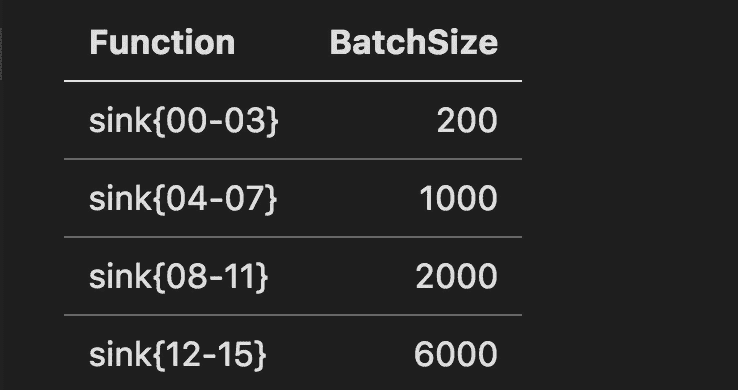**

**为了更好地理解这种行为，我部署了 16 个 *sink* 函数，它们从同一个流中读取数据，并*sink*已读取的记录。对于每一个，我都分配了一个批量(见左边的表格),并开始将记录输入 Kinesis。我认为，从理论上讲，我应该能够看到一种模式的出现，从`sink00`到`sink03`的接收函数被更频繁地调用，因此与其他函数相比具有更小的`IteratorAge`，比如具有更大批量的`sink12`到`sink15,`。我还设置了一个 CloudWatch 仪表板来跟踪各种功能及其指标。**

**在以 1.3k 记录/分钟的速度在流中推送记录 15 分钟后，我得到的是这件美丽的现代艺术作品:**

**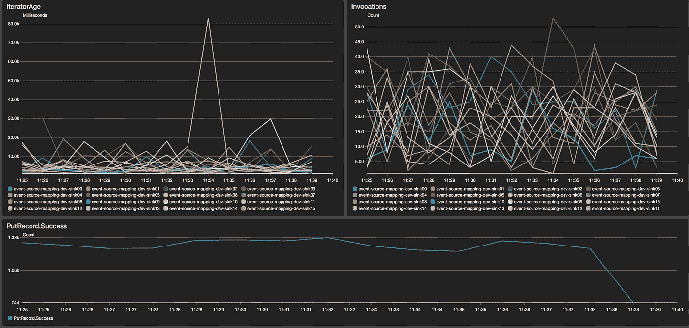**

**当理论失败时(点击放大)**

**我认为很明显调用的分布是随机的，迭代器的年龄也在 1 到 80 秒之间，也遵循看似随机的分布。**

**那现在怎么办？是厄运和绝望吗？不，还没有。我有一个*聪明的*和*笨拙的*解决方案，希望如果来自*神奇的 AWS Lambda* 团队的某人读到这篇文章，你在未来将不再需要它。但与此同时，它在这里。**

**每次数据流中有数据时，AWS 都会使用请求/响应模型同步调用 Lambda 函数。换句话说，那些阻塞调用在函数返回(成功或失败)之前*不会被重新发出。等等，你已经看到了吗？要解决这个问题，你需要做的就是确保你的*不那么紧急的功能*比那些你想要最低延迟的功能需要更长的执行时间。***

*顺便说一句，这可能是因为要处理更大的批量，然后就没什么可担心的了，但也可能是被迫的，我们都知道这是每个优秀程序员的*秘密武器*，无处不在的`sleep()` 函数。*

*你刚刚翻白眼了吗？我想我看到你翻白眼了。*

*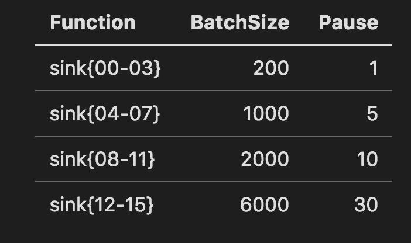*

*因此，对于每个 sink 函数，我都添加了一个*暂停*参数，如下表所示。停顿时间越长，批量就越大，以确保没有任何功能落后太多。设置一个至少是流的预期吞吐量两倍的批处理大小是很重要的。然后，我运行同一个负载生成器 15 分钟，这次我得到了我想要的:一种为一个函数提供更高优先级并确保它有最低的`IteratorAge`的方法，代价是其他对时间要求不那么严格的函数，它们可以承受更高的延迟。*

*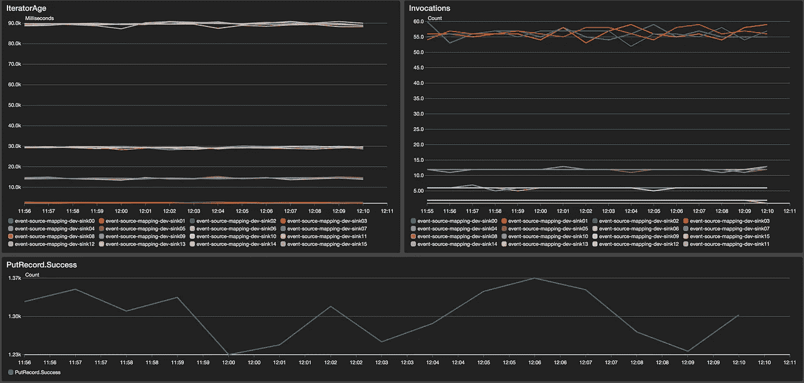*

*找到了，成功了！*

*如果放大上图，您会看到优先级最高的函数`sink{00–03}`具有最低的迭代器年龄，不到几秒钟，而优先级最低的函数，如`sink{12–15}`具有更高的迭代器年龄，但不变。*

*要明确的是，在那之前你责备我说你在这里读到了它，*在 Lambda 中睡觉绝对是一种反模式*，并且我*永远不会在除此之外的任何其他情况下建议它，因为你是按调用时间收费的，并且为睡觉付费是你不想做的事情(我的意思是，在现实生活中有时我会，但不是为我的 Lambda)。**

*但另一方面，当你看实际成本时，它比你想象的要便宜得多。一个 Lambda，每 60 秒轮询一个碎片，分配给它 128MB 的内存，将花费你一个*不那么大的*5.41 美元/月。即使你有 10 个碎片，54 美元对你的内心平静来说也不是很多，也不比你为从不睡眠的低延迟功能支付的多多少。事实上，假设每秒调用 5 次，执行时间为 100 毫秒，那么每月将花费 5.29 美元。*

*Lambda 很便宜，面对现实吧。*

*[](https://gist.github.com/alessandrobologna/7b7953d73844454152dd3c34a44cc080)

不是我在软件工程方面的最高成就(点击查看要点)* 

*我知道在这一点上你想立即抓住这个代码，所以在这里，在所有美丽的 hacky。*

*是的，这在任何其他语言中都会比你目前可以在 Lambda 上运行的 ES6 之前版本的 Javascript 更容易，因为你不能真正进行阻塞调用，但有用的 [*无服务器 Babel/Webpack 插件*](https://github.com/serverless-heaven/serverless-webpack) 给你异步/等待，所以，你去那里。(编辑: [AWS 刚刚宣布支持 Node v8.10](https://aws.amazon.com/about-aws/whats-new/2018/04/aws-lambda-supports-nodejs/) 和 async/await。耶！).*

*另外，如果你更喜欢 python， [*这里有完整的代码*](https://github.com/alessandrobologna/custom-cf-resources/tree/master/event-source-mapping) ，它演示了在 python 中使用 16 个 lambdas，不同的暂停时间，对一个单独的流。*

*值得一提的是，当 AWS 在阅读了这篇文章后，将在[*CreateEventSourceMapping*](https://docs.aws.amazon.com/lambda/latest/dg/API_CreateEventSourceMapping.html)API 中实现额外的参数，就像这样(记住，您首先在这里阅读它):*

```
*POST /2015-03-31/event-source-mappings/ HTTP/1.1
Content-type: application/json
{ 
 **"PauseTime": number,**  "BatchSize": number,
  "Enabled": boolean,
  "EventSourceArn": "string",
  "FunctionName": "string",
  "StartingPosition": "string",
  "StartingPositionTimestamp": number
}*
```

*您将能够删除睡眠黑客，并完全控制调用的速度。*

## *更多麻烦*

*将 Lambda 与 Kinesis 一起使用时，您需要记住的另一个约束是 Lambda 同步调用的最大有效负载大小。如果您将您的 *BatchSize* 设置得太高，并且产生的有效负载大于 6 兆字节， *AWS 将不会向您发送您期望的所有记录*，而只会发送它们在一次调用中能够容纳的数量，并且您的函数可能会开始滞后。*

*假设您的数据速率为 8000 条记录/分钟，平均消息大小为 1 千字节，您的批处理大小为 8000，暂停时间为 60 秒。在第一次调用时，只会收到 6000 条消息，一分钟后，您还会处理剩下的 2000 条消息(加上接下来的 8000 条)，但您仍然只会收到 6000 条消息。你可以调整*睡眠破解*的逻辑，例如根据你阅读的最后一条记录的`approximateArrivalTimestamp`减少你的睡眠时间(它太晚了，睡眠时间更少)，或者，你可以只*增加你的碎片数量*。在这种情况下，每个碎片将有效地携带更少的记录，然后它们都可以在一次调用中被发送到 lambda。*

*最后，我最喜欢的问题是云的形成。不要误解我。我喜欢云的形成。*

*但是如果你用它来注册你的 Lambda 订阅，你很快就会发现，当你使用模板`[AWS::Lambda::EventSourceMappin](https://docs.aws.amazon.com/AWSCloudFormation/latest/UserGuide/aws-resource-lambda-eventsourcemapping.html)g`时，它将调用`[CreateEventSourceMapping](https://docs.aws.amazon.com/AWSCloudFormation/latest/UserGuide/aws-resource-lambda-eventsourcemapping.html)` API，如果你有多个其他函数从同一个流中读取，它将随机失败，并出现类似这样的异常:*

```
*Received Exception while reading from provided stream. Rate exceeded for stream event-store-dev-event-stream under account ******. (Service: AmazonKinesis; Status Code: 400; Error Code: LimitExceededException; Request ID: ed339cfe-2d25-df52-be02–6eef40c6e5d1)*
```

*这就像收到一条“嗨，我第一次出错就退出了”的信息。这也很烦人，因为 CloudFormation 会自动尝试回滚到以前的配置，这也可能会因相同的异常而失败，使您的堆栈更新操作以臭名昭著的*更新回滚失败*状态结束。这尤其令人恼火，因为无服务器框架和 AWS SAM 都依赖这种云信息资源来创建订阅。*

*我确信*神奇的* CloudFormation 团队，在读完这篇文章后，将已经着手修复(只是再次尝试一个基本上良性的异常)。与此同时，对于我们其余的人，我已经将我之前提到的相同的 [*Github repo*](https://github.com/alessandrobologna/custom-cf-resources/tree/master/event-source-mapping) 推送到一小段 python 代码[](https://github.com/alessandrobologna/custom-cf-resources/blob/master/event-source-mapping/mapper.py)*中，该代码将创建一个 [*CloudFormation 自定义资源*](https://docs.aws.amazon.com/AWSCloudFormation/latest/UserGuide/template-custom-resources.html) 来处理将 Lambda 函数注册到 Kinesis，而不会在第一个错误时退出。我用这 16 个订阅测试了它，它*工作得很好*，所以 *c* 检查一下。不客气。**

## **另类模式。**

**我还应该提到，对于 Kinesis 对单个流施加的约束，还有其他解决方案，它们都主张使用多个流来克服那些令人讨厌的服务限制。**

**首先，更容易的是，如果您的应用程序域允许，您可以为单独的子域使用单独的流。例如，您用于分析的点击流数据不一定要使用与您用于更新业务实体的点击流相同的点击流。是的，有一个单一的流很好，也更简单，但是我不认为你应该把它当成一个教条，只需要对你的实际需求实际一点，设计一个适合你的解决方案。**

**另一种方法，Kinesis 扇出模式，建议使用不同的技术在许多领域特定的流中分出一个单一的输入流，每个流携带基于领域的事件的子集。这是一种有效的方法，但是有一些需要注意的地方。**

****Lambda based fanout:**aw slabs 前段时间发布了 [*这个项目*](https://github.com/aws-samples/aws-lambda-fanout) ，它允许动态地将各种输出(不仅仅是其他的 Kinesis 流)映射到一个 Kinesis 输入流。或者您可以阅读这篇 [*好文章*](https://medium.com/retailmenot-engineering/building-a-high-throughput-data-pipeline-with-kinesis-lambda-and-dynamodb-7d78e992a02d) 来了解另一种异步 lambda 扇出模式。或者 [*这个另一个好的*。我想我可以继续谷歌搜索，找到更多。我看到的所有这些方法的主要问题是，你将会牺牲订购来换取性能，或者增加你将会收到的重复消息的数量(这更容易处理)。](https://read.acloud.guru/aws-lambda-3-pro-tips-for-working-with-kinesis-streams-8f6182a03113)**

**让我解释一下:比方说，1000 条记录将调用您的扇出函数。基于每个记录的域，您可以向流 A 发送 500，向流 b 发送 500，您需要使用上面解释的`SequenceNumberForOrdering`参数一个接一个地处理记录。无论什么原因，当你的`PutRecord`到下游失败时，问题就发生了。您可以使用某种指数补偿算法重试，或者您可以继续尝试在最后发送失败的记录，或者您可以使整个批处理失败(在 Lambda 中返回一个错误)并从头开始。在第一种情况下，失败的记录之后的所有记录都将被延迟，如果发生几次，您就开始落后了。在第二种情况下，您将失去严格的排序，而在第三种情况下，您的所有下游都将收到重复的消息(并且您仍然会滞后)。**

****基于 Kinesis Analytics 的扇出:** Kinesis analytics 是一款非常强大的实时流分析工具，它使用 SQL 来选择记录，然后您可以根据自己的逻辑将其路由到其他流。你甚至不需要写任何实际的代码，而且有一个开源的 [*GitHub 项目*](https://github.com/alexcasalboni/kinesis-streams-fan-out-kinesis-analytics) 来帮你开始。但是，有一些限制可能不会使它成为一个可行的解决方案。特别是，每个记录(或数据行)不能大于 50 千字节，记录的数据格式仅限于 JSON、CSV 和 TSV(不支持聚合)。你可以使用一个 [*预处理λ*](https://docs.aws.amazon.com/kinesisanalytics/latest/dev/lambda-preprocessing.html)*，*来解决这个问题，但是这样会增加系统的复杂性。**

**所以，*买者自负*，如果*睡眠黑客*在你的情况下不够好，当然值得尝试这些模式。重要的是，您运行一些真实的负载模拟，并使用不同的解决方案进行测试。**

# **记录保留和流快照**

****

**戴维·坎特利在 [Unsplash](https://unsplash.com?utm_source=medium&utm_medium=referral) 上拍摄的照片**

**在 Kinesis 中，流中的每条消息都可以存活 24 小时，因此订阅服务的短暂宕机并不等同于数据丢失:你只需修复问题，然后再次启动你的功能，它就会恢复正常。**

**因为有时用你的代码修复问题并不简单，你可以将这个*延长到 7 天*，只需使用 API 调用 的 [*。七天是一个很长的时间，如果它是为了提供一个缓冲来防止您的某个服务宕机，以便 it 可以在宕机后通过快速赶上它在宕机时错过的内容来恢复状态。但是，如果在事件已经在你的平台中流动了可能几个月之后，你添加一个新的服务，这显然是不够的。*](https://docs.aws.amazon.com/streams/latest/dev/kinesis-extended-retention.html)**

**此外，如果您的事件流是您的应用程序状态的真实来源，您可能希望确保它以多种方式得到备份。**

**我当然会建议，作为第一道防线，使用您的云提供商提供的托管数据存储产品，并确保自动拍摄快照，至少每天一次。但是你还能做更多。**

## **Kinesis 消防软管**

**你要做的第一件事是确保你的信息流有一个消费者是 Kinesis 消防水带交付信息流，并且你把 S3 作为它的目标。谢天谢地，这就像 [*将消防软管连接到 Kinesis*](https://docs.aws.amazon.com/firehose/latest/dev/writing-with-kinesis-streams.html) 上，然后选择一个桶来倾倒所有好东西一样简单。请记住，在你的流中添加一个消防水管会消耗一些你的读取配额，但没有什么是免费的。你现在应该知道如何解决你的阅读极限了。**

**一旦记录在 S3，您可以利用 [*Glue*](https://aws.amazon.com/glue/) 或您喜欢的 ETL 过程来加载它们并在流中回放它们。实际上，我会推荐一个单独的*回放*流。当您回放事件时，您希望快速完成，尤其是当您有大量消息需要处理时。拥有单独的读取流和单独的订阅，有助于避免应用程序的主流饱和。**

## **DynamoDB 事件存储**

**理想情况下，您会希望使用类似 DynamoDB 的东西来永久存储您的事件。这将允许您编写快速的 ETL 来选择在流中回放什么事件。也可以是一种为每个实体创建时间点快照的方法，这样就不必回放 1970 年 1 月 1 日(众所周知，世界开始的时候)的一切，而可以从昨天开始。**

**[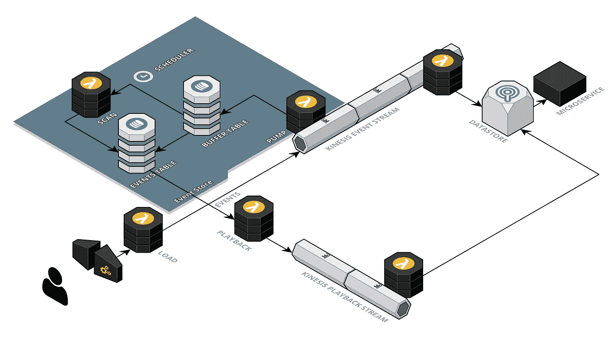](https://github.com/alessandrobologna/dynamodb-event-store)

基于时间的事件的简单存储** 

**这并不像您想象的那么简单，因为基于时间的事件有同时发生的趋势，如果您在表中选择一个简单的分区键，它们将在 DynamoDB 中创建一个移动的热点，就像一波漂亮的节流错误。但是[这里是一个开始](https://github.com/alessandrobologna/dynamodb-event-store)的地方。它还远未完成，还没有准备好投入生产。我有几个关于如何从那里改进的好主意，创建时间点快照和加速事件的回放，PRs 是受欢迎的。**

**我意识到还有更多的内容需要介绍，在本系列的下一期文章中，我将深入探究这篇文章顶部的蓝图。与此同时，如果你有任何问题，请随时发表评论。**