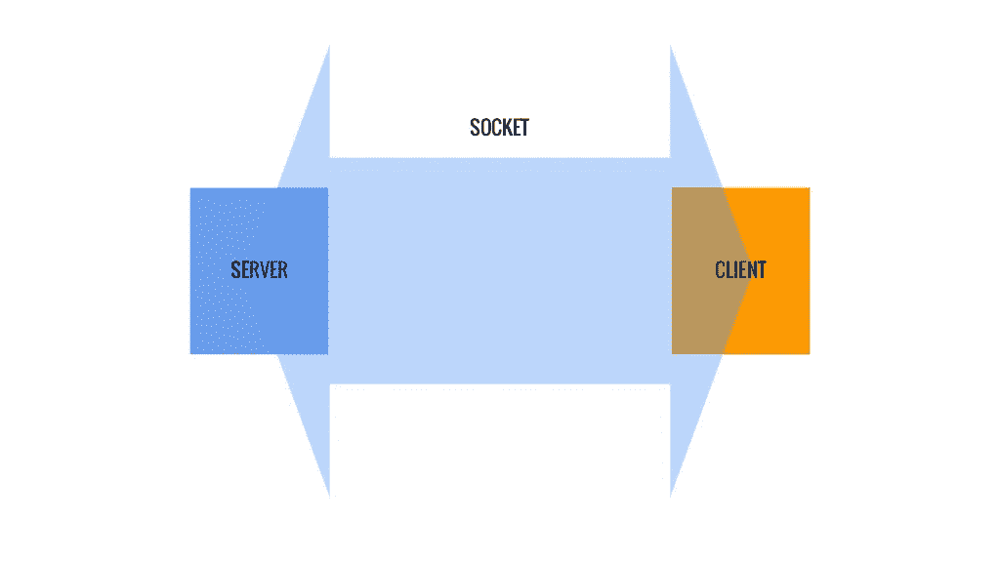
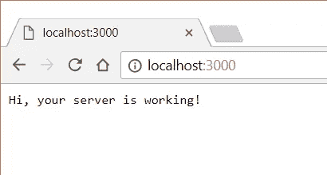
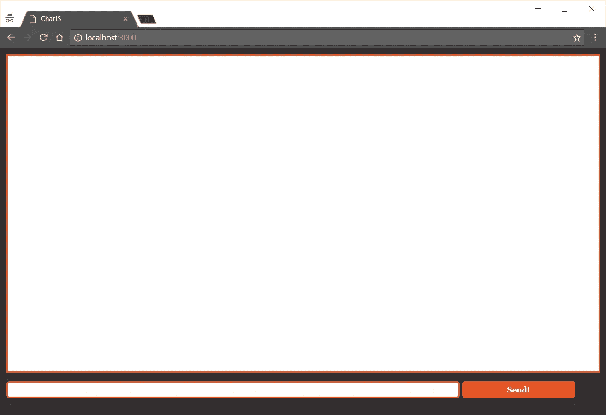
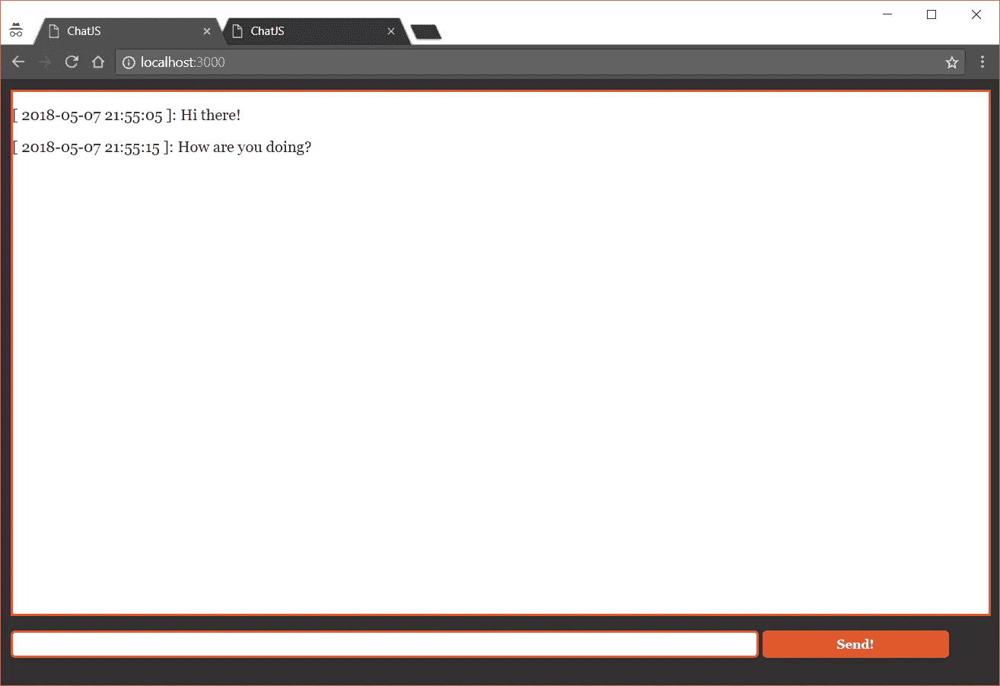

# 从头开始用 Node.js 创建聊天

> 原文：<https://itnext.io/creating-a-chat-with-node-js-from-the-scratch-707896d64593?source=collection_archive---------1----------------------->

实时消息应用程序在 web 世界中并不是一个新事物，但在商业社区中已经聚集了更多的空间，特别是在需要以更加灵活和个性化的方式与他们的顾客/客户集成的应用程序中。


Chats 架构通常被认为是基于服务器端应用程序的，该应用程序将支持来自客户端的请求(在本例中是一些 JavaScript/Ajax ),并处理业务逻辑以及数据库存储、事件处理、队列等。

当我们谈到前端解决方案时，它的所有魅力都基于 WebSockets，这是一种浏览器广泛支持的通信协议，旨在建立浏览器和服务器之间的双向实时通信，实现更快的消息交换，而无需页面刷新或耗时的等待。

由于并非所有版本的浏览器(旧版本)都支持 WebSockets， **Node.js** 创建了一个模块，负责所有的传输协议，可以作为旧版本浏览器的 B 计划。它们将如下(按此顺序):Adobe Flash Socket、Ajax long polling、Ajax multipart streaming、Forever iframe 和 JSONP Polling。有很多选项，所以模块本身负责通过最方便的传输协议与服务器通信。

因此，在本文中，我们将创建一个项目来了解 Socket 的基础知识。IO 和它能为我们提供什么，不需要使用数据库、Ajax 或其他后端语言…只需要 JavaScript、Node.js 和 jQuery。

# 关于插座。超正析象管(Image Orthicon)

这个 Node.js 模块提供了一种从客户端浏览器直接连接到应用服务器的方法。该库通过事件工作，即服务器或客户端将触发事件，以便有来自其中一方的响应，参见**图 1** 中的示例。



**图一。**客户端和服务器之间的消息交换。

某种程度上，我们用两个非常基本的方法，分别是`emit`和`on`。一个用于发出事件，另一个用于接收事件的响应。因此，应用程序的每一端都有套接字。IO 库已添加。

除了允许两个设备之间直接交换消息之外，套接字。IO 还允许消息广播，向所有其他连接的用户发送事件。广播可以来自客户端和服务器。

当用户访问页面时，服务器会创建一个套接字，客户端和服务器之间的消息交换就是通过这个套接字进行的。反过来，这可以向单个套接字或连接到它的所有套接字发出一个事件，我们称之为消息广播。

# 设置环境

如果您还没有准备好 Node.js 环境，让我们在本节中一起看看如何准备好开始开发这样的应用程序。这一切都归结为一个简单的文本编辑器和一个适用于您的操作系统的终端(或提示符)。

## Windows / MAC

访问[官方 Node.js 网站](https://nodejs.org/en/download/)并下载适用于您的 Windows 类型(32 或 64 位)的 *msi* 安装文件，或*。Mac 的 pkg* 文件。打开文件并正常运行安装。最后，访问终端(或命令提示符)并运行命令`node -v`。如果答案是 Node.js 的安装版本，这意味着环境已经准备好了。

## Linux 操作系统

对于 Linux，在 Debian 和 Fedora 发行版中，过程非常简单:安装由应用程序库执行。让我们首先看看在 Ubuntu 终端上运行的命令(对 Debian 发行版也有效)，如清单 1 所示。在**清单 2** 中，我们可以看到 Fedora 发行版的命令。

**清单 1。**在 Ubuntu (Debian 发行版)中安装的命令。

```
sudo apt-get update
sudo apt-get install Node.js
sudo apt-get install npm
```

**清单 2。**Fedora 发行版的安装命令。

```
sudo curl —silent —location [https://rpm.nodesource.com/setup](https://rpm.nodesource.com/setup) | bash -
sudo yum -y install Node.js
sudo yum -y install npm
```

在过程结束时，只需访问终端并输入命令`Node.js -v`。如果答案是 Node.js 的安装版本，那么我们的环境就可以开始了。

Node.js 之后的第二个安装命令是指 **NPM** ( *Node.js 包管理器*)，一个在 Node.js 应用开发中非常重要的包管理的系统。

# 该项目

现在让我们创建一个名为`\ChatJs`的目录，在其中，我们将创建一个名为 app.js 的文件，这将是我们服务器的主文件。作为第一部分，我们将创建一个相当简单的服务器，它只会在浏览器屏幕上显示一条成功的消息，如清单 3 所示。

**清单 3。**创建单个应用程序。

```
var app = require('http').createServer(response);app.listen(3000);
console.log("App running…");function response(req, res) {
 res.writeHead(200);
 res.end("Hi, your server is working!");
}
```

该脚本创建了一个 HTTP 服务器(将在端口 3000 上监听)，该服务器有一个被请求的主方法`response()`函数，该函数又有两个参数:`req`(请求)和`res`(响应)。在这个函数中，我们定义了一个成功代码(200)，并以一个警告服务器正常的字符串结束。

不久之后，只需运行以下命令，它将在提示符下运行我们的应用程序:

```
node app.js
```

注意，当您在提示符下运行这段代码时，终端会显示`console.log`函数的内容，警告应用程序正在运行。但是，它不会打印任何其他行，这表明我们的应用程序当前正在运行。

此时，我们只有 Node.js 服务器在运行。如果您在 [http://localhost:3000/](http://localhost:3000/) 访问浏览器，您将看到我们在`end`方法中传递的消息，正如我们在**图 2** 中看到的。



**图二。**浏览器响应。

接下来，我们将让我们的服务器呈现一个 HTML 响应，它将成为我们聊天的主页。为此，我们必须加载`FileSystem`模块，因为我们将浏览项目目录并打开一个文件。因此，让我们改变我们的`app.js`，就像我们在**清单 4** 中看到的那样。在进行更改之前，进入提示符并按下`Ctrl + C`(或`command + C`)来停止服务器上的应用程序。

**清单 4。**介绍一个 HTML 页面。

```
var app = require('http').createServer(response);
var fs = require('fs');app.listen(3000);
console.log("App running…");function response(req, res) {
 fs.readFile(__dirname + '/index.html',
 function (err, data) {
 if (err) {
   res.writeHead(500);
   return res.end('Failed to load file index.html');
 } res.writeHead(200);
   res.end(data);
 });
}
```

在这些更改之后，我们将再次执行命令`node app.js`，当再次访问地址 [http://localhost:3000/](http://localhost:3000/) 时，您将会看到消息“*加载 index.html 文件时出错”*，这只是因为我们的项目中还没有 index.html 文件。

同样重要的是要记住，我们到目前为止创建的服务器并没有区分路径，也就是说，你可以在 [http://localhost:3000/](http://localhost:3000/) 之后放置任何东西，它总是以同样的方式响应，因为我们还没有实现它如何处理这些路径。很快，你就可以调出类似[http://localhost:3000/chat](http://localhost:3000/chat)、[http://localhost:3000/error](http://localhost:3000/error)、[http://localhost:3000/potato](http://localhost:3000/potato)等地址。

让我们为我们的聊天创建一个简单的界面。在项目根目录下创建一个`index.html`文件。在该文件中输入一个与清单 5 中所示代码相同的代码。

**清单 5。**聊天 HTML 代码。

```
<!DOCTYPE html>
<html>
<head>
 <title>ChatJS</title>
 <link rel="stylesheet" type="text/css" href="/css/style.css" />
</head>
<body>
 <div id="history"></div>
 <form id="chat">
 <input type="text" id="msg_text" name="msg_text" />
 <input type="submit" value="Send!" /> 
 </form>
</body>
</html>
```

目前，我们的索引将只处理一个名为`history`的 div，聊天中交换的所有消息都将在这里进行排列。然后，我们很快就有了一个带有文本框和消息发送按钮的表单。到目前为止非常简单的聊天结构。

但是，如果您现在尝试访问地址 [http://localhost:3000/](http://localhost:3000/) ，您将会收到相同的错误消息。这是因为我们没有重启我们的服务器应用程序，然后我们再次进入提示符，按下`Ctrl + C`然后重新执行应用程序。

您可能已经注意到，我们已经在应用程序的`<head>`中留下了一个链接标签来加载我们的 CSS。在我们项目的目录中，创建另一个名为`css`的目录，并在其中创建与清单 6 中所示内容相同的`style.css`文件。

**清单 6。** style.css 文件。

```
html, body, input {
 font-family: Georgia, Tahoma, Arial, sans-serif;
 margin: 0;
 padding: 0;
}body {
 background: #302F31;
 padding: 10px;
}form {
 margin: 15px 0;
}form input[type='text'] {
 border: 2px solid #eb5424;
 border-radius: 5px;
 padding: 5px;
 width: 75%;
}form input[type='submit'] {
 background: #eb5424;
 border: none;
 border-radius: 5px;
 color: #FFF;
 cursor: pointer;
 font-weight: bold;
 padding: 7px 5px;
 width: 19%;
}#history {
 background: #FFF;
 border: 2px solid #eb5424;
 height: 550px;
}
```

如果我们重新启动应用程序，该样式还没有应用到索引页面。原因是我们的 app.js 到目前为止只处理一个请求路径。为了解决这个问题，我们将更改我们的 app.js 文件，以便它加载在请求 URL 中传递的文件，而不是手动放置每个 URL。让我们仔细看看清单 7 中列出的变化。

**清单 7。**app . js 中的路径变化

```
var app = require('http').createServer(response);
var fs = require('fs');app.listen(3000);
console.log("App running...");function response(req, res) {
    var file = "";
    if (req.url == "/") {
        file = __dirname + '/index.html';
    } else {
        file = __dirname + req.url;
    } fs.readFile(file, function(err, data) {
        if (err) {
            res.writeHead(404);
            return res.end('Page or file not found');
        } res.writeHead(200);
        res.end(data);
    });
}
```

重启应用程序后，您将看到与图 3 中相同的内容。



**图 3。**风格化聊天页面

# 发送消息

我们现在将研究消息传递机制。我们的应用程序将通过 Socket 的客户端库与 Node.js 服务器进行通信。而 jQuery 发生在与页面的交互中。

为此，我们将修改 app.js 文件，如清单 8 中所示，并在文件开头包含一行命令，声明我们正在包含 Socket。应用程序中的 IO。

**清单 8。**包括插座。IO 模块。

```
var app = require('http').createServer(response);
var fs = require('fs');
var io = require('socket.io')(app);
…
```

为了在模块中使用`require`功能，我们需要首先为我们的应用安装它。因此，停止应用程序并运行以下命令来完成此操作:

```
npm install socket.io
```

完成后，转到您的 index.html 页面，在文件末尾添加清单 9 中所示的代码片段。

**清单 9。**消息发送事件。

```
…
 <script type="text/javascript" src="[https://code.jquery.com/jquery-3.3.1.min.js](https://code.jquery.com/jquery-3.3.1.min.js)"></script>
 <script type="text/javascript" src="/socket.io/socket.io.js"></script>
 <script type="text/javascript">
 var socket = io.connect();
 $("form#chat").submit(function(e) {
   e.preventDefault();

   socket.emit("send message", $(this).find("#msg_text").val(), function() {
     $("form#chat #msg_text").val("");
   });
 });
 </script>
</body>
</html>
```

我们声明了一个引用套接字的`socket`变量。IO 库，它将负责所有套接字功能。接下来，我们在 jQuery 中声明表单的一个`submit`事件，并传递一个`preventDefault`，这样表单就不会进入它的`action`，因为我们是负责表单响应的人。

请注意，调用了库的`emit`方法，其中我们传递了三个参数:事件名称(这在服务器上很有用)、我们正在发送的数据(在本例中，我们只发送了`message`字段的内容)以及最后的`callback`，这是一个一旦事件发出就会执行的函数。尤其是后者，将仅用于清除消息字段，因此用户不必在发送消息后删除它。

如果我们现在测试我们的应用程序，消息发送将不工作，甚至清除消息字段的回调也不工作，因为我们还没有设置服务器在接收到该事件时必须做的功能。为此，编辑 app.js 文件，并将清单 11 中所示的代码放在它的末尾。

**清单 11。**接收来自客户端的消息。

```
io.on("connection", function(socket) {
    socket.on("send message", function(sent_msg, callback) {
        sent_msg = "[ " + getCurrentDate() + " ]: " + sent_msg;
        io.sockets.emit("update messages", sent_msg);
        callback();
    });
});function getCurrentDate() {
    var currentDate = new Date();
    var day = (currentDate.getDate() < 10 ? '0' : '') + currentDate.getDate();
    var month = ((currentDate.getMonth() + 1) < 10 ? '0' : '') + (currentDate.getMonth() + 1);
    var year = currentDate.getFullYear();
    var hour = (currentDate.getHours() < 10 ? '0' : '') + currentDate.getHours();
    var minute = (currentDate.getMinutes() < 10 ? '0' : '') + currentDate.getMinutes();
    var second = (currentDate.getSeconds() < 10 ? '0' : '') + currentDate.getSeconds();
    return year + "-" + month + "-" + day + " " + hour + ":" + minute + ":" + second;
}
```

我们已经创建了一个方法来响应客户端到服务器的连接。当客户端访问页面时，它在服务器上触发这个方法，当这个套接字接收到一个`send message`时，我们触发一个方法，该方法将发送的数据(`message`字段)和我们在客户端创建的回调作为参数。

在这个方法中，我们放入了功能的第二部分:模块将向连接到服务器的套接字(所有用户)发送`update messages`事件，并且还将通过特定的日期时间格式传递发送了哪个新消息。为了提供日期和时间，我们创建了一个单独的函数，因为在整个开发过程中我们还会多次使用这个方法。马上，我们调用我们在客户端创建的回调，这是清除字段的方法。

最后，还要编辑 index.html 文件，并创建为用户更新消息的方法。想法很简单:让我们在`history` div 中给出一个`append`(变化在**清单 12** )。提交表单后，应立即输入以下行。

**清单 12。**更新消息历史。

```
socket.on("update messages", function(msg){
var final_message = $("<p />").text(msg);
   $("#history").append(final_message);
});
```

基本上，服务器和客户端之间的对话在两端是相同的，即两者分别有一个`emit`和`on`函数用于发出和接收事件。

因此，重启并在两个选项卡中访问应用程序，然后发送一条消息来查看 Socket 的强大功能。木卫一在行动。应用程序应显示如图**图 4** 所示的信息。



**图四。**发送和接收消息。

# 结论

通过这个非常简单的项目和一些依赖项，我们成功地用几行代码创建了一个非常实用的应用程序。

尽管如此，插座的力量。IO 扩展到更多以前依赖后端页面的解决方案。现在，入站/出站服务器响应时间可以依靠 WebSocket 协议实现更灵活的信息交换，使系统能够跟踪监控结果，甚至为用户设置实时价格。

你可以在这里找到完整的源代码。