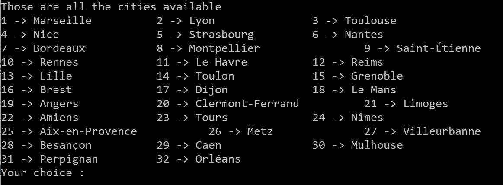
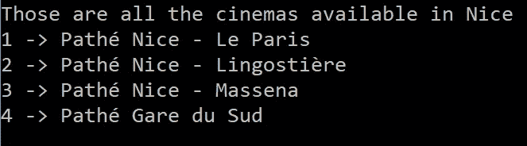
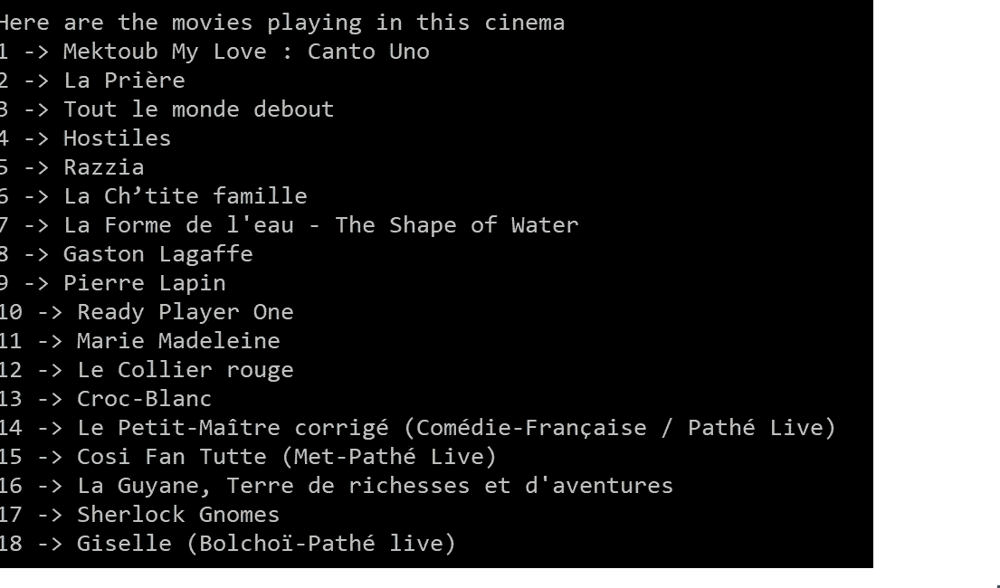
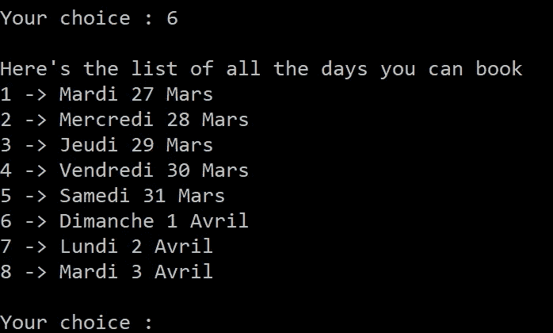
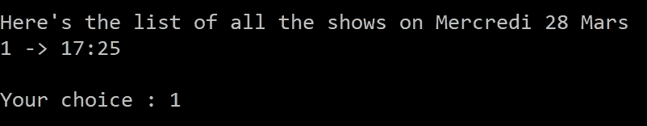
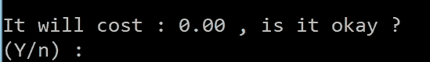
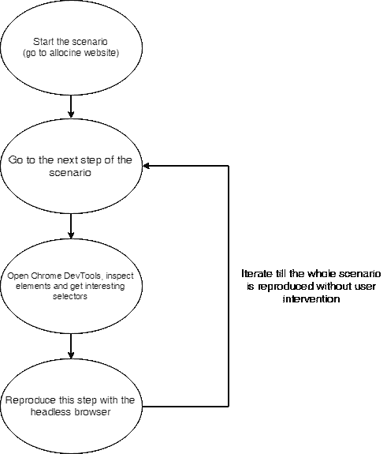

# 创建一个可以预订电影票的聊天机器人—第 1 部分

> 原文：<https://itnext.io/creating-a-chatbot-to-book-cinema-shows-part-1-9c13de573a07?source=collection_archive---------1----------------------->

乔尔·穆尼斯在 [Unsplash](https://unsplash.com?utm_source=medium&utm_medium=referral) 上拍摄的照片

我想开发这个工具并发布它已经很久了。

我将开始这个过程的第一部分，这实际上是我到目前为止所做的。下一部分将是关于未来的改进，以及这种方法的缺点。

# TL；速度三角形定位法(dead reckoning)

我有一个 CLI(命令行界面)，允许我通过 **CINEPASS DUO** (按月付费订阅)预订法国任何 Pathé电影院的演出。

我的代码可以在我的 github repo 上获得。

这是一个可以运行的文件(假设您已经安装了所需的依赖项)。

你应该有一个有效的卡号/姓氏对来使它工作到最后。此外，这个工具不会绕过验证码，所以如果你试图在一个小时内预订 50 场演出，不要责怪它。

# 示范

第一步

第二步

第三步

第四步

第五步

第六步——我有一张高级卡很正常

就在它要求一个邮件地址来发送票之后😍

你可能想知道“聊天机器人的****部分在哪里？”，**保持** **读数**。

## 故事时间

自从我在过去的几年里发现了夏波特酒后，**我就想自己动手制作。**

我首先尝试了 WYSIWYG 编辑器，比如非常酷且易于使用的 Chatfuel。然而，一旦你使用完这些工具，你就会明白你可以通过自己编码来创造更强大的东西。

我尝试了 Node.js 教程和 Python 教程，设法让非常好的库处理所有的 NLP(自然语言处理)。

好吧，到目前为止我一直在想“我怎么能通过 Allocine 预订一场演出呢？”(这是一个法国平台，提供所有电影内容，并拥有由 Gaumont Pathé持有的在线预订系统)。

嗯，**“那个该死的 REST API 在哪里？？?"。**REST API 肯定会轻松取胜。一个 HTTP 请求在这里，另一个在这里，然后我就去电影院了。

找了几个小时**，我唯一得到的是一份逆向工程文档** [**这里**](https://wiki.gromez.fr/dev/api/allocine_v3) **。不够用😢**

> 不够不代表做的工作不好。相反，它非常好，但它不允许一个人点任何东西

我把这个项目搁置在办公桌上将近一年了。在我上一次在 Node.js 上的课程中，学员(一个好学员)告诉我关于无头浏览器的事情。

我已经知道了 Selenium(Python)和 PhantomJS，但是对这些技术一点也不适应。

> 和 Chrome 发布的木偶师

最棒的是，受训者告诉我一个我甚至不知道的由谷歌制作的工具(我感到羞耻，每天深夜保持阅读媒介和其他馈送是不够的)。

> 对话流进入了游戏

让我们概述一下创建这个简单而强大的应用程序需要什么。也许它能唤起开发者社区的想法和支持？

# 方案

到目前为止，无头浏览器是你看不到的浏览器。

**你问这个有什么意义？**

事实上，人们可以通过一种语言来控制这种无头浏览器，在这种情况下，这一切都与 Javascript (Node.js 环境)有关。

它真的非常强大和有趣，因为它允许人们执行自动单元测试、自动在线填表等等(以 bruteforcing 为例)。

正如你所猜测的，**木偶师**就像其他无头浏览器一样，允许你输入、点击和截屏页面。

下面是它看起来有多酷的一个片段(不仅仅是看起来，确实是)。

这主要是大多数用户在网站上做的事情，这就是为什么无头浏览器适合这项任务，并允许我在线预订我的位置。

基本上，它是关于执行完全相同的用户场景，但是使用由程序控制的无头浏览器。

> 自动化的

从现在开始，我的目标将是按照我在 Allocine 上随便做的事情，一步一步地无脑复制来预订我的位置。

# 编码

> 坐下来，系好安全带。

开玩笑，在一个无头浏览器中实现一个用户场景是非常容易的。

**这是我遵循的流程**(相信大家都是这么做的，我错了吗？) :

感谢 draw.io 的开发人员让这个令人惊叹的图表成为可能

所以，这只是一系列代码帮助下的复制。直白。

代码并不复杂。我只能说，这可能是一个漫长的过程，因为我与木偶师的一些误解和一些缓慢的加载时间(我希望可以规避)。

通过查看代码，您会注意到这是一个列表:

*   document . query selector()& document . query selector all()；
*   类型()
*   单击()

我还启用了请求拦截，以防止浏览器下载影响性能的资源，如图像、广告等。

# 未来计划

到目前为止，我在这个项目上花的时间没有超过两个工作日，因为作为一名自由职业培训师和开发人员，我很难处理我的工作。

然而，当我有足够的空闲时间时，我希望我能:

*   改进代码(整体可读性和错误处理，以及重构重复代码)；
*   将其绑定到一个用 DialogFlow 制作的聊天机器人上(本系列第二部分)；
*   让它处理更多的案件，而不仅仅是一个电影通行证二人组；
*   让它能够选择电影院房间的位置，而不是跳过这一部分。
*   使它能够要求用户在必要时完成验证码。
*   **与 Allocine & Gaumont Pathé取得联系，实现这个梦想？**

希望我会继续努力，尽我所能写好这个系列的第二部分。

无论如何，请随时联系我并提出建议。

如果你真的提出完成和改进这个工具的请求，我会非常感激。

# 无头浏览器方法的缺点

在我看来，用无头浏览器解决这个问题是可以承受的。然而，它不是为它而生的(IMHO)。

这些都是这种方法的缺陷:

*   **如果网页变了，代码就坏了**。
*   验证码不能被绕过(然而没有机器学习和神经网络的东西)。
*   为了防止抓取，网站可以**生成随机 id 和类**。这使得**方法甚至无法实现。**
*   **表演没那么快。**再现普通用户的行为很快，但不如使用传输 JSON 数据的 HTTP 请求执行常见的 REST 场景快。这是因为无头浏览器就像普通浏览器一样，下载网页及其资源(HTML & JS 通常不会被阻止，因为网页需要它们才能按预期工作)。

> 时间一长肯定不靠谱

**最后，我将继续关注 web 服务和 API，因为这将是真正的游戏规则改变者。肯定还在做这个项目，至少是为了创建一个 POC(概念验证)。**

老实说，这个 CLI 失败的次数比成功预定位置的次数还多，因为 captchas、即使 puppeteer 认为页面没有完全呈现，等等。这只是创建概念证明的一种尝试。

# 感谢您的阅读

我希望你喜欢这篇文章。

随便看看我写的上一篇:[https://it next . io/programming-tips-2-6-tips-to-make-your-code-clean-and-elegant-again-c6c 47458724 a](/programming-tips-2-6-tips-to-make-your-code-clean-and-elegant-again-c6c47458724a)

如有任何问题和建议，请联系我😺

**不是每次都提，但我总是很感激被它分享下，谢谢！**

[吴怡](https://unsplash.com/@takeshi2?utm_source=medium&utm_medium=referral)在 [Unsplash](https://unsplash.com?utm_source=medium&utm_medium=referral) 上的“白色马克杯里的卡布奇诺，白色泡沫艺术在木桌上”