# 创建一个可以预订电影票的聊天机器人—第 2 部分

> 原文：<https://itnext.io/creating-a-chatbot-to-book-film-tickets-part-2-435aecdf402d?source=collection_archive---------1----------------------->

[亚历山大·奈特](https://unsplash.com/@agkdesign?utm_source=medium&utm_medium=referral)在 [Unsplash](https://unsplash.com?utm_source=medium&utm_medium=referral) 上发表的“一个名叫 Pepper 的机器人拿着一个 iPad”

*如果你还没有看第一部分，这里是:* [*创建一个聊天机器人来预订电影票——第一部分*](/creating-a-chatbot-to-book-cinema-shows-part-1-9c13de573a07)

> [点击这里在 LinkedIn 上分享这篇文章](https://www.linkedin.com/cws/share?url=hhttps%3A%2F%2Fitnext.io%2Fcreating-a-chatbot-to-book-film-tickets-part-2–435aecdf402d%3Futm_source%3Dmedium_sharelink%26utm_medium%3Dsocial%26utm_campaign%3Dbuffer)

**我很感激也很高兴被** [**帕特丽夏·杜兰**](https://medium.com/u/2543d8373361?source=post_page-----435aecdf402d--------------------------------) **从**[**Planeta Chatbot**](https://medium.com/u/a3488d2b50b2?source=post_page-----435aecdf402d--------------------------------)**翻译成西班牙语。**

*这是西班牙语版本:*[*Creando un chatbot para reserver entradas de cine—part 1*](https://planetachatbot.com/creando-un-chatbot-para-reservar-entradas-de-cine-c0e7c9c5a0f)

# 第一部分总结

到目前为止，在第一部分的结尾，我完成了创建一个由**操纵的基本机器人，它是一个 [**无头浏览器**](https://en.wikipedia.org/wiki/Headless_browser) 。**

**这个机器人可以:**

*   **检索法国所有的电影院。**
*   **告知在选定的电影院有哪些电影。**
*   **根据你选择的时间来判断一部电影是否可以预定。**
*   ****开始预订流程**。**

**最后一点非常关键，原因如下。**

****在不同网络的不同电脑上做了大量测试后，我意识到机器人十几次中只有一次能成功订到一部电影的票。****

**这对于一个成熟的自动预订过程来说还不够，但是我认为对于本系列来说已经足够了。**

**我想知道:**

> **这个项目最重要的是什么？**

**两条路，要么:**

*   **我有自己定制的聊天机器人，可以根据需要预订电影票。**
*   **了解如何设置一个聊天机器人，链接到由服务器上的远程应用程序控制的无头浏览器。**

**我选择了后者，因为有太多我无法克服的技术障碍。**

**一个聪明的媒体读者评论了第一部分，问*(重排)* **“你为什么不尝试对订票用的 REST API 进行逆向工程？”**。**

**我发现我对这个评论的回答应该是这个系列的第一部分，你应该看一下:[https://medium . com/@ snowmoser/why-don-you-just-do-a-manual-network-inspection-see-what-URLs-be-called-and-what-headers-8024 E3 AFB 03 a](https://medium.com/@snowmiser/why-dont-you-just-do-a-manual-network-inspection-see-what-urls-are-being-called-and-what-headers-8024e3afb03a)**

**结合章节:**无头浏览器方法的缺点，**它强调了是什么使得这个项目比预期的要困难得多。**

# **现在怎么办？**

**这一次我们将重点关注一个由[**dialog flow**](https://dialogflow.com/)**(Google)**支持的**聊天机器人。****

> ****边注:** DialogFlow 过去被称为 api.ai。这就是为什么在网上搜索如何解决你的问题会得到关于 api.ai 的结果。记住 api.ai = dialogflow。想要更进一步吗？看这里[https://blog . dialog flow . com/post/apiai-new-name-dialog flow-new-features/](https://blog.dialogflow.com/post/apiai-new-name-dialogflow-new-features/)**

**我们主要关注的是:**

*   **从零开始创建一个基本的聊天机器人，无需编码。**
*   ****理解当聊天机器人接收到一个特定的句子**(意图，场景，随你怎么调用)时，如何调用 web 服务器上的远程函数。**

***请注意，DialogFlow 是免费的，功能极其强大，但它意味着* ***你就是产品*** *。你的聊天机器人通过 DialogFlow 处理的一切都有可能被谷歌用来改善他们的人工智能。***

**运行在由 **express** 支持的 **Node.js** 服务器上的 **Javascript ES6** 将提供**代码示例**。我相信这是在最短的时间内运行服务器的最直接的方法。**

> ****旁注:**读完一篇文章后，我的一个朋友问我**“老兄，你是如何托管你的 Node.js 应用的？”**。请记住，大多数广泛传播的主机服务通常只支持 PHP(因为 Joomla、Wordpress 和所有这些 CMS 都运行在 PHP 上，我认为这只是出于经济考虑)。我告诉他去找:**数字海洋，甘地**和**VPSes**T9【一般】T10。**

**我尽了最大努力使它非常容易使用和实现，我建议你在阅读这篇文章后阅读官方的 DialogFlow 文档，这只是一个很好的起点。**

# **你好世界**

**首先，您需要将您的 Google 帐户绑定到 DialogFlow。**

**导航到 [**dialogflow 的网站**](https://dialogflow.com/) **，**你应该看到这个:**

**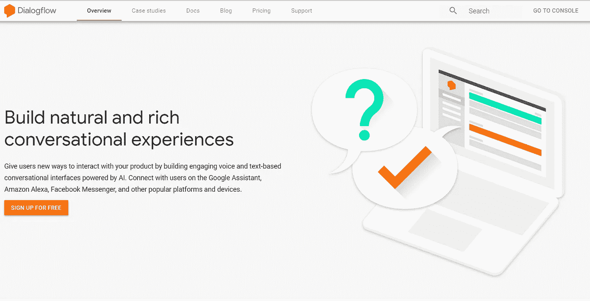**

**Dialogflow 主页**

**点击**“免费注册”**按钮，系统会提示您输入您的谷歌账户密码并创建一个新的谷歌项目。这是一个简单易行的步骤。**

**现在您的项目已经创建好了，让我们来看一下 DialogFlow 面板。**

**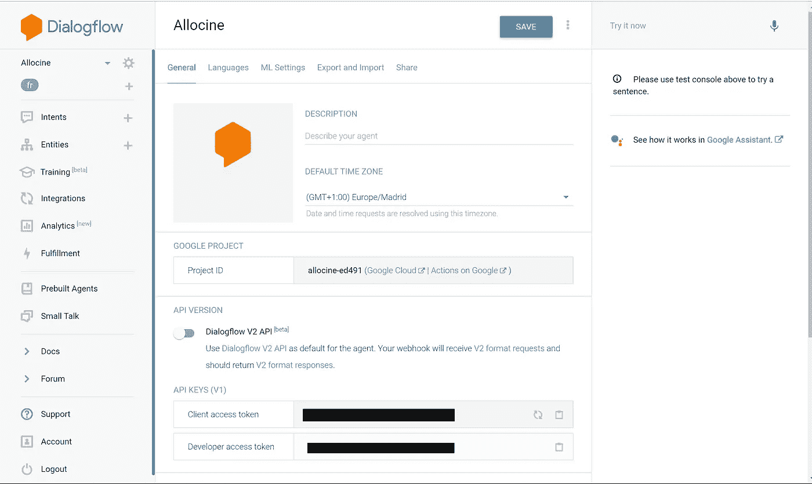**

**如你所见，我的聊天机器人叫做 **Allocine** 。**

**该界面由三部分组成:**

*   ****左侧侧面导航菜单****
*   ****屏幕中央的主要组件****
*   **右边的聊天界面，你可以在这里测试和调试你的聊天机器人**

**让我们看看这个配菜菜单提供了什么:**

*   **这些是你的聊天机器人处理的场景。**
*   **实体:那些是你定制的数据结构(不是算法结构，如果你喜欢的话，也可以是 JSON 对象)。事实上，DialogFlow 有很多类似`@sys.date, @sys.number`之类的内置实体。**
*   ****训练:**这个功能非常强大和直观。它给你一个人们与你的聊天机器人最近聊天的概述，并且它能使你监督学习。假设你的聊天机器人不能理解一个问题，你可以找到这个问题，并告诉“下次，就像在澳大利亚正常的预订场景一样处理它”。**
*   ****集成:**几乎一键集成不同的平台，如脸书、Telegram、Slack、Twitter 等。**
*   ****分析:**你已经知道了。**
*   ****履行:**我们将关注什么。它负责将你的聊天机器人绑定到你的服务器，以处理特殊请求。例如，如果有人键入“我想买一个比萨饼”，您可以将这个意图(也称为场景)绑定到您的服务器逻辑。Google 还允许那些对 Firebase Cloud 比较熟悉的人使用它(内置浏览器代码编辑器)。这部分也叫 webhooks。**
*   ****预建代理:**一组非常有用的现有代理，帮助您开始使用 Dialogflow。它允许您导入代理，了解它们如何工作，定制它们，等等。**
*   ****闲聊:**正是它听起来的样子。这一部分旨在让您配置您的聊天机器人将如何处理小型会谈。这一部分不应该被忽略，因为它让你的聊天机器人看起来更像人类。**

**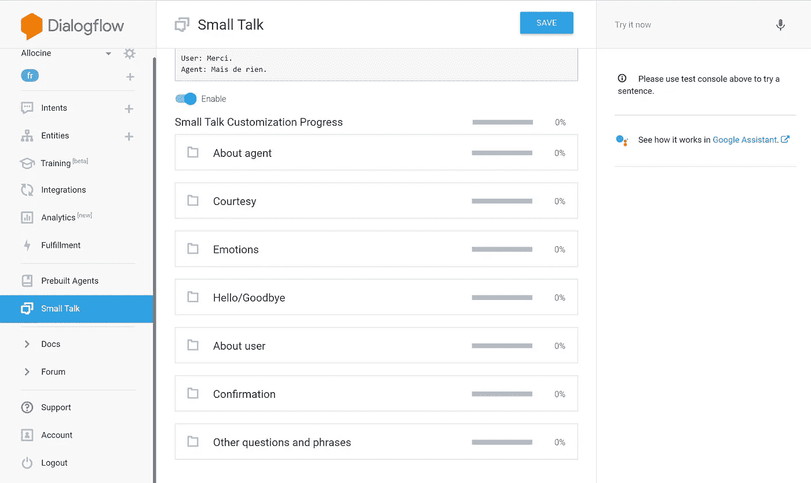**

**你明白了吗？**

****

**Jason Rosewell 在 [Unsplash](https://unsplash.com?utm_source=medium&utm_medium=referral) 上拍摄的照片**

# **让它说话-基础**

**导航到**闲聊**面板。**

**选择一个主题，例如**关于代理****

> ****旁注:** `Agent`是用作`Chatbot`同义词的术语**

**填写字段，每行对应一个问题的可能答案。**

**例子**

**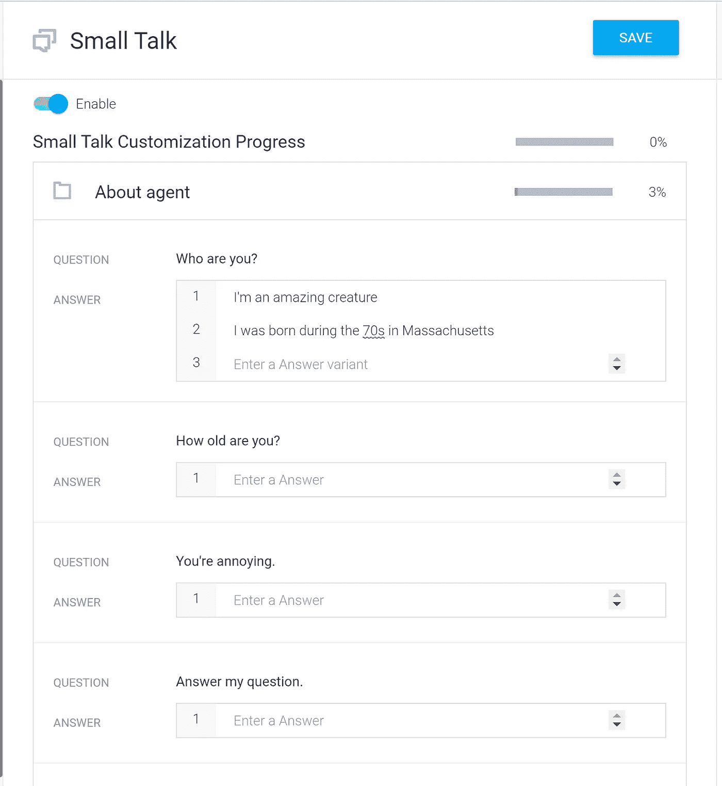**

**不要忘记**保存**按钮和**启用**开关**

**然后点击右上角的**保存**。**

**用正确的面板试试吧！**

**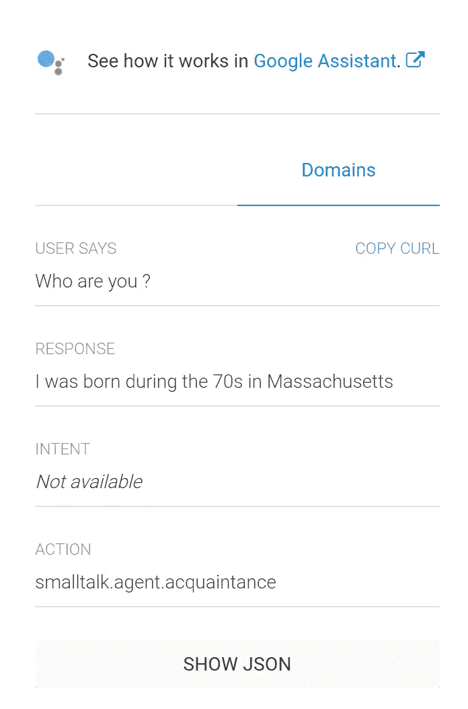**

**你的宝宝刚刚说出了他的第一个单词。**

**您有一些额外的信息，如:**

*   ****Google Assistant :** 一个模拟器，看看你的聊天机器人在 Google Assistant 中是如何工作的，有专门的面板和非常有用的调试工具。**
*   ****显示 JSON 按钮:**对于调试非常有用，你已经得到了大量的信息，比如日期、语言、动作、意图等等。**
*   **Copy CURL : CURL 是一个命令行界面，允许您非常容易地执行 http 请求。例如，拥有用户界面和令人敬畏的功能的等同物是 **Postman** 。**

**从现在开始，你应该能让你的聊天机器人说话，并且有个性。如果允许用户实际输入文本来与你的聊天机器人**互动，那么填充闲聊部分是很重要的(例如，在 Facebook Messenger 中，你可以自由地禁用该功能，这样用户只能触发按钮来使用你的“聊天机器人”**)**

# **挖掘一点——网络钩子**

**到目前为止，你的聊天机器人是一个巨大的数据库，充满了硬编码的问题-答案字段。**

**现在，我们的目标是了解如何让它更动态*(这句话让我立刻想起了另一个关于动态网页从 HTML/CSS 转换到 PHP 的旧教程)。***

****除了有一个由你的服务器驱动的智能聊天机器人之外，webhooks 总体上是强大的，因为它允许你将任何东西与聊天界面集成在一起。****

> **这就是为什么利用 DialogFlow 或任何其他大型聊天机器人平台非常方便，因为它处理所有的 NLP 部分，与 Messenger、Whatsapp 等应用程序的集成，以及其他你我无疑都不知道的大问题。**

**让我解释一下。例如，如果你想在聊天机器人上建立一个电子商务，你可以。**

**场景:**

*   ****“嗨，我在找最新款的耐克空气马克斯。”****
*   **(通过 webhook 执行数据库请求)->显示最新的 Air Max 型号。**“你想买吗？”****
*   ****“当然！”****
*   ****“输入您的信用卡信息 bla bla”****
*   ****搞定。****

> **这个例子只是为了证明我的观点。这样一个应用程序将会引发巨大的安全问题，巨大的 UX 问题，而且它会扼杀就业机会，因为不会再有广告了。**

## **设置**

**首先，**从左侧菜单导航至“完成”**。**

**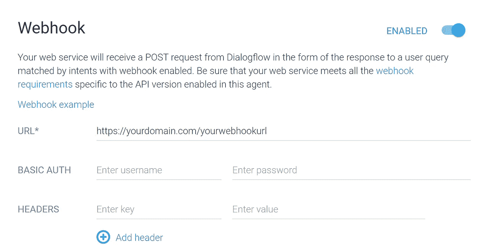**

> **HTTPS 不是一个选项**

****相信我，如果你的 SSL 证书没有在你的服务器上完美配置，DialogFlow 就不会工作。**(我在上面丢了几天，以后见)**

**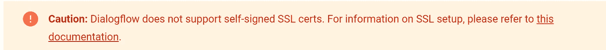**

**记住它**

**您可以在发送的请求中配置基本身份验证和标头，但这不是强制性的。**

**其次，**定义一个意图**(一个场景)。**

**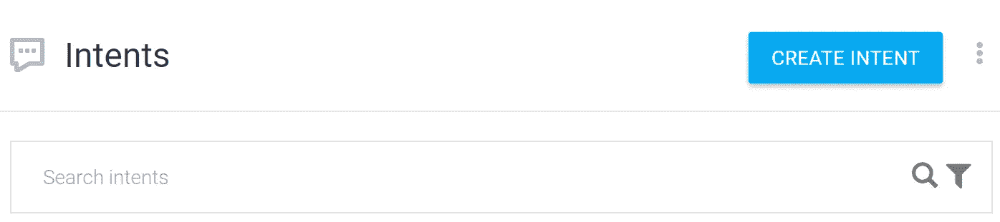**

**点击**按钮【创建意图】****

**接下来，您将被重定向到此配置屏幕。**

**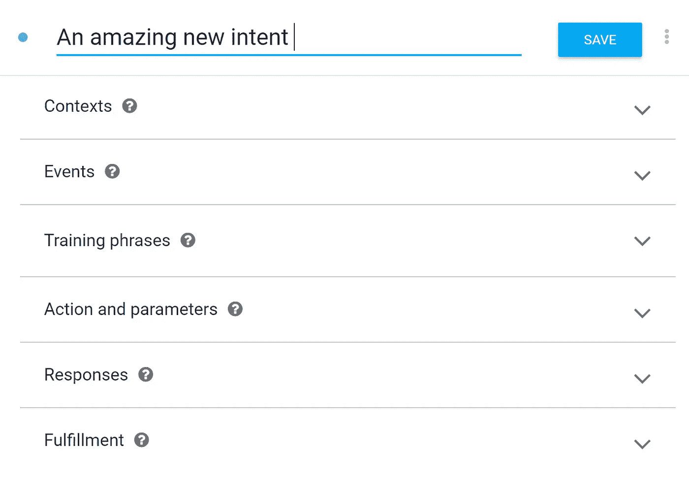**

****填写**你想要的并点击**按钮保存****

**每个部分的简要描述:**

*   ****上下文:**允许你为每个用户定义一个生命周期的变量。 [**文档**](https://dialogflow.com/docs/contexts)**
*   ****事件:**那些是谷歌提供的事件。例如，当用户第一次用“开始”按钮开始对话时。 [**文档**](https://dialogflow.com/docs/events)**
*   ****训练短语:**引用工具提示:“你可以从用户那里期待的，会触发意图的短语”**
*   ****动作和参数:** [**文档**](https://dialogflow.com/docs/actions-and-parameters)**
*   ****响应:**就像闲聊一样，它允许您配置当意图被触发时使用的默认响应。**
*   ****Fulfillment :** 如果你希望你的 webhook 被调用，你需要启用的部分。 [**文档**](https://dialogflow.com/docs/fulfillment) **。**请注意，如果您的 webhook 由于某种原因中断，将使用默认响应，您期望 DialogFlow 有多智能？😃**

> **DialogFlow 是有据可查的，真的。文档是交互式的，在代码示例之间有内置的聊天工具，可以帮助你理解事情。花时间在上面，值得。**

**这是我的配置**

**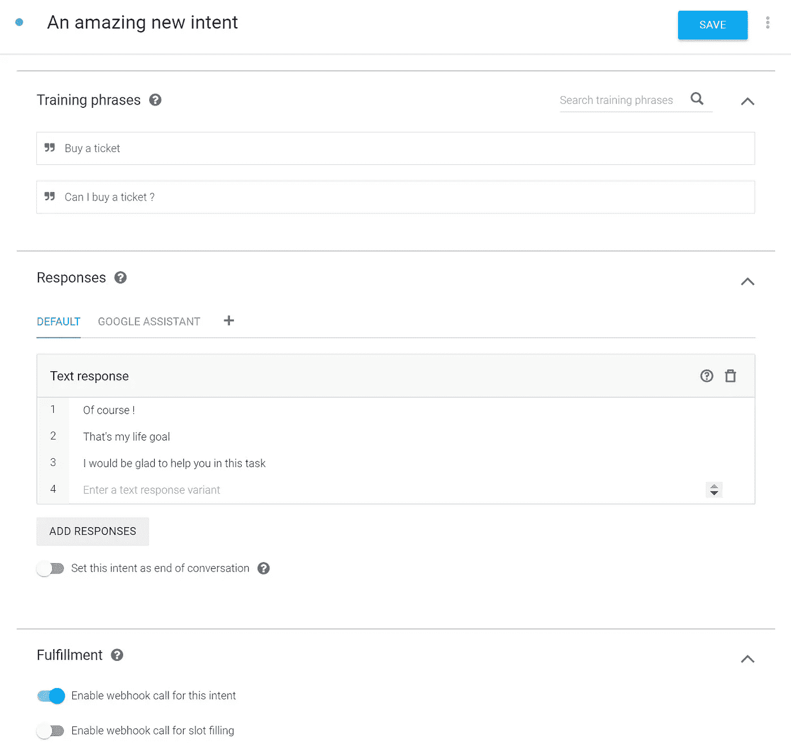**

****太棒了，**现在救你的吧**

**测试一下以防万一。**

**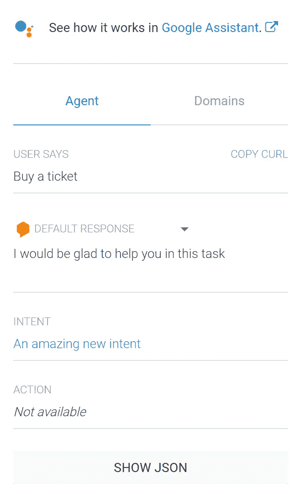**

**耶！！！**

## **编码部分-用超能力扩展你的聊天机器人**

> **这就是你来的目的**

**我不会去设置 SSL 证书或在 NodeJs 中设置 express 应用程序。**(下一整篇文章都会在上面，这就是为什么)****

**我们假设你的服务器在运行，https 工作完美，你的 webhook 路由是:`/webhook`。**

****DialogFlow 在触发 webhook 时使用 JSON 数据执行 POST 请求。****

**这就是你的处理方式。**

**就这么简单**

> **注意，也可以使用 Google 官方发布的 NodeJS 包:[https://github.com/dialogflow/dialogflow-nodejs-client-v2](https://github.com/dialogflow/dialogflow-nodejs-client-v2)**

**如果你再次测试。**

**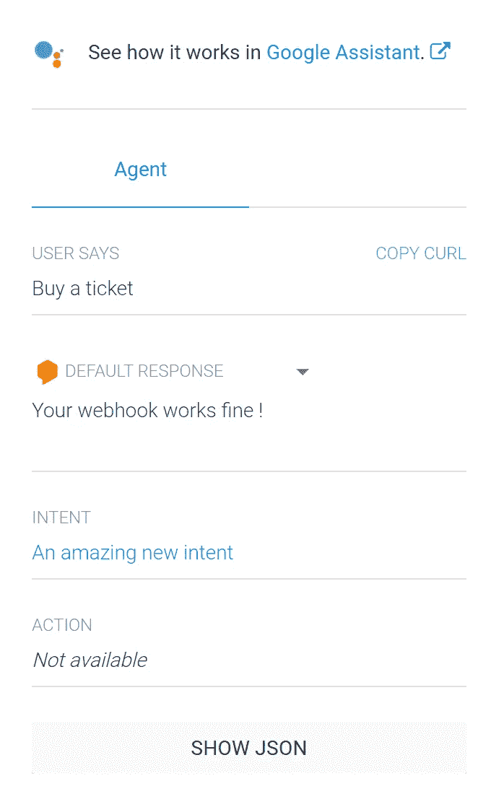**

**如果响应不是来自 webhook 请求，查看这个文档并点击 **Show JSON** :**

**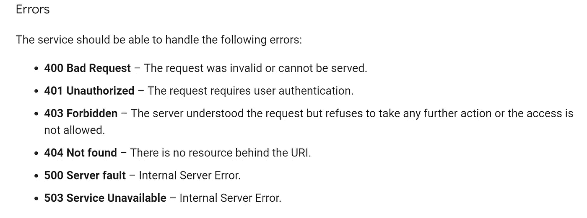**

**截图来自**官方文档****

**您可以更进一步，创建自己的定制实体，阅读文档并构建一个大型项目。例如，我使用 DialogFlow 的第一个项目是一个简化的汽车预订系统(涉及定制实体和意图)。**

# **有趣的事实(没那么多)**

**你们中的一些人可能已经注意到，在发表这篇文章之前，我花了比平均时间更多的时间，即使我正努力做到每周一篇文章。**

**这种延迟是由一个可怕的罪犯造成的:SSL。**

**它毁了我的日子。**

**然而，好的一面是，它让我想写一篇关于如何在两分钟内设置一个免费的 SSL 证书的文章，不管你的服务器运行的是什么操作系统。准备好😃**

****DialogFlow 不允许用户在不使用 HTTPS 协议的服务器上使用 webhooks。****

****

**我，搜索一个真正的手写教程使用 LetsEncrypt 与 NodeJs**

# **感谢阅读**

**我希望你喜欢这篇文章。**

**最后一个是这个系列的第一部分:**

*   ****英文**:[https://it next . io/creating-a-chatbot-to-book-cinema-shows-part-1-9c 13 de 573 a 07](/creating-a-chatbot-to-book-cinema-shows-part-1-9c13de573a07)**
*   ****西班牙语:**[https://planetachatbot . com/creando-un-chatbot-para-reservar-entra das-de-cine-c 0 e 7c 5 a 0 f](https://planetachatbot.com/creando-un-chatbot-para-reservar-entradas-de-cine-c0e7c9c5a0f)**

**对于所有可能感到疑惑的人:**这是本系列的第二步，也是最后一步。我正努力让我的内容易于理解，并为初学者和早期高级开发人员重用。****

****不过，我很乐意更进一步，与大家互动，围绕聊天机器人、安全等话题展开辩论和讨论。****

**像往常一样，请随时通过**David . mell ul @ outlook . fr**联系我**

****

**[吴怡](https://unsplash.com/@takeshi2?utm_source=medium&utm_medium=referral)在 [Unsplash](https://unsplash.com?utm_source=medium&utm_medium=referral) 上的“白色马克杯中的卡布奇诺，白色泡沫艺术在木桌上”**