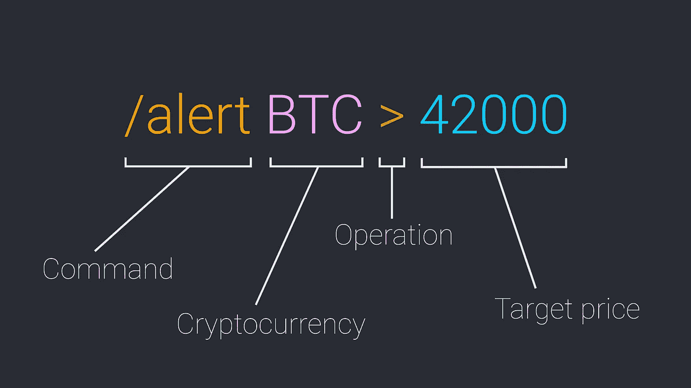
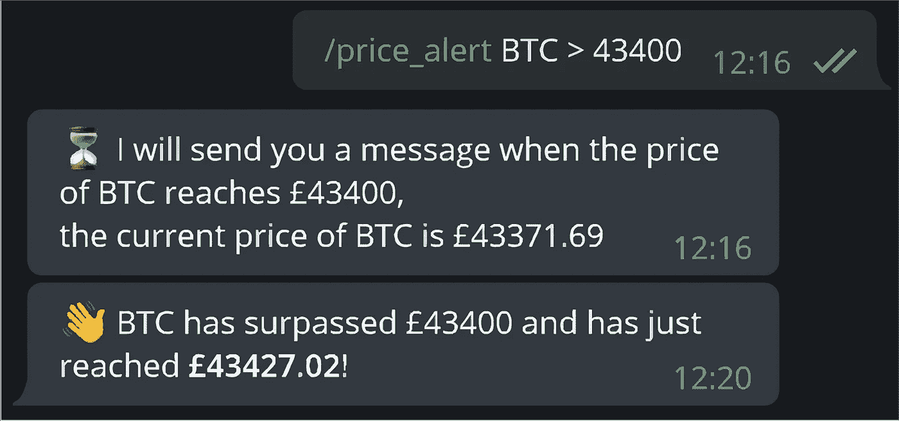

# 用 Python 在 Telegram 上创建一个加密价格提醒机器人

> 原文：<https://itnext.io/creating-a-crypto-price-alert-bot-on-telegram-with-python-ce3779879357?source=collection_archive---------0----------------------->

# 介绍

随着越来越多的人投资加密货币以获得短期和长期收益，加密货币越来越受欢迎。连我都买了一些。但有一件事很难做到，那就是持续跟踪某种加密货币的价格。今天，我将向您展示如何创建一个电报机器人，它可以在加密货币超过目标价格时提醒您。

要与电报机器人交互，您可以向它们发送以命令开头的消息，如果需要，还可以发送任何参数。



我们的警报命令的语法图

你必须确保通过它的符号告诉机器人要观察哪种加密货币。你可以在这里看到密码及其符号的列表[。该操作将以小于的*或大于*的*符号表示，目标价格将以您当地的法定货币表示，例如，对我来说是英镑(无论您在哪里看到英镑，如有必要，请将其改为您当地的法定货币)。为了获得加密货币的当前价格，我将使用比特币基地 API。如果您想使用另一个 API，下面会有更多的信息。如果你没有比特币基地账户，那么你可以在这里创建一个(这是一个推荐链接，如果你使用它会很酷)。*](https://coinmarketcap.com/all/views/all/)

在运行我们的机器人之前，我们需要做两件事:

1.  设置先决条件
2.  给机器人编程

# 设置先决条件

首先，我们需要从 telegram 获得一个官方的机器人令牌，没有它就不可能创建一个机器人。首先，您需要向[机器人父亲](https://t.me/botfather)发送消息，然后从那里您可以使用`/newbot`命令创建一个机器人。你很快就会得到一个机器人令牌，确保你把它记在某个地方，不要与任何人分享。

现在我们需要获得我们的比特币基地 API 令牌。为此，你可以去他们的[网站](https://www.coinbase.com/settings/api)创建一个新的 API 密钥。你可以添加任何基本权限，但如果你希望你的机器人能够告诉你你的账户余额，那么你可以添加钱包读取权限(我今天不会讨论)。如果您犯了错误，请不要担心，如果需要，您可以随时创建新的 API 密钥。一旦你创建了一个密匙，你的 API 密匙和密匙就会出现在屏幕上。确保你把这两个都记在安全的地方，并且**不要告诉任何人你的 API 秘密**，否则如果权限允许，他们可以访问你的整个帐户。

如果你没有比特币基地账户，那么你可以从另一个服务获得 API 密钥，这样你就可以获得任何加密货币的当前价格。请务必检查通话限制，因为我们将每隔 15 秒左右对服务器进行 ping 操作，而您不想被暂时禁止。

# 给机器人编程

在我们开始编码之前，我们需要安装一些新的库，这将允许我们与比特币基地 API 接口，并创建电报机器人。您可以运行以下命令来安装这两者:

```
pip install python-telegram-bot coinbase
```

注意:如果您没有使用比特币基地，那么您可能需要搜索如何从您的 API 请求数据。

首先，我们需要导入我们的库，创建我们的令牌常量，并创建我们稍后要访问的比特币基地客户端对象:

确保用模拟键替换您的 API 键。

电报机器人的工作原理是添加一个处理程序来检查每一条输入的消息，它会检查特定的处理程序是否能够处理该消息。如果可以，那么将调用在创建处理程序时作为参数提供的函数。要开始使用处理程序，我们需要通过 updater 对象访问 dispatcher 对象(是的，这很混乱，但我将向您展示代码，这将大大简化事情):

我们使用导入并在令牌中提供的 Updater 对象，以及默认的 HTML 解析模式。这意味着我们可以在我们的响应消息中使用一些基本的 HTML 元素来使文本加粗、倾斜或加下划线等。从那里，我们可以访问 dispatcher 对象，并向它添加两个句柄。第一个将是基本的启动处理程序，当它被满足时，我们现在将创建的 *startCommand* 函数将被调用。另一个是警报处理器，它调用 *priceAlert* 函数。

之后，我们告诉更新程序开始轮询。这将不断获取发送给机器人的任何新消息。idle 方法告诉 updater 对象在脚本停止时关闭。我们需要这样做，因为电报机器人作为另一个线程运行，如果不正确关闭，它将继续在后台无休止地运行。

*startCommand* 功能其实很简单:

它接受两个参数，这两个参数都包含激活该函数的消息的信息。在这里，我们向发送机器人消息的同一个聊天室发回一条消息。如果机器人与不同的用户进行多次聊天，这是需要的，否则它不知道回复哪个聊天/用户。

现在我们需要创建 *priceAlert* 函数:

这里您可以看到我们现在从上下文对象中访问了 *args* 属性。它保存了我们在命令调用(/alert)后提供的文本。我们可以检查参数的数量是否大于 2，如果不是，则返回一条错误消息，同时用斜体显示命令的正确语法用法(使用 HTML italics 元素)。否则，我们可以给三个变量赋予它们特定的值。

接下来，我们需要向作业队列添加一个作业，电报机器人将重复运行这个作业，直到它从队列中删除。我们将添加的作业是调用另一个函数，该函数将检查我们想要的加密的价格是否符合我们的要求，如果符合，则发送一个响应，并从队列中删除该作业。这里我们创建一个重复的作业，它在 15 秒后开始，每隔 15 秒调用一次 *priceAlertCallback* 函数。我们还可以提供一个带有特定数据的上下文参数，比如我们想要查询哪个加密、价格、操作类型和聊天 id。之后，我们可以发送一条消息，告诉我们正在查询的加密货币的当前价格。

*priceAlertCallback* 函数其实很简单，它会先检查我们的密码的当前价格，然后根据我们的操作，会检查我们提供的价格与当前价格相比如何。如果他们满足我们的操作，那么我们将发送一个消息，表明我们的目标价格已被超过/达到。在此之后，我们从队列中删除该作业，这是非常重要的，因为我们不希望每隔 15 秒就调用一次该函数，即使在达到我们的价格目标之后。

运行 bot 并发送命令后，您可以等待并检查它是否工作，它应该看起来像这样:



比特币价格超过目标价格时收到的示例消息

# 最后的想法

如果你愿意，你甚至可以扩展这个机器人做更多的事情，甚至可以帮助你自动交易，在价格低的时候买入(买入下跌)，或者根据当前趋势买入(查看移动平均线)。所有这些都是算法交易，而且都非常复杂，也许我会在以后的文章中讨论这个问题。

我希望你喜欢这篇文章，如果你有任何疑问或反馈，请在下面评论。

感谢您的阅读！💖