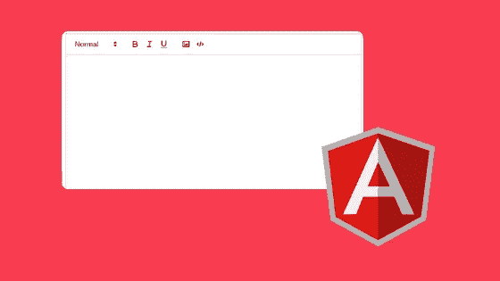
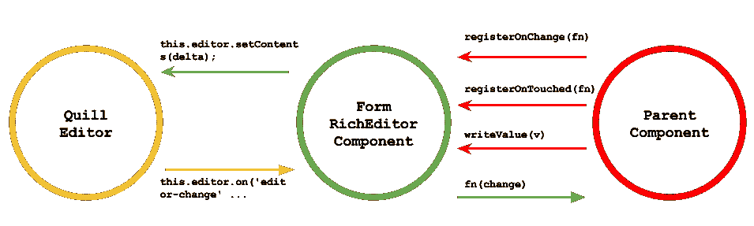

# 创建与反应式表单和角度材料兼容的自定义表单字段控件

> 原文：<https://itnext.io/creating-a-custom-form-field-control-compatible-with-reactive-forms-and-angular-material-cf195905b451?source=collection_archive---------0----------------------->



角材和角材提供了各种基本的 html 表单控件。但是，当我们想使用更复杂的工具，如富编辑器、文件上传器、标签、国际电话等时，会发生什么呢？

遗憾的是，棱角分明的材料无法覆盖所有的项目需求，所以我们必须自己创造。

在花了大量时间搜索示例、阅读教程和测试技术后，我设法创建了各种各样的自定义表单字段，它们与**反应式表单**和**角形材料**表单设计兼容。

在本教程中，我将向你展示我如何用 **Quill** 创建一个富编辑器表单控件，实现 **ControlValueAccessor** 和 **MatFormFieldControl** 。

# 先决条件

*   角度 5°或更高
*   角形材料 5 或更高

(这种方法已经在角度 5 和角度 7 上进行了测试)

# 装置

我假设您已经创建了一个角度项目，并且已经在项目中安装了角度材质。

你必须首先安装 Quill 编辑器及其类型的打字稿。

```
npm install --save quill
npm install --save @types/quill
```

> Quill 有一个简洁的用户界面，它提供了一个广泛的 API 来处理丰富的编辑器及其数据。

开始之前的一些最终配置:将 css 文件导入到项目中。

要么在 index.html

```
<link href="PATH_TO_QUILL_CSS/quill.snow.css" rel="stylesheet">
```

或者在 angular.json 的样式部分

```
...
"styles": [
...
"PATH_TO_QUILL_CSS/quill.snow.css",
...
]
```

就是这样！您终于准备好开始编码了！

# 创建组件

我们将从创建组件开始，就像 angular 中的任何其他组件一样。还没有反应形态和角状物质的联系。我们将使用标准输入/输出与父组件通信。

```
import { Component, Input, OnInit, OnChanges, ElementRef, ViewChild, Output, EventEmitter } from '@angular/core';
import Quill from 'quill';const SELECTOR = 'rich-editor';@Component({ selector: SELECTOR, template: `<div class="text-editor-container" #container>         
     <div id="editor" (click)="onTouched()" [ngStyle]="{'height': 
      '200px'}"></div>
   </div>`, styles: [`img {
      position: relative;
    }`]
})export class FormRichEditorComponent implements OnInit, OnChanges{@ViewChild('container', { read: ElementRef }) container: ElementRef;
@Input() value: any;@Output() changed: EventEmitter<any> = new EventEmitter();//this one is important, otherwise 'Quill' is undefined
quill : any = Quill; editor: any;constructor(public elementRef: ElementRef) {}ngOnInit(): void {
   let editor = this.container.nativeElement.
                 querySelector('#editor') this.editor = new Quill(editor, {theme: 'snow'}); this.editor.on('editor-change', (eventName, ...args) => {
 **this.changed.emit(this.editor.getContents());**   })
}ngOnChanges() {
    if (this.editor) {
 **this.editor.setContents(this.value);**    }
  }}
```

一旦编辑器被创建，我们使用`editor-change`事件订阅它的值变化。当事件被触发时，我们使用`changed`输出事件发射器通知父组件。我们还使用`ngOnChanges`生命周期钩子跟踪输入`value`绑定的变化，当值更新时，我们将它设置到富编辑器中。

现在，我们的组件可以在父组件中使用了！

为此，请使用以下代码片段:

```
<rich-editor [value]="editorValue" (changed)="editorValueChanged($event)">
</rich-editor>
```

然而，正如我在本文开头所说的，我们希望将我们的富编辑器作为表单的一部分，并使用反应式表单指令与它进行通信。为此，我们需要实现一个值访问器。并且我们不会使用标准的输入/输出通信机制，我们将在实现 ValueAccessor 时删除它。

# 实现自定义 ValueAccessor

实现自定义值访问器需要两个简单的步骤:

1.  注册一个`NG_VALUE_ACCESSOR`提供商
2.  实现`ControlValueAccessor`接口方法

`NG_VALUE_ACCESSOR` provider 指定了一个实现`ControlValueAccessor`接口的类，Angular 使用它来设置与`formControl`的同步。通常是注册提供者的组件(或指令)的类。

所有表单指令都使用标记`NG_VALUE_ACCESSOR`和一个合适的访问器注入值访问器:

*   一个非内置的访问器(就像我们将要实现的)
*   `DefaultValueAccessor`

我们只能为每个元素定义一个自定义访问器。

那么，让我们来定义提供者:

```
@Component({
...
providers: [{
   **provide**: **NG_VALUE_ACCESSOR**,
   **useExisting**: **forwardRef**(() => **FormRichEditorComponent**),
   multi: true
}]
```

什么是 forwardRef，为什么我们在这里使用它？

在官方的角度文档中，我们可以看到以下关于`*forwardRef*`的定义:

> 允许引用尚未定义的引用。
> 
> 例如，`*forwardRef*`被用在为了 DI 的目的我们需要引用的`*token*`被声明，但是还没有被定义的时候。当我们在创建查询时使用的`*token*`尚未定义时，也会用到它。

因此需要`*forwardRef*`,因为当提供者注册时我们的类还没有被定义，我们需要告诉**提供者构造函数**,这样它可以等待类被定义。

现在我们已经定义了我们的`NG_VALUE_ACCESSOR`提供者，所以让我们实现`ControlValueAccessor`接口:

```
export class FormRichEditorComponent **implements** OnInit, OnChanges, **ControlValueAccessor** {
   ...
   ngOnInit(): void {
      ...
      this.editor.on('editor-change', (eventName, ...args) => {
 **this.onChange(this.editor.getContents());**      })
   } **onChange = (delta: any) => {};

   onTouched = () => {
      this.touched = true;
   };** **writeValue(delta: any): void {**
      this.editor.setContents(delta);
      this._value = delta;
 **}** **registerOnChange(fn: (v: any) => void): void {
      this.onChange = fn;
   }** **registerOnTouched(fn: () => void): void {
     this.onTouched = fn;
   }**
```

根据官方角度文件:

*   `writeValue`:向元素写入一个新值。
*   `registerOnChange`:注册一个回调函数，当 UI 中控件的值改变时调用该函数。
*   `registerOnTouched`:注册表单 API 在初始化时调用的回调函数，在模糊时更新表单模型。

因此，在`registerOnChange`中，我们简单地保存对由`formControl`传递的回调`fn`函数的引用。我们将在每次编辑器内容改变时触发它。在`writeValue`方法中，我们将内容设置为富编辑器。最后，在`registerOnTouched`中，我们保存了对由`formControl`传递的回调`fn`函数的引用。

所以上面的功能交互看起来像这样:



通过比较我们在开始时创建的简单包装器和 controlValueAccessor，我们可以看到与父组件的交互有点不同，而与 Quill 编辑器的交互是相同的。
我们用`writeValue`替换了`ngOnChanges`，这里我们想要改变视图值，我们用`this.onChange(this.editor.getContents())`替换了`this.changed.emit(this.editor.getContents())`，这里我们想要通知表单一个改变。

我们唯一要做的事情，就是调用父组件中的组件。让我们开始吧。

```
@Component({
  selector: 'my-app',
  template: `
      <span>Current Editor's value: {{ctrl.value}}</span>
     ** <rich-editor [formControl]="ctrl"></rich-editor>**
  `
})
export class AppComponent {
  **ctrl = new FormControl();**
}
```

现在我们的自定义形式与角反应形式相连接！

我们的下一步是连接我们的形式领域与角材料。

如果您试图将我们刚刚创建的表单字段包装在一个`mat-form-field`标签中，您将会得到一个如下所示的错误:

```
mat-form-field must contain a MatFormFieldControl
```

那是因为我们的组件没有实现`MatFormFieldControl`。

# 实现 MatFormFieldControl

第一步是提供我们的新组件作为`MatFormFieldControl.`的实现

> `MatFormFieldControl`是一个`<mat-form-field>`知道如何使用的接口。

然后，我们向我们的组件添加一个提供者，这样表单域将能够将其作为`MatFormFieldControl`注入(就像我们之前对`ControlValueAccessor`所做的那样)。

```
@Component({
...
providers: [
 {
   provide: NG_VALUE_ACCESSOR,
   useExisting: forwardRef(() => FormRichEditorComponent),
   multi: true
 },
 **{
   provide: MatFormFieldControl,
   useExisting: FormRichEditorComponent
 }**
]export class FormRichEditorComponent implements OnInit, ControlValueAccessor, **MatFormFieldControl<any>**) {...
```

这设置了我们的组件，所以它可以与`<mat-form-field>.`一起工作。现在我们需要实现接口声明的方法和属性。

# **MatFormFieldControl 属性**

`**stateChanges**`

因为`<mat-form-field>`使用`OnPush`变更检测策略，所以我们需要让它知道表单域控件中发生了什么事情，可能需要表单域运行变更检测。我们可以通过`stateChanges`属性做到这一点。

当我们的组件被破坏时，我们应该确保完成`stateChanges`。

```
**stateChanges = new Subject<void>();**ngOnDestroy() {
 **this.stateChanges.complete();**
}
```

我们这样做是因为当值、焦点、触摸状态、禁用和错误状态改变时，我们需要在`stateChanges`上发出信号。我稍后会解释。

`**ngControl**`

该属性允许表单域控件指定绑定到该组件的`@angular/forms`控件。因为我们已经将组件设置为充当`ControlValueAccessor`，所以我们将在组件中将它设置为`this`。

```
constructor(public elRef: ElementRef, **public injector: Injector**) {}ngOnInit() {
   **this.ngControl = this.injector.get(NgControl);
   if (this.ngControl != null) { this.ngControl.valueAccessor = this; }**
...
}
```

> 注意，我们没有在`*constructor*`注入`*ngControl*`，因为它导致`*Cyclic Dependency*`。
> 
> 我们可以通过`*Injector*`注入它来避免错误。

我们需要导入`Injector.`

```
import { Component, Input, OnInit, ElementRef, ViewChild, Output, forwardRef, **Injector** } from '@angular/core';
```

`**controlType**`

这个属性允许我们为表单域中的控件类型指定一个唯一的字符串。`<mat-form-field>`将在此类型的基础上添加一个额外的类，该类可用于轻松地将特殊样式应用于包含特定类型控件的`<mat-form-field>`。在我们的组件中，我们将使用`richeditor`作为我们的控件类型，这将导致表单字段添加类`mat-form-field-richeditor`。

```
controlType = 'richeditor';
```

`**errorState**`

该属性指示关联的`NgControl`是否处于错误状态。最初我们将它设置为 false，但是我们在 **ngDoCheck** 检查变化，并根据控件的有效性更改它的值。

```
**errorState = false;**...**ngDoCheck(): void {
   if(this.ngControl) {
      this.errorState = this.ngControl.invalid && this.ngControl.touched;
     this.stateChanges.next();
   }**
**}**
```

如果你在上面的代码片段中注意到了，我们使用了`ngDoCheck`生命周期钩子，所以我们需要导入它并通知类我们将要实现它。

```
import { Component, Input, OnInit, ElementRef, ViewChild, Output,  forwardRef, Injector,  **DoCheck** } from '@angular/core';...export class FormRichEditorComponent implements OnInit, **DoCheck**, ControlValueAccessor, MatFormFieldControl<any> {
```

`**value**`

这个属性允许我们设置或获取控件的值。我们应该用实现`MatFormFieldControl`时用于类型参数的相同类型来定义它。我们将使用的类型是`any,`，因为鹅毛笔编辑器的值是一个增量。正如您在下面看到的，当值发生变化时，我们运行变化检测器。

```
_value: any;
**get value(): any {
   return this._value;
}****set value(value) {
   this._value = value;
   this.editor.setContents(this._value);
   this.onChange(value);
   this.stateChanges.next();
}**
```

`**placeholder**`

我们让用户可以通过`@Input()`指定定制表单域的`placeholder`(就像 matInput 和 mat-select 做的那样)。由于占位符的值可能会随着时间而改变，我们需要确保在占位符改变时通过在`stateChanges`流上发出来触发父表单字段中的改变检测。

```
@Input()
get placeholder() {
   return this._placeholder;
}set placeholder(plh) {
   this._placeholder = plh;
   this.stateChanges.next();
}public _placeholder: string;
```

`**focused**`

此属性指示表单域控件是否应被视为处于焦点状态。

> 当表单域处于焦点状态时，它会以纯色下划线显示。

我们可以使用来自`@angular/cdk`的`FocusMonitor`来轻松检查这一点。我们还需要记住在`stateChanges`流上发出，这样就可以进行变更检测。

当组件被销毁时，我们还希望停止监视焦点变化。

```
constructor(public elRef: ElementRef, public injector: Injector, fm: FocusMonitor) {
... **fm.monitor(elRef.nativeElement, true).subscribe(origin => {
     this.focused = !!origin;
     this.stateChanges.next();
   });** ngOnDestroy() {
     ...
 **this.fm.stopMonitoring(this.elRef.nativeElement);**   }
}
```

`**required**`

此属性用于指示是否需要输入。`<mat-form-field>`使用此信息向占位符添加所需的指示器。如果所需的状态发生变化，不要忘记运行变化检测。

```
@Input()
get required() {
   return this._required;
}set required(req) {
   this._required = coerceBooleanProperty(req);
   this.stateChanges.next();
}public _required = false;
```

我们还必须导入`coerceBooleanProperty.`

```
import { coerceBooleanProperty } from '@angular/cdk/coercion';
```

`**disabled**`

该属性通知表单域何时应处于禁用状态。同样，如果禁用状态发生变化，不要忘记运行变化检测。

```
@Input()
get disabled() {
   return this._disabled;
}set disabled(dis) {
   this._disabled = coerceBooleanProperty(dis);
   this.stateChanges.next();
}public _disabled = false;
```

`**id**`

该属性返回组件模板中一个元素的 ID，我们希望`<mat-form-field>`将它的所有标签和提示与该元素相关联。在这种情况下，我们将使用 host 元素，并为它生成一个惟一的 ID。

```
static nextId = 0;@HostBinding() id = `rich-editor-input-${FormRichEditorComponent.nextId++}`;
```

正如我们之前所做的，我们必须导入`HostBinding`

```
import { Component, Input, OnInit, ElementRef, ViewChild, Output, forwardRef, Injector,  DoCheck, **HostBinding** } from '@angular/core';
```

`**empty**`

此属性指示表单域控件是否为空。对于我们的控件，如果它没有任何字符，我们就认为它是空的。

```
get empty() {
   const commentText = this.editor.getText().trim();
   return commentText ? false : true;
}
```

`**shouldLabelFloat**`

此属性用于指示标签是否应处于浮动位置。我们将使用与`matInput`相同的逻辑，并在输入被聚焦或非空时浮动占位符。

```
@HostBinding('class.floating')
get shouldLabelFloat() {
  return this.focused || !this.empty;
}
```

因为占位符在不浮动的时候会和我们的控件重叠，所以我们应该稍微改变一下它的位置。

```
.mat-form-field-type-richeditor.mat-form-field-can-float .mat-form-field-label-wrapper, .mat-form-field-type-file.mat-form-field-can-float .mat-form-field-label-wrapper {
   top: -22px;
}.mat-form-field-type-richeditor.mat-form-field-should-float .mat-form-field-label-wrapper, .mat-form-field-type-file.mat-form-field-should-float .mat-form-field-label-wrapper {
   top: -8px;
}
```

`setDescribedByIds(ids: string[])`

这个方法被`<mat-form-field>`用来指定应该用于组件的`aria-describedby`属性的 id。该方法有一个参数，id 列表，我们只需要将给定的 id 应用到我们的主机元素。

```
@HostBinding('attr.aria-describedby') describedBy = '';setDescribedByIds(ids: string[]) {
   this.describedBy = ids.join(' ');
}
```

现在，我们必须将这些 id 应用于我们的主机元素。

```
@Component({
...
   **host: {
      '[id]': 'id',
      '[attr.aria-describedby]': 'describedBy'
   }**
...
})
```

`**onContainerClick(event: MouseEvent)**`

当单击表单域时，将调用此方法。它允许我们的组件挂接并处理点击。该方法有一个参数，即点击的`MouseEvent`。在我们的例子中，如果用户无论如何都不打算点击`<div>`，我们将只关注`<div>`。

```
onContainerClick(event: MouseEvent) {
   if ((event.target as Element).tagName.toLowerCase() != 'div') {
      this.container.nativeElement.querySelector('div').focus();
   }
}
```

# 尝试

现在我们已经完全实现了`ControlValueAccessor`和`MatFormFieldControl`接口，我们准备好测试我们的组件了！我们需要做的就是把它放在一个`<mat-form-field>`里面

```
<mat-form-field>
   **<rich-editor [formControl]="ctrl"></rich-editor>**
</mat-form-field>
```

我们还获得了`<mat-form-field>`的所有特性，比如浮动占位符、前缀、后缀、提示和错误。

```
<mat-form-field>
  **<rich-editor [formControl]="ctrl"></rich-editor>
**  <mat-hint>Include your formatted text</mat-hint>
  <mat-error>This field cannot be empty!</mat-error>
</mat-form-field>
```

仅此而已！感谢您的阅读！