# 使用角度创建自定义库

> 原文：<https://itnext.io/creating-a-custom-library-with-angular-888a7e3689ca?source=collection_archive---------0----------------------->

嘿伙计们，我今天在这里谈论自定义库。我希望在本文结束时，你会知道如何创建自己的自定义库。😊

# 介绍

当您对 Angular 架构进行初步规划时，您可能会发现您的一个共享资源需要在多个应用程序之间共享。例如，你想把它放在 [npm](https://www.npmjs.com/) 中，或者放在你的公司可能使用的内部 [npm](https://www.npmjs.com/) 中。这样，多个应用程序都可以利用它。听起来不错？是的，听起来很棒😊。

# **创建自定义库**

首先，您需要使用 CLI 创建一个新项目。

在这一点上我们应该都很好。从这里开始，我们需要使用 Angular 6 或更高版本中 CLI 提供的命令，即 *ng generate* 。这个 *ng 生成*库被设计用来创建一个定制的共享库。然后，通过为您的库命名，它将被添加到一个单独的项目中，这个项目称为工作区。

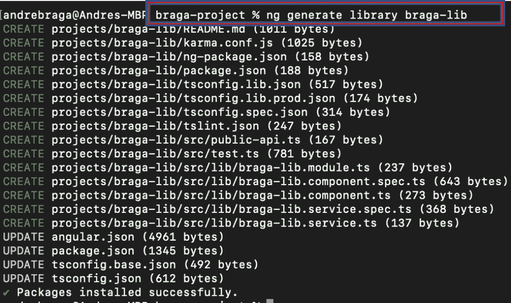

当你做 *ng new* 的时候，你会得到一个包含一个项目的工作空间，这个项目就是你的 web 项目。这个 *ng generate* 将在工作区中添加第二个版本，这样我们就可以在 Angular 应用程序中测试我们的库，而无需发布到 npm 或任何其他资源。现在，这将修改 *tsconfig* 文件，该文件将被更新，以便 Angular 项目(工作区中的独立项目)了解如何访问我们将要构建的库，即共享库。

然后，您可以使用 *ng build* 命令构建您的库，然后为它命名您的项目，如下所示:

您可以使用它，并在工作空间内的另一个 Angular 项目中直接测试它。因此，它使做这件事变得非常容易，而不必在某个地方发布到 npm。在那之后，一旦我们准备就绪，我们将希望发布到 npm，我们已经对它进行了测试，它看起来不错，因为我们希望能够从 npm 引入，无论它是任何人都可以访问的 npm，还是您公司可能拥有的内部 npm。我们希望将这些应用程序整合到我们不同的应用程序中，这样我们就可以得到重用。如果你是 npm 的新手，有一个[链接](https://docs.npmjs.com/packages-and-modules/contributing-packages-to-the-registry)。

我们需要这样做才能进入 dist 文件夹，其中将包含 package.json 文件。这将用于向 npm 发布。我们只需要编写以下命令:

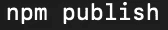

那么，我们应该看到我们的解决方案中的不同之处吗？我们走吧，☺.

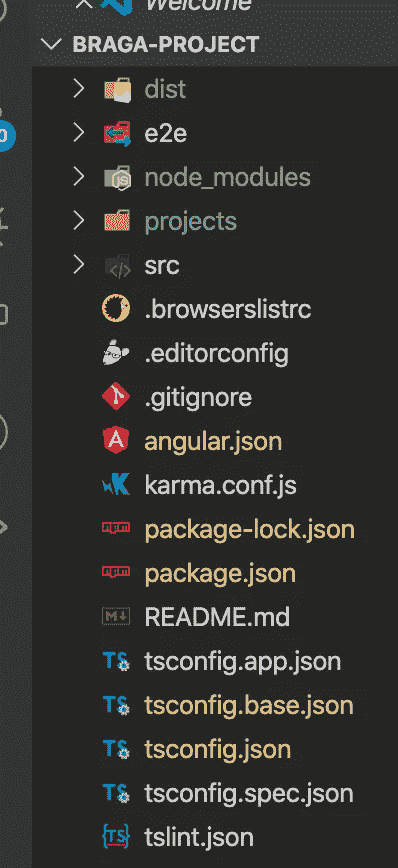

首先，你会注意到我们有一个*项目*文件夹。我们现在也有了更新的 *tsconfig* ，如下图所示:

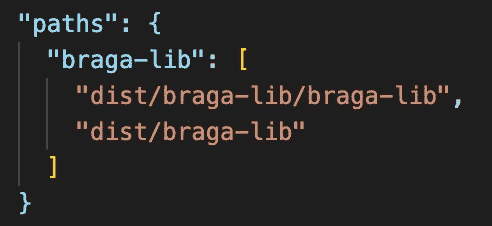

它添加了路径，我们最终将在哪里建立我们的 dist 文件夹，一旦我们做了一个构建，这就是为什么你必须先构建，然后你才能这样做，因为 TypeScript 实际上是要指望这能够使这一切工作。

现在，已经完成的另一件大事是我们的 *angular.json* 文件中有一个新项目:

因此，我们在这里有一个二级项目，这是我们的 braga-lib，你会注意到这个项目的根的路径。现在，构建和测试所需的一切都包括在内了。这些是它修改的主要内容。现在，我们可以从这里对我们的库进行更改。因此，如果我们进入，您将在这里看到普通文件和一个 src 文件夹，然后他们添加的是一个 lib，如您所见:

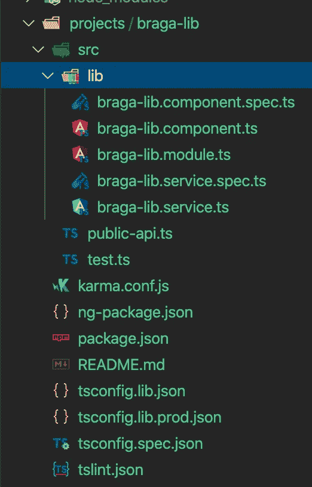

lib 将会有我们的组件，我们的模块，甚至一个服务，如果你想要的话。如果你打开组件文件，它几乎只是说“braga-lib 工作！”。

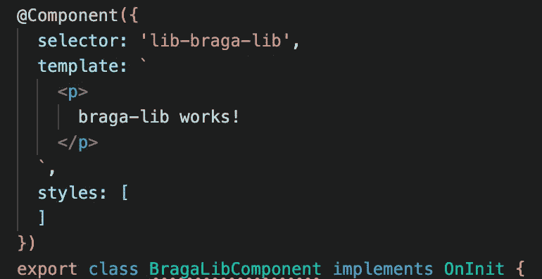

现在请注意选择器“lib-braga-lib”。你可以改变这一点，但现在让我们让它保持原样，让我们使用它在我们的角度项目。让我们看看那个？哦，是的，☺

# **消费自定义库**

现在让我们看看如何使用我们的共享库。因此，我将转到我们的 app.component.html，删除他们放在此文件上的大部分内容，并添加我们的共享库标记。

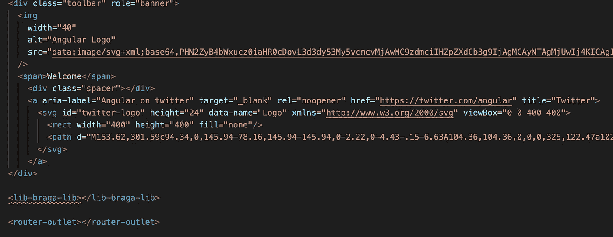

你可以看到我们的共享库标签变成了红色。那是因为我们还没有导入共享库模块。这很容易解决。我们可以转到 app.module，将我们的共享库添加到导入中。

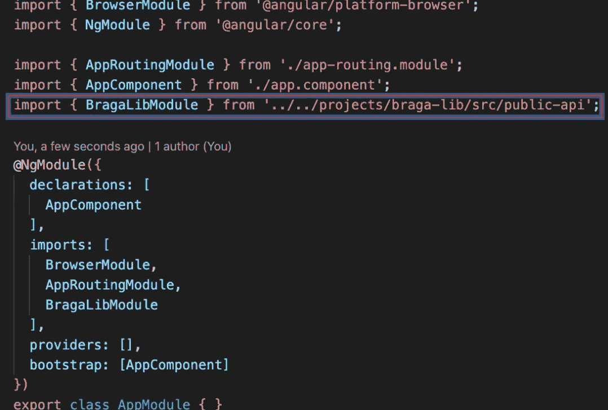

这里，导入行是'*../../projects/Braga-lib/src/public-API*'。他们所做的是创建这个公共 API 来导出这个特定共享组件内部的内容。

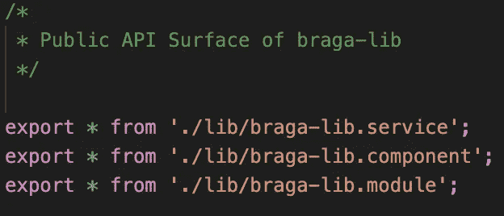

正如上面所说，这是公共 API 服务。请注意，共享模块(我们的 braga.lib 模块)是他们导出的内容之一，对于本练习来说已经足够了。我们可以回到我们的*app.component.html*，我们的红线将会消失。

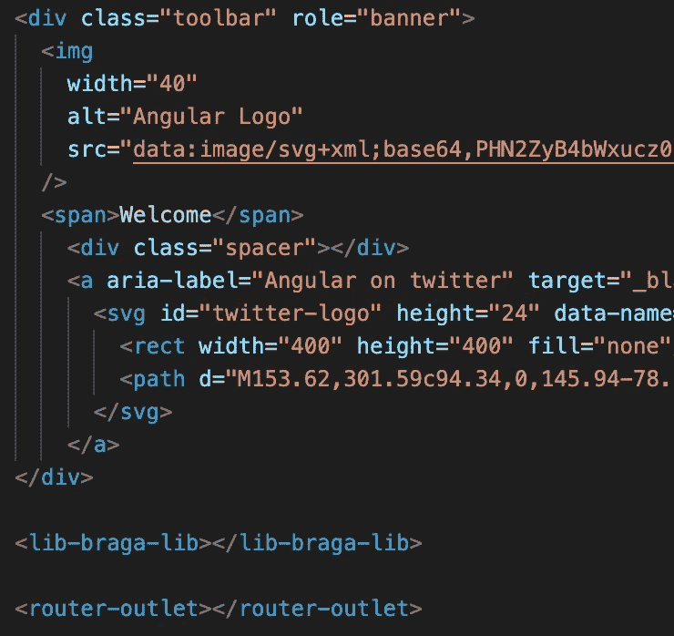

现在我们准备去☺.我们可以首先尝试通过执行" *ng serve -o* "来运行项目，但是我们会得到一个错误，因为我们还没有共享库的 dist 文件夹。因此，我们需要做的第一件事是运行" *ng build braga-lib* "。

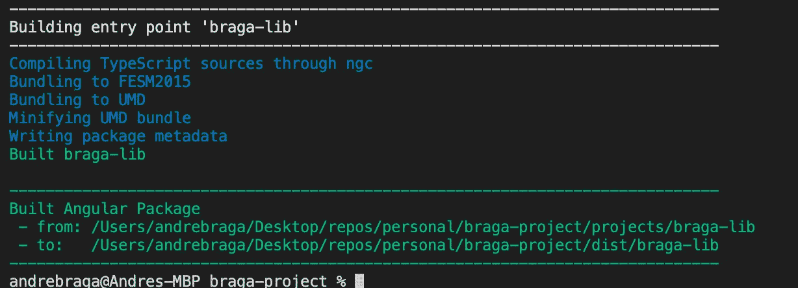

现在我们可以做常规的" *ng serve -o* "来启动我们的共享库项目。

如你所见，我们现在在 Angular 项目中有了我们的共享库。只需很少的努力，几分钟之内，您就可以建立并运行一个共享库。最后一步是实际向国家预防机制发布。

# 结论

当你和你的团队计划未来的实现时，这是非常有用的。现在你可以说:我们的许多应用程序都将使用这些特定的小部件，所以让我们计划创建一个库，而不是将它们放在应用程序的共享文件夹中，然后在应用程序之间复制和粘贴！