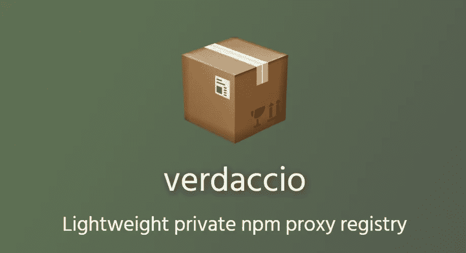

# 用 Verdaccio 创建一个免费的私有 npm 注册表

> 原文：<https://itnext.io/creating-a-free-private-npm-registry-with-verdaccio-e1becdc542b?source=collection_archive---------2----------------------->



# 问题是

有时你想在你的项目或组织中共享代码、库或组件，但不希望你的 npm 包是公开的。

使用 npm 注册表，您可以发布自己的 npm 包，这些包有自己的发布周期，因此任何有权访问注册表的人都可以在自己的项目中安装和使用。这有助于实现模块化、代码重用和代码库中关注点的分离。

[npm 企业](https://www.npmjs.com/products/enterprise)已经提供了，但不是免费的。是一个轻量级的私有 npm 代理注册表，允许你免费拥有自己的 npm 注册表。在接下来的部分中，我将带您了解如何设置和配置您自己的私有 npm 注册表。

# 配置 Verdaccio

1.  您可以在这里克隆一个示例库[来开始。在我的例子中，我将使用“docker-local-storage-volume”来通过一个挂载的 docker 卷在我的服务器上本地存储发布的包。](https://github.com/verdaccio/docker-examples)
2.  您可以从`conf/config.yaml`文件中更改配置以满足您的需求，其中[文档](https://verdaccio.org/docs/en/configuration)包含了所有关于可能的配置选项的必要信息。
3.  在我的例子中，出于安全原因，我希望只有经过认证的用户能够看到和发布包，毕竟它应该是私有的，对吗？所以我将遵循[这个](https://verdaccio.org/docs/en/packages)来使它只允许用户发布在他们的包名中有 *@myscope* 作用域前缀的包，如`package.json`中所定义的。如果你不熟悉 npm 作用域[，你可以在这里](https://docs.npmjs.com/about-scopes)阅读更多。这基本上是一种按用户/组织分组的方式。这就是我的配置看起来的样子

```
'@myscope/*':
    # scoped packages
    # you can specify usernames/groupnames (depending on your auth plugin)
    # and three keywords: "$all", "$anonymous", "$authenticated"
    access: "$authenticated"
    publish: "$authenticated"
    # if package is not available locally, proxy requests to 'npmjs' registry
    proxy: npmjs
```

最后一行让我们的注册表充当公共 npm 注册表的代理，以防用户试图访问私有注册表中不存在的软件包，在这种情况下，请求将被重定向，软件包将从默认的公共 npm 注册表安装。Verdaccio 还将缓存安装在服务器上的包。

4.我想关闭用户注册，只允许特定用户访问注册表，否则任何访问该 URL 的外部用户都可以注册新帐户，并能够访问或发布软件包，幸运的是，Verdaccio 附带了一个 htpasswd 插件用于验证，设置验证的文档可以在这里找到。这是我的设置的样子

```
auth:
  htpasswd:
    file: /verdaccio/conf/htpasswd
    # Maximum amount of users allowed to register, defaults to "+inf".
    # You can set this to -1 to disable registration.
    max_users: -1
```

就这样，现在只有在/verdaccio/conf/htpasswd 文件中配置的用户才能访问注册表，并且注册被禁用。在下一节中，我将向您展示如何创建新用户。

5.就这样，将 docker 映像部署到您最喜欢的云提供商的服务器上，但是确保在部署的实例中运行以下命令，以允许将包写入和存储到目录中。

```
chmod -R 777 storage/
chmod -R 777 conf/
```

# 认证和创建新用户

要让一个新用户访问注册表，只需在 htpasswd 文件中添加另一个 htpasswd 条目。

1.  前往[http://www.htaccesstools.com/htpasswd-generator/](http://www.htaccesstools.com/htpasswd-generator/)
2.  创建您的用户名和密码。
3.  发送生成的 htpasswd 行，并将其复制到服务器上的 verdaccio/conf/htpasswd 文件中。
4.  现在，您应该能够从 web 界面或通过 npm 使用该用户名和密码登录..(不需要重启服务器)

# 发布和安装私有 npm 模块

既然我们已经部署并保护了我们的私有 npm 注册表，我们只需要配置 npm 来使用它。

记住我们将使用作用域包作为最佳实践，查看这些链接可以更好地理解 [npm 作用域](https://docs.npmjs.com/misc/scope)和[私有模块](https://docs.npmjs.com/private-modules/intro)。

1.  您可以将默认 npm 范围设置为@myscope。当您执行 npm init `npm config set scope @myscope`时，确保您的包名称以 *@myscope* 开头
2.  将您的本地 npm 注册表设置为指向新的注册表，而不是默认的公共 npm 注册表，否则您将不得不通过您使用的每个 npm 命令的`— -registry`标志来指定注册表。`npm set registry <PRIVATE_REGISTRY_URL>`
3.  要使用您在上一节中创建的用户名注册/登录，以便您可以发布自己的软件包，请运行`npm adduser`
4.  一旦登录，您现在可以通过运行`npm publish`将您自己的 npm 模块发布到注册表。
5.  您可以通过运行:`npm install @myscope/my-first-published-package`将新发布的包安装到该注册表上

就是这样，您现在可以安全地发布和安装私有包，并与您的同事或跨多个项目共享模块，而不必像从 npm 安装任何其他包一样担心它们。Verdaccio 还为您的注册表提供了一个很好的 web 界面，类似于您的 npm。您可以通过端口 4783 从浏览器访问它。

如果你喜欢我的内容，愿意支持我，你可以[请我喝啤酒](https://www.buymeacoffee.com/khaledosman)