# 为 ARM Kubernetes 集群创建完整的监控解决方案

> 原文：<https://itnext.io/creating-a-full-monitoring-solution-for-arm-kubernetes-cluster-53b3671186cb?source=collection_archive---------5----------------------->

[*点击这里在 LinkedIn* 上分享这篇文章](https://www.linkedin.com/cws/share?url=https%3A%2F%2Fitnext.io%2Fcreating-a-full-monitoring-solution-for-arm-kubernetes-cluster-53b3671186cb)

在将一个 Kubernetes 集群部署到三个 Rock64 SBCs 之后，在我的[上一篇文章](http://medium.com/@carlosedp/building-an-arm-kubernetes-cluster-ef31032636f9)中，我想使用一个更好、更灵活的监控解决方案。在最初的文章中，我“手动”部署了解决方案的所有元素。

在这里，我使用一个更加精细和维护的堆栈，通过 CoreOS Prometheus-operator 进行监控。该解决方案提供动态配置来定位 Prometheus 目标，并具有用于添加新的受监控元素的“可插拔”解决方案。

所有部署文件都可以从我的 [Github 库](https://github.com/carlosedp/cluster-monitoring)下载。像往常一样，更容易跟踪和修改。

这个库是为 ARM 平台调整的官方 kube-prometheus 文件的副本。大多数图像是为 ARM 平台构建的，并上传到 [DockerHub](https://hub.docker.com/r/carlosedp/) 。

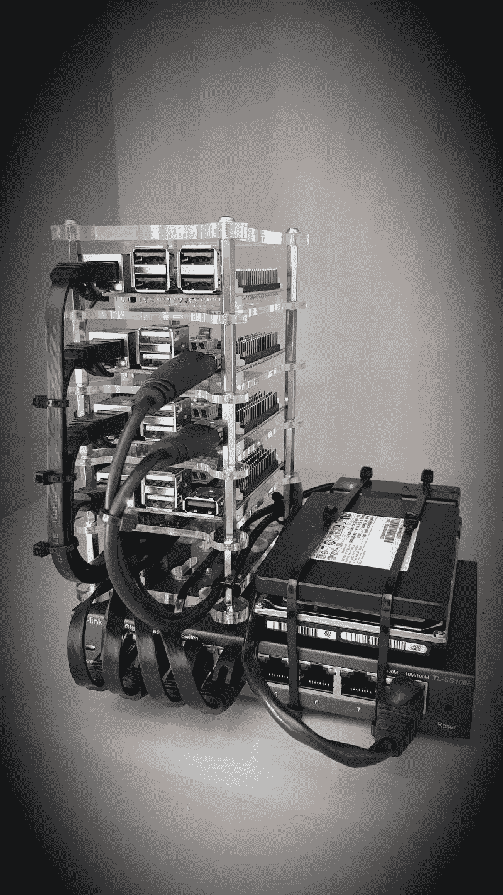

现在有了 Raspberry Pi 3 和一个额外的媒体硬盘

在本文中，我将从上到下，概述从面向用户的元素到系统收集器的细节以及如何部署它们。这提供了一个更好的视角以及更多的鼓励来实现它。

# 格拉夫纳

[Grafana](https://grafana.com/) 提供监控仪表板和阈值的基本通知。

prometheus-operator 的默认部署安装了一些仪表板，允许监控重要的 Kubernetes 健康状态。

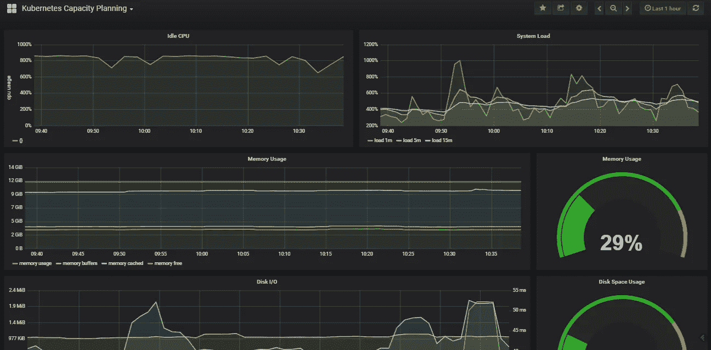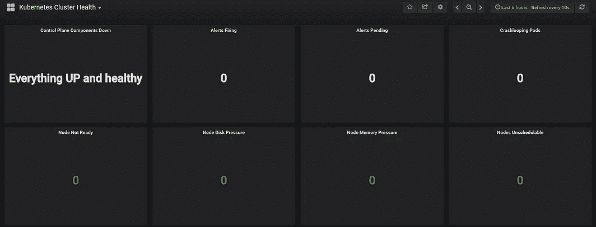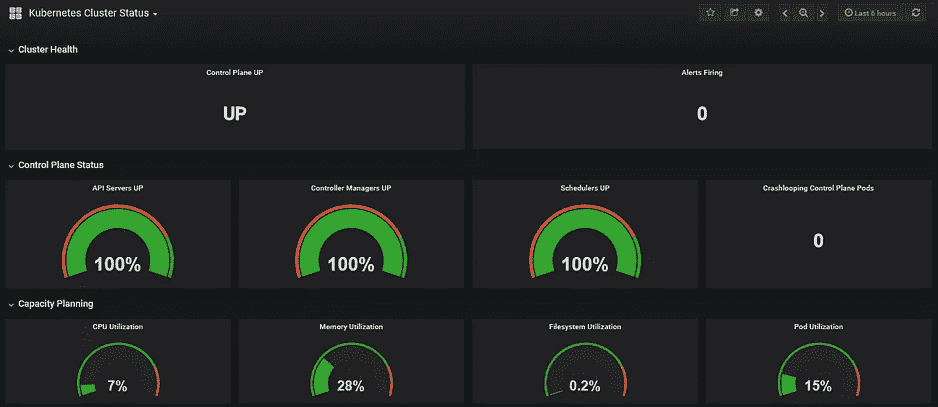

这些仪表板非常完整，但自从我那时开始玩 Prometheus 和 Grafana 以来，我调整了一些已经使用的仪表板，并创建了具有更广泛节点视图的定制仪表板。

这些附加仪表板在 [grafana-dashboard](https://github.com/carlosedp/prometheus-operator-ARM/tree/master/grafana-dashboards) 目录中提供，可以在部署后使用 JSON 文件导入(左边的加号- > Import - > Upload)。json 文件)。

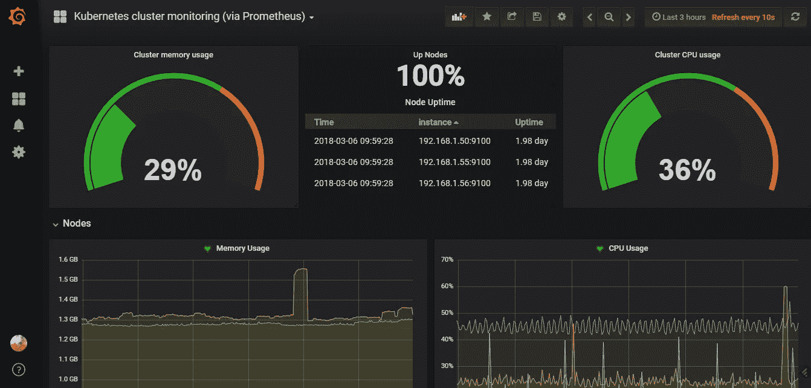

其中一个自定义修改的仪表板

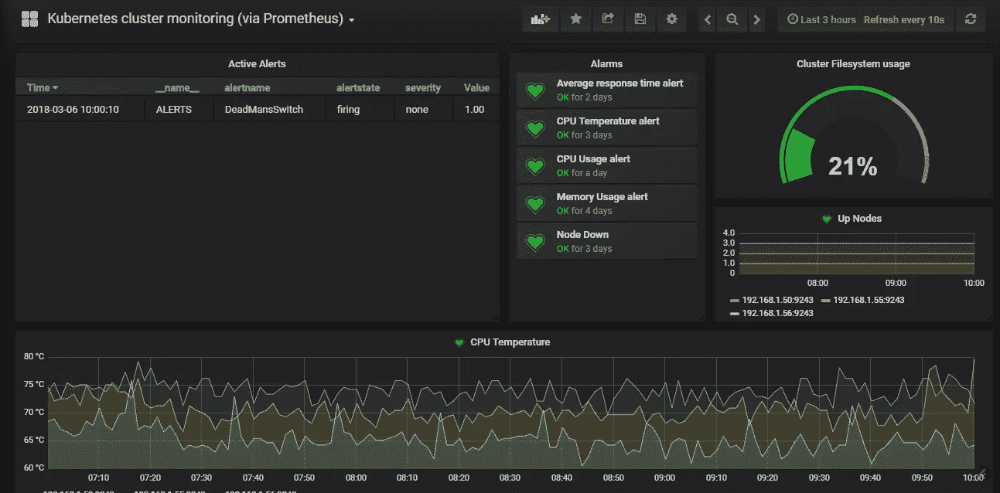

自定义仪表板，pt2

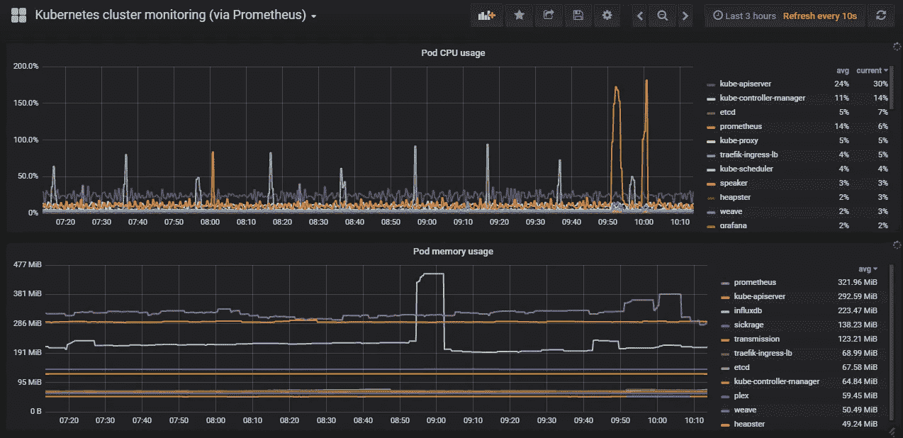

自定义仪表板，pt3

我还添加了一个仪表板来监控 Traefik 统计数据:

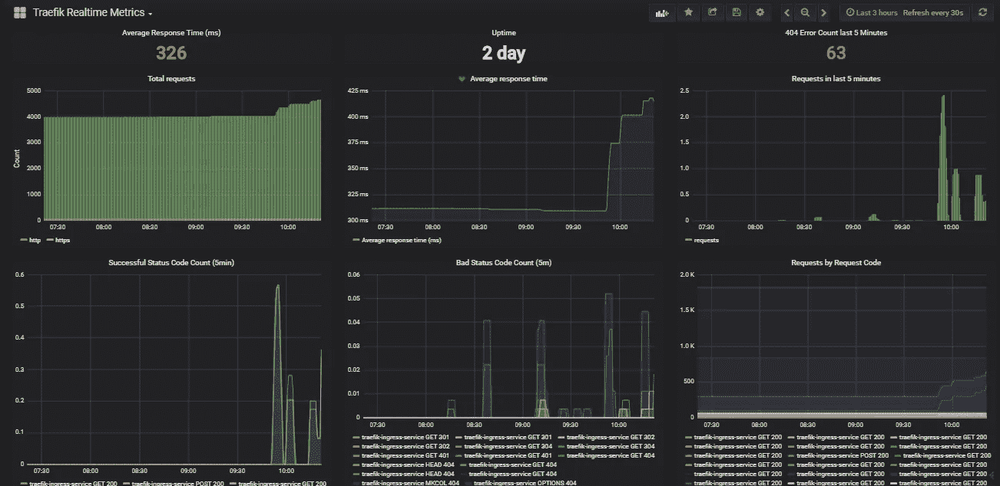

和普罗米修斯统计仪表板:

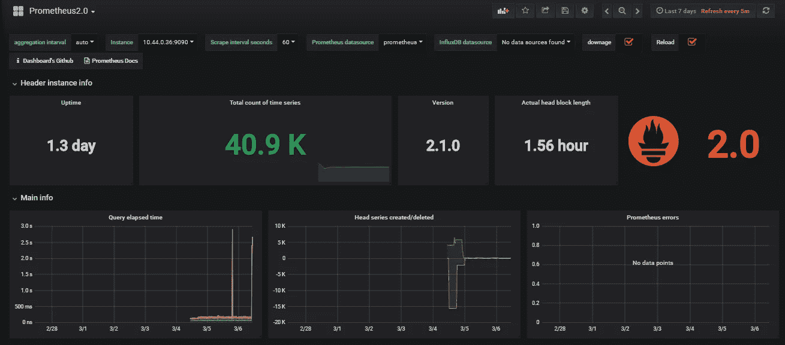

此外，我正在使用 Grafana 根据仪表板上创建的警报来触发通知。这些警报在您想要发出警报的每个 Grafana 面板和阈值上定义。Grafana 然后使用电子邮件中继部署(稍后将详细介绍)通过电子邮件发送通知(在本例中)。

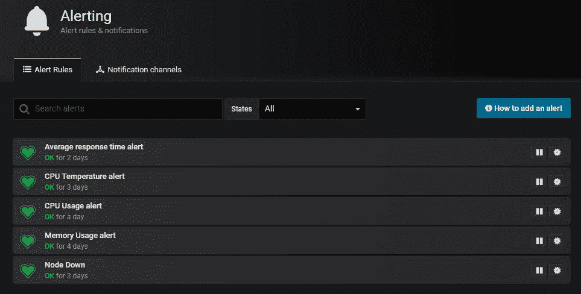

定义的所有警报

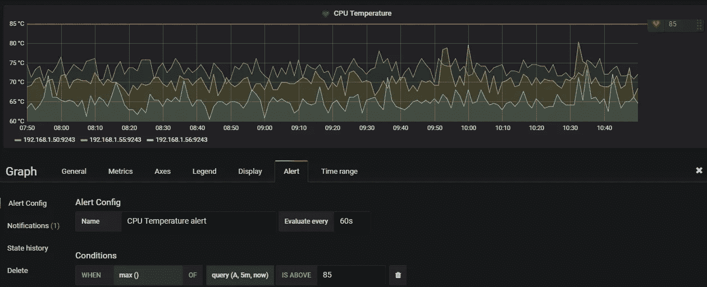

定义警报阈值

为了提供所有这些，由 CoreOS 维护的 prometheus-operator 堆栈包括:

*   [普罗米修斯——操作员](https://github.com/coreos/prometheus-operator/)——管理所有组件的元素
*   [普罗米修斯](https://github.com/prometheus/prometheus/)——存储数据的采集和时序数据库
*   [节点导出器](https://github.com/prometheus/node_exporter/) —用于获取节点数据的收集器
*   [arm-exporter](https://github.com/prometheus/node-exporter) —获取电路板温度的收集器
*   [报警管理器](https://github.com/prometheus/alertmanager) —为 Prometheus 提供报警通知的元件
*   [Grafana](http://grafana.com) —仪表板 GUI
*   [Kube-state-metrics](https://github.com/kubernetes/kube-state-metrics/)—Kubernetes 集群统计信息的收集器

为了部署这个堆栈，在项目的根上有一个自动化的脚本来处理所有的事情。运行前，调整以下部分列出的参数。

`./deploy`

这应该会创建一个`monitoring`名称空间，并为您的 Kubernetes 集群生成所有部署和 pods。

现在简要概述一些元素。

## 普罗米修斯算子

Prometheus-operator for Kubernetes 为 Kubernetes 服务以及 Prometheus 实例的部署和管理提供了简单的监控定义。它负责生成部署，并根据`service-monitor`配置自动配置 Prometheus 获取新目标。

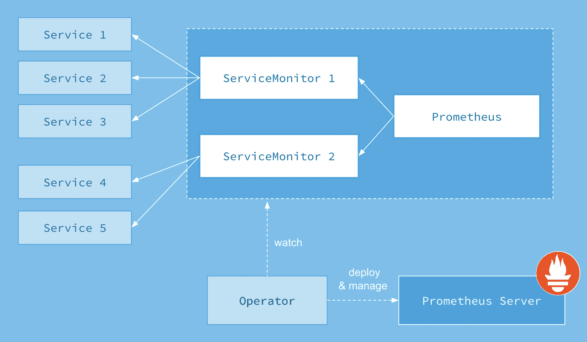

这里是我为 Traefik 创建的服务监视器:

```
apiVersion: monitoring.coreos.com/v1
kind: ServiceMonitor
metadata:
  name: traefik-ingress-lb
  labels:
    k8s-app: traefik-ingress-lb
spec:
  jobLabel: k8s-app
  endpoints:
  - port: admin
    interval: 30s
  selector:
    matchLabels:
      k8s-app: traefik-ingress-lb
  namespaceSelector:
    matchNames:
    - kube-system
```

根据这一定义，prometheus-operator 将配置 prometheus 查找 traefik 服务标签，以及如何通过配置的端口访问其指标，所有这些都是动态的，无需重启。在[存储库](https://github.com/carlosedp/prometheus-operator-ARM/tree/master/manifests/prometheus)中查找所有服务监视器。

## 普罗米修斯

普罗米修斯，一个[云本地计算基金会](https://cncf.io/)项目，是一个系统和服务监控系统。它以给定的时间间隔从配置的目标收集度量，评估规则表达式，显示结果，并在观察到某个条件为真时触发预警。

普罗米修斯的目标由操作员动态配置:

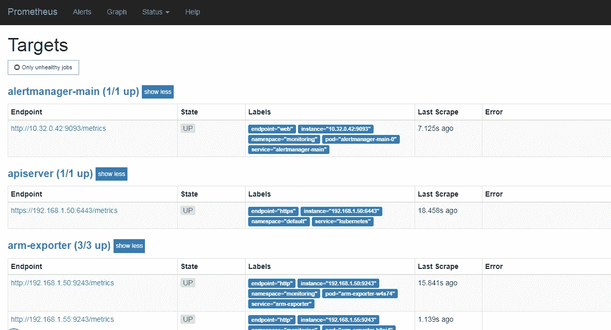

Prometheus GUI 暴露在内部网络的入口上，可用于查询其指标。调整`./manifests/prometheus/prometheus-k8s-ingress.yaml.`中入口 URL 的参数

Prometheus 还从 Kubernetes 集群中的多个元素收集指标。为此，它需要访问 Kubelet API 和其他 Kubernetes 元素。

如果您的部署是用 **Kubeadm** 完成的(就像我的另一篇文章)，请确保做以下更改:

> 根据官方部署文档[这里的](https://github.com/coreos/prometheus-operator/blob/master/contrib/kube-prometheus/docs/kube-prometheus-on-kubeadm.md)，需要对集群进行一些更改:
> 
> 我们需要公开由 kubelet 守护进程安装和管理的 cadvisor，并允许 webhook 令牌认证。为此，我们在所有主节点和节点上执行以下操作:

```
sed -e "/cadvisor-port=0/d" -i /etc/systemd/system/kubelet.service.d/10-kubeadm.conf
sed -e "s/--authorization-mode=Webhook/--authentication-token-webhook=true --authorization-mode=Webhook/"
systemctl daemon-reload
systemctl restart kubelet
```

> 如果您已经使用 kubeadm 部署了一个 Kubernetes，那么除了先前的 kubelet 更改之外，还要更改 kube-controller-manager 和 kube-scheduler 在主节点上监听的地址:

```
sed -e "s/- --address=127.0.0.1/- --address=0.0.0.0/" -i /etc/kubernetes/manifests/kube-controller-manager.yaml
sed -e "s/- --address=127.0.0.1/- --address=0.0.0.0/" -i /etc/kubernetes/manifests/kube-scheduler.yaml
```

关于 kube-prometheus 网站的更多信息。

## 警报管理器

Alertmanager 处理客户端应用程序(如 Prometheus 服务器)发送的警报。

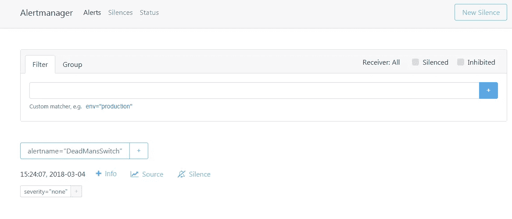

在`./manifests/alertmanager/alertmanager-ingress.yaml.`中调整入口 URL UI 的参数

## 节点导出器

Prometheus exporter 针对*NIX 内核公开的硬件和操作系统指标。该组件提供关于硬件和底层操作系统的所有指标。

## 军火出口商

该组件仅输出一个指标，即处理器芯片的温度。这一指标可以在附加的 Grafana 仪表盘“Kubernetes 集群监控(通过 Prometheus)”中看到。

## kube-状态-度量

Kube-state-metrics 是一个服务，它监听 Kubernetes API 服务器并生成关于对象状态的度量。

## SMTP 中继

为了提供电子邮件通知，我添加了一个电子邮件中继服务来与 Gmail 帐户集成。要部署它，调整`./manifests/smtp-server/smtp.yaml`上的环境变量来添加您的 Gmail 凭证。

## 格拉夫纳


> Grafana 是一款开源软件，为 Graphite、Elasticsearch、OpenTSDB、Prometheus 和 InfluxDB 提供了丰富的度量仪表板和图形编辑器

普罗米修斯-操作员部署格拉夫纳和它的仪表板。要获得额外的仪表板，从`grafana-dashboards`目录加载它们。

对于电子邮件通知，请在`./manifests/grafana/grafana-configmap.yaml`上调整您的源电子邮件，并在`./manifests/grafana/grafana-external-ingress.yaml.`中调整入口 URL

要访问它，请转到 http://grafana.internal.mydomain.com 的[](http://grafana.internal.mydomain.com)

## *结论*

*这个堆栈使得监控堆栈的部署和管理更加完整和动态。要查看更多信息，请查阅 prometheus-operator [文档](https://coreos.com/operators/prometheus/docs/latest/)，并像往常一样，阅读清单的源代码。*