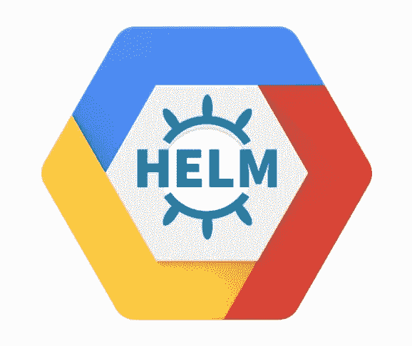

# 在谷歌云上创建 Helm repo

> 原文：<https://itnext.io/creating-a-helm-repo-on-google-cloud-d970cccb60c9?source=collection_archive---------2----------------------->



# 问题陈述

这项工作的问题陈述如下:

**作为一名**平台工程师
**我希望**新的图表版本能够尽快在所有 env 上发布。
**以便** HelmReleases 在启动时不会因为版本不存在而失败。
**和**对 HelmReleases 的依赖保持在集群之外。

# 当前实施

在这项工作开始之前，我们曾经构建了一个舵注册容器，作为将舵图变更合并到`k8s-helm-charts`的`master`分支的一部分。

然后，我们在每个集群内进行了部署，应用了以下 flux 注释:

```
annotations:
    flux.weave.works/automated: "true"
    flux.weave.works/tag.k8s-helm-charts: semver:~2.0
```

注意:当我们使用 Helm v2 时，图像标签是`2.0.x`。

然而，这种方法存在许多问题:

*   新映像部署到我们集群的速度
*   缺乏可见性，无法轻易知道哪些图表版本可用
*   我们所有的定制`HelmReleases`都依赖于服务的运行

# 可能的选择

当开始任何一项工作时，最好看一下我们能处理的所有可能的选择。

## 图表博物馆

图表博物馆([https://github.com/helm/chartmuseum](https://github.com/helm/chartmuseum))是主要的备选方案，但是，我们认为这不是一个可行的方案，原因如下:

*   因为我们希望保持所有环境之间的“空隙”,所以我们需要每个环境都有一个 S3 存储桶，这将使 CI 成为更新所有环境的噩梦。此外，当升级在某些环境下有效，而在其他环境下无效时，您如何处理这种情况。
*   真正的障碍是 chartmuseum 本身需要在集群中运行，所以从引导的角度来看，我们现在比以前更好。

# 被选中的人

该团队决定选择从谷歌云平台(GCP)的存储桶中运行 Helm 存储库。采取这种方法的原因是:

*   从 CI 的角度来看，它是“一劳永逸的”,一旦产品包放入存储桶中，就可以立即从所有环境中利用它们。
*   默认情况下，Buckets 有自己的 DNS 记录，所以我们可以直接在我们的 HelmReleases 中使用它。
    `[https://<bucket name>.storage.googleapis.com](https://kubernetes-charts.storage.googleapis.com/)`
*   存储桶带有一个新的用户界面，使浏览它们和搜索对象变得超级容易，这是工程师的理想选择。
*   将我们的集群放在 GCP 的 AWS 和 Helm Repository 中是一个很好的关注点分离，并减少了我们现有基础架构堆栈的爆炸半径。

# 履行

我们在 Mettle 的所有基础设施都由 Terraform 管理，即使我们部署到 GCP，也没有什么不同。

创建此桶和相应服务帐户的 Terraform 代码如下所示:

```
data "google_iam_policy" "admin" {
  binding {
    role = "roles/storage.admin"
    members = [
      "serviceAccount:terraform-helm-registry@terraform-helm-registry.iam.gserviceaccount.com",
    ]
  }

  binding {
    role = "roles/storage.objectViewer"
    members = [
      "allUsers",
    ]
  }

}

resource "google_service_account" "helm_registry_service_account" {
  account_id   = "terraform-helm-registry"
  display_name = "CircleCI Service Account for Helm Registry"
  project      = var.project_id
}

resource "google_service_account_key" "mykey" {
  service_account_id = google_service_account.helm_registry_service_account.name
  public_key_type    = "TYPE_X509_PEM_FILE"
}

resource "google_storage_bucket" "this" {
  name               = "<redacted>"
  project            = var.project_id
  location           = var.location
  force_destroy      = var.force_destroy
  bucket_policy_only = var.bucket_policy_only
  versioning {
    enabled = var.bucket_versioning
  }
}

resource "google_storage_bucket_iam_policy" "policy" {
  bucket      = google_storage_bucket.this.name
  policy_data = data.google_iam_policy.admin.policy_data
}
```

现在我们有了一个 bucket 和服务帐户，我们需要更新 CI 配置，以安全的方式将必要的对象推送到 bucket 中。

# CI 变更

首先要考虑的是我们需要构建的脚本，以将必要的对象推送到桶本身。这个脚本可以在下面找到，它混合使用了`helm package`和`gsutil`(谷歌云工具)来构建`.tgz`文件，并将它们推送到我们在 GCP 的桶中。

```
**#! /usr/bin/env bash** set -o errexit
set -o nounset
set -o pipefail

readonly HELM_URL=https://storage.googleapis.com/kubernetes-helm
readonly HELM_TARBALL=helm-v2.16.5-linux-amd64.tar.gz
readonly REPO_URL=https://redacted-charts.storage.googleapis.com/
readonly GCS_BUCKET=gs://redacted-charts

main() {
  setup_helm_client

  if ! sync_repo charts "$GCS_BUCKET" "$REPO_URL"; then
      log_error "Not all charts could be packaged and synced!"
  fi
}

setup_helm_client() {
  echo "Setting up Helm client..."

  curl --user-agent curl-ci-sync -sSL -o "$HELM_TARBALL" "$HELM_URL/$HELM_TARBALL"
  tar xzfv "$HELM_TARBALL"

  PATH="$(pwd)/linux-amd64/:$PATH"

  helm init --client-only
}

sync_repo() {
  local repo_dir="${1?Specify repo dir}"
  local bucket="${2?Specify repo bucket}"
  local repo_url="${3?Specify repo url}"
  local sync_dir="${repo_dir}-sync"
  local index_dir="${repo_dir}-index"

  echo "Syncing repo '$repo_dir'..."

  mkdir -p "$sync_dir"
  mkdir -p "$index_dir"

  # Copy the index.yaml file from the bucket.
  if ! gsutil cp "$bucket/index.yaml" "$index_dir/index.yaml"; then
    log_error "Exiting because unable to copy index locally. Not safe to proceed."
    exit 1
  fi

  local return_value=0

  # Loop around each chart and package.
  for dir in "$repo_dir"/*; do
    if helm dependency build "$dir"; then
      helm package --destination "$sync_dir" "$dir"
    else
      log_error "Problem building dependencies. Skipping packaging of '$dir'."
      return_value=1
    fi
  done

  if helm repo index --url "$repo_url" --merge "$index_dir/index.yaml" "$sync_dir"; then

    # Move updated index.yaml to sync folder so we don't push the old one again
    mv -f "$sync_dir/index.yaml" "$index_dir/index.yaml"

    # Push all the local chart tarballs to the bucket.
    gsutil -m rsync "$sync_dir" "$bucket"

    # Make sure index.yaml is synced last
    gsutil cp "$index_dir/index.yaml" "$bucket"

  else
    log_error "Exiting because unable to update index. Not safe to push update."
    exit 1
  fi

  ls -l "$sync_dir"

  return "$return_value"
}

log_error() {
    printf '\e[31mERROR: %s\n\e[39m' "$1" *>&*2
}

main
```

为了将此与 Circle CI 挂钩，我们更新了我们的`.circleci/config.yml`文件，以包括以下内容:

```
publish:
  docker:
    - image: google/cloud-sdk
  steps:
    - checkout
    - setup_remote_docker
    - run:
        name: sync
        command: |
          echo $GCLOUD_SERVICE_KEY | gcloud auth activate-service-account --key-file=-
          gcloud --quiet config set project ${GOOGLE_PROJECT_ID}
          gcloud --quiet config set compute/zone ${GOOGLE_COMPUTE_ZONE}
          bin/sync-repo.sh
```

`GCLOUD_SERVICE_KEY`是一个环境变量，是在 Terraform 中构建的 JSON 服务帐户密钥。

在连接上它之后，我们的桶里装满了文件，我们可以在我们的`HelmReleases`中毫无问题地使用它。

**任务完成…嗯，还没完成！**

# 缺少图表版本问题

即使在完成这次迁移后，我们的一些 HelmReleases 仍然显示`chart version X.Y.Z not could in repository …`,尽管图表版本明显存在于桶中。

在网上做了一些调查后，我们看到了下面的片段:

> 缓存控制。在对象上指定`[Cache-Control](https://cloud.google.com/storage/docs/metadata#cache-control)` [元数据](https://cloud.google.com/storage/docs/metadata#cache-control)将有利于热对象或频繁访问的对象的读取延迟。关于`Cache-Control`等对象元数据的设置说明，请参见[查看和编辑元数据](https://cloud.google.com/storage/docs/viewing-editing-metadata#edit)。

因此，我们决定更新我们的脚本，在我们所有的对象上设置`no-cache` 。

```
gsutil -m setmeta -h "Cache-Control:no-cache" "$bucket"/*.tgz
gsutil -m setmeta -h "Cache-Control:no-cache" "$bucket"/index.yaml
```

在应用了这些设置后，Flux 现在几乎可以立即看到新的图表版本，这个问题已经解决了。

关于 `Cache-Control`元数据的更多信息，我强烈推荐[https://developer . Mozilla . org/en-US/docs/Web/HTTP/Headers/Cache-Control](https://developer.mozilla.org/en-US/docs/Web/HTTP/Headers/Cache-Control)。

# 摘要

总之，从编写 Terraform 代码到更改所有的 HelmReleases 以使用新的存储库，这项工作花了大约一天时间才全部完成。就成本而言，目前托管我们的图表每月约 1 美元，对于它为我们的工作流程提供的优势而言，这是显而易见的，我们只是希望我们能早点这样做😞