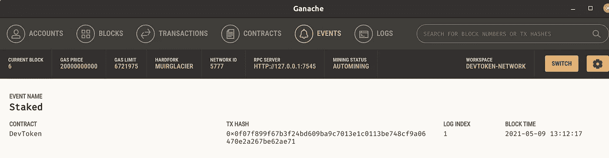
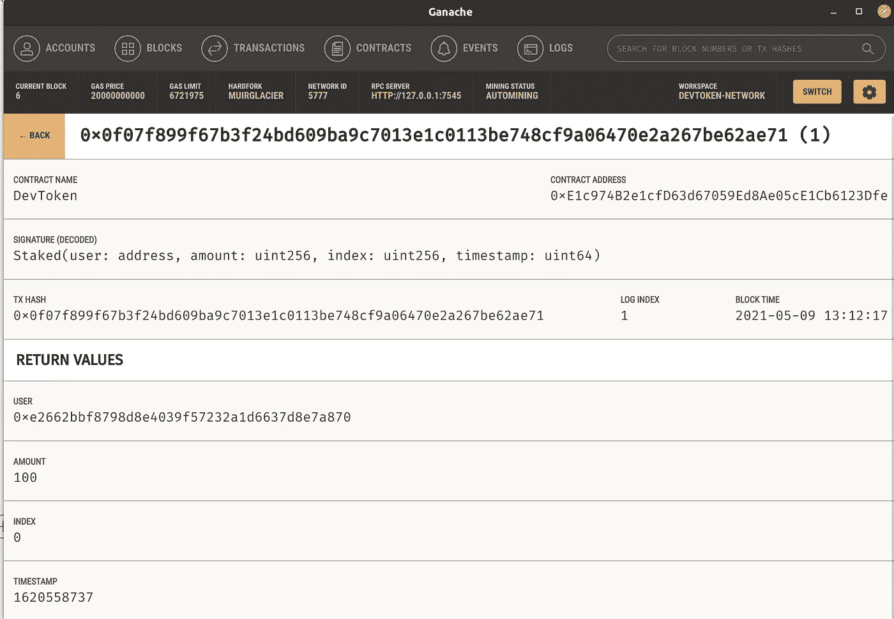

# 在实体中创建可继承的标桩合同

> 原文：<https://itnext.io/creating-a-inheritable-staking-contract-in-solidity-7804ae2d7a32?source=collection_archive---------0----------------------->


珀西·博尔默拍摄的图片

本文是四部分系列的第二部分。

1.  [**【在 Solidity 中用 BEP-20 契约构建一个去中心化的应用】**](https://medium.com/@percybolmer1/building-a-decentralized-application-with-bep-20-contract-in-solidity-d2c066447aa6) —这篇文章将帮助你理解 Solidity 的基础知识
2.  **【在实体中创建可继承的赌注契约】** —第二篇文章，我们将介绍更高级的实体物品，并实现赌注和奖励
3.  [**【在 Web 应用中使用智能合约】**](https://medium.com/@percybolmer1/using-a-smart-contract-in-an-web-application-78432ed68527) —本系列的第三篇文章，我们将学习如何使用元掩码通过 Web 应用连接到区块链
4.  [**【将智能合约部署到币安松露智能连锁店】**](https://medium.com/@percybolmer1/deploying-smart-contracts-to-binance-smart-chain-with-truffle-c57a7d1eb6ed) —第四篇也是最后一篇文章，我们将学习如何将智能合约部署到真实网络中

在第一部分中，我们介绍了如何设置开发环境来开发定制的 BEP20 令牌。在这篇文章中，我们将添加标记的令牌。

如果你没有第一篇文章的完整代码，你可以在这里找到。

## 什么是赌注？

赌注是指你将代币投入网络，并因此获得报酬。之所以鼓励下注，是因为有一个术语叫做赌注证明。把它看作是挖掘，但不是运行 GPU 来计算东西，而是通过在网络中存储令牌来挖掘。你可以在这里 阅读详细解释 [*。*](https://academy.binance.com/en/articles/what-is-staking)

在本文中，我们将通过继承另一个契约来添加 Staking。

## **介绍令牌的赌注**

是时候让我们的 DevToken 变得更酷一些，增加一些功能了。目前，这只是一个简单的象征，我们真的不能做太多。让我们添加下注令牌并从中获得奖励的功能。

让我们首先创建一个可以由 DevToken 继承的新的智能契约。创建一个名为 **contracts/Stakable.sol 的文件。**我们将从编写一个空合同开始，并在进行过程中向其中添加项目。这样，我们就可以深入了解每个部分的实际功能。

可押记—我们的可押记合约的空模板

在继续之前，将可赌注契约继承到 DevToken 中，并确保我们可以编译。

打开 **contracts/DevToken.sol** 并确保更新合同声明以继承可维护合同，我们还需要导入可维护合同。

DevToken —继承可拥有的和可堆叠的契约

```
truffle compile // Compile to make sure everything is correct
```

希望一切编译顺利，否则修复错误，然后让我们开始建立我们的打桩机制。

我们需要做的第一件事是创建所有我们需要的结构。我们将使用一个**映射**来跟踪账户的股份指数。solidity 中的**映射**有点像大多数语言中的哈希映射。它可用于将唯一地址映射到一个值。一个很好的分解可以从 Doug Crescenzi 在他的[帖子](https://medium.com/upstate-interactive/mappings-in-solidity-explained-in-under-two-minutes-ecba88aff96e)中找到。我们将使这个映射成为一个**内部**修饰符，这意味着映射只能从契约内部访问。

我们创建的映射实际上将只保存一个数组的索引引用。这个数组将包含我们所有的利益相关者。我们为什么这样做将很快得到解释。

我们将保存赌注的信息，包括赌注是何时下的、金额是多少以及是谁下的。还要注意，我们有一个赌注事件，每当下注时都会触发该事件。如果您对事件不确定，请回到本系列的第一篇文章。

可打桩——我们需要开始打桩的所有结构

我们将从添加新的利益相关者的方法开始。该方法将在利益相关者数组中添加一个空白空间，并将新的利益相关者值赋给它。然后它将返回使用过的索引，这个索引是利益相关者的个人索引，其中存储了他/她的所有股份。这个索引可以使用 staker 的地址来检索。这就是为什么我们使用 map 来存储索引，然后通过该索引来检索涉众的**原因。这会节省我们的时间，因为在数组中通过索引查找用户比遍历整个数组要便宜得多。**

可标注—添加利益相关者并绘制他们的地图

现在我们可以添加新的利益相关者了，让我们添加一个 Stake 函数，这样我们就可以开始测试它了。这里唯一需要学习的新东西是 **require** 关键字。Require 用于进行条件检查。如果不满足该条件，呼叫将被拒绝，并显示一条错误消息。所以我们要确保赌注不是 0。

可下注——一种增加新的利益相关者并推动他们下注的方法

如果你一直在关注，你可能会注意到一件奇怪的事情。如果没有，没关系，我会说出来。

你有没有想到**股份法并没有修改任何账户**的余额？你有没有注意到 _stake 方法有一个**内部**修改器？这意味着这个函数不允许在契约之外被调用。

这不是 bug！这是因为该协定将被继承到 DevToken 协定中。可维护契约不知道继承它的契约的内部工作方式，所以这需要在父契约中实现。让我们打开 **contracts/DevToken.sol** 并公开这个函数，并添加一些烧录和编写一些单元测试来确保它能够工作。

DevToken — Stake 是公共的，公开了 internal _stake

DevTokens stake 将增加一些要求，如发送方余额必须大于赌注金额。这在可赌注契约中是做不到的，因为它不知道赌注者的平衡。
我们还会下注，然后从下注者账户中烧掉相同的金额。

让我们测试一下，确保它能正常工作。

我已经创建了一个名为 **tests/Stakeable.js** 的新文件，它将包含与 Stakeable 契约相关的测试。

现在，这也是事件变得令人兴奋的地方。我们实际上可以监听 javascript 中的事件(如果您想为您的令牌创建一个网站，这会很有帮助)。我们将利用事件来执行我们的测试。我们将触发 stakes，然后查看触发的事件，并确保其中的数据是正确的。请记住，我们只在成功的赌注上触发事件。

为了帮助我们进行单元测试，truffle 有一个有用的 javascript 库，叫做 **truffle-assertions** 。如果您按照第一步操作，您应该已经安装了它，但是如果没有，请尝试安装这些

```
npm install chai
npm install truffle-assertions
```

Truffle 断言允许我们从区块链上执行的函数中获取响应，并轻松断言该调用发出的事件。

```
truffleAssert.eventEmitted(ReturnedTransaction,"EventName",(ev) => {Your custom callback logic with assertion, ev is your event
},"The error message to trigger if assertion faileed");
```

上例中的 ev 项包含我们在事件中发送的信息，并且可以被断言。让我们试一试，先做一个简单的测试。

我们将做一个简单的测试来标记，然后断言标记的事件，并检查信息是否正确。

stakable . js——简单的第一次测试，以确保它的工作

运行测试并确保其正常工作，纠正出现的任何问题。

```
truffle test
```

让我们进一步增加赌注 100x2 测试，实际赌注两次。

Stakeable.js —在 Staking100x2 测试中添加第二个桩

我们还将添加一个测试，以确保利益相关者的索引分配正确，因此将在帐户 1 上建立一个赌注，索引现在应该是 2。

Stakeable.js —新的利益相关者应该得到一个新的索引

## 查看区块链的赌注

在我们继续之前，让我们尝试使用 Ganache 来检查事务。

在 truffle 控制台中执行一个 stake，并使用 Ganache 来监控发出的事件。

```
truffle migrate
truffle console
devToken = await DevToken.deployed(); // await contract to be deployedlet accounts = await web3.eth.getAccounts() // Grab all accounts
await devToken.stake(100, {from: accounts[0]}) // Stake 100 from owner
```

stake 命令的输出将是事务，查看它可以很好地了解正在发生的事情。还要记住，由于以太坊的性质，每个动作都有一个气体成本。

打开 Ganache 并转到 Events 选项卡，您应该能够显示自我们迁移以来网络上发生的所有事件。



我们创作的木桩事件正在加纳切展出



关于我们的赌注事件的细节

## 奖励利益相关者并允许退出

既然我们的合同允许入股，是时候开始实施某种入股奖励制度了。

让我们添加一个函数，该函数允许我们在 **contracts/DevToken.sol** 中提取赌注。该函数必须验证我们提取的金额没有超过我们下注的金额，并且它应该将下注的令牌返回到所有者的地址。

我将它命名为 withdrawStake，它将是一个公共函数，因为我们希望允许从智能合约外部调用它。这里就不解释细节了，因为基本上就是一个 Stake 的翻版但是反过来了。

dev token——withdraw stake 将收回股份并铸造新的代币

withdrawStake 调用了**内部方法 _withdrawStake** ，所以让我们跳到 **contracts/Stakeable.sol** 并创建它。

进行并实施一个奖励系统，根据赌注的持续时间增加用户的奖励。由于持续时间不同，用户的每一笔赌注都会得到不同的回报，我认为这很公平。

我们将实施一个奖励系统，将奖励用户每小时 0.01%的赌注。因此，让我们首先创建一个包含我们的报酬率的变量。请注意，通常在编程中，我会乘以 0.01，但由于我们不允许小数，我们需要使用反转的数学选项和除法。0.01 的反义词是除以 1000。

用户将获得奖励，每小时的股份一直存在，我们会给他们每小时 0.1%的奖励。让我们在文件的顶部创建一个变量，这样我们就可以控制报酬率。

可下注——奖励率设定为 0.1%

我们将首先创建一个名为 **calculateStakeReward 的必要函数。**该函数的主要目的是计算风险承担者因其努力而应获得的报酬。**计算赌注回报**将接受赌注，并根据赌注生效的时间计算其有权获得的回报。该函数将是**内部的**，即只允许从契约内部访问。它也将有**视图**修改器，因为它不会以任何方式影响状态。

该算法将如下

*   通过 block.timestamp 计算持续时间—赌注的时间，这将返回秒
*   除以 1 小时(3600 秒的坚固性内部变量)
*   乘以赌注金额
*   除以每小时报酬率。

stakeable . sol——根据小时费率计算奖励

既然我们已经能够计算赌注的回报，让我们实现 _withdrawStake。该功能将查找一个利益相关者，根据发送者，要求提款金额少于赌注金额。
任何空的木桩也会被**删除**。删除是清理区块链资源的一种方式，也是很重要的，因为你实际上将为释放的存储退还天然气。 **Delete** 接受具有指定索引的数组，并使该给定索引中的所有值无效。**它没有删除索引，这很重要，因为我们使用数组的顺序作为 ID。**删除很重要，不仅是为了清理垃圾，也是为了退一些气。

这里有一点对我们来说是新的，那就是**内存**关键字。这意味着我们将暂时存储数据，在这里阅读更多信息[。](https://www.geeksforgeeks.org/storage-vs-memory-in-solidity/)

可下注——如果没有归零，撤回赌注会重置计时器

我们现在将在 DevToken 中添加一个 withdrawStake 来公开这个函数，因为它有一个内部修饰符。可赌注契约不知道什么契约将继承它，它能做的最好的事情是返回奖励金额，继承人将负责实际铸造这些代币。这个函数应该可以从区块链外部调用，并且有一个 **public** 修饰符。

DevToken — withdrawStake 调用内部函数并生成令牌

我们将很快测试我们的新功能，但为了使它更容易，我们将添加一种方法来检查帐户是否有任何股份。

让我们创建一个新的结构，它总结了一个帐户上的所有赌注。该结构将进入可堆栈协定内部。

可下注——下注摘要保存有关帐户赌注的数据

在我们开始总结之前，让我们也更新一下 Stake，以保存关于可以获得多大奖励的数据。

可下注——增加了可下注字段，显示有更大的奖励

因为我们修改了 Stake 结构，所以它的所有新初始化都必须改变，幸运的是我们在 _stake 函数中只有 on。只需向新的 Stake 添加一个输入参数，在我们的例子中，claimable 应该从 0 开始。

Stakable — _stake 函数初始化一个 stake，将 0 加到输入中

现在让我们创建一个名为 **hasStake 的函数。**它将有两个修饰符，
**public** ，因为它允许在区块链之外执行，以及 **view** ，因为它不修改区块链中的值。该函数将返回存储在**内存中的 StakingSummary 结构。**内存是仅在函数运行时可用的可靠存储类型，是一种存储数据的廉价方式。

我们的函数将获取帐户的所有赌注，并遍历所有赌注，计算它们当前的奖励。

可下注—允许帐户查看他们的赌注

现在是我们测试取款并确保奖励的计算是正确的时候了。

## 块菌试验期间的快进时间

现在我们已经有了函数并需要测试它们，我们将注意到一个更棘手的部分。我们不希望测试等待一个小时才注意到奖励是否正确支付(或者至少我不希望如此)。我们需要某种方式来实际快进区块链的时间，谢天谢地，我们可以使用一些。

我们将借用安迪·瓦特的一个技巧，他写了一篇关于如何在松露测试中快进加纳切区块链的文章。简而言之，ganache 接受允许我们更改时间的呼叫。

其中一个是 **evm_increaseTime** ，它增加了区块时间，但是时间不会改变，直到区块被开采。因此还必须调用 **evm_mine** 。

在测试文件夹中，创建一个名为 **helpers 的文件夹。Andy 有几个函数使得这些动作在测试中变得非常简单。创建一个名为**trufflestesthelpers . js**的文件，并将以下要点复制到其中。记得阅读这个文件，这样你就能在一定程度上理解正在发生的事情，(尽管，在第一阶段它可能不太重要)，最后，一定要阅读安迪的文章。**

Andy watt 的一个小助手函数，我们可以在其中快进块时间。

首先在文件**顶部的 **Staking.js** 中导入助手函数。**

```
const helper = require("./helpers/truffleTestHelpers");
```

## 单元测试锁定和撤销

我们终于准备好实现对 stake 功能和撤销的单元测试了。

我们将在 Stakeable.js 中工作，但是我们将逐个测试，因为它是一大块代码。

第一个测试很简单，只是检查我们不能撤回超过最初的赌注。

Stakable.js —确保撤回不超过原始股份的单元测试

下一个是单元测试，以确保撤销有效。我们将看看退出是否真的如预期的那样有效，我们将从一个赌注中退出 50 个代币。我们还将确保使用我们创建的新摘要更新金额。请记住，stake 是在这个测试之前的单元测试中执行的，这不是最好的解决方案，请尝试实现一个新的 Stake 并使用它。

Stakeable.js —从赌注中提取代币。

现在，让我们添加一个测试，再次从赌注中提取 50 个代币，(最初的赌注金额是 100)。这意味着木桩应该被移走，因为它现在是空的。检查我们将核实股份中的相关账户是否设置为空账户，实际情况是:

> 0x 000000000000000000000000000000000000000000

Stakeable.js —移除木桩应该有效

现在是时候做一些更高级的测试了。我们将需要利用我们之前创建的助手来快进时间。这将用于确保奖励计算正确。

Stakeable.js —通过快进时间计算奖励

最终测试将用于确保利益相关者在提取金额时得到正确的回报，并且在每次提取后，赌注将重置可索赔计数器。

stakeable . js——验证奖励是否正确发放

确保触发测试，以便您知道它们正在工作。

```
truffle test
```

## 第二条的结论

第二篇文章到此结束。本系列还有两篇文章，您可以在我的[库的 stakeable 分支中找到完整的代码。](https://github.com/percybolmer/DevToken/tree/stakeable)

我们已经介绍了以下内容

*   什么是打桩
*   如何实现简单的锁定
*   奖励赌注
*   为我们的代码编写单元测试

《T2》的第三篇文章将讲述在 web 应用中使用**智能合同。**

我希望你喜欢它，如果有任何问题，请随时联系我们。