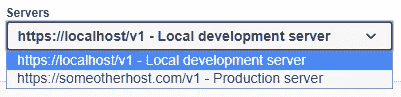
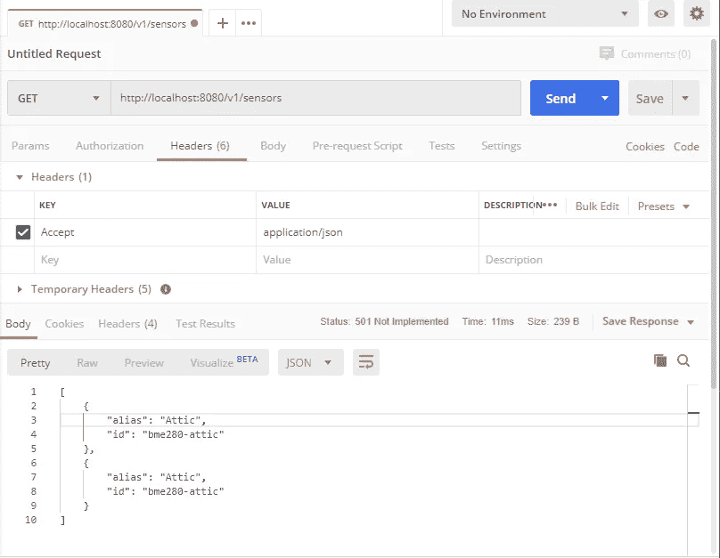

# 从 OpenAPI 3.0 定义创建 Java Spring REST 服务

> 原文：<https://itnext.io/creating-a-java-spring-rest-service-from-an-openapi-3-0-definition-94fbd5b8aa9e?source=collection_archive---------0----------------------->


照片由来自 [FreeImages](https://freeimages.com/) 的 Krzysztof(Kriss)Szkurlatowski 拍摄

OpenAPI 3.0 规范已经存在一段时间了，但是到目前为止，我仍然使用它的前身 Swagger 2.0 定义。对于一个新项目，我决定使用 OpenAPI 3.0 定义来定义 REST API，并将其提供给 Swagger 提供的一些优秀工具，以生成一个基于 Spring 的 Java 项目来帮助 kickstart 实现。

# Swagger 2.0 vs OpenAPI 3.0

对于那些熟悉 Swagger 2.0 的人来说，好消息是，对 [OpenAPI 3.0](https://swagger.io/blog/news/whats-new-in-openapi-3-0/) 所做的更改在功能上是向后兼容的，尽管你的 JSON 或 YAML 文件将需要更新，因为格式已经发生了一点变化(像 [Mermade Swagger 2.0 到 OpenAPI 3.0.0 转换器](https://openapi-converter.herokuapp.com/)这样的工具可以为你做到这一点)。

OpenAPI 3.0 中我最喜欢的一些增强包括:

*   支持多个根 URL——这意味着当您的 API 定义显示在 Swagger UI 中时，读者可以选择在发送请求时使用哪个服务器。当有单独的开发、测试和生产环境时非常方便。



多个根 URL 允许在 Swagger UI 中选择不同的服务器

*   支持`oneOf`、`anyOf`、`allOf`和其他 [JSON 模式关键字](https://swagger.io/docs/specification/data-models/keywords/)，当 JSON 响应或请求开始变得复杂时，这些关键字允许更好地描述它们。
*   直接支持基于承载令牌的认证方案。

# Pi 天气休息 API

我目前正在探索的项目是关于构建和实现一个基于 Raspberry Pi 的传感器小网格，以收集不同位置的天气测量结果，并提供一个显示数据的仪表板。作为该系统的一部分，将有一个 REST API 来读取和写入测量值。每个收集天气测量数据的 Raspberry Pi 都将调用 write API。运行仪表板应用程序的 Raspberry Pi 将调用 read API。

下面的 OpenAPI 3.0 JSON 文件描述了这个简单的 REST API:

Pi Weather REST API 的 OpenAPI 3.0

# 生成 Spring 项目

现在我们已经定义了 REST API，我们可以使用 [Swagger Codegen](https://swagger.io/tools/swagger-codegen/) 工具创建一个基于 Spring 的 Java 项目来实现它。根据您的操作系统，有不同的安装方式，从自制软件，到从 Maven 下载最新的稳定 JAR，再到克隆 repo 并自己构建。

我要给出的唯一警告是确保您使用的是该工具的 3.x 版本，因为这是支持 OpenAPI 3.0 和更高版本所必需的。该工具的 2.x 版本仅支持 Swagger 2.0，如果针对 OpenAPI 3.0 文件运行，则会给出误导性错误。

一旦所有东西都安装好了，我们只需要创建一个选项文件，允许我们指定 Java 包名，然后我们就可以开始了。运行工具本身需要几个选项:

*   `-i`从中读取 REST API 定义的输入文件。
*   `-l`生成代码的语言。这里有很多选择，但是对于我的项目，我使用`spring`在基于 Java 的 Spring 框架中生成一个实现。
*   `-o`将生成的代码写入的目录(如果不存在将被创建)。
*   `-c`从中读取任何语言特定选项的文件。对于我们的 Spring 项目，我们将通过一个包含以下内容的选项文件来指定要使用的包名:

```
{
    "basePackage":"org.piweather.app",
    "configPackage":"org.piweather.app.config"
}
```

*   `-DhideGenerationTimestamp=true`将防止生成的代码包含文件创建时的时间戳，使得后续重新生成的代码的差异更加简单。

我已经将这些选项放在一个小脚本中(参见我的 GIT repo[https://github.com/arronharden/pi-weather-api-swagger30](https://github.com/arronharden/pi-weather-api-swagger30))，该脚本将从 Maven 下载 Swagger Codegen JAR 并根据我的 OpenAPI 3.0 定义运行它:

```
#!/bin/shCODEGEN_DIR="$(dirname "$0")/."CODEGEN_JAR=${CODEGEN_DIR}/swagger-codegen-cli.jar
CODEGEN_SWAGGER=${CODEGEN_DIR}/../swagger.json
CODEGEN_CONFIG=${CODEGEN_DIR}/swagger-codegen-spring-options.json
CODEGEN_OUT_DIR=${CODEGEN_DIR}/../../pi-weather-app-springrm -f ${CODEGEN_JAR}
wget [http://central.maven.org/maven2/io/swagger/codegen/v3/swagger-codegen-cli/3.0.11/swagger-codegen-cli-3.0.11.jar](http://central.maven.org/maven2/io/swagger/codegen/v3/swagger-codegen-cli/3.0.11/swagger-codegen-cli-3.0.11.jar) -O ${CODEGEN_JAR}java -jar ${CODEGEN_JAR} generate \
    -i ${CODEGEN_SWAGGER} \
    -l spring \
    -o ${CODEGEN_OUT_DIR} \
    -c ${CODEGEN_CONFIG} \
    -DhideGenerationTimestamp=true
```

# 生成的 Java Spring 项目

现在我们已经生成了框架项目，我们可以将它导入到我们最喜欢的 IDE 中，并开始实现每个 API 的逻辑。

生成的 Spring 应用程序

Spring 代码生成器的一个优点是，它创建的框架代码将返回我们在 OpenAPI 3.0 定义中提供的任何示例 JSON 内容以及 501 状态，这意味着我们可以快速运行它并尝试一些 GET APIs。这里有一个针对新生成的项目运行 [Postman](https://www.getpostman.com/) 的例子。



Postman 调用骨架项目上的 REST API

# 摘要

我们已经看到了 OpenAPI 3.0 中的一些变化，以及新的 REST API 定义是什么样子的。使用 Swagger Codegen 工具，我们还生成了一个基于 Spring 的 Java 项目框架，为 REST API 端点创建了真正的实现。