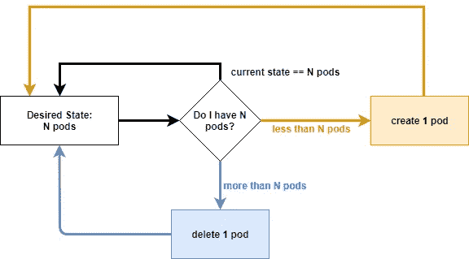
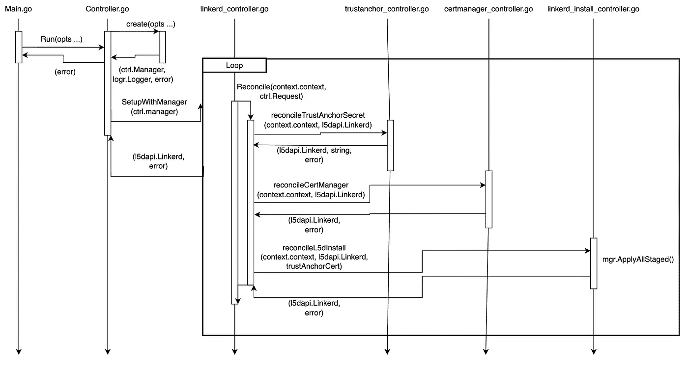

# 在 Golang 中创建 Linkerd 控制器

> 原文：<https://itnext.io/creating-a-linkerd-controller-in-golang-e588ad1c821a?source=collection_archive---------6----------------------->

使用您自己的 Kubernetes 控制器在您的集群中维护您的 Linkerd 部署的期望状态。

图片来自[https://octez . com/docs/2019/2019-10-13-controllers-and-operators/](https://octetz.com/docs/2019/2019-10-13-controllers-and-operators/)

# 项目架构和核心组件

在 Kubernetes 中，控制器是控制循环，它监视您的[集群](https://kubernetes.io/docs/reference/glossary/?all=true#term-cluster)中的进程状态，然后在需要的地方做出或请求改变。每个控制器都试图将当前的群集状态移至更接近所需的状态。

我们的团队需要在生产集群中部署 [Linkerd](https://linkerd.io/) ，并为长期集群处理证书和密钥的轮换。此外，我们希望对默认的 Linkerd 安装进行更改。为此，我们创建了一个 Linkerd 控制器来管理 Linkerd 对象的生命周期。

## [Linkerd](https://linkerd.io/)

Linkerd 是一个服务网格，为网格应用程序提供相互传输层安全(mTLS)通信以及可观察性指标。当使用默认的`linkerd install`命令安装时，Linkerd 会自动生成一个有效期为一年的信任锚。为了维持 mTLS 通信，必须在到期之前轮换该信任锚。

出于生产目的，我们希望提供自己的信任锚、发行者证书和密钥。为了处理自动轮换，我们决定使用 cert-manager。

## [证书管理器](https://cert-manager.io/)

Cert-manager 在 Kubernetes 集群中创建证书和证书颁发者作为资源类型。这简化了获取、更新和使用 Linkerd 所需证书的过程。

## 附加功能

除了自动颁发者和密钥轮换之外，我们还对 Linkerd 的安装提出了额外的要求，例如设置高可用性的选项，这对于生产工作负载是推荐的，我们还建议将授权策略设置为 T1，而不是默认的 T2。

出于这些原因，我们决定实现 Linkerd 和 Cert-manager 控制器来维护我们的 Linkerd 服务网格。

下图展示了我们控制器的流程:

我们的 Linkerd 控制器的序列图

# Linkerd 安装

为了使用我们自己的信任锚，我们安装了带有舵图的 Linkerd，而不是默认的`linkerd install`选项。这样，我们可以为控制器提供我们自己的信任锚。鉴于我们希望在生产中使用 Linkerd，我们决定在这里复制一份 Linkerd 的 Github repo [中的舵图，并将它们添加到我们的代码库中。这样，我们就有了一个稳定的副本，可以在本地使用，并在新版本出现时通过 justfile 进行更新。](https://github.com/linkerd/linkerd2/tree/5e6a1b550872751149552a043f8ff5dda875c40d/charts)

用于安装 Linkerd 舵图的 just 文件

因为我们的项目需要对 Linkerd 默认安装进行特定的配置更改，所以我们创建了自己的 Linkerd 对象，该对象允许我们轻松地实现我们的定制配置。例如，考虑到一些安装需要高可用性，我们创建了一个可以根据需要启用的高可用性配置选项。此外，我们希望实现各种状态，以便我们可以轻松地看到我们的 Linkerd 对象的状态。

下面是 Linkerd 对象规范:

Linkerd 对象规范

# Linkerd 控制器

安装完成后，我们现在可以创建一个控制器来处理 Linkerd 对象的生命周期。该控制器允许我们按照 Linkerd 文档中提到的步骤自动旋转控制平面 TLS 凭证，在此处[找到](https://linkerd.io/2.11/tasks/automatically-rotating-control-plane-tls-credentials/#save-the-signing-key-pair-as-a-secret)。

## 设置控制器

下面是我们控制器的入口点，`Run()`。在这里，我们创建我们的管理器和记录器，然后启动管理器。传入的是运行之前需要的任何选项，比如设置显式 k8s 客户机 rest 配置、启用 leader 选举和设置特定的绑定地址。

我们的创建函数由`Run()`调用。在设置了记录器和管理器之后，我们设置了 Linkerd 协调器。这个结构包含我们的客户机、记录器、Linkerd 清单和控制器的名称。

## Linkerd 调解器

下面是我们的 Linkerd 协调器结构，`l5dReconciler`:

L5d 调解器

## 设置管理器

在`create()`中调用的`SetupWithManager()`配置 Linkerd 控制器来管理我们的 Linkerd 对象以及它需要监视的其他资源，比如 cert-manager 证书和 Issuer 资源。

## 和解

我们的 Linkerd 协调器使用我们的`Reconcile()`函数来获取我们的 Linkerd 对象，并设置或重置我们的 Linkerd 对象的初始状态。通过创建状态，我们可以很容易地看到 Linkerd 安装的进度，如果出现错误，对象的状态将相应地更新，这样用户就可以清楚地看到对象的状态，而不必参考错误日志。

对于这个项目，我们决定使用与 fluxcd 相同的状态条件，在这里找到。

如果出现错误，我们会尝试对对象重新排队，以尝试将实际的 Linkerd 对象与所需的 Linkerd 对象进行协调。默认情况下，我们每 30 分钟协调一次，以避免实际对象和期望对象之间的任何意外偏差。

我们的私有`reconcile()`函数处理我们的大部分安装。

私有 reconcile()函数

上面的代码处理我们的安装和协调的三个主要部分:

首先，我们检查信任锚秘密是否存在。这通过`r.reconcileTrustAnchorSecret(ctx, l5d)`来检查，它检查信任锚秘密是否存在。如果它不存在，我们创建自己的证书并将证书返回给我们的 Linkerd 协调器。因为证书管理器需要信任锚，所以必须首先检查它。

其次，我们调用`r.reconcileCertManager(ctx, l5d)`来验证我们的 CertManager 发行者和证书是否已创建。如果没有找到对象，则创建它们。

最后，我们调用`r.reconcileL5dInstall(ctx, l5d, trustAnchorCert)`来根据 Linkerd 对象的规范从官方 Helm 图表中呈现 Linkerd 清单。

一旦呈现了 Linkerd 清单，我们就能够安装 Linkerd 了！

## 创建信任锚机密

下面是用于检查信任锚秘密是否存在的函数，在`reconcile()`中调用。如果秘密已经存在，我们返回现有的证书。如果没有，则创建一个。

协调信任锚机密

下面是`createTrustAnchorSecret()`功能:

生成我们的 TLS 密钥和 CA

有关创建根证书颁发机构或对私钥进行编码的特定函数的更多细节，请查看 Linkerd 存储库[这里的](https://github.com/linkerd/linkerd2/tree/main/pkg/tls)。

然后我们在`buildTrustAnchorSecret()`中创建 K8s 秘密:

构建信任锚 K8s 秘密

## 创建我们的证书管理器资源

下面是我们在`reconcile()`中调用的 cert-manager 资源的协调。这里，我们检查 cert manager 发行者和证书是否存在。如果没有，则创建它们。在整个过程中，如果创建资源时出现任何错误或者资源没有准备好，它们将被收集到一个错误和原因的数组中，然后可以将这些错误和原因报告给 Linkerd 资源，以将对象的状态更新为`Not Ready`。

证书管理器资源的协调

## 呈现我们的 Linkerd 对象

一旦创建了信任锚机密和 cert-manager 资源，我们就可以最终呈现 Linkerd 清单了。因为我们总是提供我们自己的信任锚证书，这是作为一个渲染选项自动添加的。接下来，我们检查我们的 Linkerd 对象是否启用了高可用性。如果是这样，我们用`HighAvailability: true`渲染对象。一旦添加了所有的渲染选项，我们就创建了一个非结构化对象的数组，这样我们就可以通过服务器端的应用客户端来应用我们的资源。

协调 Linkerd 安装

我们现在准备运行我们的 Linkerd 控制器的本地实例！

# 运行本地实例

我们可以使用 main.go 文件中的`Run()`函数来启动控制器:

main.go

一旦启动并运行，我们应该看到记录器记录我们的 Linkerd 控制器的设置。

Linkerd 控制器的日志

然后，我们可以使用`kubectl apply -f linkerd.yaml`应用一个 Linkerd 对象。

启用了高可用性的 Linkerd 对象

接下来，我们可以使用`kubectl get linkerd`检查状态:

获取 Linkerd 对象的状态

上面我们看到 Linkerd 对象已经准备好，状态显示安装成功。

最后，当我们运行`kubectl get pods -n linkerd`来查看 Linkerd pods 时，我们看到三个 Linkerd pods，destination、identity 和 proxy-injector 都已启动并运行。

获取 Linkerd 窗格

从这里开始，您可以像往常一样用 Linkerd 注入您的服务来创建您的服务网格！

# 关于作者

摩根·戈麦斯是 NCR 公司的一名软件工程师。她于 2021 年毕业于佐治亚理工学院，获得了计算媒体学士学位。

Kevin O'Brien 是 NCR 公司负责零售创新的软件工程师。他于 2021 年毕业于佐治亚理工学院，获得了计算机科学学士学位。

Alex Weidner 是 NCR 公司的一名软件工程师，专门修理和修理他弄坏的东西。