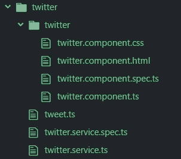

# 创建一个平均堆栈 Twitter 调度器(Angular、MongoDB、Node.js 和 Express)——第 2 部分

> 原文：<https://itnext.io/creating-a-mean-stack-twitter-scheduler-angular-mongodb-node-js-and-express-part-2-ded5b5d5fc05?source=collection_archive---------6----------------------->

在本系列的[第 1 部分中，我们为 Tweet 定义了一个基本的 TypeScript 对象，并创建了一个 API 来将 Tweet](https://medium.com/@aaronrhoades91/creating-a-mean-stack-twitter-scheduler-angular-mongodb-node-js-and-express-34b37e717ceb?source=friends_link&sk=3778ff7e3b568fe56f5b75ead951f0a0) [文档](https://docs.mongodb.com/manual/core/document/)添加到我们的 MongoDB 数据库中。到上一篇教程结束时，我们已经有了一个可以向数据库添加一个基本的“预定 Tweet”对象的 API。在本教程中，我将重点放在应用程序的角度部分。

首先，让我们将上一篇教程中的 TypeScript `Tweet`类复制并粘贴到一个名为“Twitter”(*src/app/Twitter*)的新文件夹中。这也是我将要存储我的 Twitter 组件的地方

**src/app/Twitter/tweet . ts**

现在让我们创建组件。打开可信 Angular CLI 并创建一个组件:

`ng g component twitter/Twitter`

使用默认角度设置，这将创建以下组件，并很好地打包到一个文件夹中:

*   twitter.component.html
*   推特.组件.规格. js
*   推特.组件. ts
*   推特.组件. css
*   (更新至 app.module.ts)

我们还需要一个服务来连接我们的 API，所以我们最好现在就在命令行中创建它。

`ng g service twitter/Twitter`

现在我们的 Twitter 组件有了一个 Twitter 服务来安排我们的 tweets。



推特真多。

# 设置 Twitter 服务

Twitter 服务将以一些样板代码开始:

```
import { Injectable } from '[@angular/core](http://twitter.com/angular/core)';[@Injectable](http://twitter.com/Injectable)({
  providedIn: 'root'
})
export class TwitterService {constructor() { }
}
```

我们需要设置我们的 HTTPClient。添加必要的导入语句:

```
import { Tweet } from './tweet';
import { HttpClient } from '[@angular/common](http://twitter.com/angular/common)/http';
import { Observable } from 'rxjs';
```

在构造函数中创建一个 http 对象:

`constructor(private http: HttpClient){}`

并创建 ScheduleTweet 函数，该函数返回一个 rxjs [可观察值](https://rxjs-dev.firebaseapp.com/guide/observable):

```
ScheduleTweet(tweet: Tweet) : Observable<any>{
   return this.http.post('api/tweets', tweet);
}
```

总之，加上语法突出显示，我们完成的 Twitter 服务应该是这样的:

不算太坏，嗯？

# 现在，Twitter 组件

现在是时候设置我们的组件了。这是应用程序的一部分，用户在其中与 UI 交互以创建预定的 tweet。我在我的应用程序中使用 [bootstrap 4](https://getbootstrap.com/) 来加速，我们假设用户已经登录。我们将通过查看 Angular 为我们设置的样板文件再次开始。

**下面是组件样板:**

```
import { Component, OnInit } from '[@angular/core](http://twitter.com/angular/core)';[@Component](http://twitter.com/Component)({
  selector: 'app-twitter',
  templateUrl: './twitter.component.html',
  styleUrls: ['./twitter.component.css']
})
export class TwitterComponent implements OnInit { constructor() { } ngOnInit() {
  }}
```

马上，我们将想要导入我们的 Twitter 服务，以及某种用户/登录服务来获取登录的用户名。我不会在本教程中详细介绍用户/登录服务，因为这是一个完全不同的设置，但基本上你需要知道的是你将从它那里收到一个用户名。

**导入两个服务，以及 Tweet 对象:*(只需记住 login.service 在本教程中不做回顾。)***

```
import { Tweet } from '../tweet';
import { LoginService} from '../../login/login.service';
import { TwitterService } from '../twitter.service';
```

**向构造函数添加两个服务的实例:**

```
constructor(
  private loginService: LoginService,
  private twitterService: TwitterService
) { }
```

最后但同样重要的是，出色的 scheduleTweet 函数(它实际上从服务中调用了`scheduleTweet()`函数):

```
sendTweet(tweet: Tweet){
  this.twitterService.scheduleTweet(tweet).subscribe(
    (data: any) => console.log(data),
    err => console.log(err)
  );
}
```

我喜欢让事情从简单开始，所以我只是将成功或失败记录到 JavaScript 控制台。最终我们将显示数据并创建错误回退，但现在我只想看到数据从 UI 输入到数据库中。

在我们进入 UI 之前，还有最后一件事。在加载页面时，我们将必须检索用户以进入我们预定的 Tweet 对象的`shq_userid`字段。这将是我们从 loginService 中需要的一件事，我们将把它添加到 ngOnInit():

```
this.scheduledTweet.mhq_userid = this.loginService.getLoggedInUser();
```

如果你有困难，你可以暂时把它设置为一个特定的字符串。

# 还剩下什么？

我们仍然需要用户填写推文`text` 和`shq_scheduled_date`字段。我们可能需要设法获得 Twitter `id`和`screen_name`字段。由于我目前只关注连接到 MongoDB，我们将首先关注用户输入的**文本**和**预定日期**。因此，我将简单地将下面两行作为占位符代码添加到 ngOnInit()函数中，我们将在本教程的下一部分讨论用户输入的数据。感谢你的坚持！

```
this.scheduledTweet.user.id = 123456;
this.scheduledTweet.user.screen_name = "aaronbrosef";
```

PS，这是本教程末尾的语法突出显示的完整 twitter.component.ts:

第 3 部分即将推出！