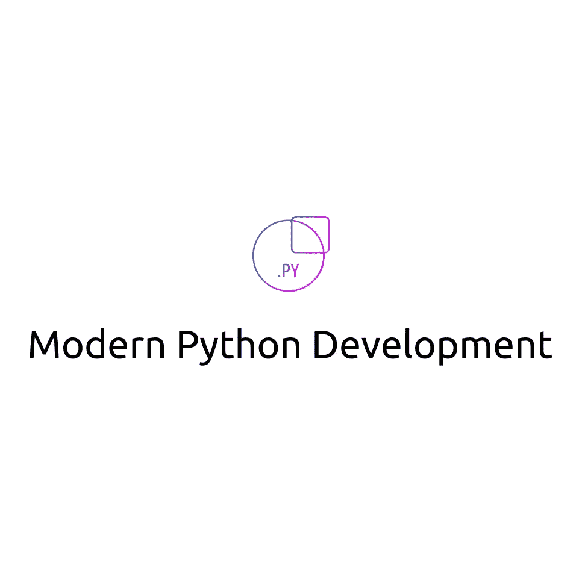
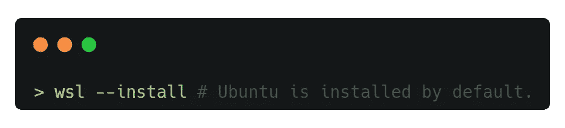
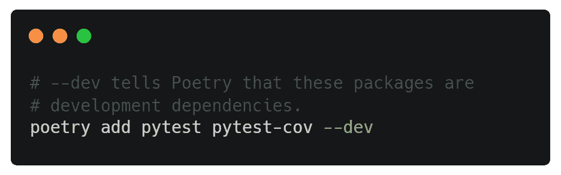
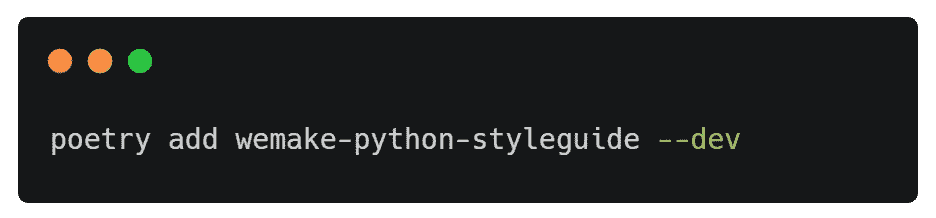
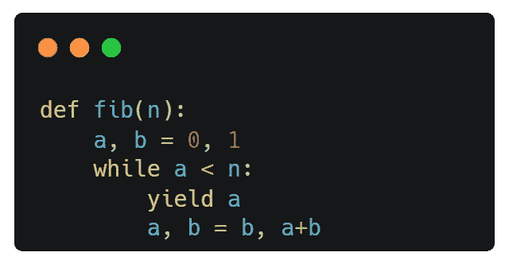
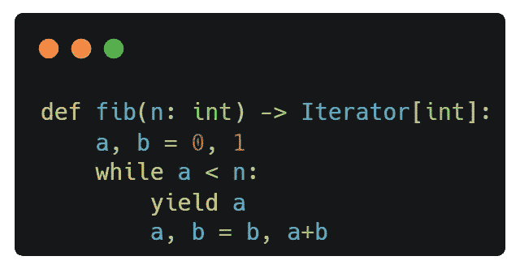
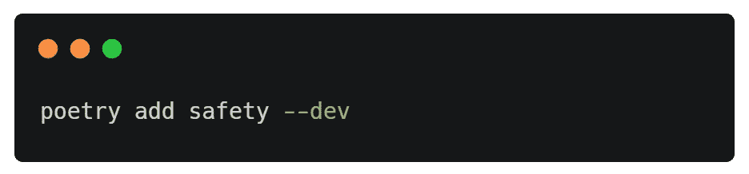
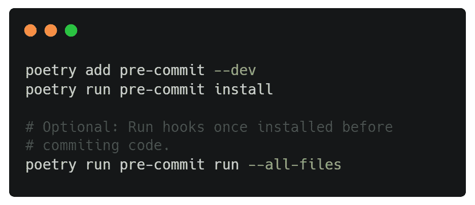
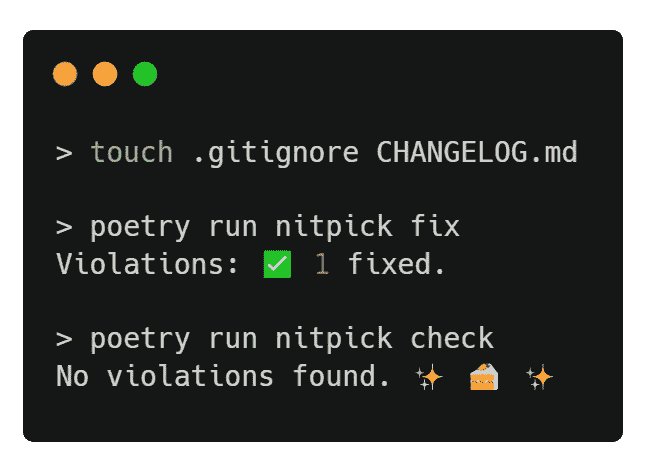

# 创建现代 Python 开发环境

> 原文：<https://itnext.io/creating-a-modern-python-development-environment-3d383c944877?source=collection_archive---------0----------------------->



作为一名 Python 开发人员，在过去的几年里，我收集了一份我最喜欢的包/工具的列表，我几乎在每个项目中都使用它们。开发是一项团队工作，在某些时候，有人必须阅读和/或修改你写的代码。如果代码实现得不好，而开发人员要实现一个新的特性或错误修复，这很可能会导致额外的技术债务。所以我喜欢强制开发者(*包括我自己*😉)来产生可测试的、可维护的、可读的、最重要的是一致的代码，否则，它会被拒绝。这导致软件开发过程更加顺利，因为他们将在相同的可靠代码上工作。

这篇博文展示了我如何在 Unix 和 Windows 系统上使用 pyenv 和 poems 设置和配置我的 Python 开发环境，以生成相同的一致代码，帮助避免技术债务。

# **安装 pyenv** 🐍

从官方二进制文件下载和安装 Python 会将您限制在一个特定的 Python 版本上，如果您使用不同的 Python 版本处理多个项目，这不是一件好事。因此，最好使用 [pyenv](https://github.com/pyenv/pyenv) ，这个工具可以让你在多个版本的 Python 之间轻松切换。

## Windows 安装

对于 Windows 用户，我建议您安装 [WSL2](https://docs.microsoft.com/en-us/windows/wsl/install) ，这是一个 [Windows 子系统，它让开发人员可以在没有传统虚拟机或双引导设置](https://docs.microsoft.com/en-us/windows/wsl/about#:~:text=The%20Windows%20Subsystem%20for%20Linux%20lets%20developers%20run%20a%20GNU/Linux%20environment%20%2D%2D%20including%20most%20command%2Dline%20tools%2C%20utilities%2C%20and%20applications%20%2D%2D%20directly%20on%20Windows%2C%20unmodified%2C%20without%20the%20overhead%20of%20a%20traditional%20virtual%20machine%20or%20dualboot%20setup.)开销的情况下运行 Linux 环境。您可以通过在 PowerShell 或命令提示符下执行以下命令来安装 WSL2:



WSL2 安装命令。

如果你不想使用 WSL2，你可以安装 [pyenv-win](https://github.com/pyenv-win/pyenv-win) ，*一个不太现代的方法*并跳到**用 pyenv 设置 Python 版本**一节。

安装后在 Windows 上搜索 Ubuntu(WSL 终端)并打开它。它将向您展示一个 bash shell，并要求您提供用户名和密码。一旦它们被设置好，你的终端就可以进行修补了🔨！

在安装 pyenv 之前，您需要更新您的环境并安装一些构建依赖项*(如果您还没有的话)。*打开终端，执行以下命令:

```
> sudo apt update && sudo apt upgrade
> sudo apt install -y build-essential git curl libexpat1-dev libssl-dev zlib1g-dev libncurses5-dev libbz2-dev liblzma-dev libsqlite3-dev libffi-dev tcl-dev linux-headers-generic libgdbm-dev libreadline-dev tk tk-dev
```

pyenv 现在可以安装和配置了*(告诉您的终端 pyenv 在哪里):*

```
> curl https://pyenv.run | bash> echo '\nexport PATH="$HOME/.pyenv/bin:$PATH"' >> ~/.bashrc
> echo '\neval "$(pyenv init -)"' >> ~/.bashrc
> echo '\neval "$(pyenv init --path)"' >> ~/.bashrc> source ~/.bashrc# Confirm successful installation:
> pyenv --version
pyenv 2.2.5 # Your version will likely be newer.
```

## 用 pyenv 设置 Python 版本

成功安装 pyenv 后，使用以下命令设置您的全局 Python 版本:

```
# Install the required Python version:
> pyenv install 3.9.0# Refresh pyenv since you installed a new Python version:
> pyenv rehash# Set your global Python version:
> pyenv global 3.9.0# You can also set the local Python version, i.e. for a project:
# > pyenv local 3.9.0# Confirm Python version:
> pyenv version
3.9.0 (set by /home/wsl/.pyenv/version)
```

如果您需要 Python 的另一个版本，您可以简单地用不同的版本号执行相同的命令🤗。

# 装置诗歌📜

Python 中的打包系统和依赖性管理相当复杂，新手很难理解。即使对于经验丰富的开发人员来说，创建 Python 项目中所需的所有文件有时也很麻烦。[poems](https://github.com/python-poetry/poetry)帮助你声明、管理和安装 Python 项目的依赖，确保你在任何地方都有正确的栈。它自动为每个项目创建隔离的环境，防止修改另一个项目中的依赖关系。

```
> pyenv shell 3.9.0> curl -sSL https://raw.githubusercontent.com/python-poetry/poetry/master/get-poetry.py | python -> source ~/.bashrc# Confirm installation was successful:
> poetry --version
Poetry version 1.1.13 # Your version will likely be newer.
```

# 编辑器配置

[EditorConfig](https://editorconfig.org/) 有助于跨不同编辑器和集成开发环境(IDE)为从事同一项目的多个开发人员保持一致的编码风格。它通过读取项目顶层提供的`.editorconfig`配置文件来工作。[大多数 ide 都有内置支持](https://editorconfig.org/#pre-installed)，但这里列出了需要插件的[ide/编辑器](https://editorconfig.org/#download)。

这是我在所有 Python 项目中使用的标准`.editorconfig`文件:

编辑器配置文件。

您的环境现在已经准备好创建现代 Python 项目🥳.了

# 创建和配置 Python 项目⚙️

以下说明如何使用 pyenv 和 poem 手动*创建和配置 Python 项目。*

要创建新的 Python 项目，您需要使用 pyenv 指定 Python 版本，然后使用 poem 创建项目。

```
> pyenv shell 3.9.11
> poetry new PROJECT_NAME # Example testproject
> cd testproject
> git init # Initialise the repository
```

接下来，创建上面提供的`.editorconfig`配置。您的项目树结构应该如下所示:

```
> tree.
├── .editorconfig
├── .git
│   ├── ...
├── README.rst
├── pyproject.toml
├── testproject
│   └── __init__.py
└── tests
    ├── __init__.py
    └── test_testproject.py12 directories, 22 files
```

就我个人而言，我更喜欢 Markdown 而不是 reStructuredText，所以我把`README.rst`改名为`README.md`。所有的应用程序逻辑都放在以您的项目命名的文件夹中，而*测试放在 tests 文件夹*中。


使用 pyenv 和诗歌创建 Python 项目的示例。

# 我的基本 Python 包📦

这一节详细介绍了我在 Python 项目中使用的大多数开发包(*包，只在开发阶段*需要)。

## 带有 pytest-cov 的 pytest

pytest 框架使得编写小测试变得容易，同时也支持应用程序和库的复杂功能测试。与内置的 unittest 库相比，我更喜欢 pytest，因为它支持诸如 [pytest-xdist](http://pypi.python.org/pypi/pytest-xdist) 这样的插件，可以一次执行多个测试，加快测试运行时间，并且生成与 unittest 相同的输出需要更少的代码行。此外， [pytest-cov](https://pypi.org/project/pytest-cov/) 是一个插件，可以自动生成测试覆盖报告。



安装开发依赖 pytest 和 pytest-cov with poem。

## wemake-python-styleguide

wemake.services 团队将[we make-Python-style guide](https://wemake-python-stylegui.de/en/latest/)描述为 [*有史以来最严格、最固执己见的 Python linter*](https://wemake-python-stylegui.de/en/latest/#:~:text=strictest%20and%20most%20opinionated%20Python%20linter%20ever.)。它本质上是 [flake8](https://github.com/PyCQA/flake8) 包，一个分析代码缺陷的林挺工具，带有[插件](https://wemake-python-stylegui.de/en/latest/pages/usage/violations/index.html#external-plugins)。其主要目标是:

*   强制使用 Python 3.6+版本。
*   大大降低了代码的复杂性，使其更易于维护。
*   将“应该有一种——最好只有一种——显而易见的方法”规则应用到编码和命名风格中
*   保护开发人员避免可能的错误，并实施最佳实践。



用诗歌安装开发依赖 wemake-python-styleguide。

如果你正在使用 pytest，我还会推荐`flake8-pytest-style`插件。

对于现有的项目，您可以使用带有基线特性的软件包 [flakehell](https://github.com/flakehell/flakehell) 来报告新的违规，因为集成一个新的 linter 可能会导致数百甚至数千个违规。这份[指南](https://wemake-python-stylegui.de/en/latest/pages/usage/integrations/flakehell.html)解释了如何整合 flakehell 并逐步解决违规问题。

## Mypy

[Mypy](https://github.com/python/mypy) 是一个可选的静态类型检查器，旨在结合动态(或“鸭子”)类型化和静态类型化的优点。静态类型代码的好处是增加了可读性和可维护性。对于现有的代码库，这里有一个关于如何实现 Mypy 的[指南](https://mypy.readthedocs.io/en/stable/existing_code.html)。



静态类型化 Python 代码之前和之后。


用诗歌安装开发依赖 Mypy。

## 安全

Snyk 的 2021 [安全报告](https://go.snyk.io/rs/677-THP-415/images/Python%20Insight%20Report.pdf)指出，47%的 Python 项目包含已知的漏洞。另一方面，几乎 87%的已知漏洞可以通过升级易受攻击的软件包来解决。[安全](https://github.com/pyupio/safety)检查您安装的依赖项是否存在已知的安全漏洞。


安全检测脆弱包装的示例。



用诗歌安装开发依赖项安全。

## 预提交

[预提交](https://github.com/pre-commit/pre-commit)是一个管理和维护多语言预提交钩子的框架。例如，在代码提交到存储库之前，运行 pytest 的钩子必须成功，以防止代码缺陷。下面是我在 Python 项目中使用的预提交配置文件。**确保代码提交前测试、覆盖、状态类型检查和漏洞扫描全部通过。**


防止提交有缺陷代码的预提交示例。

这是上例中使用的`.pre-commit-config.yaml`文件:

提交前配置文件。替换{PROJECT_NAME}。



安装开发依赖项预提交。

## 挑剔的

跨项目维护配置可能会变得很乏味，尤其是因为 EditorConfig、pytest-cov、flake8、Mypy 和 pre-commit 都需要配置文件。是一个工具和 flake8 插件，在多个独立于语言的项目中执行相同的配置，自动化这种繁琐的配置。


用诗歌安装开发依赖吹毛求疵。

安装完成后，将下面一行添加到您的`pyproject.toml`文件中:

```
**[tool.nitpick]**
style = "https://raw.githubusercontent.com/wemake-services/wemake-python-styleguide/master/styles/nitpick-style-wemake.toml"
```

您需要创建一个`.gitignore`和`CHANGELOG.md`文件来成功通过挑剔的验证。



挑剔的配置设置。

它将自动创建一个包含所有必需配置的`setup.cfg`文件。


挑剔的 wemake-服务安装。

祝贺您，您已经成功地创建了一个现代 Python 开发环境🎉。如果你想和我联系，你可以在 [Linkedin](https://www.linkedin.com/in/shanenullain/) 或 [Github](https://github.com/ShaneNolan) 上找到我。感谢阅读😊！

# 额外:VSCode WSL2 集成

如果您的编辑器是 [VSCode](https://code.visualstudio.com/) ，那么您很幸运，因为您可以轻松地将 Linux 子系统与其[远程 WSL 插件](https://marketplace.visualstudio.com/items?itemName=ms-vscode-remote.remote-wsl)集成在一起。安装完成后，打开 WSL 终端并执行`code .`。这将自动打开 Linux 子系统中的 VSCode 编辑器。你可以在这里阅读更多关于它的[。](https://code.visualstudio.com/blogs/2019/09/03/wsl2)

# 额外:自动化项目设置和配置

如果你和我一样，那么当你发现自己不止一次地做一件事时，你必须自动化它。我已经使用 [cookiecutter](https://github.com/cookiecutter/cookiecutter) 自动化了现代 Python 项目的创建和配置。您需要首先设置您的环境。另外，挑剔使用了我自己对 wemake-services 配置的看法，你可以在这里查看[库](https://github.com/ShaneNolan/python-project-template)。

```
> pyenv shell 3.9.11---------------------------------------------
# Unix: Specify the name of the project.
> export PROJECT_NAME="MY_PROJECT_NAME"
=============================================
# Windows: Specifcy the name of the project.
> set PROJECT_NAME="MY_PROJECT_NAME"
---------------------------------------------

> python -m pip install cookiecutter &&
python -m cookiecutter --no-input gh:ShaneNolan/python-project-template \
project_name=$PROJECT_NAME &&
(cd $PROJECT_NAME && git init &&
poetry init --no-interaction --name $PROJECT_NAME &&
poetry add mypy pytest pytest-cov flake8-pytest-style wemake-python-styleguide safety pre-commit nitpick --dev &&
poetry run nitpick fix &&
poetry run pre-commit install) && python -m uninstall cookiecutter
```


自动化项目设置和配置的示例。