# 在颤动中创建视差背景

> 原文：<https://itnext.io/creating-a-parallax-background-in-flutter-5e8b5f4bb837?source=collection_archive---------0----------------------->

## 如何在 Flutter 中构建具有视差背景的选项卡导航器

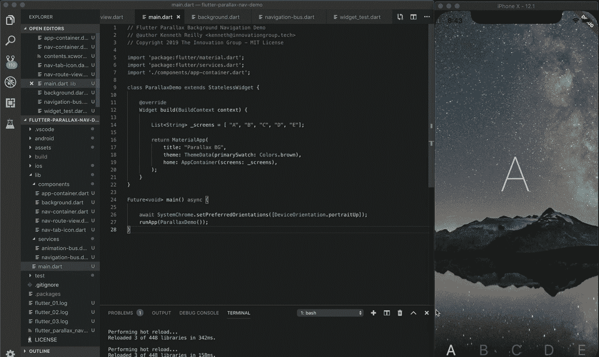

运行[颤振-视差-导航-演示](https://github.com/kenreilly/flutter-parallax-nav-demo)项目的 iOS 模拟器的屏幕截图

## 介绍

在这篇文章中，我们将看看使用 [Dart](https://www.dartlang.org) 和 [Flutter 创建具有同步视差背景的可滚动标签导航布局的过程。](https://flutter.dev)

Dart 和 Flutter 是移动开发的绝佳组合。从 Silverlight 和 WPF 到数十种不同的桌面、web 和移动平台，我已经构建了各种用户界面，我发现 Flutter 为快速构建丰富的移动应用程序体验提供了一个很好的环境。

如果您还没有 Flutter SDK，请转到[安装页面](https://flutter.dev/docs/get-started/install)，按照您的操作系统的说明进行操作。如果您想要一份本文中使用的演示项目的源代码，请在这里查看。

## **入门**

让我们来看看项目结构及其定义文件， **pubspec.yaml** :

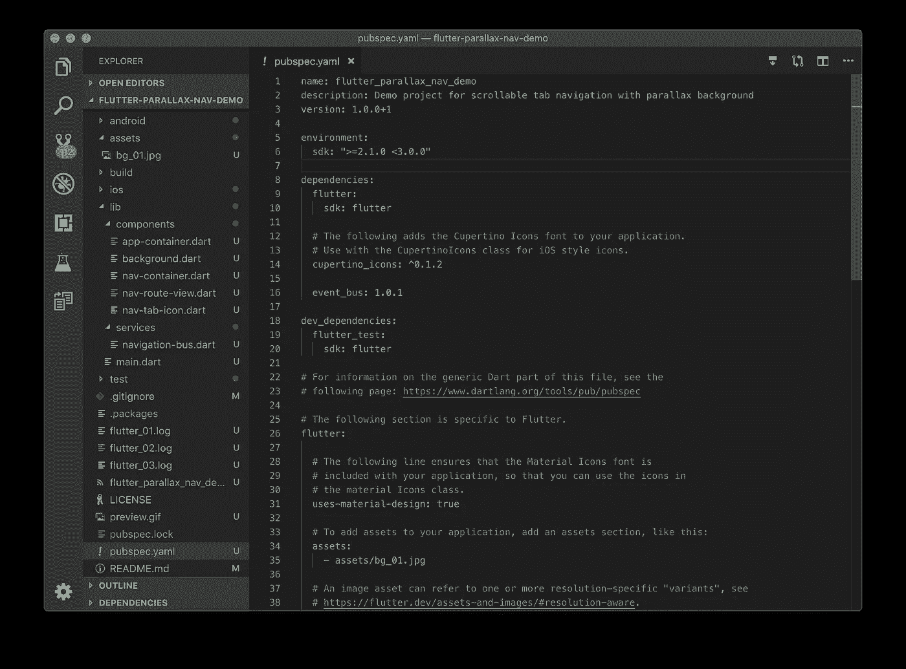

添加了 **event_bus** 包和图像**资产**的默认 **pubspec.yaml**

在项目定义文件 **pubspec.yaml** 中，增加了 **event_bus** 依赖关系。事件总线允许侦听器订阅事件，并允许发布者触发这些事件。关于 Dart 的 **event_bus** 包及其工作原理的更多信息，[查看这里](https://pub.dev/packages/event_bus/versions/0.2.3)。同样在该文件中，背景图像作为图像资产包含在**资产下。**这将允许从应用程序中引用和显示图像文件。

## 主应用程序容器

接下来，让我们检查应用程序的主入口文件， **lib/main.dart** :

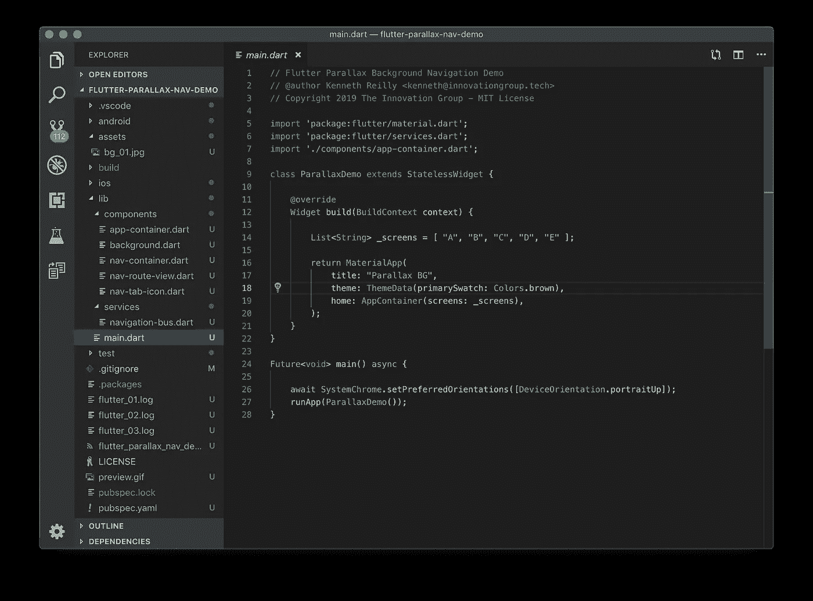

带有顶级小部件构建器的应用入口文件 **lib/main.dart**

这个文件定义了根应用程序组件 **ParallaxDemo** ，它是一个 [StatelessWidget](https://docs.flutter.io/flutter/widgets/StatelessWidget-class.html) ，返回一个 **MaterialApp** 组件，带有我们的标题*“视差背景”*、一些默认主题数据和 home **AppContainer** 小部件。

在这个项目中,“屏幕”的定义只是字母 A 到 E，为了简单起见，我们将它们表示为选项卡图标和屏幕内容。

请注意，我们的 **main()** 函数已经使用 **async** 进行了定义，以允许调用异步方法**system chrome . setpreferedorientations()，**，该方法将设备方向锁定到**device orientation . portraitup .**这只是为了方便起见而选择的，并且可以针对任何目的进行修改。

现在让我们检查一下**组件/app-container.dart** 中的 **AppContainer** :

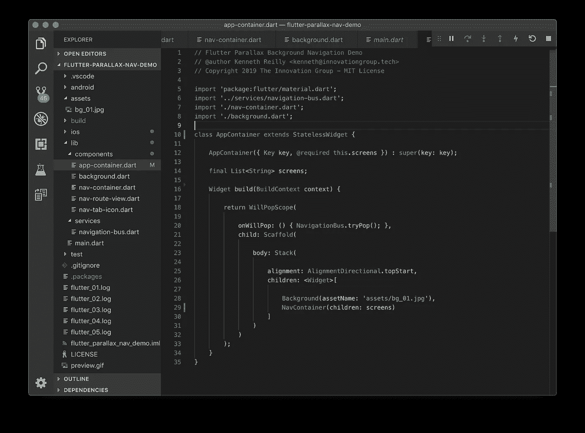

具有堆叠在 z 轴上的**背景**和**导航容器**的 **AppContainer** 类

这个类还扩展了 StatelessWidget，因为它只是一个没有自己状态的容器。它采用**屏幕**参数，即我们的字母列表 *A* 到 *E* 。注意，构建器返回了 **WillPopScope** ，这允许这个小部件捕获 Android back 按钮，然后调用 *onWillPop* 处理程序中的 **NavigationBus** 向上游转发事件。

## **可滚动背景**

我们要检查的下一个组件类是背景小部件，它位于**lib/components/Background . dart**中:

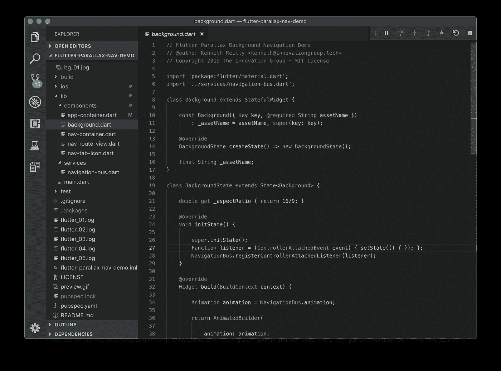

具有各种属性和初始化器的**背景**类

与我们之前检查的类文件不同，这个**背景**类扩展了一个 [StatefulWidget](https://docs.flutter.io/flutter/widgets/StatefulWidget-class.html) 来支持本地可变状态属性和事件触发使用 **setState()** 重绘的能力。有一个 *aspectRatio* 属性，我将它任意设置为 *16/9* ，但它可以是任何纵横比，这取决于您选择显示的图像以及您打算在应用程序中支持的设备大小和方向。此外，还有一个 **initState()** 方法覆盖，它在上一个类中出现的同一个 **NavigationBus** 上注册一个事件侦听器。该监听器的目的是当新的**动画**对象在事件总线上可用时，使该小部件重新绘制自身。由于滚动标签动画在背景第一次被创建时不太可能存在，这确保了一旦它被滚动标签控制器创建，它将接收到对更新的动画的引用。

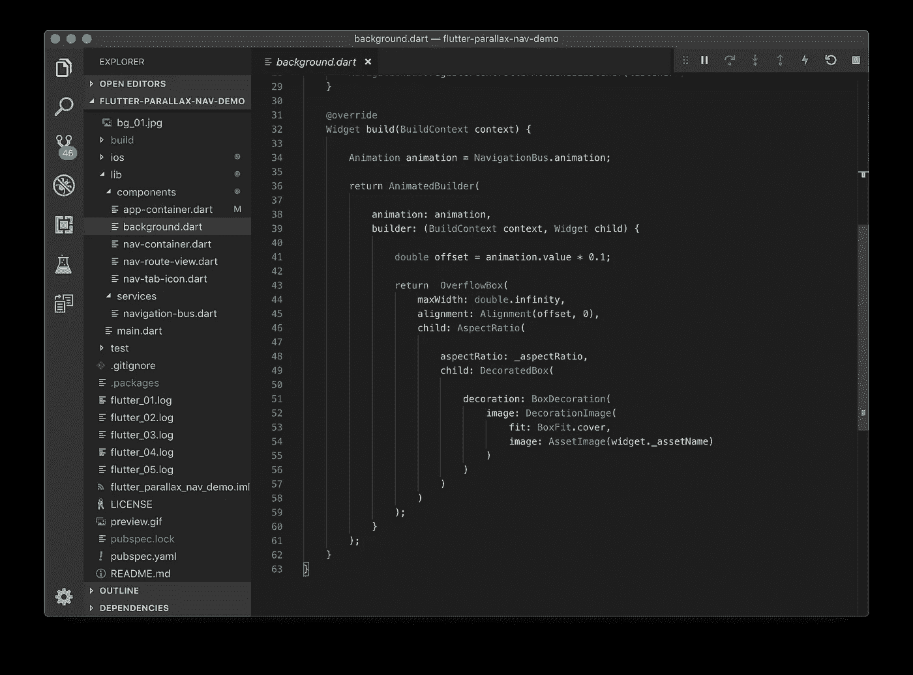

显示**构建**方法的**背景**类

用于**背景**类的**构建**方法获取对 NavController 上可用的**动画**的当前实例的引用，将其传递给 **AnimatedBuilder** ，然后计算对齐偏移量，该偏移量为动画值的 10%。在这个有五个屏幕的例子中， *animation.value* 的值的范围是从 *0.0* 到 *4.0* ，我们依次从 *0.0* 到 *0.4* 映射到**对齐**小部件，它使用这个值作为一个百分比来偏移**溢出框**的子对象。这对于我们的示例项目来说非常有用，但是在现实应用中，图像的实际位置将取决于它的大小和用于视差效果的**比例**。

## **导航事件总线**

接下来是我们唯一的服务文件，**services/navigation-bus . dart**:

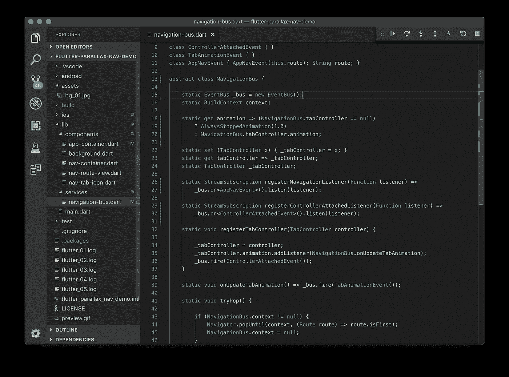

文件**services/navigation-bus . dart**带有事件类型和 **NavigationBus** 类

就在 **NavigationBus** 类的上面，有几个针对事件类型的单行类定义，在根据事件类型将事件转发给特定侦听器时会用到它们。创建了一个 **EventBus** 的实例，并且有一个用于*动画的 getter，*返回一个 **AlwaysStoppedAnimation** ，除非有一个 **TabController** 的实例可用，此时它将开始返回该控制器的动画，以允许其他小部件将自己从选项卡导航器的变化动画值中移走。还有注册新侦听器的方法。其中的第一个，**registerNavigationListener**()，没有在这个项目中使用，但它提供了一个示例，说明如何使用 **EventBus** 来跟踪应用范围内的导航事件，以处理各种事情，从触发后台网络请求到记录分析或任何其他事情。另一个事件监听器**registercontrolrattachedlistener**被**后台**类用来订阅**ControllerAttachedEvent**类型的事件。

当一个 **TabController** 被注册到总线上时，一个对它的引用被保存，来自它的动画事件通过处理程序**onupdatabanimation 被转发到事件总线。**此外，一个**ControllerAttachedEvent**沿着总线被触发，以通知任何相关组件获取一个新的**动画**的副本，就像**背景**只在固定位置开始的情况一样，然后一旦一切启动并运行，就开始跟随选项卡导航器。

## 导航集装箱 UX

导航组件分为三个文件:父容器、屏幕内容本身的小部件和选项卡导航图标的小部件。我们将从主导航文件**components/nav-container . dart**开始:

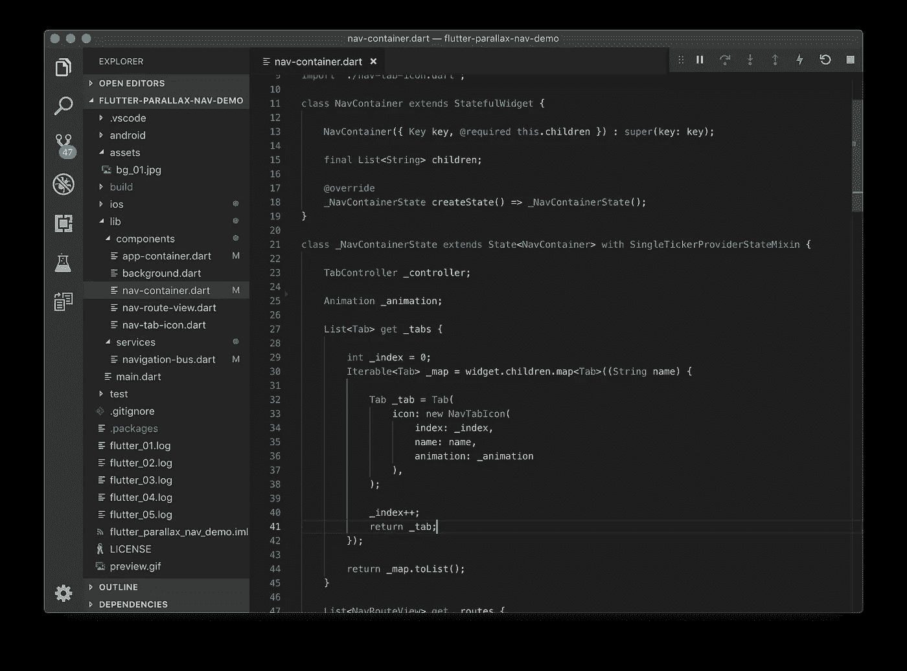

具有各种状态属性的 **NavContainer** 类

**NavContainer** 作为父容器，用于显示应用程序内容本身和底部选项卡。对于 **TabController** 和**动画**有一个*子*属性和局部引用。 **_tabs** getter 从*子*属性 *(* 字母 *A* 到*E】*开始，将其映射到带有 **NavTabIcon** 实例的**列表< Tab >** ，突出显示当前选中的选项卡。

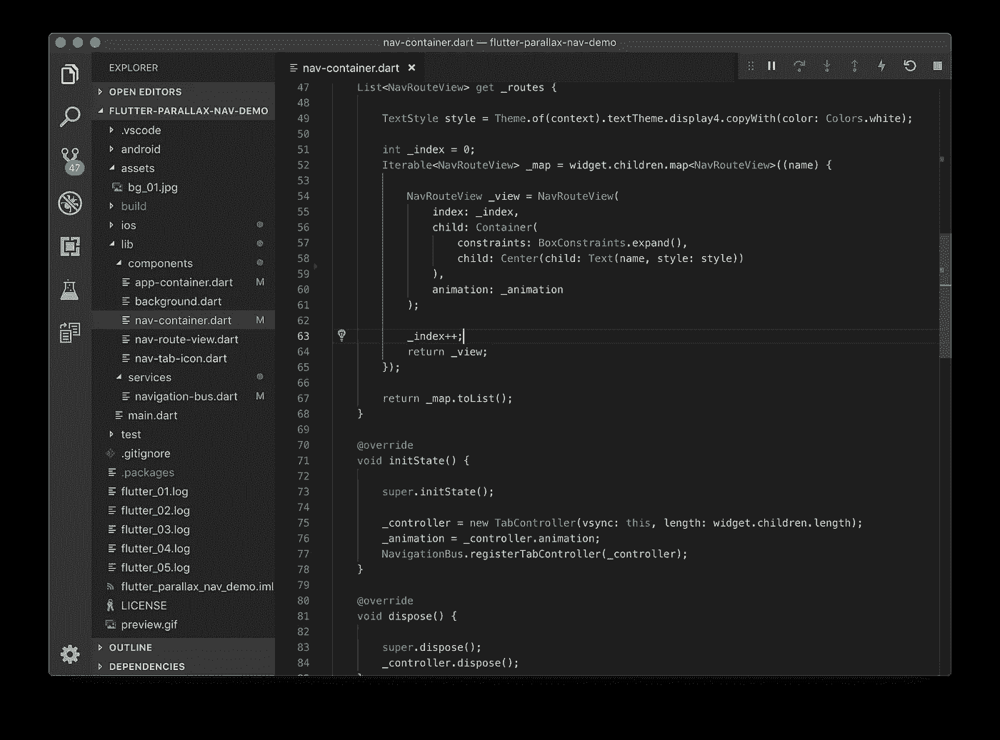

显示 _ **路线**和各种覆盖的 **NavContainer** 类

这个类中还有一个 getter，它使用相同的子属性，并将 is 映射到一个**列表< NavRouteView >** ，该列表显示我们的字母 A 到 E，并在页面转换期间应用一些很酷的导航效果。对 **initState()** 的覆盖创建了一个 **TabController** ，并将其注册到 **NavigationBus** 上。此外，还有一个 dispose()方法，当导航容器被释放时，该方法显式地释放控制器实例。

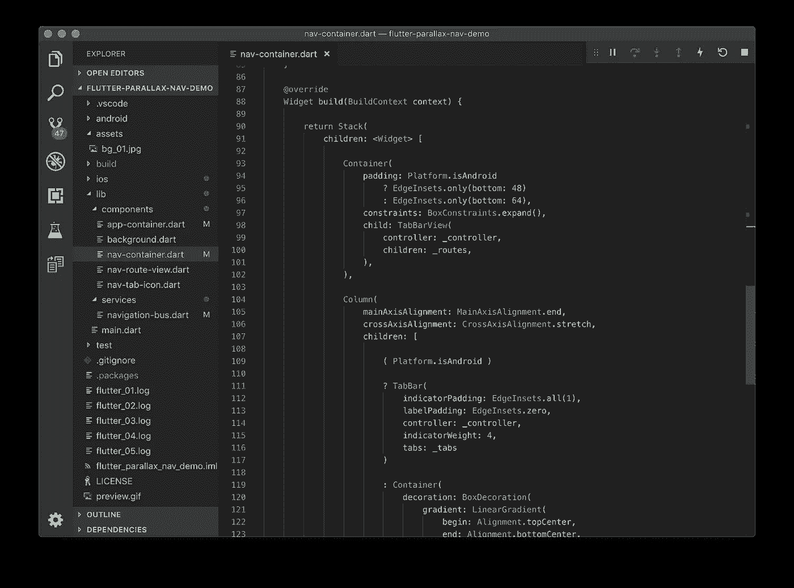

使用**构建**方法的 **NavContainer** 类

我们不会深入研究这个类，但是它是常见的列、容器和装饰的标准实现。有几个条件分支来处理标签栏在 iOS 上的呈现方式不同于 Android，这有助于将标签从 iPhone X 上的圆角和底部抽屉手柄中取出，这通常会干扰它们。

接下来是文件**lib/components/nav-route-view . dart**:

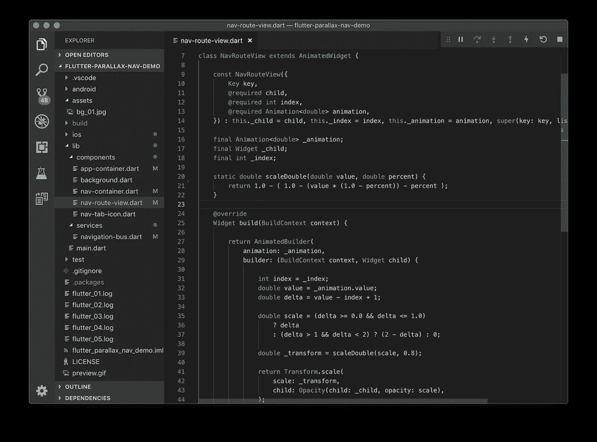

动画部件 **NavRouteView** 带有一些计算

这里我们有我们的 **NavRouteView** ，它是一个[动画化的小工具](https://docs.flutter.io/flutter/widgets/AnimatedWidget-class.html)，当路线飞入和飞出屏幕时，它对路线应用各种变换。方法 **scaleDouble** 是一个线性变换，它将动画值按比例缩小到一个更小的值，在本例中为原始值的 80%。请注意计算*比例*的公式，该公式根据容器是滑入还是滑出视图，以及它相对于屏幕可见部分的位置来确定如何在屏幕上绘制容器，这是通过从动画值中减去小部件的索引，然后对结果执行一组条件测试来处理的。

最后但同样重要的是，我们将看看**lib/components/nav-tab-icon . dart:**

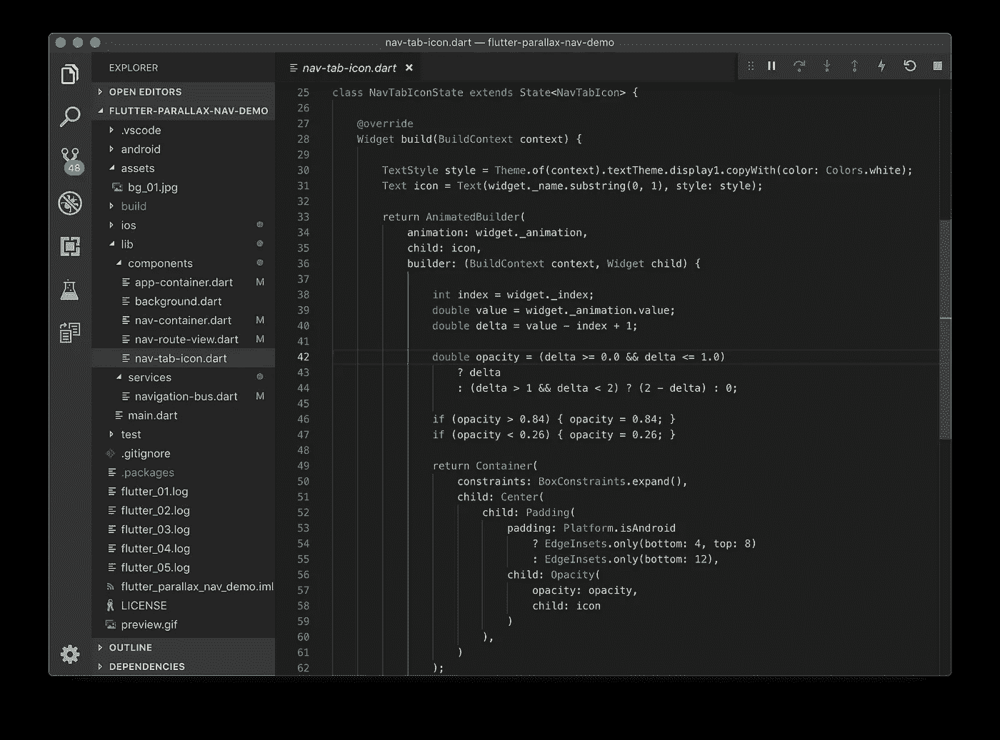

**NavTabIcon** 用于渲染图标的计算

**NavTabIcon** 类与 **NavRouteView** 类似，它根据传递给它的动画的当前状态(我们的选项卡导航器动画值)更新它的外观。实现这一点的代码可以做成一些抽象的特性，而不是在这些类之间复制，但是这确实给了一些灵活性，可以为每个类试验不同的值。

这个小部件呈现提供的**图标**，在本例中，它只是应用了文本样式的相同字母 A 到 E 中的一个。

我们再次看到平台检查有助于缓解在原生 iOS 手机组件上绘制时出现的任何问题。在这个小部件中，不透明度值被固定在 *0.26* 和 *0.84* 之间，以防止图标完全不透明或透明，使它们看起来更微妙。

## 结论

Flutter 提供了一组强大的功能，充分利用 Dart 语言来创建现代化的本地应用程序，具有令人难以置信的动画和过渡，可以无缝呈现出色的性能。

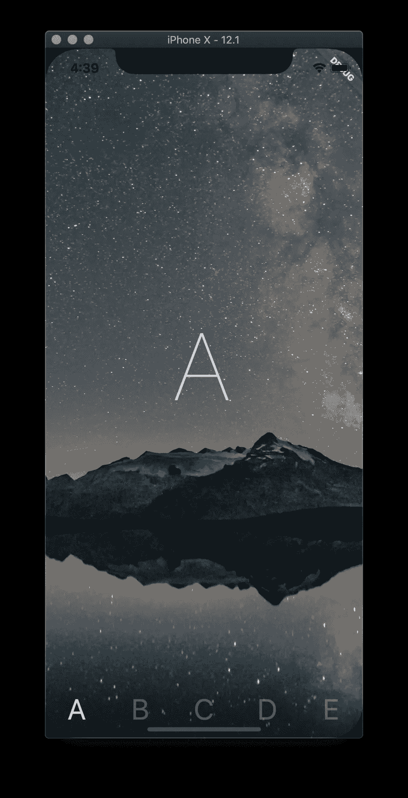

这个项目展示了 Flutter 中的一些概念，这些概念使得用干净的源文件构建高度复杂的、交互式的移动应用成为可能。

使用事件总线和一些标准组件，我们能够以一种易于维护且不太可能在您最不期望的时候无缘无故中断的方式，将原本需要另一个依赖包的东西连接起来。这些概念可以应用于你能想到的任何一种动画或控制手势，只受想象力的限制。

我希望你喜欢这篇文章，并发现它很有用。该项目的完整源代码可在[这里](https://github.com/kenreilly/flutter-parallax-nav-demo)获得，如果有任何问题或建议，请随时联系我。

感谢你的阅读，祝你好运！

> 肯尼斯·雷利( [8_bit_hacker](https://twitter.com/8_bit_hacker) )是 [LevelUP](https://lvl-up.tech/) 的 CTO