# 使用 StreamSets、Kafka、ElasticSearch 和 Kibana 创建实时航班信息数据管道

> 原文：<https://itnext.io/creating-a-real-time-flight-info-data-pipeline-with-streamsets-kafka-elasticsearch-and-kibana-dc40868c1021?source=collection_archive---------0----------------------->

在本文中，我将使用[史基浦航班 API](https://www.schiphol.nl/nl/developer-center/pagina/our-flight-api-explored/) 、[流集数据收集器](https://streamsets.com/products/sdc)、 [Apache Kafka](https://kafka.apache.org/) 、[elastic search](https://www.elastic.co)和 [Kibana](https://www.elastic.co) 来构建到达史基浦(阿姆斯特丹国际机场)航班的实时数据管道。我将向您展示使我们能够创建这个数据管道的高级架构和相应的配置。最终结果将是一个从 ElasticSearch 获取实时数据的 Kibana 仪表板。

要阅读这个“教程”,你应该对 Docker 和数据工程概念有一些基本的了解，比如转换和流。

# 高层架构

高层架构由两条数据管道组成；一条管道传输来自公共飞行 API 的数据，转换数据并将数据发布到 Kafka 主题`flight_info`:

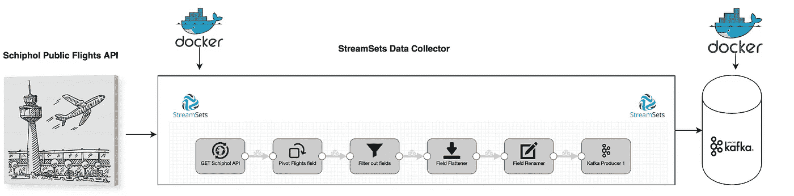

已描述的第一个管道的可视化表示

第二个管道消耗来自这个主题的数据，并将数据写入 ElasticSearch。最后，Kibana 连接到 ElasticSearch，每 5 秒钟获取一次新数据:

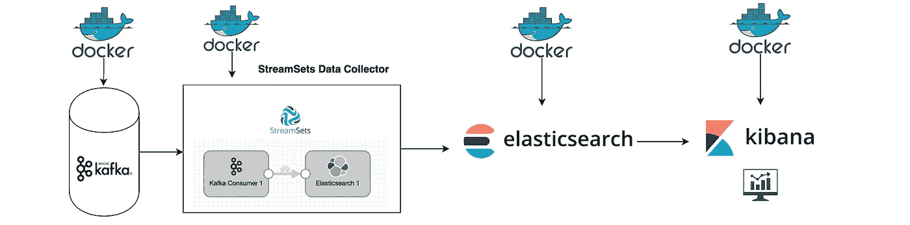

已描述的第二条管道的直观表示

在本文的剩余部分，我将简要介绍管道的每个组件及其相应的配置。

# 用 Docker-Compose 创建我们的环境

我们可以通过这个简单的 [docker-compose 文件](https://github.com/klimpie94/flight-pipeline/blob/master/docker-compose.yml)轻松构建我们将要使用的所有服务。在包含该文件的目录中执行`docker-compose up`命令，将自动创建一个本地环境，其中包含:

*   一个卡夫卡节点
*   动物园管理员
*   流集数据收集器
*   弹性搜索 6.3.2
*   基巴纳 6.3.2

> 在继续下一步之前，您必须对您的撰写文件做一个小小的更改:
> 
> KAFKA _ ADVERTISED _ HOST _ NAME:<place your="" docker="" host="" ip="" here=""></place>

您可以通过以下步骤找到您的 Docker 主机 IP:

*   在你的终端中做一个 ***ifconfig***
*   向下滚动到 ***en0:***
*   ***inet*** 后的 ip 就是你的 Docker 主机 IP。

多亏了这个[环节](https://stackoverflow.com/questions/22944631/how-to-get-the-ip-address-of-the-docker-host-from-inside-a-docker-container)

# 史基浦机场-公共飞行 API

史基浦公共航班 API 是一个 REST API，它提供了大量关于往来史基浦机场的当前和预定航班的信息。它是免费的，在[网站](https://developer.schiphol.nl/signup)注册后就可以访问。

注册后，您可以访问航班的详细信息，如目的地、航班状态、飞机类型、预定时间等。对于我们的特定用例，我们感兴趣的是进港航班和其他与此密切相关的有用信息。

# 流集数据收集器

StreamSets Data Collector (SDC)是一款开源、低延迟的接收工具，可以让您在一个易于使用的 UI 中设计复杂的任意对任意数据管道。它设计用于处理连续到达的数据(流)和批处理数据。SDC 兼容多种系统和工具，如 Spark、关系数据库、云(AWS、Azure、GCP)、Hadoop 等。

# **创建第一条管道**

如果您执行了前面的 docker-compose 命令，那么您可以通过这个[链接](http://localhost:18630)访问 SDC。默认的登录凭证是密码为`admin`的`admin`，下一步是创建一个名为‘Flight data to Kafka’的新管道。

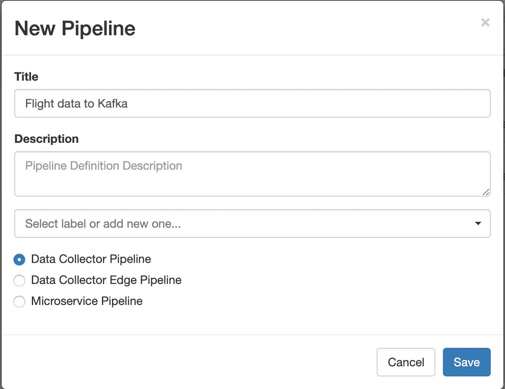

**HTTP 客户端**

点击“保存”后，您将看到一个空管道。选择 **HTTP 客户端**作为‘origin ’,并使用以下配置开始配置 HTTP 客户端 origin:

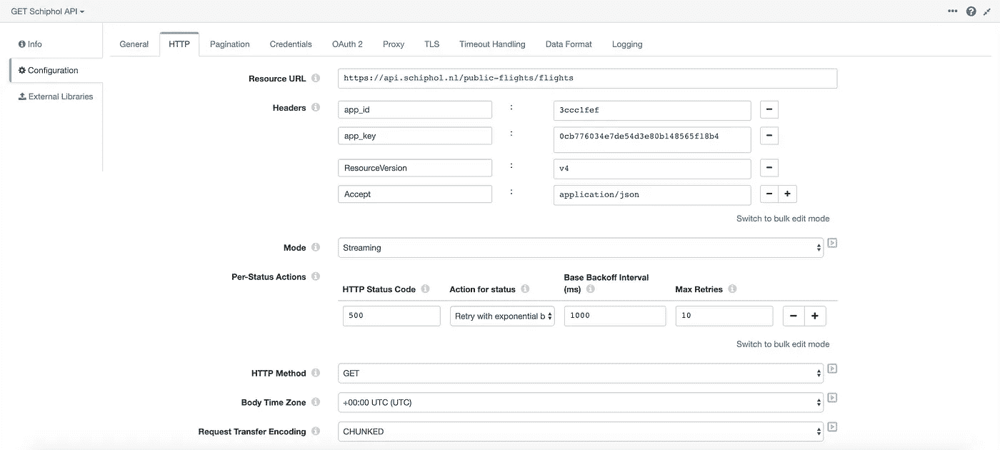

HTTP 客户端 1/2 的配置

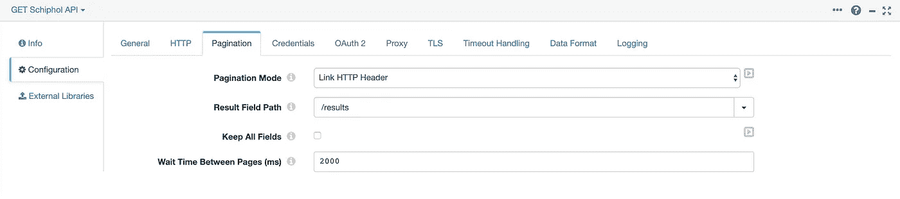

HTTP 客户端 2/2 的配置

这种配置允许我们向公共 Flight API 发出 GET 请求，该 API 将依次响应一个包含 20 个航班的大型 JSON 响应。公共 Flight API 使用分页，这基本上意味着它被设计成将响应保持在合理的大小。在响应的链接头中，返回下一个和最后一个页面的**的 URI。这样配置分页选项卡将允许我们从所有航班获取数据！**

在所有请求中，我们都需要提供`APP ID`和`APP KEY`。从版本 v4 开始，这必须在标题中完成。我们将**模式**设置为`Streaming`，并将 **HTTP 方法**设置为`GET`。所有的 HTTP 客户端参数，如`Resource URL`、`app_id`和`app_key`都由公共飞行 API 提供，在这里可以很容易地找到[。](https://developer.schiphol.nl/admin/applications)

> *我们还需要更改数据格式页签中的一个参数:*
> 
> 设置为:
> 
> **最大对象长度(字符):** 32768000

每个 JSON 响应都是一个大的 JSON 对象，包含几个不同的航班。然而，为每次飞行使用一个 JSON 对象要容易得多。因此，我们使用一个**字段透视器**将大的 JSON 对象展平为每个航班的一条消息:

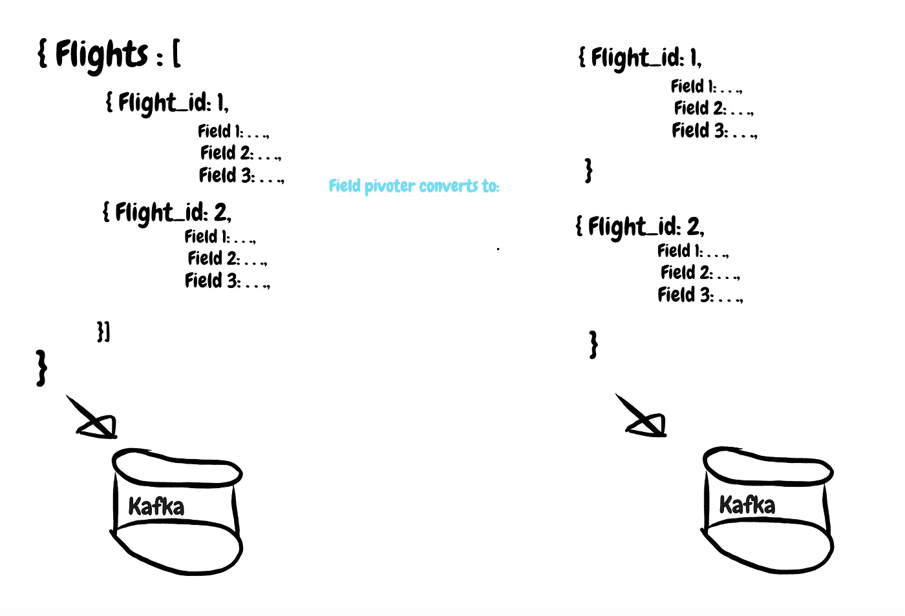

用 StreamSets 字段透视工具展平 JSON 对象

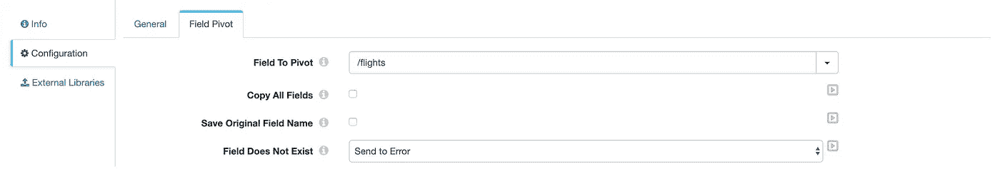

现场 Pivoter 的配置

展平 JSON 对象后，我们可以使用**字段移除器**轻松选择我们感兴趣的字段:

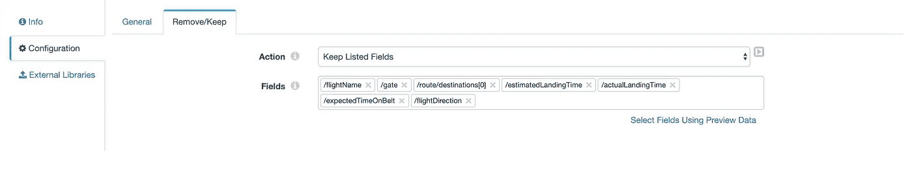

现场移除器处理器的配置

因此，我们现在只剩下我们感兴趣的字段(见:下图左侧)。然而，我们仍然背负着一个嵌套字段(`Route-destinations-0`)，为了克服这种不适，我们将应用一个**字段拼合器**。这个字段展平器以一种更理想的格式展平我们的 JSON 对象(图片的右侧展示了最终结果)。

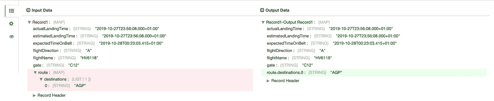

输入数据:应用字段移除器后得到的 JSON。输出数据:应用字段拼合器后的 JSON

场平仪的配置

除此之外，我们还将通过在此阶段声明一个前提条件来过滤掉所有偏离:

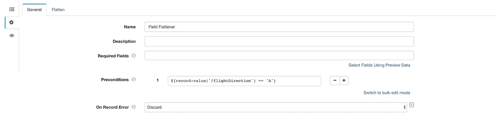

保留所有满足前提条件 FlightDirection=="A "的记录。

最后，我们还将对 JSON 对象应用一个**字段重命名器**。这个字段重命名器只是将字段`/’route.destinations.0'`转换成`/departedFrom`。

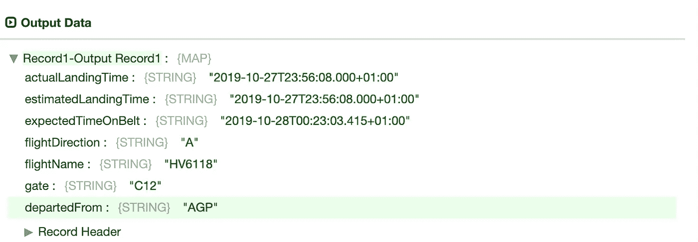

发送给 Kafka 的 JSON 对象

我们的数据现在可以写入卡夫卡；我们“飞行数据到卡夫卡”管道的最后一步。

**卡夫卡** 卡夫卡是什么？简而言之:Kafka 是一个开源软件，它提供了一个在分布式环境中存储、读取和分析流数据的框架。Kafka 的受欢迎程度尤其可以用其高吞吐量(百万/秒)、可扩展性和可靠性来解释。如果你对卡夫卡不熟悉，看看他们的[网站和文档](https://kafka.apache.org/)。

在 SDC，我们必须指定卡夫卡的制片人作为目的地。Kafka Producer 有可能不在您的目的地标签中，在这种情况下，您必须通过软件包管理器安装它，您可以通过单击屏幕顶部的“gift”图标来访问软件包管理器。

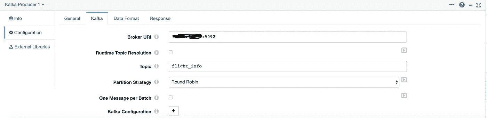

卡夫卡生产者的配置

这种配置(如上图)创建了一个名为`flight_info`的卡夫卡主题。在代理 URI 中，您必须指定< Docker 主机 IP:9092 >。就这样，我们已经完成了我们的第一个管道，它应该是这样的:

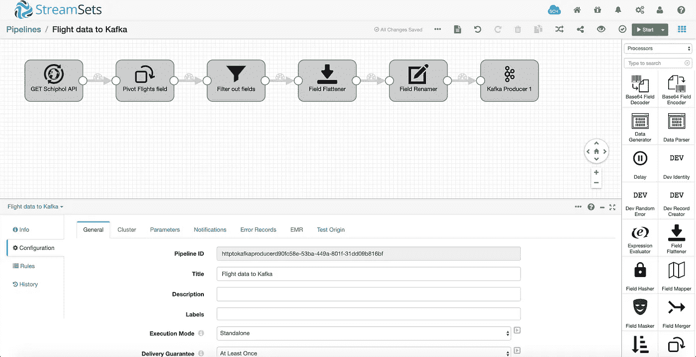

StreamSets 数据收集器中第一个管道的概述

# 创建第二条管道

第二管线仅由两个阶段组成。起点是一个从主题`flight_info`读取数据的 Kafka 消费者，这条管道的目的地是 ElasticSearch。

> 什么是 ElasticSearch？ElasticSearch 是一个分布式、开源的搜索和分析引擎，适用于所有类型的数据，包括文本、数字、地理空间、结构化和非结构化数据。ElasticSearch 以其简单的 REST APIs、分布式特性、速度和可伸缩性而闻名，它是 Elastic Stack 的核心组件，是一套用于数据摄取、丰富、存储、分析和可视化的开源工具。(来源:[链接](https://www.elastic.co/products/elasticsearch))

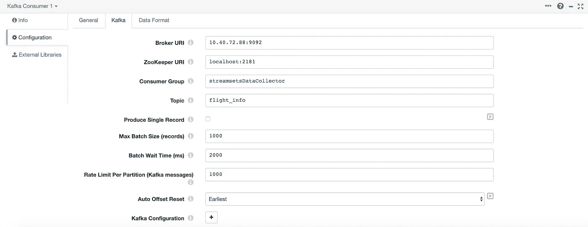

卡夫卡消费者的配置

为了使本文简单，我们将把航班数据写入一个名为`flights`的 ElasticSearch 索引(例如，一种“表”)，将映射设置为`flights`(尽管我们没有上传任何元数据到 ElasticSearch)，并将**文档 ID** 字段设置为`${record:value(‘/flightName’)}`。

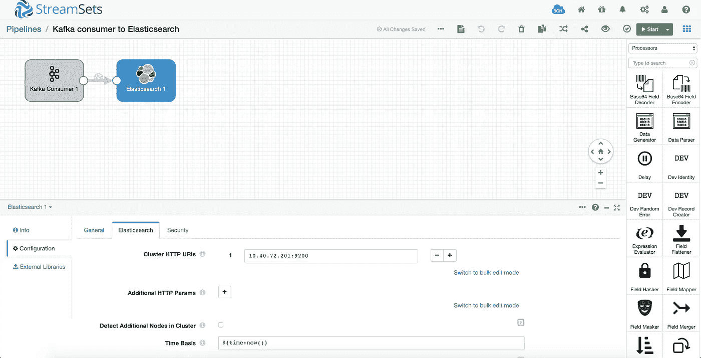

弹性搜索 1/2 的配置

弹性搜索 2/2 的配置

最后，我们选中 **Enable Upsert** ，这样记录将根据文档 ID 自动更新或插入到 ElasticSearch 中。

现在我们可以同时运行“飞往 Kafka 的航班数据”和“飞往 ElasticSearch 的 Kafka”:

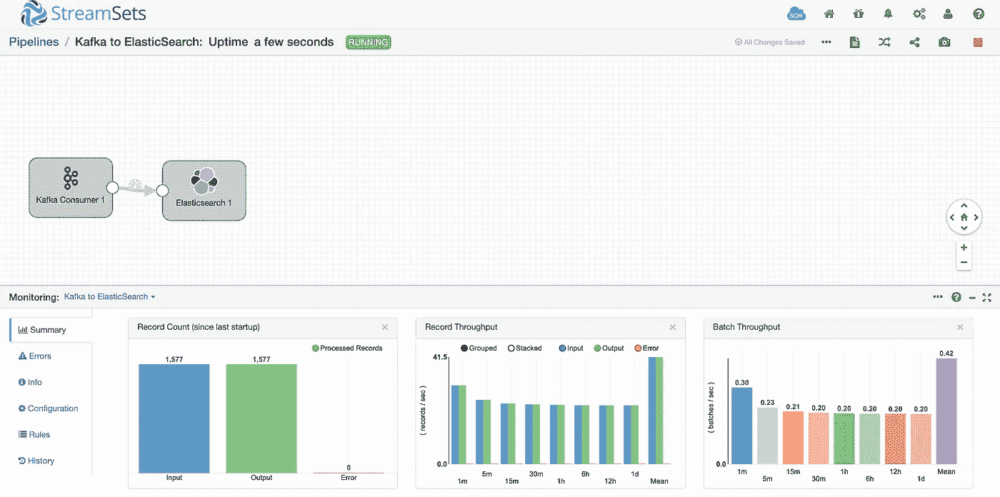

流集内部管道监控

# 基巴纳

Kibana 是一个用于弹性搜索的开源数据可视化插件。它在 Elasticsearch 集群上索引的内容之上提供可视化功能。用户可以在大量数据的基础上创建条形图、折线图和散点图，或者饼状图和地图(来源:[链接](https://www.theserverside.com/discussions/thread/80828.html)

通过这个[链接](http://localhost:5601)可以访问基巴纳。单击链接后，我们需要设置一个索引模式。搜索索引`flights`并创建索引模式，我们现在应该能够在 Kibana 中可视化并[查看](http://localhost:5601/app/kibana#/discover)我们的数据。

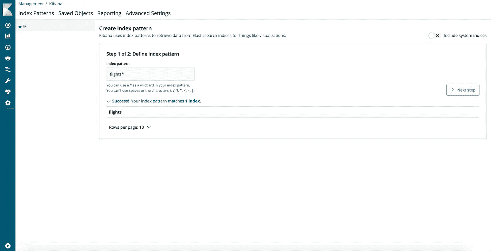

在 Kibana 中创建索引模式

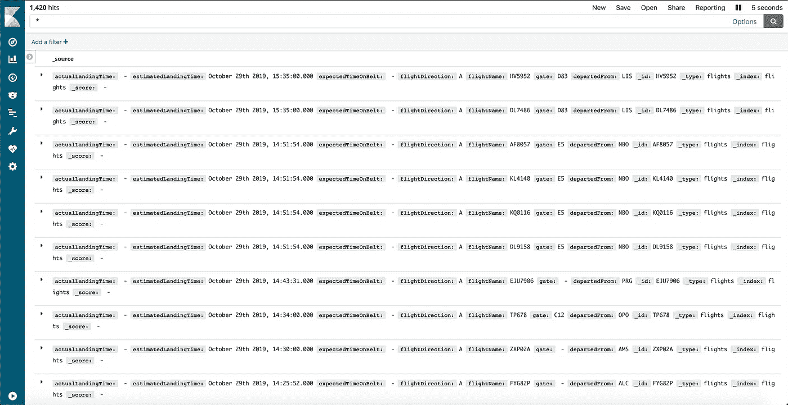

实时飞行数据显示在基巴纳

# 结束语

如您所见，由于有了 **StreamSets，创建这样一个相对复杂的管道已经被简化了几个数量级。**我期待着在我当前的项目中使用这个**强大的**工具，并且我可能会在不久的将来写一篇关于 [StreamSets Transformer](https://streamsets.com/products/transformer/) 的文章。这篇文章的 docker-compose 文件可以在[这里](https://github.com/klimpie94/flight-pipeline/blob/master/docker-compose.yml)找到。请随时向我提供任何反馈或意见。

最后，如果你有兴趣参加[数据工程训练营](https://www.linkit.nl/vacatures/data-engineering/0007529/data-engineering-apprenticeship-starts-feb-1st-2020)或者你只是好奇我是如何经历这两个‘紧张’月的，请随时联系我:)我可以肯定地推荐这是你职业生涯的一个完美开端。

# 参考

*   [流集数据采集器文档](https://streamsets.com/documentation/datacollector/latest/help/datacollector/UserGuide/Getting_Started/GettingStarted_Title.html#concept_htw_ghg_jq)
*   [史基浦机场公共航班 API](https://www.schiphol.nl/nl/developer-center/pagina/our-flight-api-explored/)