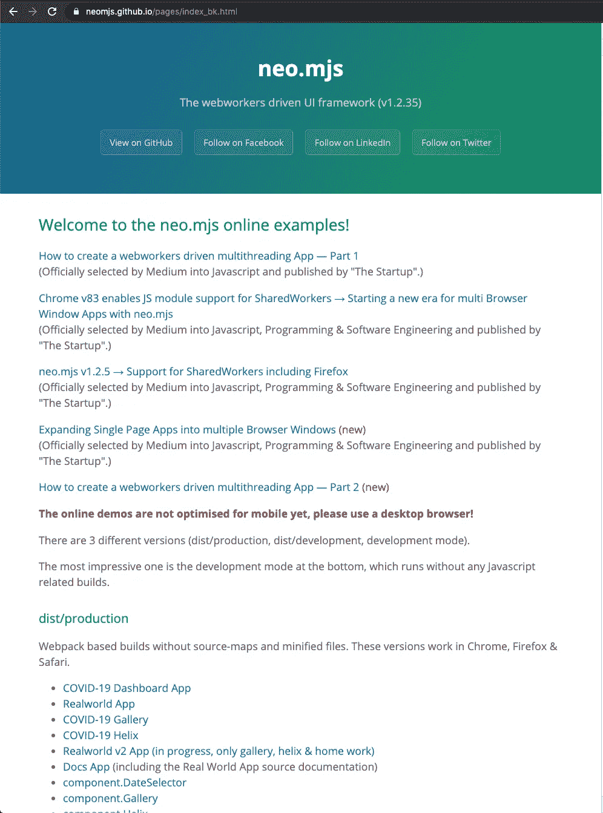
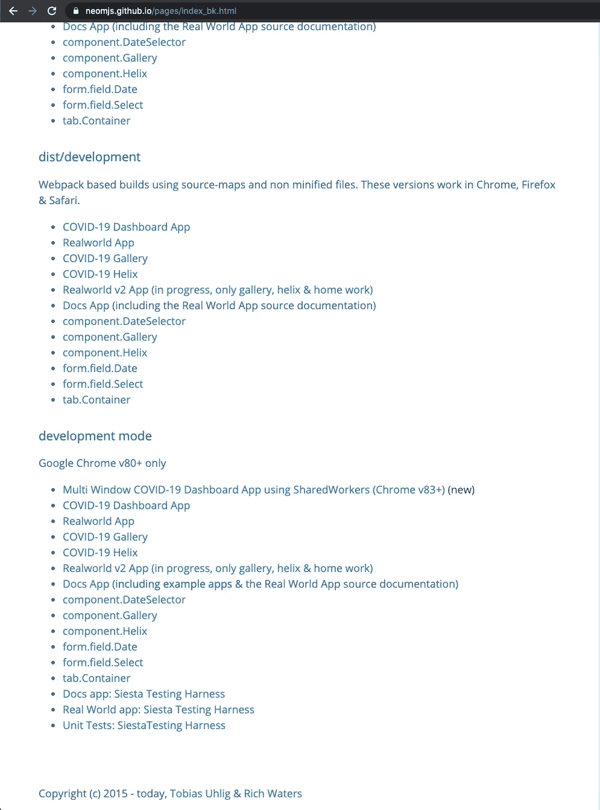
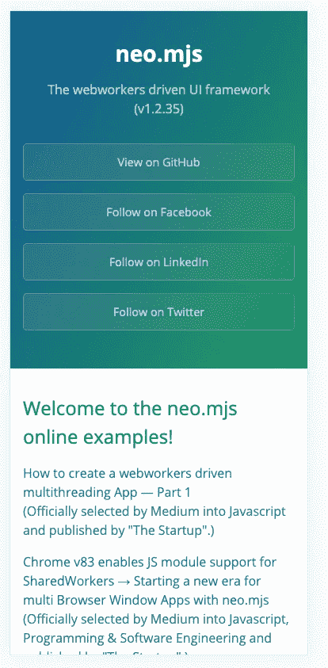
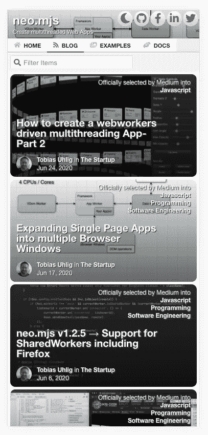
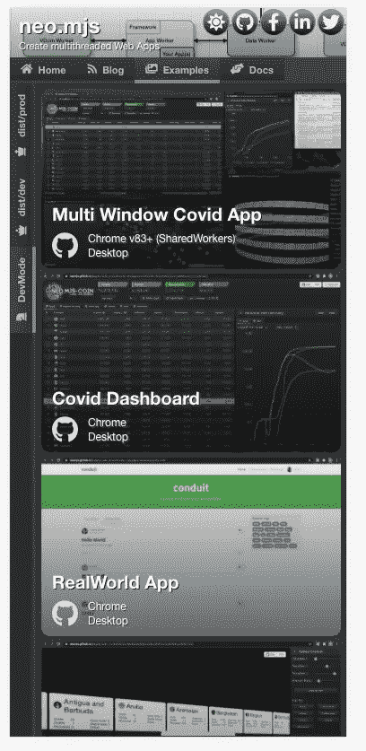
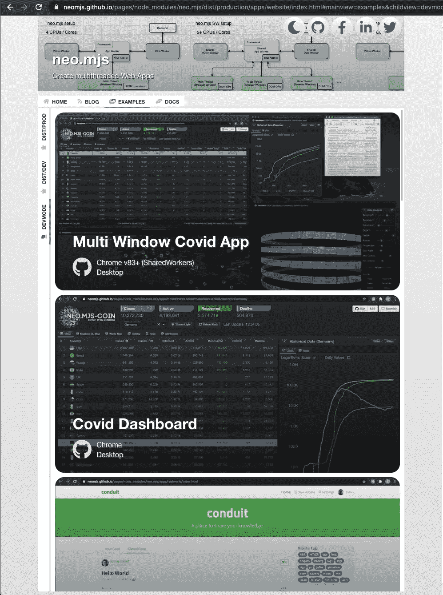
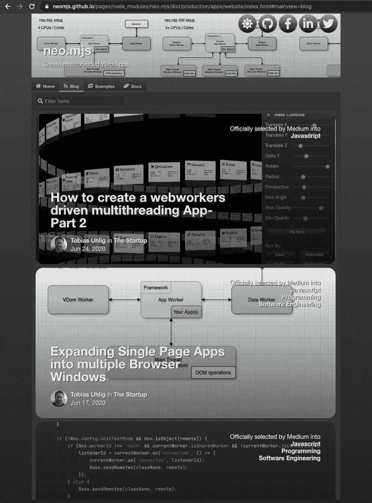
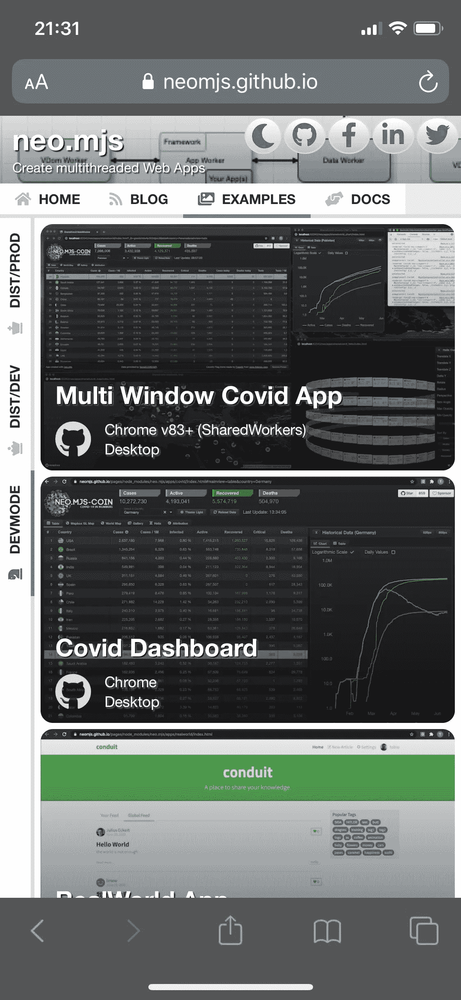

# 为桌面和移动设备创建一个响应迅速的多线程网站

> 原文：<https://itnext.io/creating-a-responsive-multithreading-website-for-desktop-mobile-8da990ae5bf3?source=collection_archive---------3----------------------->

# 内容

1.  介绍
2.  问题
3.  解决方案
4.  欢迎使用 neo . mjs 1 . 3 . 0 版
5.  这个 App 是 PWA 吗？
6.  网站源代码
7.  现场演示
8.  我们可以得到一个关于创建这个应用程序的教程吗？
9.  接下来是什么？
10.  最后的想法

# 1.介绍

请先看一下介绍视频，了解一下这个想法:

# 2.问题

您可能知道这种感觉:您创建了一个新的 GitHub 存储库，并使用默认的 GH 设计皮肤从默认的 GH Pages 实现开始。你添加越来越多的内容，突然看起来像这样:

公平地说，这只是一个网上例子集，而不是一个真正的产品网站，但你会同意，这伤害了你的眼睛。对于第一次发现 neo.mjs 项目的开发者来说帮助不大。

下一个问题是，一个完整的博客文章集合隐藏在资源库中(projects/14)。

可能最大的问题是，直到现在，neo.mjs UI 框架还没有一个针对移动设备而优化的示例应用程序。

# 3.解决方案

基于网络的应用和网站的界限越来越小。回想我为 Sencha 工作的时候，许多开发者抱怨说，网站不是用 Ext JS(或者至少是它的核心版本)创建的。

因此，对我来说，挑战是使用 neo.mjs UI 框架创建新的 neo.mjs 网站，并使其具有响应性。含义:完全适用于移动设备。如果你仔细看视频，你可能会看到有超过 25 个过渡，让它在桌面和移动分辨率之间切换时感觉更自然。

虽然我绝对不是专业设计师，但我非常喜欢这个新版本。特别是项目预览包含了很多 CSS 魔法，比如将背景渐变与背景图像混合以创建更好的对比度。

# 4.欢迎使用 neo . mjs 1 . 3 . 0 版

正如你所看到的，v1.3.0 主要集中在新的网站上，给第一次发现这个项目的新访问者一个更愉快的体验。

新的介绍文本(主页选项卡)也投入了大量精力。

正如标题中提到的:网站应用程序正在使用完整的工人设置(4 个 CPUs 核心)。框架的大部分部分和整个网站代码库都在 App worker 内部:

除此之外，这个版本大部分包含了错误修复&在框架层面上的改进。

 [## 近地天体

### neo.mjs 使您能够使用一个以上的 CPU 创建可扩展的高性能应用程序，而无需使用…

github.com](https://github.com/neomjs/neo) 

# 5.这个 App 是 PWA 吗？

差不多了。更准确地说:

在这一点上，这是我能做到的最接近渐进式 Web 应用程序的了。

两个项目丢失:

清单文件。这一点实际上没有意义，直到项目有了一个标志，因为你需要不同分辨率的应用程序图标，以防你想把应用程序保存到你的移动主屏幕上。

如前所述:我不是专业设计师，最好连试都不要试。如果你有好主意:

 [## neo.mjs 需要一个标志问题#7

### 我绝对不是设计师，所以这方面的帮助将不胜感激。我可以有人想出一个好主意…

github.com](https://github.com/neomjs/neo/issues/7) 

我们肯定可以在主库自述文件中添加一个徽标赞助商链接，以防有人创建一个会被使用的徽标。

第二个缺失的项目是一名服务人员。我们肯定可以在以后的时间点添加一个。

# 6.网站源代码

整个 neo.mjs 代码库包括所有示例和演示应用程序都是开源的(麻省理工学院许可)。新网站也不例外。如果您想创建自己的 responsive neo.mjs 应用程序，可以查看代码或将其作为起点。

源代码:

[https://github.com/neomjs/neo/tree/dev/apps/website](https://github.com/neomjs/neo/tree/dev/apps/website)

SCSS 文件:

[https://github . com/neom js/neo/tree/dev/resources/scss/src/apps/website](https://github.com/neomjs/neo/tree/dev/resources/scss/src/apps/website)

# 7.现场演示

您可以在此处找到最终版本:

[https://neom js . github . io/pages/node _ modules/neo . mjs/dist/production/apps/website/index . html # main view = blog](https://neomjs.github.io/pages/node_modules/neo.mjs/dist/production/apps/website/index.html#mainview=blog)

您也可以在 dist/development 或 real 开发模式下运行它。链接位于匹配示例选项卡内。

# 8.我们可以得到一个关于创建这个应用程序的教程吗？

创建深入的教程需要大量的时间。如果相关的票至少有 20 张赞成票，我会很乐意去做。

[https://github.com/neomjs/neo/issues/915](https://github.com/neomjs/neo/issues/915)

听起来公平吗？

# 9.接下来是什么？

我将很快为 1.4 版本创建一个新项目。正如在新的介绍文本中提到的:你可以影响当前的路线图。只需向现有票证添加评论或根据需要创建新票证。

我正在考虑应用程序对话框或缓冲网格(表格视图)中的拖放实现。

# 10.最后的想法

我希望在这一点上，你对 neo.mjs 的范围以及未来的潜力有了一个概念。

neo.mjs 是一个开源项目(整个代码库以及所有示例都使用 MIT 许可证)。

含义:可以免费使用。

它会一直这样。

然而，这个项目需要更多的贡献者和赞助者。

很多(！)路线图上还有更多项目和想法。

如果你想为一个可爱的开源项目做贡献，我会非常感激。

万一这个项目对你的公司有或将会有商业价值:注册成为赞助商可以让我投入更多的时间，从而加快新事物的交付时间。

 [## GitHub 赞助商上的赞助商@tobiu

### 成为 tobiu 的赞助商 Tobias 正在创建 neo.mjs 1 赞助商正在资助 tobiu 的下一个目标@tobiu 的目标是赚…

github.com](https://github.com/sponsors/tobiu) 

问候&快乐编码，
托拜厄斯