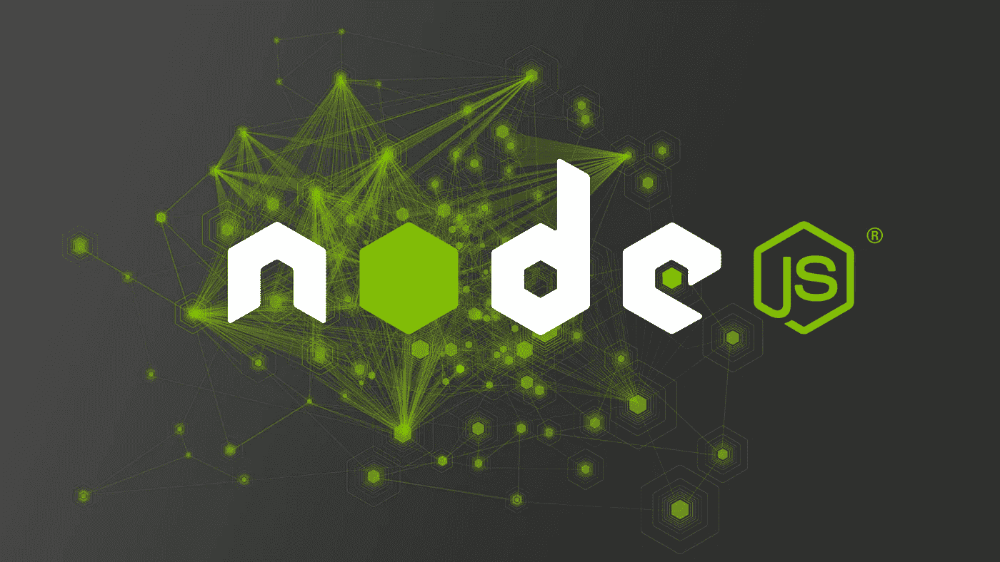
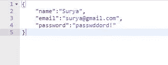

# 使用 Node.js 创建 RESTful API

> 原文：<https://itnext.io/creating-a-restful-api-using-node-js-256c22c47e0b?source=collection_archive---------0----------------------->



[*点击这里在 LinkedIn* 上分享这篇文章](https://www.linkedin.com/cws/share?url=https%3A%2F%2Fitnext.io%2Fcreating-a-restful-api-using-node-js-256c22c47e0b)

本文面向初级开发人员和任何对在应用程序中使用 node.js 感兴趣的人。在深入研究之前，您应该对 JavaScript 和一些 ES6 特性有基本的了解。您还应该已经在本地计算机上安装了 node.js。

**准备好一些代码了吗？**

不，只是开玩笑。我们需要设置和安装应用程序正常工作所需的依赖项和节点模块。由于我们将创建一个 API，显然需要一个数据库。我们将使用 [MongoDB](https://www.mongodb.com/) ，一个 [NOSQL 数据库](https://en.wikipedia.org/wiki/NoSQL)。这是满足我们需求的最佳选择，因为我们不需要关系数据库。为了简单起见，我们不在本地安装和运行它，而是在 [mLab](https://mlab.com) 上连接一个沙盒数据库。

但是，请记住，mLab 就像一个玩具，我建议使用 [MongoDB Atlas](https://www.mongodb.com/cloud/atlas) 在生产环境中托管您的数据库。这是官方的 MongoDB 云托管服务。

初始化 npm 并安装以下模块:

```
npm init
npm install express --save
npm install mongoose --save
npm install body-parser --save
```

我们将在这个应用程序中使用 [Express](http://expressjs.com/) ，因为它是当今大多数节点应用程序的事实标准。Mongoose 是一个对象关系映射器。准确的说是 MongoDB 使用的官方 ORM。为了分解它，我们使用 ORM 来简化应用程序和数据库之间的数据传输。它映射我们应用程序中的数据，以支持数据库设置的一组严格规则。body-parser 模块只是一个中间件，我们用它来解析通过 HTTP 请求发送的数据。

**设置项目**

我们可以使用你选择的任何文本编辑器。我推荐用 visual studio(代码)。首先，我们应该在文本编辑器中创建一个带有 js 扩展名的新文件，比如(server.js)。创建文件后，下一步是在该文件中编写以下代码:

```
const express = require('express');
const {mongoose}= require('mongoose');
const bodyParser = require('body-parser');
const app = express();
const port =process.env.PORT||3000;
app.use(bodyParser.json());
module.exports = app;
```

上面的代码为项目设置了添加快速路线的功能。这些用来写不同的 URL 到你的 API。

**设置几个其他文件**

```
//mongoose.js
var mongoose = require('mongoose');
mongoose.Promise = global.Promise;
mongoose.connect(process.env.MONGODB_URI);
module.exports = {mongoose};
```

这个文件允许我们连接我们的 mLab mongodb 客户端。

**设置猫鼬模式**

我们将创建一个模式，给数据库中的每个用户一个特定的外观。用户将有一个名字，一个电子邮件和一个密码。通过指定`mongoose.model('User', UserSchema)`，您将模式的布局绑定到名为`'User'`的模型。这是您将用来访问数据库中的数据的内容，这也是您将它导出以在程序的其他部分使用的原因。

```
// User.js
var mongoose = require('mongoose');  
var UserSchema = new mongoose.Schema({  
  name: String,
  email: String,
  password: String
});
mongoose.model('User', UserSchema);module.exports = mongoose.model('User');
```

**添加各种路线**

路由不过是不同的 URL，用户必须点击它们才能执行不同的操作(获取、发布、上传、删除)。

使用它，我们可以为我们的 API 创建各种路由路径，它将包含控制数据流入和流出数据库的操作。让我们继续为 POST 请求创建一个简单的路由:

```
*app.post('/users/signup',(req,res)=>{
var body=req.body;
var user=new User(body);
user.save().then(()=>{
res.status(200).send();})
.catch((e)=>{
res.send(400).send(e);});});*
```

app 对象有一个接受两个参数的`.post` 方法。第一个是将被链接到一个函数的路由。这个函数是第二个参数。它需要另外两个参数，分别代表对服务器的请求和来自服务器的响应。在函数内部，您将使用上面要求的用户模型。用户对象包含要插入数据库的值。你看，它们的结构就像你在上面创建的模式一样。在它被创建之后，回调函数用另外两个参数调用，一个**错误**值和一个**成功**值。您将检查在创建新用户的过程中是否有错误，并做出相应的响应，或者如果一切正常，则使用新创建的数据进行响应

Post 请求应该包含以下 JSON 数据:



要将这些数据存储到 MongoDB 中，我们必须:创建一个用户模型的实例，然后我们必须用该实例调用 mongoose 方法 save()，即我们在上面的代码中所做的 user.save()。我们可以挂接一个 then 调用和一个 catch 调用来添加所需的功能。在我们的示例中，我们发送状态代码 200 作为对成功案例的响应。对于失败案例，我们发送一个 400 状态代码。

让我们创建一个 get 请求来返回这个数据库中的所有用户:

```
app.get('/users/data',(req,res)=>{
Sale.find().then((data)=>{
res.status(200).send(JSON.stringify(data,undefined,2))})
.catch((e)=>{
res.status(400).send(e);});});
```

app 对象还有一个`.get`方法，它也接受两个参数。在这个函数中，你现在调用用户模型上的`find()`方法，它也有两个参数。Find 是一种从数据库中返回值的方法。它的第一个参数是一个对象，定义了返回值必须满足的要求。因为在本例中对象是空的，所以将返回数据库中的所有用户。

# 所以你认为就这样了？

你只是刮到了冰山的一角。但是，现在已经足够了。不要让 Node 吓到你。这只是普通的 JavaScript。以与您在浏览器中编写的代码相同的方式查看它。分解一下，它只是一堆事件侦听器和处理程序。

如果您对 Node 或 JavaScript 有任何疑问，请随时在 insta gram:[Suryatejaadluri](https://www.instagram.com/suryateja_adluri/)和脸书: [suryateja.adluri](https://m.facebook.com/suryateja.adluri?ref=bookmarks) 与我联系

*你觉得这个教程会对某个人有帮助吗？不要犹豫分享。如果你喜欢它，点击下面的* ***拍手*** *，这样其他人会在媒体上看到它。*