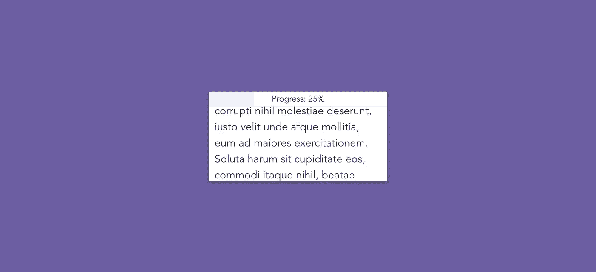
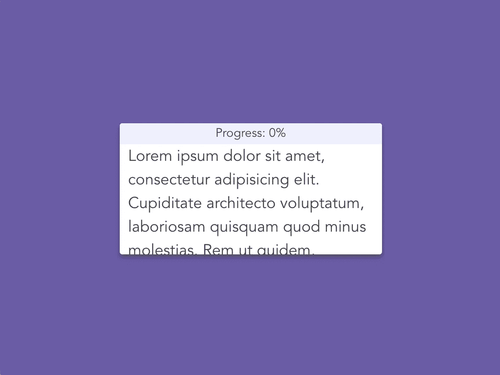
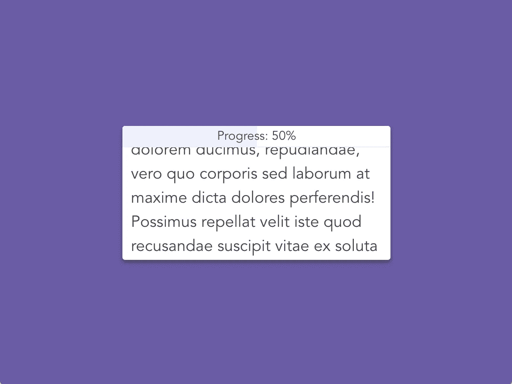

# 在 Vue 中创建基于滚动的进度条

> 原文：<https://itnext.io/creating-a-scroll-based-progress-bar-in-vue-42979cd34773?source=collection_archive---------8----------------------->



有时候，我们需要一种方式来向用户展示他们从一篇文章中读到了多少。最好的方法是显示一个进度条，以百分比显示。

要做到这一点，我们必须知道他们已经滚动了多少文章(或任何东西)，然后用这个来计算完成的百分比。我们还需要一个组件向用户显示该百分比。

如果你对学习如何构建这个感兴趣，可以在 [CodePen](https://codepen.io/tahazsh/pen/ZwxeGx) 上查看下面的演示，然后继续阅读，看看如何构建它。

# 步骤 1:创建 App.vue

我们将使用 [Vue CLI 3 的即时原型](https://medium.com/@Taha_Shashtari/test-out-your-vue-component-ideas-in-no-time-with-instant-prototyping-5fdf22688c08)来运行这个项目。因此创建`App.vue`，并将以下内容放入`<template>`部分:

```
<template>
  <div id="app">
    <div class="card">
      <progress-bar :value="progress"/>
      <div class="text-section">
        Lorem ipsum dolor sit amet, consectetur adipisicing elit. Cupiditate architecto voluptatum, laboriosam quisquam quod minus molestias. Rem ut quidem, corrupti nihil molestiae deserunt, iusto velit unde atque mollitia, eum ad maiores exercitationem. Soluta harum sit cupiditate eos, commodi itaque nihil, beatae dolorem ducimus, repudiandae, vero quo corporis sed laborum at maxime dicta dolores perferendis! Possimus repellat velit iste quod recusandae suscipit vitae ex soluta nostrum animi saepe eius itaque, voluptas, sapiente minima quo culpa explicabo necessitatibus distinctio. Veritatis amet tempora, consectetur molestias optio eveniet laudantium, tenetur aspernatur nobis ratione sit hic in impedit quod deserunt recusandae atque, ipsam molestiae sequi!
      </div>
    </div>
  </div>
</template>
```

我们在这里显示一个带有一些文本的卡片元素。我们还在它上面显示进度条组件(我们还没有创建它)。

在`<script>`部分，输入以下内容:

```
<script>
**import** ProgressBar **from** './ProgressBar'

**export** **default** {
  components: { ProgressBar },
  data () {
    **return** {
      progress: 0
    }
  }
}
</script>
```

我们将使用`progress`数据属性来存储到目前为止用户已经滚动了多少。它将来自`0-1`。

现在我们转到`<style>`部分:

```
<**style**>
* {
  box-sizing: border-box;
}

**body** {
  margin: 0;
  padding: 1px 0 0;
  width: 100vw;
  height: 100vh;
  background: #6B5CA5;
}

**html** {
  padding: 0;
  margin: 0;
}

.card {
  border-radius: 3px;
  font-family: 'Avenir', Helvetica, Arial, sans-serif;
  -webkit-font-smoothing: antialiased;
  -moz-osx-font-smoothing: grayscale;
  line-height: 1.5;
  font-size: 18px;
  color: #444;
  width: 300px;
  margin: 10px auto;
  height: 150px;
  margin-top: 10px;
  display: flex;
  flex-direction: column;
  background: #FFFFFF;
  box-shadow: 0 3px 6px rgba(0,0,0,0.16), 0 3px 6px rgba(0,0,0,0.23);
}

.text-section {
  height: 100%;
  max-height: 100%;
  padding: 0 10px 10px;
  overflow: scroll;
  -webkit-overflow-scrolling: touch;
}
</**style**>
```

# 步骤 2:创建 ProgressBar.vue

创建`ProgressBar.vue`并将其放入`<template>`:

```
<template>
  <div class="progress-bar">
    <div class="filled-bar"></div>
    <span class="percentage-text">
      Progress: {{ percentageText }}
    </span>
  </div>
</template>
```

该组件由三部分组成:

*   `.progress-bar`是进度条的容器——我们在这里指定进度条的宽度和高度。
*   `.filled-bar`将具有与其容器相同的宽度和高度，但是它将被填充一种背景颜色。
*   `.percentage-text`显示当前滚动百分比。

`.filled-bar`和`.percentage-text`将*绝对定位*。而且，显然，`.percentage-text`应该有更高的`z-index`才能出现在`.filled-bar`之上。

如上所述，`.filled-bar`将与其容器具有相同的宽度。这意味着我们将使用它的位置来反映当前的滚动百分比。因此，当用户在最顶端时(还没有滚动)，我们将把填充栏完全移出进度条容器(从左侧)。当用户向下滚动时，我们将向右移动填充栏，逐渐进入进度条容器。

但是当然，用户不应该看到填充栏的外部。所以我们要给容器(`.progress-bar`)加上`overflow: hidden`。

现在，让我们编写`<script>`部分:

```
<script>
**export** **default** {
  props: {
    value: {
      type: Number,
      default: 0
    }
  },

  computed: {
    percentageText () {
      **return** `${Math.round(**this**.value * 100)}%`
    }
  }
}
</script>
```

注意我们是如何通过`value` prop 接受当前进度值的。

正如您在 computed 部分看到的，我们使用了那个`value`来获得格式化文本形式的百分比值。所以，举个例子，如果`value`是`0.05`，它应该输出`5%`。

接下来，让我们添加样式:

```
<**style** **scoped**>
.progress-bar {
  position: relative;
  height: 30px;
  width: 100%;
  border-bottom: 1px solid #f0f0f0;
  display: flex;
  justify-content: center;
  align-items: center;
  overflow: hidden;
  border-radius: 3px 3px 0 0;
}

.percentage-text {
  position: absolute;
  top: 50%;
  left: 50%;
  z-index: 2;
  font-size: 14px;
  transform: translate3d(-50%, -50%, 0);
}

.filled-bar {
  position: absolute;
  top: 0;
  left: 0;
  z-index: 2;
  height: 100%;
  width: 100%;
  background: #eef0ff;
}
</**style**>
```

现在，如果您在浏览器中查看您的工作，您会看到类似这样的内容:



我们还有两件事要做:

1.  根据当前进度值更新填充栏位置(`value` prop)。
2.  计算用户滚动时的滚动百分比。我们将通过`value` prop 把这个值传递给进度条。

# 步骤 3:更新填充栏的位置

我们将使用`transform: translate3d(x, y, z)` CSS 属性来改变填充栏的位置。

这里需要注意两件事。首先，我们将只需要更新`x`值并保持另外两个值为 0。其次，出于性能原因，我们将使用`translate3d`而不是`translateX`——让 GPU 来处理。

现在当`x`为 0 时，填充栏会出现在原来的位置(用户会看到进度被完全填充)。要将其完全移动到左侧(容器外部)，我们应该将其设置为`-100%`。这意味着，`x`将来自`0%-100%`。

我们可以在填充栏上使用`transform`,只需将它绑定到它的样式属性:

```
<div
  class="filled-bar"
  :style="{ transform: `translate3d(-${(1 - value) * 100}%, 0, 0)` }"
></div>
```

您可以通过更改`value`属性的默认值来测试进度条是否正常工作。试着设置成`0.5`，应该会看到这样的:



# 步骤 4:计算当前滚动百分比

为了得到这个值，我们必须首先监听`.text-section`上的`@scroll`事件，然后用当前滚动位置(以像素为单位)除以文本部分的全高。

因此，在`App.vue`中，将`@scroll`和`ref`添加到`.text-section`中，就像这样:

```
<div
  class="text-section"
  ref="text"
  @scroll="onScroll"
>
```

我们需要添加`ref`来访问元素的滚动位置和高度值。

接下来，实现`onScroll`方法:

```
methods: {
  onScroll () {
    **const** progress = **this**.$refs.text.scrollTop / (**this**.$refs.text.scrollHeight - **this**.$refs.text.clientHeight)
    **if** (progress > 1) {
      **this**.progress = 1
    } **else** **if** (progress < 0) {
      **this**.progress = 0
    } **else** {
      **this**.progress = progress
    }
  }
}
```

因为手机上的动量滚动，我们确保进度值不高于`1`或低于`0`——否则，进度条看起来会坏掉。

所以，当用户滚动时，我们更新`App.vue`中的`progress`值；然后，将它传递给进度条组件(通过`value`)，进度条组件将更新填充的进度条位置，并重新生成格式化的百分比文本。