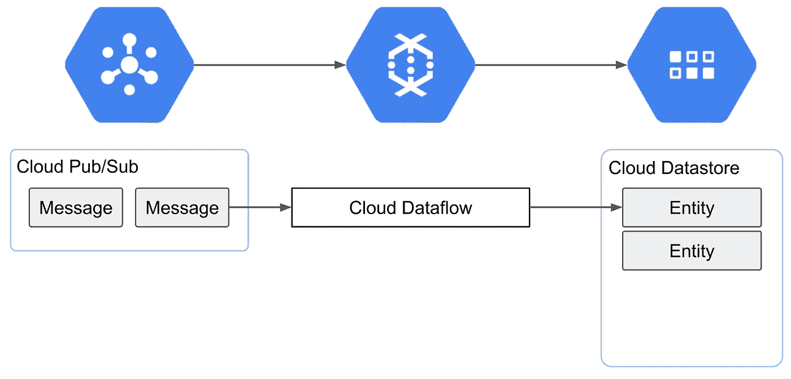
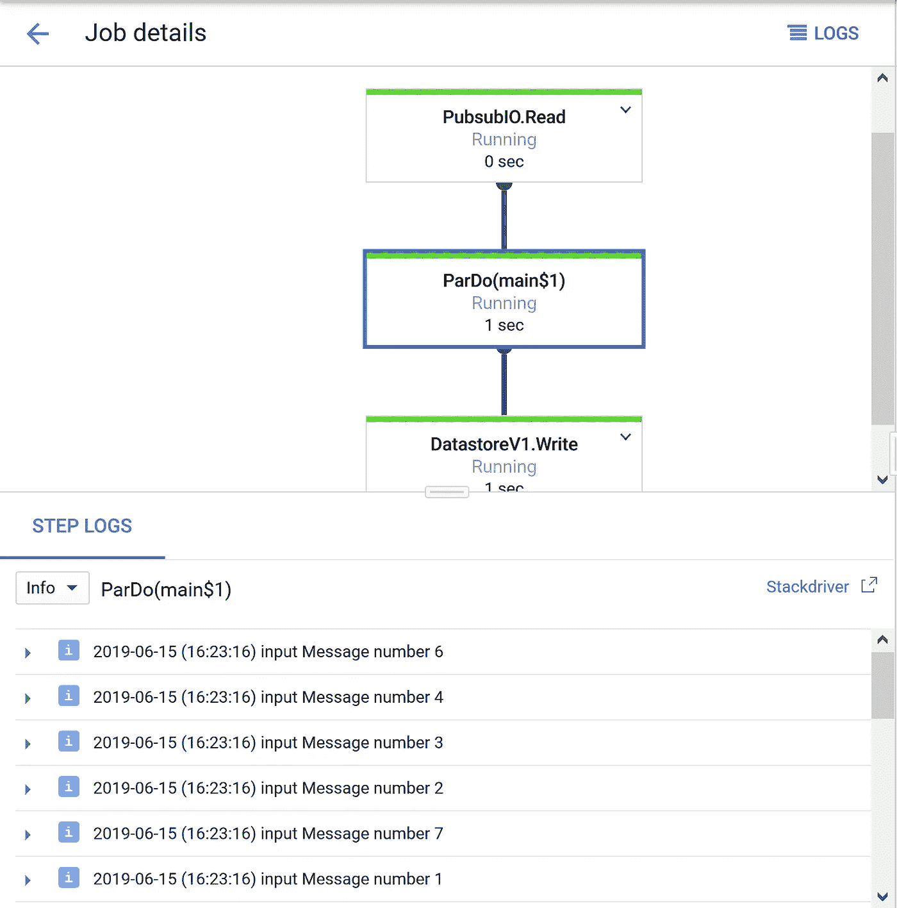

# 用 Kotlin 创建简单的云数据流

> 原文：<https://itnext.io/creating-a-simple-cloud-dataflow-with-kotlin-cc9f76f47bc5?source=collection_archive---------3----------------------->


# 介绍

长期以来，MapReduce 一直被用来处理大数据。不久前，谷歌推出了云数据流，这使得批处理和流处理的新模式成为可能。在本文中，我将展示一个使用 Apache Beam、云发布/订阅和云数据存储的最小项目。

# 为什么是科特林？

虽然来自 Google 的[文档仍然是 Java 和 Maven，但是 Apache Beam 项目最近得到了](https://cloud.google.com/dataflow/docs/quickstarts/quickstart-java-maven) [Kotlin 示例](https://beam.apache.org/blog/2019/04/25/beam-kotlin.html)。我认为用 Kotlin 编写射束管道会使它们更加易读、直观和熟悉:)

# 我们创造了什么？

让我们创建一个简单的管道，它订阅一个发布/订阅主题，并为每条消息创建数据存储实体。可能这是数据流的一个最原始的用例。



# 创建项目

首先，创建一个 gradle 项目。您可以通过传递`type`参数将其指定为 Kotlin 项目。

```
mkdir <your-proj-dir>
cd <your-proj-dir>
gradle init --type kotlin-application
```

# 设置梯度构建

因为我们在这个项目中使用 Apache Beam，所以将这些行放在`build.gradle`文件的`dependencies`块中。

```
 implementation 'org.slf4j:slf4j-simple:1.7.26'
    implementation 'org.apache.beam:beam-sdks-java-core:2.13.0'
    implementation 'org.apache.beam:beam-runners-direct-java:2.13.0'
    implementation 'org.apache.beam:beam-runners-google-cloud-dataflow-java:2.13.0'
```

另外，在`build.gradle`的顶层添加这个块。当我们运行这个程序时，这对于传递命令行参数是必要的。

```
run {
    if (project.hasProperty('args')) {
        args project.args.split('\\s+')
    }
}
```

感谢[这篇文章](https://i101330.hatenablog.com/entry/2018/04/25/124127)！

# 配置您的环境

准备一个具有发布/订阅、数据存储和数据流范围的服务帐户。
从谷歌云控制台获取账户的凭证`json`文件，并将其放在你的 PC 上的某个地方。

在 Linux 或 Mac 上，

```
export GOOGLE_APPLICATION_CREDENTIALS=<full-path-to-your-json>
```

在 Windows 上，在你的外壳上使用`set`之类的东西。

注意:Apache Beam 有`GcpOptions#setGcpCredential`但是对我没用。

# 制作管道代码

打开`src/main/kotlin/<your-proj-name>/App.kt`，用下面的代码替换它的内容。请随意更改包名和其他常量。

```
package org.yourprojimport org.apache.beam.sdk.Pipeline
import org.apache.beam.sdk.io.gcp.pubsub.PubsubIO
import org.apache.beam.sdk.io.gcp.pubsub.PubsubOptions
import org.apache.beam.sdk.io.gcp.datastore.DatastoreIO
import org.apache.beam.sdk.options.PipelineOptionsFactory
import org.apache.beam.sdk.transforms.*
import org.apache.beam.sdk.values.PCollectionimport com.google.datastore.v1.client.DatastoreHelper.makeKey
import com.google.datastore.v1.client.DatastoreHelper.makeValue
import com.google.datastore.v1.Entity
import org.slf4j.LoggerFactory;interface MyOptions : PubsubOptions {
    var topic: String
}fun main(args: Array<String>) {
    val LOGGER = LoggerFactory.getLogger("org.yourproj.AppKt") val options = PipelineOptionsFactory
        .fromArgs(*args)
        .withValidation()
        .`as`(MyOptions::class.java) val p = Pipeline.create(options)
    p.apply<PCollection<String>>(PubsubIO.readStrings().fromTopic(options.topic))
        .apply(ParDo.of(object: DoFn<String, Entity>() {
            [@DoFn](http://twitter.com/DoFn).ProcessElement
            fun processElement([@DoFn](http://twitter.com/DoFn).Element input: String, output: DoFn.OutputReceiver<Entity>) {
                LOGGER.info("input " + input) val key = String.format("%s-%s", "data", input.replace(' ', '-').toLowerCase())

                val entityBuilder = Entity.newBuilder()
                entityBuilder.setKey(makeKey("beam-test", key).build())
                entityBuilder.putProperties("message", makeValue(input).build())output.output(entityBuilder.build())
            }
        }))
         .apply(DatastoreIO.v1().write().withProjectId(options.project)) p.run()
}
```

注意，像项目 id 和主题名称这样的 GCP 参数是通过继承的 options 对象通过实参传递的。

现在，您可以通过运行此命令来构建您的项目。

```
gradle build
```

如果构建投诉，删除`AppTest.kt`中的单元测试。

# 在本地运行

现在，您可以使用这个命令在本地运行管道。

```
gradle run -Pargs="--runner=DirectRunner --project=<your-project-name> --topic=<your-pubsub-topic-name>”
```

如果成功建立了发布/订阅连接，您将在控制台上看到这样的日志。

```
[main] WARN org.apache.beam.sdk.io.gcp.pubsub.PubsubUnboundedSource - Created subscription projects/<your-project>/subscriptions/<random-subscription> to topic projects/<your-project>/topics/<your-topic>. Note this subscription WILL NOT be deleted when the pipeline terminates
```

# 测试

我们在这里不使用发布/订阅仿真器，但是来自[的`publisher.py`这个文档](https://cloud.google.com/pubsub/docs/emulator)对于测试是有用的。打开一个新的 shell，设置环境变量并运行此命令来发布关于某个主题的一些消息。

```
python publisher.py PUBSUB_PROJECT_ID publish TOPIC_ID
```

如果成功，您将看到每条消息的日志行。此外，检查云数据存储中的实体。

# 在云数据流上部署它

只需将命令行参数改为`--runner=DataflowRunner --tempLocation=gs://<your-bucket>`，就可以在云数据流上部署管道。

一旦您的管道成功部署，它就会出现在数据流控制台上，并看到它正在运行。



注意:要在数据流上部署，您可能需要启用一些 API，并为服务帐户分配额外的作用域。仔细阅读错误信息。

# 结论

处理大数据一直是一项艰巨的工作，但云发布/订阅和数据流允许我们通过结合多种存储和管道来采取循序渐进的方法。因为管道很容易开发，所以我们可以专注于模型和架构设计。