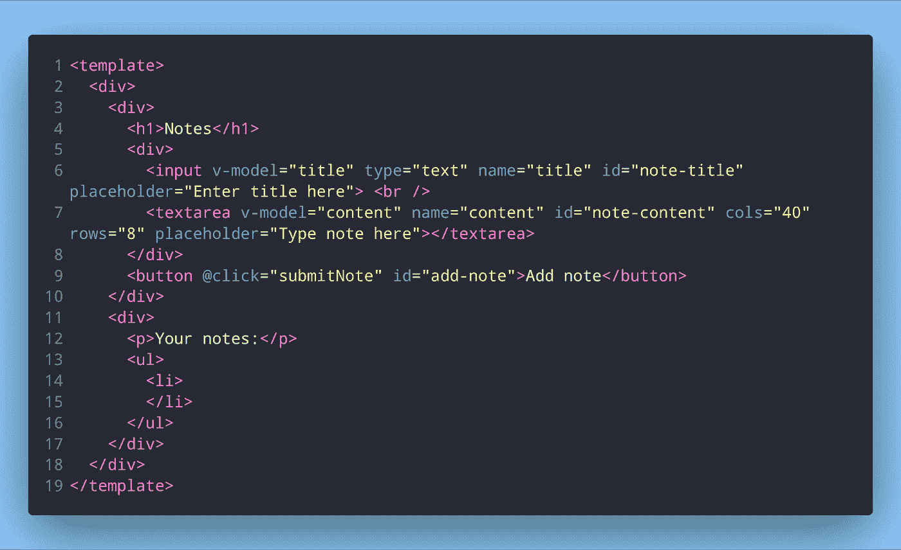
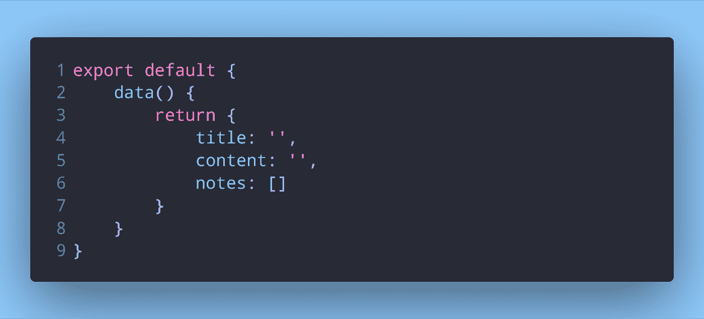
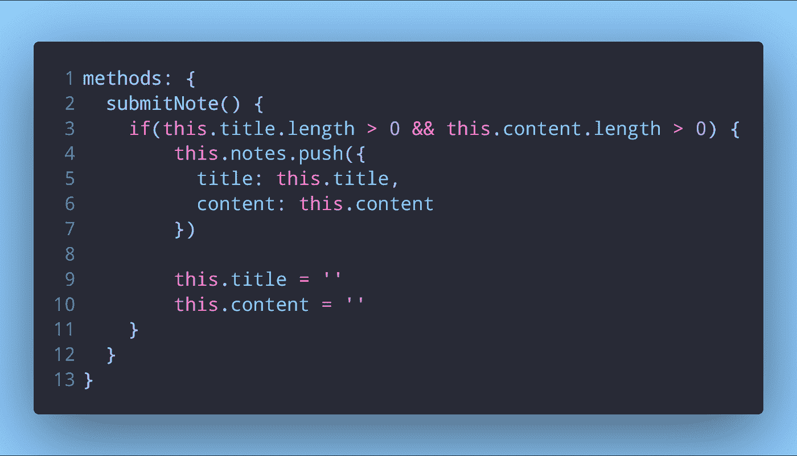

# 使用 Vue 和 Firestore 创建简单的 Notes web 应用程序

> 原文：<https://itnext.io/creating-a-simple-notes-web-app-with-vue-and-firestore-c323087772ac?source=collection_archive---------3----------------------->

# 短片系列介绍

这是一个关于使用 Vuejs 创建笔记应用程序的多部分教程。它使用 Firestore 作为数据库来存储所有的笔记。本教程分为以下几个部分:

1.  开始一个 Vue 项目并设置它(本文)
2.  创建 Firestore 数据库
3.  将 Firestore 数据库连接到 Vue 应用程序，并向数据库发送注释
4.  从数据库中获取笔记并显示排序的笔记
5.  向应用程序添加删除注释功能

# 设置项目

启动一个新的 Vue 项目，并用以下代码替换`App.vue`模板中的代码:

如果你之前没用过 Vue v3.x 创建项目，参考[我之前的文章](https://dev.to/napoleon039/how-to-create-new-projects-with-the-vue-cli-3pgo)。

在这个`App.vue`组件中，我们有一个注释标题的输入和一个注释内容/主体的文本区域。有一个按钮可以将我们的笔记添加到数据库中。

下面是一个无序列表，显示我们所有的笔记。每个笔记旁边还会有一个按钮，允许我们删除特定的笔记。

让我们创建数据，这将允许我们与笔记标题和内容进行双向绑定。

我们可以访问输入和文本区域的内容，并获得注释的标题和内容。这个`notes`数组将保存我们所有的笔记。现在，我们需要一个方法将我们的笔记添加到这个数组中。

这个方法将检查`title`和`content`是否为空，否则将它们推入我们的`notes`数组。将`title`和`content`设置为空字符串将清除输入和文本区。

# 包扎

我们已经建立了我们的新项目，准备向其中添加新的注释。我们可以在输入中输入注释标题，并在文本区中输入注释的内容。单击该按钮会将我们的注释添加到一个数组中。

我们可以用一个`v-for`在无序列表中显示我们的笔记，但是...刷新页面后，我们所有的笔记都将消失！为了使它们持久，我们需要一个数据库来存储我们所有的笔记。我们将在下一部分创建一个新的 Firestore 数据库。

*最初发布于* [*开发至*](https://dev.to/napoleon039/creating-a-simple-notes-web-app-with-vue-and-firestore-1kjk)