# 用 Python 从头开始创建单个神经元模型(感知器)

> 原文：<https://itnext.io/creating-a-single-neuron-model-perceptron-5731aaf36a54?source=collection_archive---------0----------------------->

## 从零开始理解深度学习

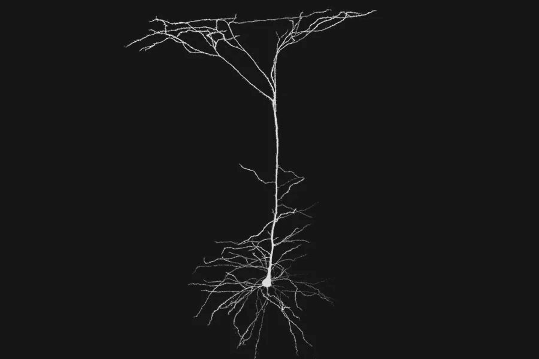

你可能以前使用过或听说过神经网络，今天在这篇博客中，我们将从头开始创建一个单神经元模型或感知器，它也可以被称为逻辑回归，一种用于分类数据的分类算法。所有代码都可以在 *perceptron.ipynb* 笔记本内的这个 [GitHub 链接](https://github.com/akil-ahmed3/understanding_deep_learning.git)中找到，数据集可以在[这里](https://drive.google.com/drive/folders/1OTmte5WhL97YrDHYsb7JSv_7E55JZeYG?usp=sharing)找到。

所以让我们创造我们可爱的小感知器

首先，我们需要准备好所需格式的数据，它只能使用矢量格式的数据或一维数据，但我们的图像形状是(32，32，3)，其中前两个是图像的高度和宽度，3 是 RGB 通道。

*   首先，在上面的代码块中，我们导入所需的模块
*   然后，我们从本地驱动器加载数据，并以 4:1 的比例分割数据。
*   然后，我们正在将我们的图像数据从多维矩阵格式重塑为矢量格式。
*   最后，我们正在标准化我们的数据集，使像素值保持在 0 到 1 之间。

现在，一旦我们的数据准备就绪，让我们了解我们的模型的架构，你可以在下面的图片中看到。


首先，我们有向量格式的数据(X ),它将与我们的权重向量(W)加上偏差(b)进行点积，在下面的等式中(I)表示第 I 个元素 *X* 或 *Z，*和 Z 是 *W* 、 *X* 和 *b* 的结果的向量。

这是否意味着 Z 是我们感知机的结果。嗯，没那么快！

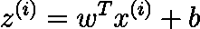

值为 *Z* 矢量没有任何上限或下限，我们需要一个介于 0 和 1 之间的值，因此我们将使用 sigmoid 函数，该函数将获取 *Z* 的值，并将它们带入 0 和 1 之间，这表示为*一个*矢量。

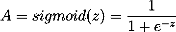

所以现在，你可能会问我们如何决定 W 和 b 的值？嗯，我们正在将 *W* 的向量元素的所有值初始化为 0.0，将 *b* 初始化为标量值 0.0。

整个过程到目前为止被称为前向传播，这里是所有步骤的代码。

*   首先，我们定义一个函数 *initialize_with_zeros* ，它将 dimension 作为一个参数，并将返回 *W* vector 和 *b* ，记住偏置项(b)是一个标量值。
*   然后，我们正在定义 *sigmoid* 函数。
*   最后， *forward_propagation* 函数会给我们*一个值从 0 到 1 的*向量。

现在，一旦我们完成了正向传播步骤，我们必须返回并更新 *W* 和 *b* 的值，以便它可以正确区分这两个类。为此，有一个叫做*成本函数(J)* 的东西，它给出了预测的成本，这意味着预测值与实际值有多远。因此，为了进行计算，我们必须找出每个单独预测的成本，这里的 *y 后缀(i)* 是实际值，而 *a 后缀(i)* 是用数据预测的*值。请参考这个[链接](https://www.youtube.com/watch?v=k_S5fnKjO-4)详细了解成本函数，以及这个表达式是怎么来的。*

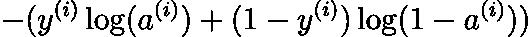

对数据集中的所有值求和。

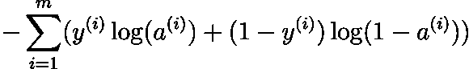

取平均值，其中 *m* 是当前训练数据的数量。这是成本函数，我们要尽可能的最小化这个成本函数。

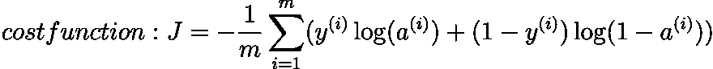

为了最小化成本函数或 *J* ，我们必须找到 *J* 相对于 *W* 和 *b、*的导数，这意味着 *W* 和 *b* 区分两个类别所需的变化量。

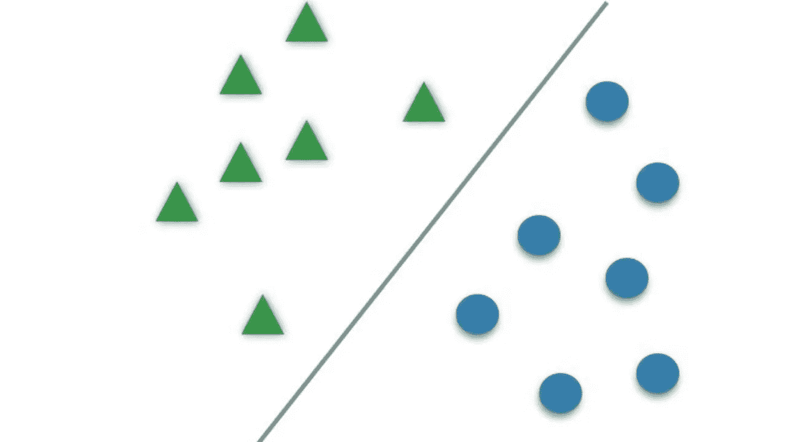

所以下面给出 *W(dw)* 和 *b(db)* w.r.t *J* 的导数， *dw* 和 *db* 称为 *J* 的梯度。如果你想了解它是如何进入画面的，那么参考这个[视频](https://www.youtube.com/watch?v=yXcQ4B-YSjQ)。从*正向传播*到现在为止的所有步骤都称为*反向传播*。

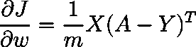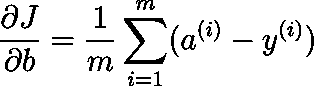

现在，让我们看看到目前为止的代码。我们去掉了 forward_propagation 函数，将其与向后传播代码合并，姑且称之为 *propagate* 函数。

*   我们之前已经解释到第 12 行，现在首先，我们根据之前提到的表达式计算*成本*。
*   然后，我们计算*成本的梯度，其中*是 *dw* 和 *db*
*   最后，返回梯度和成本。

现在，在接下来的步骤中，我们必须迭代地降低成本函数，为此，我们必须在每次迭代中非常缓慢地减去 *W(dw)* 和 *b(db)* 的导数，但是 *dw* 和 *db* 的值非常大，由于过冲，直接减去它们的值将不起作用，作为一种解决方案，我们将 *dw* 和 *db* 乘以一个非常小的数，称为*这里 *l* 是学习率，“:=”是赋值运算符。*

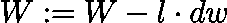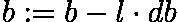

W 和 b 值的这种逐渐变化称为*梯度下降。*下图中，足球表示 *W* 和 *b* 的值。


[图像来源](https://laptrinhx.com/implement-gradient-descent-in-python-841608606/)

现在，让我们来理解梯度下降代码。

*   在函数中，我们传递 w(权重)、b(偏差)、X(训练集)、Y(训练集的实际值)、num_iteration(迭代次数)和 learning_rate(相同)。我们在第一个代码块中创建的训练和测试集。
*   从上面创建的传播函数中，它得到 *dw* 、 *db* 和*成本*。
*   然后我们正在根据我们之前的解释更新 *w* 和 *b* 。在下一次迭代中， *w* 和 *b* 的值将是新值。
*   然后我们打印每 100 次迭代的成本，并返回 *w* 和 *b* 。请理解，虽然 *w* 是小写字母，但它是一个矢量，b 是标量。

因此，我们现在处于最后阶段，让我们首先创建一个*预测*函数，它将预测(显然)我们的数据点的类别，您可以在这里看到，如果 sigmoid 函数的结果值小于 0.5，则它将被视为 0，否则为 1。

让我们把现在所有的函数组装起来，创建*模型*函数。

这段代码非常简单明了，用零初始化 *w* 和 *b* 的值，然后在梯度下降后，我们打印训练和测试集中的精度。

让我们看看我们可爱的小模特表现如何。运行下面给出的代码。

```
logistic_regression_model = model(train_set_x, y_train, test_set_x, y_test, num_iterations=2000, learning_rate=0.001)`
```

这是运行它后可能得到的结果。

```
Cost after iteration 0: 0.693147 
Cost after iteration 100: 0.679755 
Cost after iteration 200: 0.673041 
Cost after iteration 300: 0.668556 
Cost after iteration 400: 0.665001 
Cost after iteration 500: 0.661952 
Cost after iteration 600: 0.659240 
Cost after iteration 700: 0.656784 
Cost after iteration 800: 0.654535 
Cost after iteration 900: 0.652458 
Cost after iteration 1000: 0.650527 
Cost after iteration 1100: 0.648720 
Cost after iteration 1200: 0.647020 
Cost after iteration 1300: 0.645414 
Cost after iteration 1400: 0.643889 
Cost after iteration 1500: 0.642436 
Cost after iteration 1600: 0.641046 
Cost after iteration 1700: 0.639713 
Cost after iteration 1800: 0.638430 
Cost after iteration 1900: 0.637192 
train accuracy: 63.25 % 
test accuracy: 58.5 %
```

因此，我们在测试集上的准确率是 58.5%，这比随机猜测(50%)要好，但显然没有达到标准。所以，现在让我们想想我们可以改变什么来使它变得更好，我们可以使用不同的激活函数，不同的学习速率可以训练它进行更多或更少的迭代。请尝试不同的想法，看看你是否能改变结果。在本系列的第二篇文章中，我们已经从头开始创建了一个神经网络模型

信用:【https://www.coursera.org/specializations/deep-learning 