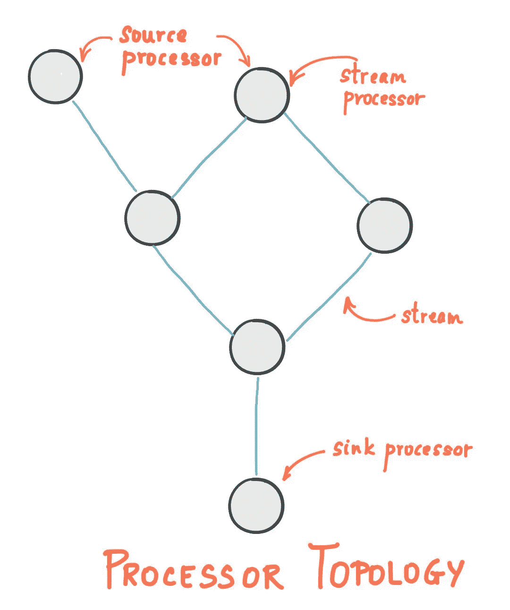
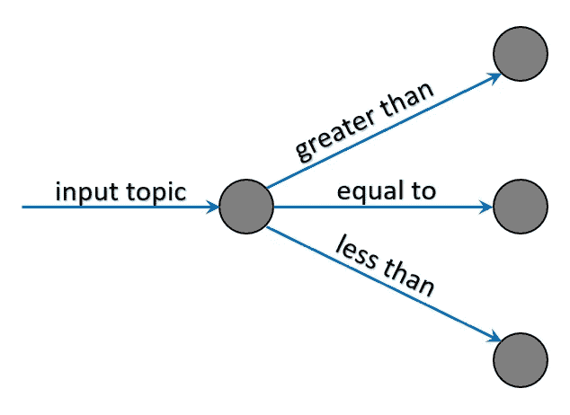
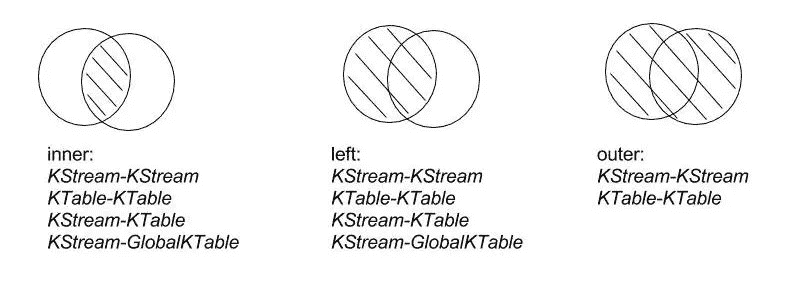
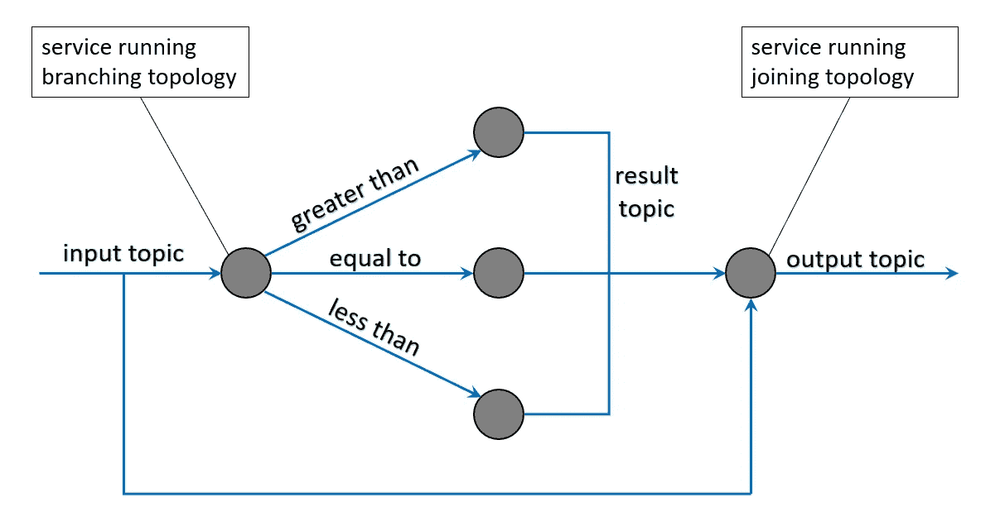

# 使用 Kafka 流创建流数据管道

> 原文：<https://itnext.io/creating-a-streaming-data-pipeline-with-kafka-streams-898fb352a7b7?source=collection_archive---------2----------------------->

## 创建基于规则的流数据拓扑

# 什么是流式拓扑？

拓扑是由流(边)连接的流处理器(节点)的[有向无环图(DAG)](https://en.wikipedia.org/wiki/Directed_acyclic_graph) 。DAG 的几个关键特征是它是有限的，并且不包含任何环。创建流拓扑允许数据处理器成为小型、集中的微服务，可以轻松分布和扩展，并可以并行执行工作。

# 为什么要用卡夫卡流？

[Kafka Streams](https://kafka.apache.org/documentation/streams/) 是由 [Confluent](https://www.confluent.io/) 开发的 API，用于构建使用 Kafka 主题的流媒体应用程序，分析、转换或丰富输入数据，然后将结果发送到另一个 Kafka 主题。它允许您以分布式和容错的方式用简洁的代码来实现这一点。Kafka Streams 将处理器拓扑定义为流处理代码的逻辑抽象。



一个简单的卡夫卡流拓扑

## 卡夫卡流的关键概念

*   一个**流**是一个无界的、持续更新的数据集，由一个有序的、可重复的、容错的键值对序列组成。
*   **流处理器**是拓扑中的一个节点，它从拓扑中的上游处理器一次接收一个输入记录，对其应用操作，并且可以选择性地向其下游处理器产生一个或多个输出记录。
*   **源处理器**是没有任何上游处理器的处理器。
*   **接收处理器**是没有任何下游处理器的处理器。

# 入门指南

对于本教程，我将使用 Kafka 和 Kafka 流的 Java APIs。我将假设对使用 [Maven](https://maven.apache.org/guides/getting-started/maven-in-five-minutes.html) 构建 Java 项目有一个基本的了解，对 Kafka 有一个初步的熟悉，并且已经设置了一个 Kafka 实例。[lens . io](https://lenses.io/)提供了一个快速简单的容器化解决方案来设置 Kafka 实例[这里](https://github.com/lensesio/fast-data-dev)。

首先，我们需要添加 [kafka-clients](https://mvnrepository.com/artifact/org.apache.kafka/kafka-clients) 和 [kafka-streams](https://mvnrepository.com/artifact/org.apache.kafka/kafka-streams) 作为项目 pom.xml 的依赖项:

# 构建流式拓扑

流式拓扑需要一个或多个输入、中间和输出主题。创造新的卡夫卡主题的信息可以在[这里](https://kafka.apache.org/quickstart#quickstart_createtopic)找到。一旦我们创建了必要的主题，我们就可以创建一个流拓扑。下面是一个为输入主题创建拓扑的例子，其中值被序列化为 JSON(由 [GSON](https://github.com/google/gson) 序列化/反序列化)。

流式拓扑的简单示例

上面的例子是一个非常简单的流拓扑，但是在这一点上它并没有真正做什么。**需要注意的是，拓扑由执行前面代码片段的应用程序执行和保存，拓扑不在 Kafka 代理内部运行。所有拓扑处理开销都由创建应用程序支付。**

可以通过执行以下命令来停止正在运行的拓扑:

```
streams.close();
```

为了使这种拓扑更有用，我们需要定义基于规则的分支(或边)。在下一个示例中，我们根据 JSON 消息有效负载中特定字段的值，创建了一个具有 3 个分支的基本拓扑。

具有多个分支的流拓扑

我们刚刚创建的拓扑如下图所示:



前一个例子中的分支的下游消费者可以像使用任何其他 Kafka 主题一样使用分支主题。下游处理器可以产生它们自己的输出主题。因此，将来自下游处理器的结果与原始输入主题相结合可能是有用的。我们还可以使用 Kafka Streams API 来定义将结果输出主题加入到单个流中的规则。

# 穿越溪流

Kafka Streams 根据 SQL 连接对其流连接功能进行建模。有三种联接:



*   **内部连接:**当两个输入主题都有相同键的记录时，发出一个输出。
*   **left join:** 为左侧或主输入主题中的每个记录发出一个输出。如果另一个主题没有给定键的值，则它被设置为 null。
*   **外部连接:**在任一输入主题中为每个记录发出一个输出。如果只有一个源包含键，则另一个源为空。

对于我们的例子，我们将输入记录流和来自下游处理器的结果连接在一起。在这种情况下，执行一个左连接最有意义，因为输入主题被认为是主主题。这将确保连接的流总是输出原始输入记录，即使没有可用的处理器结果。

最终的整体拓扑如下图所示:



通过编程可以让同一个服务创建并执行两个流拓扑，但是我在示例中避免了这样做，以保持图形不循环。

# 参考

*   [汇合文件](https://docs.confluent.io/current/streams/index.html)
*   [用 Kafka Streams 学习流处理](https://medium.com/better-programming/learn-stream-processing-with-kafka-streams-stateless-operations-2111080e6c53)
*   [Java kafk stream 简介](https://www.baeldung.com/java-kafka-streams)