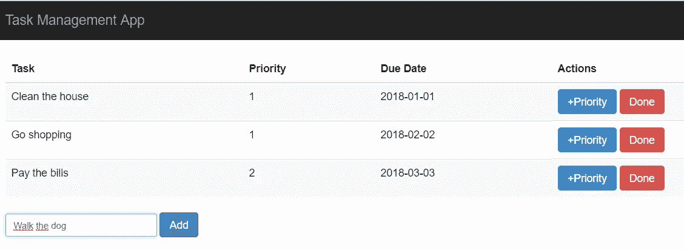

# 用 Grunt 和 CoffeeScript 创建任务管理应用程序

> 原文：<https://itnext.io/creating-a-task-management-application-with-grunt-and-coffeescript-3266fe65c4d0?source=collection_archive---------2----------------------->

当我们谈论软件开发时，一般来说，诸如 web 设计或让某些任务的执行在浏览器中完成(使应用程序更具执行性)等需求对前端框架的要求要高得多。

许多技术都为此做出了贡献:从 CSS 预处理程序，如 [Sass](https://sass-lang.com/) 和 [Less](http://lesscss.org/) ，它们帮助动态化了以前只有静态的 CSS，到压缩、缩小或单元测试库。

然而，在这个宇宙中仍然产生太多反响的一个主题是任务的自动化，这主要是因为它几乎完全与服务器端联系在一起。

在 JavaScript 世界中，最常用的任务自动化工具之一是 [**Grunt**](https://gruntjs.com) 。它诞生的目的是在实践中提高您的项目使用的任何 JavaScript 材料(包括库和框架)的开发/集成的生产率。

Twitter、jQuery 和 Adobe 等许多公司都在他们的项目中使用 Grunt，而它可以与多种技术结合使用，如 Sass/Less、 [Handlebars](https://handlebarsjs.com/) 和 [**CoffeeScript**](https://coffeescript.org/) 。

反过来，CoffeeScript 引入了我们在 CSS 处理器中看到的类似的“预编译”概念，但是是针对 JavaScript 的。通过它，我们可以用一种抽象的、更简单的语言来编译和生成 JavaScript。

它的语法概念与 Ruby 之类的语言非常接近，Ruby 的第一个版本发布后就吸引了很多人的注意。

在本文中，您将主要使用这两种技术，并尝试通过创建一个简单实用的笔记管理应用程序来解决 Grunt 和 CoffeeScript 的核心概念，如图 1 所示。

同一个应用程序将有一些清单，重点是理解 CoffeeScript 如何为这种类型的编程模型工作，同时您将看到它与 Grunt 的集成。



**图一。**任务申请视图

# 咕哝

简而言之， *Grunt* 是一个用于 JavaScript 项目的基于任务的命令行工具。

更详细地说，我们可以说，当处理一个 JavaScript 项目时，有许多事情需要定期完成，比如缩小文件、运行一些错误检测工具(比如 [JSHint](http://jshint.com/) )、运行测试(单一、集成等)。)或实时修改脚本。

如果您正在将 JavaScript 代码复制并粘贴到 JSHint 网站中，您可能会发现使用 Grunt 有一种更好的方法。即使您正在使用`"cat"`对象来连接文件或使用命令行来压缩文件，为您必须完成的所有额外任务提供一个统一的命令集不是很好吗！？

这正是格朗特的提议。有了它，我们可以简单地坚持业务规则和应用程序代码本身，而忘记自动化、生成或管理的重复任务。

然而，即使分析了我们到目前为止给出的所有概念和例子，许多人仍然认为 Grunt 是不必要的，在项目中只是作为另一个耗费你时间的工具。因此，让我们考虑一些因素:

> **我们真的需要 Grunt 做的事情吗？**

大概是的。即使你已经是一个有经验的开发人员，可以处理简单的任务，比如我们快速列出的那些，你可能会使用许多不同的工具来做每一件事 Grunt 可以帮助你把它们带到相同的环境中。最终，生产力是关键词。

> **但是 Grunt 运行在 Node.js 上，你不知道 Node…**

你不需要知道 Node.js 来使用 Grunt，同样你也不需要知道 C++来使用 Word，或者 PHP 来使用 WordPress。

> **我们有其他方法来做 Grunt 做的事情……**

可能吧，但问题是:*它们都被组织在一个地方，被配置为在需要时自动运行，并为参与您项目的每个人共享吗？*

Grunt 是一个命令行工具，你不知道如何使用这种东西。不幸的是，这实际上是该工具的一个缺点，因为我们没有 GUI 版本。但是，作为一名开发人员，知道如何处理命令行界面是非常重要的。

# 咖啡脚本

基本上，CoffeeScript 是一种编译成 JavaScript 的小型编程语言。受 Ruby 和 Python 等语言的启发，它的语法可以增加源代码的可读性并促进简洁。CoffeeScript 的源代码通常比它的 JavaScript 等价物短得多，这在不牺牲运行时性能的情况下仍然是可能的。

JavaScript 框架的优势包括:

*   CoffeeScript 提供了更简洁和一致的语法。大多数开发人员估计，使用 CoffeeScript 可以减少多达三分之一的最终代码量。
*   它包含了 JavaScript 的优点，比如 JavaScript 的优秀对象模型，同时解决了一些不好的地方，比如去掉了`with`语句。
*   CoffeeScript 编译的代码通常和 JavaScript 代码一样快，甚至更快。
*   CoffeeScript 提供了许多有用的特性，比如“基于原型的类的修正、对数组和对象的理解、链接的函数文字、安全的词法变量、赋值不匹配”等等。

显然，CoffeeScript 有一些缺点，比如在我们得到最终结果之前，在开发人员和 JavaScript 之间有另一个编译器。作为补偿，它会生成清晰易读的 JavaScript 代码。

此外，该工具的不断改进使其脱颖而出，并在它没有定义代码调试系统(自版本 1.6.1 以来已修复)时，从一开始就受到了强烈的批评。

编译器又可以分为两类:运行在 JavaScript 环境(比如浏览器)中的*核心编译器*，以及在命令提示符下实时运行 JavaScript 的*命令行编译器*。

# 设置一切

为了开始我们的应用程序开发，我们需要首先在您的机器上安装一些重要的工具。

## 安装 npm

由于 Grunt 是用 Node.js 构建的 JavaScript 项目，我们将使用 [**npm**](https://www.npmjs.com/) 进行版本控制。Npm 还将用于安装和更新 Grunt 和 [Bower](https://bower.io/) 插件(我们将在项目中使用的默认包管理器)。

要安装 npm，只需在机器上安装 Node.js，因为默认情况下它已经连接到框架。为此，访问 [Node.js 下载页面](https://nodejs.org/en/download/)并下载。用于 Windows 的 msi 安装文件，根据其版本— 32 位或 64 位(在页面上，您还可以找到用于其他操作系统的安装选项)。

运行该文件并按照所有步骤执行，不要更改已经默认标记的选项。之后，打开命令提示符并执行以下命令来验证安装是否成功，这一点很重要:

```
npm -v
```

## 安装凉亭

Bower 是前端开发的包经理。它将用于为我们的项目安装客户端库。Bower 与 npm 的相似之处在于，它有助于更容易地安装、升级和配置软件包。

主要区别在于两种工具的实现方式。npm 使用嵌套依赖关系树，可以安装一个包的多个版本，而 Bower 保持依赖关系树扁平，没有嵌套。

这表明使用 Bower 的每个客户机只需要安装一个依赖版本，从而减少了每个项目对额外空间的需求。

没有 Bower，就和传统的从官方网站下载前端库放到项目上一样。不幸的是，这些库不包括自动升级或配置库所需的元数据。使用 Bower 及其内部缓存，我们将能够根据需要轻松地升级、安装或删除软件包。

一旦安装了 npm，我们可以简单地通过执行以下命令来安装 Bower:

```
npm install –g bower
```

## 安装咕噜声

没有应该在全球范围内安装 Grunt 的用例。当启动一个新项目时，您必须将其配置为 Grunt facet 项目，也就是说，告诉您的 OS 该项目被配置为使用 Grunt 运行。

但是首先，只需运行以下命令:

```
npm install -g grunt-cli
```

这足以让你的操作系统将 Grunt 识别为一个正式的操作命令，因为它现在在你的系统变量中。

但是这并不是我们创建一个 Grunt 项目所需要的全部。grunt-cli 负责为我们拥有的每个不同的*grunt 文件*管理 Grunt 的最佳版本，允许我们同时拥有多个版本。

# 创建项目

我们的下一步是项目的创建和设置。为此，在文件系统中创建一个名为`/notes-app`的文件夹。然后，运行以下命令:

```
npm init
```

这将创建`package.json`文件，这是依赖性管理(对于其他 npm 配置)所必需的。只要按照要求填写选项，就像我们在清单 1 中看到的那样。

**清单 1。** package.json 文件。

```
{
  "name": "notes_app",
  "version": "1.0.0",
  "description": "A simple notes app with Grunt.js and CoffeeScript",
  "main": "index.js",
  "keywords": [
    "gruntjs",
    "coffeescript",
    "npm",
    "js"
  ],
  "author": "Diogo Souza",
  "license": "ISC"
}
```

要将 Grunt 添加为我们的 npm 依赖项之一，我们只需运行:

```
npm install grunt --save-dev
```

这将在我们的 *devDependencies:* 中安装最新版本的 *grunt* (模块)

```
"devDependencies": {
    "babel-core": "^6.26.3",
    "babel-preset-env": "^1.7.0",
    "grunt": "^1.0.3",
    "grunt-babel": "^7.0.0",
    "grunt-contrib-clean": "^1.1.0",
    "grunt-contrib-coffee": "^2.0.0",
    "grunt-contrib-concat": "^1.0.1",
    "grunt-contrib-copy": "^1.0.0",
    "grunt-contrib-cssmin": "^2.2.1",
    "grunt-contrib-htmlmin": "^2.4.0",
    "grunt-contrib-uglify": "^3.3.0",
    "grunt-contrib-watch": "^1.1.0",
    "grunt-usemin": "^3.1.1",
    "load-grunt-tasks": "^4.0.0",
    "matchdep": "^2.0.0"
}
```

其他依赖项构成了重要的复杂模块，例如用于清理和文件传输操作的`clean/copy`、用于缩小的`cssmin/htmlmin`、用于驱逐 es 冲突的 [Babel 配置](https://www.npmjs.com/package/grunt-babel)等。在你把它们保存到你的文件中之后，不要忘记运行`npm install`。

> 请注意，在您阅读本文时，版本可能已经更改。一定要把它们换成最新的。

同时，您可以初始化 Bower 依赖关系:

```
bower init
```

这个命令将“重用”我们之前插入的 npm 先前的指令。完成后，运行以下命令，以便将 jQuery 和 Bootstrap 依赖项添加到我们的 Bower 包中(Bower 将自动处理 jQuery 导入，因为它是一个 Sass 依赖项):

```
bower install bootstrap-sass
```

> 为了正确安装这些依赖项，你需要在你的机器上安装 [**Git** 。](https://git-scm.com/downloads)

## Gruntfile.js

Gruntfile.js 是 Grunt 配置文件，基本上由清单 2 中描述的格式组成。

**清单 2。**grunt file . js 配置文件的默认格式。

```
// constants and functions
module.exports = function(grunt) {
  grunt.initConfig({
     // configs
  });
  // user tasks
}
```

为了简化配置过程，Grunt 用户应该理想地存储所有端口、函数和其他常量，这些常量在文件的顶部作为全局变量使用。

这确保了如果一个函数或常量突然改变，在顶部编辑全局变量比在文件的每个位置改变它的值要简单得多。

此外，常数通过为每个未知值指定一个变量名来帮助提供信息。

最后，Gruntfile 将以用户定义的任务列表终止。默认情况下，所有 Grunt 插件都有各自的任务，可以调用这些任务来执行所需的输出。可以在 Gruntfile 的末尾引用用户定义的任务来异步运行。

例如，您可能希望为系统管理员设置一个任务，该任务将通过组合压缩、连接和任务编译来发送 web 应用程序的生产就绪版本。

您还可以为 web 开发人员设置一个`"watch"`任务，自动编译需要使用 build 的 CoffeeScript 或 Sass 文件。我们来看看**清单 3** 。

**清单 3。** Gruntfile 初始配置。

```
'use strict';module.exports = function(grunt) {
   require('load-grunt-tasks')
   require('matchdep').filterDev('grunt-*').forEach(grunt.loadNpmTasks);

   var config = {};
   config['watch'] = {
       options: {
           nospawn: true
       },
       coffee: {
           files: ['src/coffee/{,*/}*.coffee'],
           tasks: ['coffee:server']
       },
       compass: {
           files: ['src/styles/{,*/}*.{scss,sass}'],
           tasks: ['compass:server']
       }
   };

   config['compass'] = {
       options: {
           sassDir: 'src/styles/sass',
           cssDir: 'src/styles',
           importPath: 'src/bower_components',
           relativeAssets: false
       },
       dist: {},
       server: {}
   };

   config['coffee'] = {
       dist: {
           files: [{
               expand: true,
               cwd: 'src/coffee',
               src: '{,*/}*.coffee',
               dest: 'dist/scripts',
               ext: '.js'
           }]
       },
       server: {
           files: [{
               expand: true,
               cwd: 'src/coffee',
               src: '{,*/}*.coffee',
               dest: 'src/scripts',
               ext: '.js'
           }]
       }
   };

   // my grunt tasks

   grunt.initConfig(config);};
```

这个设置明确地告诉 Grunt，在对 CoffeeScript 和 Sass 文件进行任何直接更改之后，必须重新创建和更新哪些文件，这些文件将分别位于 */coffee* 和 */css* 文件夹中。

然而，只有在你的电脑上安装了最新版本的[红宝石](https://rubyinstaller.org/downloads/)和[指南针](http://compass-style.org/install/)的情况下，它才能工作。安装 Ruby 后，`gem`命令将自动可用。

也可以看到两个任务的创建:`compass`和`coffee`。两者都将分别处理 CSS 和 CoffeeScript 文件的部署。请注意，在第一条语句中，我们只是创建了对您的目录的引用，在那里您可以找到 Sass 依赖 CSS 文件，并且不接受相对路径来处理导入。

在第二个示例中，我们创建了`grunt-contrib-coffee`任务，并分发了部署和服务器文件。通过`src`、`dest`和`cwd`选项可以查看相同的目录特征。

读者还应该注意，这些是您在处理文件时需要操作的文件夹。如果你想改变他们的名字，请随意。

最后，执行以下命令启动控制台中的*“watch”*:

```
grunt watch
```

这将启动我们之前创建的`grunt-contrib-watch`线程，并在一个无限循环中检查无论何时你对文件进行更改，CSS 和 JS 各自的文件也将生成。现在，让它在后台运行。

作为实现中的第一个实际变化，我们将导航到`src/styles/sass`文件，并在其中包含以下代码片段:

```
@import 'bootstrap-sass/lib/bootstrap.scss';
```

这将负责将引导 CSS 依赖项导入 CSS 文件。请注意，保存文件后，将在`src/styles`文件夹中创建一个新的`main.css`文件(作为*“观察”*的结果)，其中包含我们在示例中需要的所有 CSS 内容。

回到 Gruntfile.js，让我们参考**清单 4** 的其余内容。

**清单 4。Gruntfile.js 的其余部分**

```
config['clean'] = {
 build: {
  files: [{
   dot: true,
   src: [
    'dist/*',
    '!dist/.git*'
   ]
  }]
 }
};config['useminPrepare'] = {
 options: {
   dest: 'dist'
 },
 html: 'src/index.html'
};config['usemin'] = {
 options: {
   dirs: ['dist']
 },
 html: ['dist/{,*/}*.html']
};config['htmlmin'] = {
 dist: {
  options: {
   collapseBooleanAttributes: true,
   removeAttributeQuotes: true,
   removeRedundantAttributes: true,
   removeEmptyAttributes: true
  },
  files: [{
   expand: true,
   cwd: 'src',
   src: '{,*/}*.html',
   dest: 'dist'
  }]
 }
};config['babel'] = {
 options: {
  sourceMap: true,
  presets: ['env']
 },
 dist: {
  files: {
   '.tmp/concat/scripts/compiled.js': '.tmp/concat/scripts/compiled.js'
  }
 }
};config['uglify'] = {
 options: {
   mangle: false
 }
};config['copy'] = {
 build: {
  files: [{
   expand: true,
   dot: true,
   cwd: 'src',
   dest: 'dist',
   src: []
  }]
 }
};config['cssmin'] = {
 dist: {
  files: {
   'dist/styles/main.css': [
    'src/styles/{,*/}*.css'
   ]
  }
 }
};grunt.initConfig(config);var tasks = [
 'clean:build',
 'useminPrepare',
 'htmlmin',
 'cssmin',
 'concat',
 'babel',
 'uglify',
 'copy',
 'usemin'
];grunt.registerTask('build', tasks);
```

这里有一些要点需要注意:

*   任务`clean`、`copy`、`useminPrepare`、`usemin`、`cssmin`、`uglify`和`htmlmin`只是实用程序。它们在每个复杂的项目中都很常见，有助于清理发行文件夹、传输和缩小 HTML 文件等。
*   任务`babel`帮助我们将 CoffeeScript 编译后生成的最终 js 文件转换成有效的 ES5 格式，因为我们使用的一些插件不理解如何处理 ES6。
*   最后，我们只是通过`registerTask`函数将所有想要传递给 grunt register 的任务名称进行分组。请注意，它们都将在项目构建时按照定义的顺序执行。

## CoffeeScript 文件

接下来，在 *src/coffee/app* 文件夹中创建一个名为`main.coffee`的新文件，并将**清单 5** 的内容添加到其中。

**清单 5。** main.coffee 文件。

```
Task = window.GLOBALS.Task
Panel = window.GLOBALS.Panel$ ->
 initialTasks = [
  {
   name: "Clean the house"
   priority: 1
   dueDate: "2018-01-01"
  }
  {
   name: "Go shopping"
   priority: 1
   dueDate: "2018-02-02"
  }
  {
   name: "Pay the bills"
   priority: 2
   dueDate: "2018-03-03"
  }
 ]

 tasks = {}

 for task in initialTasks
  tasks[task.name] = new Task task.name, task.priority, task.dueDate, false

 panel = new Panel $("#tasks-table"), tasks
```

在文件的开头，您可以看到将在示例中使用的两个对象的声明。为了使用 CoffeeScript 中的类，您必须首先导入它们。

内容的开始在`->`符号之后，这也将用于确定其他代码块的开始，如方法和构造函数。

还要注意，我们创建了`initialTasks`变量，它将作为一种`Collection`，在视图打开时显示表中的一些对象。

该变量将用于完成通过使用`forEach`按顺序创建的任务列表，最终创建一个`Panel`对象并将任务列表作为参数传递。

然后，再创建两个文件:`panel.coffee`和`task.coffee`。让我们从清单 6 中的**任务开始。**

**清单 6。** task.coffee 文件。

```
class Task
 constructor: (@taskName, @priority, @dueDate, @done) ->
  throw "Invalid task description" if @taskName.length is 0
  throw "Invalid priority" if @priority < 1
  throw "Invalid date" if @dueDate.length is 0

 getPriority: ->
  @priority

 getDueDate: ->
  @dueDate

 increasePriority: ->
  @priority++

 finish: ->
  @priority = 0
  @dueDate = 0
  @done = true

 isDone: ->
  @done

window.GLOBALS.Task = Task
```

必须在每个名字的开头使用`@`来引用类属性，抛出异常可以通过保留字`throw`来完成。请注意，抛出异常的条件总是在相应消息之前的声明之后。

为了划分块的开始和结束，我们使用缩进和空行，也就是说，每当你想创建一个新的方法或块时，相应地换行。文件的其余部分只是陈述属性的 getter/setter，以及完成任务或增加其`priority`值的方法。

**清单 7** 展示了管理面板视图的 CoffeeScript 代码。

清单 7。 panel.coffee 文件。

```
Task = window.GLOBALS.Taskclass Panel
   constructor: (@panel, @tasks) ->
    @init()

   init: ->
    _this = this

    @render()

    $("#btn-add").click ->
     key = $("#input-task").val()
     _this.tasks[key] = new Task key, 1, "2018-03-03", false
     $("#input-task").val("")
     _this.render()

   getTasks: ->
    @tasks

   setTasks: (tasks) ->
    @tasks = tasks

   render: ->
    _this = this

    @panel.find("tbody").html ""

    for key, value of @tasks
     if value.isDone()
      continue

     row = "<tr data-id='#{key}'>
      <td>#{key}</td>
      <td>#{value.priority}</td>
      <td>#{value.dueDate}</td>
      <td>
       <button class='btn btn-primary btn-incr-priority' data-id='#{key}'>+Priority</button>
       <button class='btn btn-danger btn-finish' data-id='#{key}'>Done</button>
      </td>
     </tr>"
     @panel.find("tbody:last").append(row)

    @panel.find(".btn-incr-priority").each ->
     $(this).click ->
      key = $(this).attr("data-id")
      _this.tasks[key].increasePriority()
      _this.render()

    @panel.find(".btn-finish").each ->
     $(this).click ->
      key = $(this).attr("data-id")
      _this.tasks[key].finish()
      _this.render()

window.GLOBALS.Panel = Panel
```

`render`方法将从 HTML 页面的`table`中检索`tbody` DOM 对象，并遍历最初在`main.coffee`中创建的任务列表。

在迭代中，我们验证任务是否已经完成，这样一个任务就不会被考虑；以及将每个任务的值组装到表的列中。

最后，该方法还将侦听表按钮上的点击，尝试删除或增加该行上的优先级值内容。

> 始终注意压痕的使用。非常重要的一点是，要正确地执行它，这样框架才能理解每条指令的开始和结束位置。

在这个过程的最后，验证`watch`线程已经创建了几个`.js`文件，对应于 *src/scripts* 目录中每个 CoffeeScript 文件的内容。

在测试之前，我们不能忘记创建 HTML 文件，该文件将包含要显示的表的内容。为此，在`src`文件夹的根目录下创建一个新的`index.html`文件，并添加**清单 8** 的内容。

**清单 8。**index.html 页面。

```
<!doctype html>
<html class="no-js">
   <head>
       <meta charset="utf-8">
       <meta http-equiv="X-UA-Compatible" content="IE=edge,chrome=1">
       <title>Task Mgmt App</title>
       <meta name="description" content="">
       <meta name="viewport" content="width=device-width">
       <link rel="stylesheet" href="styles/main.css">
   </head>

   <body>
       <header class="navbar navbar-static-top navbar-inverse" role="banner">
           <div class="container">
               <div class="navbar-header">
                   <button class="navbar-toggle" type="button" data-toggle="collapse" data-target=".bs-navbar-collapse">
               <span class="sr-only">Toggle navigation</span>
               <span class="icon-bar"></span>
               <span class="icon-bar"></span>
               <span class="icon-bar"></span>
             </button>
                   <a class="navbar-brand">Task Management App</a>
               </div>
               <nav class="collapse navbar-collapse" role="navigation">
               </nav>
           </div>
       </header>
       <div class="container">
           <div class="row">
               <div class="col-lg-12">
                   <table id="tasks-table" class="table table-hover table-striped table-border">
                       <thead>
                           <tr>
                               <th>Task</th>
                               <th>Priority</th>
                               <th>Due Date</th>
                               <th>Actions</th>
                           </tr>
                       </thead>
                       <tbody>
                       </tbody>
                   </table>
                   <input id="input-task" class="form-control input-sm" style="width: 200px; display: inline-block" /> <a id="btn-add" class="btn btn-primary">Add</a>
               </div>
           </div>
       </div>
       <!-- build:js scripts/compiled.js -->
       <script type="text/javascript" src="bower_components/jquery/dist/jquery.js"></script>
       <script type="text/javascript" src="scripts/app/init.js"></script>
       <script type="text/javascript" src="scripts/entity/task.js"></script>
       <script type="text/javascript" src="scripts/entity/panel.js"></script>
       <script type="text/javascript" src="scripts/app/main.js"></script>
       <!-- endbuild -->

       <script type="text/javascript" src="scripts/compiled.js"></script>
   </body>
</html>
```

这只是一个简单的 HTML 文件，带有适当的 CSS(主要是 Bootstrap)和 JS 导入。此外，我们还按照 coffee 文件中相同的 JavaScript 代码要求，创建了向列表添加新任务的按钮。

还要注意，最后 JavaScript 文件的导入必须按照定义的顺序进行，以避免忘记一些对象，甚至在浏览器中出现不必要的错误。重要的是不要删除它们前后的注释，因为它们将被构建使用。

最后，要将所有东西编译并正确复制到`/dist`文件夹，只需运行`grunt build`命令并检查所有文件是否都在那里。

# 结论

使用这种工具的优点是，我们只需花时间配置一次所有的东西，版本更新可以通过相应的更新命令自动完成。

你不必成为专家来掌握 Grunt 和 CoffeeScript 的功能，但是在开发了这样一个简单的例子之后，我们可以看到它们的潜力。尽管如此，还有很多东西需要探索，比如多态、封装和其他面向对象的概念、列表、动态结构等等。

查看官方 [Grunt 的入门页面](https://gruntjs.com/getting-started)了解更多信息。

你也可以在[我的 GitHub 档案](https://github.com/diogosouza/notes_app)中找到这个例子。