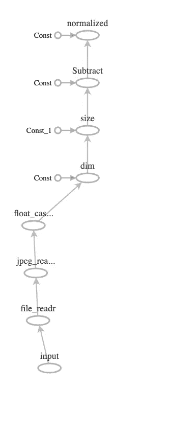

# 在 C++中创建张量流 DNN 第 1 部分

> 原文：<https://itnext.io/creating-a-tensorflow-dnn-in-c-part-1-54ce69bbd586?source=collection_archive---------0----------------------->

在这篇文章中，我将从数据准备、一个小图表和使用 TensorBoard 开始。

# 背景

在我的[上一篇文章](/how-to-use-your-c-muscle-using-tensorflow-2-0-and-xcode-without-using-bazel-builds-9dc82d5e7f80)中，我展示了如何在 MacOS 上准备一个可以使用 TensorFlow 并在 XCode 中编译的项目。

在这篇文章中，我们将开始编码，创建一个小图，运行它，并将其可视化。

当你从事机器学习项目时，数据准备可能是工作的一半，所以我们将看到如何在 C++中使用 TensorFlow APIs 进行编码。

当您搜索 DNN 的 C++实现时，您通常会找到加载预训练模型(用 Python 创建、训练并保存到磁盘)的方法，因此您可以将其加载到 C++代码中进行运行时优化。

正如我在第一篇文章中所说的，我的目标是从头开始，用 C++做所有的事情。

所以最终我的项目会有，全部用 C++写的:

1.数据准备

2.DNN 模型创建

3.培养

4.确认

当我开始学习 DNNs 时，我发现了这个 4 篇文章的系列:[在 Medium 上应用深度学习](https://medium.com/towards-data-science/applied-deep-learning-part-1-artificial-neural-networks-d7834f67a4f6)作者 [Arden Dertat](https://towardsdatascience.com/@ardendertat) 。在我看来，这是深度学习的最佳教程之一。

我将尝试做的是本系列第 4 部分中开发的模型的 C++版本。

这是 AlexNet 的缩小版(如果我没有错的话，这是第一个 CNN ),但功能强大到足以区分狗和猫。

Arden 文章中的模型是用 Python 和 Keras 开发的，我将尝试用 C++来做。

但是在我们进入模型之前，让我们回顾一些基本的东西。

# Google 示例

我在 TensorFlow 代码中找到了几个 C++示例，您可以从 GitHub 中克隆:

1.[标签图像示例](https://github.com/tensorflow/tensorflow/blob/master/tensorflow/examples/label_image/main.cc) —该示例显示了如何加载图像、加载预训练的图形并通过图形运行图像以进行分类。

2.[示例训练器](https://github.com/tensorflow/tensorflow/blob/master/tensorflow/cc/tutorials/example_trainer.cc) —以多线程和多步方式训练的简单图形，用于更好地利用计算能力。

如果您遵循了我在上一篇文章中的说明，您应该已经有了代码。

无论如何，我将使用第一个示例代码作为本文的基础。

# 基本概念

如果您已经熟悉 TensorFlow C++ API，可以继续下一节。

## 图表

图形是由运算(节点)和张量(边)组成的。您可以通过添加节点来构建图表。边是节点的输入和输出。通常，在开始和结束的时候，你会有一个图形的输入和一个输出。

需要理解的重要一点是，构建一个图就是构建一个模型。这意味着操作不会立即运行，而是一步一步地构建图表，并且只有当您执行 run 命令时，它才会实际运行。

把它想象成用 C++编码。您首先编写代码，然后编译并运行。运行时，可以改变输入，得到不同的结果。然而，在我们的例子中，模型本身也会像你训练的情况一样发生变化，权重也会发生变化。

子图是主图的一部分，您可以评估它而不是整个图。

运行图只是给引擎提供您想要评估的节点(在大多数情况下是您添加的最后一个节点)。因为图实际上定义了节点之间的依赖关系，所以引擎将遍历图并评估依赖节点，直到它评估了您请求的节点并给出结果。如果它不需要运行整个图来给出结果，它将只运行相关的子图。

该引擎还支持并行和分布式执行。

## 范围

范围是提供上下文的对象。它包含图形和物理资源，如 CPU。

使用作用域时，首先创建根作用域，然后从它创建子作用域。

作用域的名称是由您给它们的名称和作用域内的操作构成的。

因为范围也包含状态，所以这些名称有助于您理解构建图的每个步骤中发生了什么。

不要混淆 TensorFlow 作用域和 C++代码作用域，尽管概念是相似的。

## 会议

会话是您与 TensorFlow 引擎的连接。您创建一个客户机会话来运行一个图形并获得结果。

如上所述，在运行时，您向会话提供图形的输入、要评估的节点以及可选的一些选项。你也给它一个结果容器。

## 运算和张量

运算是图中的节点，张量是图中的边。

节点也可以是类似操作的节点(常量和变量),边可以是类似张量的对象(标量、字符串等)。)

让我们看一个来自 [C++指南](https://www.tensorflow.org/guide/extend/cc)的例子(有一些修改):

```
Scope root = Scope::NewRootScope();// 2x2 matrixauto a = Const(root, { {1, 2}, {2, 4} });// 2x2 matrixauto b = Const(root, { {2, 2}, {1, 1} });// a x bauto m = MatMul(root, a, b);ClientSession session(root);std::vector<Tensor> outputs;session.Run({m}, &outputs);// outputs[0] == [ [4, 4], [8, 8] ]cout << outputs[0].DebugString(4);
```

我们创建 2 个 2x2 矩阵，然后将它们相乘(数学上)；从输出向量中提取结果，并发送到输出流。

# 让我们开始工作吧！

这篇文章的代码在[这个资源库](https://github.com/bennyfri/TFMacCpp)中提供

如果您遵循了前一篇文章中的说明，您应该已经有了一个可以在 XCode 中编译并与 TensorFlow 库链接的项目。

只需使用 main.cpp 文件来创建下面的示例。

正如我所写的，我希望我的代码基于上面提到的图像标签示例。

我想采用的主要函数是读取图像，对其进行一些操作，并返回一个张量，您可以将它输入到另一个图形中。

这项工作由 TensorFlow 引擎中运行的图形来完成。

我采用示例中的函数头——函数的输入参数是:文件名、图像大小、归一化值和输出引用。我为 TensorBoard 添加了另一个 bool 标志，我们稍后会看到原因。

首先，我们创建一个新的范围

```
auto root = Scope::NewRootScope();
```

现在让我们创建一个变量，当我们运行图表时，这个变量将被输入值

```
auto file_name_var = Placeholder(root.WithOpName(“input”), DT_STRING);
```

请注意以下几点:

1.我们使用 auto，因为 TensorFlow 类型非常混乱，很难猜测(Output 也可以用作 Input……)。你会习惯的。

2.我们从 root 创建一个子作用域，给它一个名字“input ”,它只是用这个名字标记这个节点。

3.变量的类型不是字符串，这是一个包含字符串元素的张量(字符串被视为基本类型)。

接下来，我们想创建一个读取图像文件的操作。该框架提供了许多您可以使用的操作。API 文档列出了(大部分)它们。寻找它接受的具体参数和类型很重要。

```
auto file_reader = ReadFile(root.WithOpName(“file_readr”), file_name_var);
```

这里注意:

1.使用新名称创建一个新的子范围。

2.我们把从上一个操作中得到的节点放到这个操作中。那是在两个节点之间流动的(边)张量。这也定义了第二和第一节点之间的依赖性。

3.返回的输出是我们将在下一个操作中使用的另一个节点。

现在让我们使用另一个操作来解码文件:

```
const int wanted_channels = 3;auto image_reader = DecodeJpeg(root.WithOpName(“jpeg_reader”), file_reader, DecodeJpeg::Channels(wanted_channels));
```

1.有几个解码器，原来的例子显示了如何使用其他图像类型。

2.如果你想知道操作接受什么作为输入，去[文档](https://www.tensorflow.org/versions/r2.0/api_docs/cc/class/tensorflow/ops/decode-jpeg)或者查看[实现文件](https://github.com/tensorflow/tensorflow/blob/master/tensorflow/core/ops/image_ops.cc)。

3.该操作还接受属性作为第三个输入参数(struct)。在这种情况下，我们传递图像中通道(颜色)的数量。同样，[文档](https://www.tensorflow.org/versions/r2.0/api_docs/cc/struct/tensorflow/ops/decode-jpeg/attrs)可能会有所帮助。

前面操作的输出是 uint8 的张量。我们希望将元素转换成浮点数，这样我们就可以对它们进行一些数学运算。这是 TensorFlow 的典型特征。

```
auto float_caster = Cast(root.WithOpName(“float_caster”), image_reader, DT_FLOAT);
```

接下来，我们要在现有的三个维度(高度、宽度、通道)上添加第四个维度。第四个是批的。在图像处理的情况下，这对于 TensorFlow 也是典型的，具有批次、高度、宽度、通道的四维张量(称为 NHWC)。

```
auto dims_expander = ExpandDims(root.WithOpName(“dim”), float_caster, 0);
```

请注意，这里的 0 表示 dim 插入在开头。

现在让我们将图像调整到函数输入中指定的大小。这样做是因为当图像被馈送到深层网络时，它们被期望具有相同的大小。

```
auto resized = ResizeBilinear(root.WithOpName(“size”), dims_expander, Const(root, {input_height, input_width}));
```

ResizeBilinear 接受具有两个元素的一维张量作为大小:高度和宽度。在我们的例子中，我们简单地给它一个常量运算的输出，它为我们创建了张量。

接下来是浮动元素的规范化。当元素中的值介于 0 和 1 之间时，网络的性能通常会更好。

```
auto d = Div(root.WithOpName(“normalized”), Sub(root, resized, {input_mean}), {input_std});
```

在这一行中，我们再次将两个操作嵌套在一个操作中—首先做减法，然后做除法。在这两种情况下，操作都是基于元素的，第二个参数可以是一个标量(一个元素的一维张量),因此是带括号的。

# 准备好跑了吗？

图表准备好了。现在我们想运行它。

为此，我们需要:

1.会话对象

2.向变量提供输入

3.决定我们要评估哪个节点

4.为输出准备一个容器

```
ClientSession session(root);TF_CHECK_OK(session.Run({{file_name_var, file_name}}, {d}, out_tensors));
```

Run 方法可以有多种形式，最基本的形式是要计算的节点向量和指向输出张量向量的指针。

我们使用另一个参数作为输入值。

让我们回顾一下上面列出的所有要求:

1.我们根据作用域创建一个新的 ClientSession 对象。作用域隐式地给出了对会话对象创建的图的引用。注意，可能有多个图，但是在我们的例子中，我们只使用默认的一个。

2.输入作为 map 对象提供，其中索引是节点，元素是值。在我们的例子中，我们只有一个输入(文件名)，所以我们提供了一对从占位符返回的变量节点和一个字符串值。这是在另一对括号内，因为它是一个列表(一个地图)。

3.run 函数的第二个参数是我们想要评估的节点向量。在我们的例子中，这只是一个——我们添加到图表中的最后一个。

4.out_tensors 是指向从 main 提供给函数的 vector <tensor>对象的指针。返回向量中的每个元素对应于求值列表中的一个节点。我们期望只得到一个元素。</tensor>

我们使用 TF_CHECK_OK 宏来检查调用的结果，以便在失败时运行和记录错误。

正如我们所料，out_tensors[0]中的结果是形状[1，299，299，3]的四维张量(该函数的输入大小为 299 乘 299)。

仅仅加载一个图像就要做大量的工作！而且我们创建的图也不是无足轻重的(对于初学者来说)。我听说有一种可视化图表的方法。

# 张量板

> -你想用冲浪板吗？
> 
> -是的
> 
> -没问题，只需运行一次模型，然后调用 tf.summary.FileWriter…
> 
> -那是 python，对吧？
> 
> -是的…
> 
> -我想用 C++。
> 
> -嗯，在这种情况下你必须做一些工作，你需要创建一个事件对象，然后序列化图形…
> 
> -没有。

还好有个隐藏(？)文件，该文件执行与 python 方法相同的操作。您需要将 summary_file_writer.cc 文件添加到项目中(来自/tensorflow/core/summary/)，并将 summary_file_writer.h 包含在 main.ccp 文件中。

TensorBoard 是许多事物的可视化工具，其中包括图形结构。

## TensorBoard 如何工作

首先，您需要创建一个文件夹。我在我的项目文件夹下创建了一个文件夹“graphs”。这是您想要转储 TensorBoard 知道要读取的图表摘要数据的位置。

TensorBoard 是一种后台服务，您在终端中触发，然后在终端中指定的端口中打开浏览器。

让我们从代码部分开始:

```
GraphDef graph;TF_RETURN_IF_ERROR(root.ToGraphDef(&graph));SummaryWriterInterface* w;TF_CHECK_OK(CreateSummaryFileWriter(1, 0, "/Users/bennyfriedman/Code/TF2example/TF2example/graphs", ".img-graph", Env::Default(), &w));TF_CHECK_OK(w->WriteGraph(0, make_unique<GraphDef>(graph)));
```

如果你还记得的话，我们说过范围对象持有图形。我们需要使用这个工具方法从 scope 中提取 graph 对象。

接下来，我们创建一个 SummaryFileWriter，将文件写入的文件夹传递给它。前两个参数控制它写的频率，在我们的例子中，我们希望它立即写，所以最大队列是 1，等待 0 毫秒。第四个参数是一个扩展，这是在你想写多个图的情况下，所以你知道哪个是哪个。

接下来使用 writer 编写文件，给它一个 graph 对象。

运行一次之后，您应该在文件夹中获得一个文件名类似 events . out . TF events . 1556982975 . m b-Friedman . local . img-graph 的文件。

你不想每次运行你的图形时都使用它，所以这就是为什么我在函数中传递了一个标志来控制它。

现在让我们启动 TensorBoard:

如果你从来没有安装它，首先打开终端并运行

```
pip install TensorBoard
```

然后运行以下命令:

```
tensorboard — logdir ~/Code/TF2example/TF2example/graphs/
```

其中，在 logdir 之后提供的文件夹是您在上面的代码中创建和使用的文件夹。

TensorBoard 会做出如下回应:

tensor board 1 . 14 . 0 a 2019 03 01 at[http://m b-Friedman . local:6006](http://mb-friedman.local:6006)(按 CTRL+C 退出)

现在，您可以打开浏览器，将 URL 复制到地址栏。

您将看到类似这样的内容:



张量图形可视化

不错！这有助于我们调试更复杂的图形，看看什么会真正运行，谁在喂谁？以及在哪里输入了什么常量。

# 回到代码:我们如何处理输出？

最终，我们将有许多图像提取出来，我们将创建一个 DNN 来训练他们，但现在让我们确保我们没有损坏图像。

为了验证这一点，让我们创建另一个图形，它采用张量并将其放回图像中。

```
auto root = Scope::NewRootScope();auto un_normalized = Multiply(root.WithOpName("un_normalized"), Add(root, in_tensors[0], {input_mean}), {input_std});auto shaped = Reshape(root.WithOpName("reshape"), un_normalized, Const(root, {input_height, input_width, 3}));auto casted = Cast(root.WithOpName("cast"), shaped, DT_UINT8);auto image = EncodeJpeg(root.WithOpName("EncodeJpeg"), casted);vector<Tensor> out_tensors;ClientSession session(root);TF_CHECK_OK(session.Run({image}, &out_tensors));ofstream fs(file_name, ios::binary);fs << out_tensors[0].scalar<string>()();
```

检查保存到磁盘的图像。它应该是原始图像的大小调整。

# 把所有的放在一起

这是 main 中的代码:

```
string image = "/Users/bennyfriedman/Code/TF2example/TF2example/data/grace_hopper.jpg";int32 input_width = 299;int32 input_height = 299;float input_mean = 0;float input_std = 255;vector<Tensor> resized_tensors;Status read_tensor_status = ReadTensorFromImageFile(image, input_height, input_width, input_mean, input_std, &resized_tensors, true);cout << resized_tensors[0].shape().DebugString();if (!read_tensor_status.ok()){ LOG(ERROR) << read_tensor_status; return -1;}Status write_tensor_staus = WriteTensorToImageFile("/Users/bennyfriedman/Code/TF2example/TF2example/data/output.jpg", input_height, input_width, input_mean, input_std, resized_tensors);
```

# 解决纷争

## 使用状态

您已经看到，您需要检查从一些方法返回的状态对象，或者使用 TF_CHECK_OK 宏，或者像这样简单地使用这个状态返回对象:

```
Status st = …if(!st.ok()) LOG(ERROR) << st;
```

它将向输出中写入一条有意义的消息。

## 范围状态

有时，当您运行图表时，您会得到一个奇怪的错误，比如分段错误或访问冲突，而您不知道哪里出错了。

这可能是由于您创建的图表有问题。典型的问题是为操作提供错误的数据类型或错误的形状。

创建图形元素时，您需要像这样检查范围对象:

```
if(!root.ok()) LOG(FATAL) << root.status().ToString();
```

此外，在这种情况下，输出会给你一个有意义的消息，告诉你什么是错的。

## 调试字符串

一些 TensorFlow 对象支持 DebugString()方法将对象的内容转换为人类可读的内容。根据需要在张量和 TensorShape 中使用它。

# 摘要

在这一部分中，我们看到了如何在 TensorBoard 中创建、运行和可视化图形。

在下一部分，我将开始创建一个 DNN 模型并训练它。