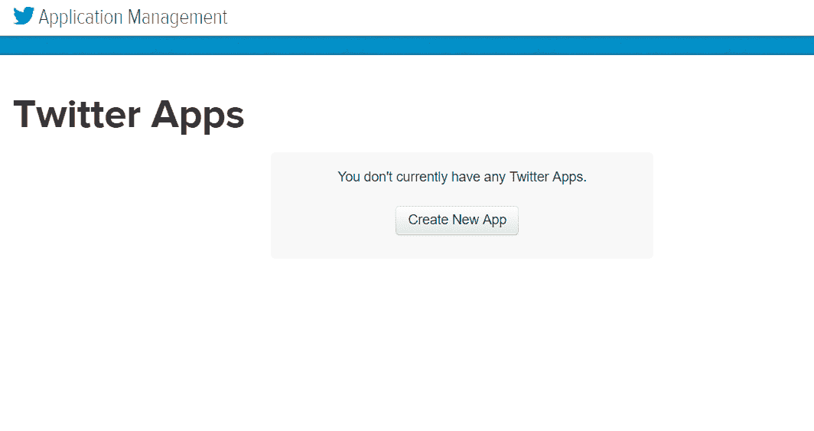
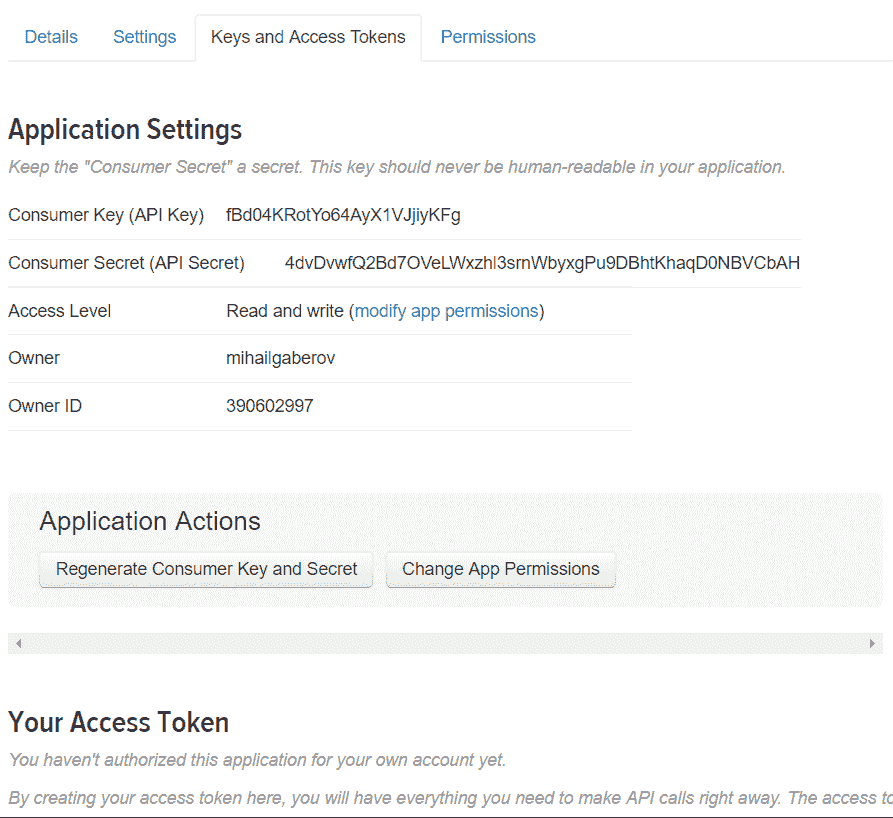
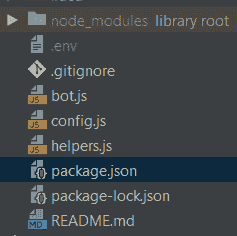
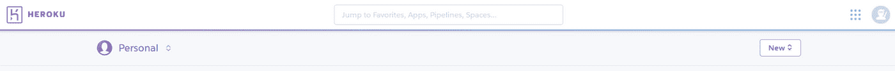
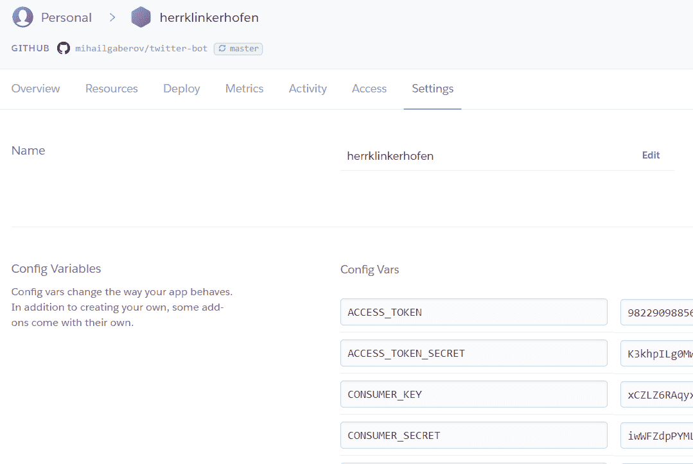
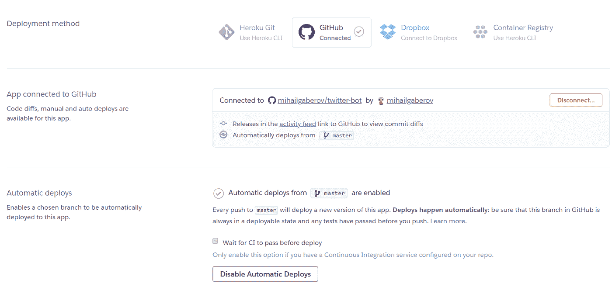
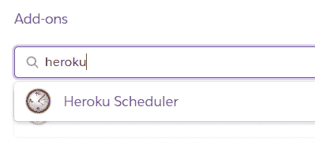
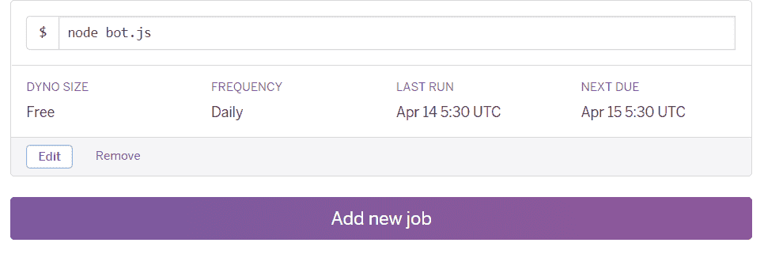

# 在凌晨 5 点创建一个推特机器人

> 原文：<https://itnext.io/creating-a-twitter-bot-in-5am-2a42a9920e67?source=collection_archive---------1----------------------->


[freestocks.org](https://unsplash.com/photos/HAIPJ8PyeL8?utm_source=unsplash&utm_medium=referral&utm_content=creditCopyText)在 [Unsplash](https://unsplash.com/search/photos/twitter-bot?utm_source=unsplash&utm_medium=referral&utm_content=creditCopyText) 上拍照

如今，社交网络的使用被认为是一件很正常的事情，是我们日常生活的一部分。也许大部分人甚至不去想它。他们只是自动使用它们。就这样。

但是这些人中的一些人也可能会问这个让我写这篇文章的问题——我们从这些网络中获得了什么来给他们我们的个人数据、我们的兴趣和偏好？我们能用它们做什么？

嗯，创建一个 Twitter 机器人不是新的也不是热门话题(甚至不难做到)，但这是我提到的事情之一。Twitter 是一个社交网络，它产生并使用人与人之间的大量数据流。这个网络中所谓的机器人实际上是用某种编程语言编写的小程序。

*我们能从社交网络中获得的最有价值的东西之一就是数据。我们可以用自动化的方式来完成。这就是这些软件，机器人，可以帮助我们的地方。*

如果你在谷歌上搜索这个话题，你会发现 Twitter 机器人最常见的例子之一是转发或喜欢某些推文的机器人，通过某些标准进行搜索。该标准可以由机器人的创建者来定义。我在这个话题上读得越多，我就越想我能用这个机器人做什么。此外，我必须确保这不会垃圾邮件和骚扰其他人。还是那句话，最简单的答案就是正确的。我已经决定创建一个机器人，它将向我发送私人消息，其中包含与我感兴趣的主题相关的推文信息。在我完成第一个版本后不久(大约在早上 5 点开始，*因此有了这篇文章的标题:)**我想我自己也应该做得对其他人更有用一点。*

**我就是这样用 Node.js 创建了一个 Twitter 机器人，向他的追随者直接发送消息，提供与特定搜索标准相关的 tweets 信息。**

*现在说得够多了，让我们开始有趣的部分。*

***TL；博士***

*本文的其余部分将是如何创建一个 twitter 机器人并将其部署到 Heroku 的一步一步的教程。机器人会向他的追随者发送私人信息。这些消息将包含与预定义搜索标准相关的推文。你可能已经熟悉了# *标签*这个术语。实际上，这样的标签将成为我们的搜索标准，或者是我们过滤推文的关键词。在我的例子中，我选择使用以下代码:#js、#javascript、#JS、#JavaScript、#react、#reactjs、#nodejs、#Nodejs。这意味着机器人会发送提到他们的消息。然后，我们将获取机器人拥有的所有追随者的 id，并使用它们向他们发送直接消息。*

*如果你想直接跳到代码，这里有[的 GitHub 回购](https://github.com/mihailgaberov/twitter-bot)。*

***初始设置** 通过 ***npm*** 设置项目:*

*由于这将是一个基于 Node.js 的项目，使用著名的节点包管理器 [NPM](https://www.npmjs.com/) 是有意义的。首先，确保你已经安装了 [Node.js](https://nodejs.org/en/) ，然后你就可以使用 *npm* 。*

*完成安装后，您可以为我们的机器人设置一个简单的项目。要开始，请在您的终端中键入以下内容:*

1.  ****NPM*init***
2.  *回答 *npm* 要求您创建 package.json 文件的问题(您可以跳过这一步，使用默认答案，方法是添加- **y** 参数，如下:***NPM**init**-y***)*
3.  *通过键入:***NPM I twit dotenv-save-dev****安装我们需要的依赖项。*这将安装我们创建机器人所需的所有软件包。(‘I’是‘install’的缩写)*

**注* *约* *包* **:** 既有包又有名噪一时的。第一个[](https://www.npmjs.com/package/dotenv)*是通过*处理[环境变量](https://en.wikipedia.org/wiki/Environment_variable)。env* 文件。这是我们存储 API 密钥和令牌的地方。第二个，即 [*twit*](https://www.npmjs.com/package/twit) ，是 Node.js 的一个 Twitter API 客户端，它提供了一个很好的、容易使用的与 Twitter API 交互的界面。**

****配置设置** 为了能够使用[推特应用编程接口](https://developer.twitter.com/en/docs)，我们需要获得四样东西:消费者密钥、消费者秘密、访问令牌和访问令牌秘密。这些都是简单的字符串，您稍后会看到。要得到这些，你唯一需要做的就是推特账户。一旦你得到了它，去[https://apps.twitter.com/](https://apps.twitter.com/)创建一个新的应用程序。**

********

**然后，您必须转到“密钥和访问令牌”选项卡，并通过单击底部的按钮生成令牌。**

****

**现在，一旦您完成了这些配置，我们就可以继续了。回到您的项目并创建一个新文件。您可以将其命名为*config . js*把**后面的代码放在里面:****

```
**require('dotenv').config()
module.exports = {
 consumer_key: process.env.CONSUMER_KEY,
 consumer_secret: process.env.CONSUMER_SECRET,
 access_token: process.env.ACCESS_TOKEN,
 access_token_secret: process.env.ACCESS_TOKEN_SECRET
}**
```

**这只是一个包含我们需要的配置的简单对象。通过使用 [Node.js 模块导出](https://nodejs.org/api/modules.html)，我们将它公开以备后用。**

**然后在主项目目录中创建另一个文件并命名为*。*[*env*](https://www.twilio.com/blog/2017/08/working-with-environment-variables-in-node-js.html)——这是我们将放置先前生成的密钥的地方。它应该是这样的:**

```
**CONSUMER_KEY=jsjIiJsjNslaxxxxxxxxxx
CONSUMER_SECRET=ksjdhdjdxxxxxxxx
ACCESS_TOKEN=jdjwowlgxxxxxxxxxxxx
ACCESS_TOKEN_SECRET=jsoJdPxxxxx**
```

**当然，密钥的值是您的个人秘密密钥，这就是为什么您**必须** **而不是**将该文件提交到公共存储库中。**

****与 Twitter API** 交互一旦我们完成了配置，我们就可以开始实现我们机器人的主要逻辑了。我们将把这个逻辑放到一个新文件中——*bot . js*(当然你可以随意命名自己的文件)。**

**从要求(例如导入)我们拥有的依赖项开始:**

```
**const Twit = require('twit')
const config = require('./config')
const helpers = require('./helpers')**
```

**第一个是我们安装的帮助我们轻松操作 Twitter APIs 的包。第二个是我们的配置，最后一个是一个小的帮助文件，其中包含一些有用的功能，我们可以重复使用。稍后我会更详细地解释这一点。**

**顺便提一下，我必须提到我使用的 Node.js 版本是最新的稳定版本。如果你不想明确地更新你的，我建议用你当前的教程来试试这个教程——如果有用的话，不用麻烦了。**

**到目前为止，您的项目结构最终将是这样的:**

****

**下一步是通过将我们的配置作为输入参数传递来初始化 Twit 客户机:**

```
**const Twitter = new Twit(config)**
```

**在这之后，就是我们主要函数的实现。它实现了我们需要的所有逻辑来获取推文，根据我们的搜索标准过滤它们，并向我们的机器人的追随者发送直接消息。**

****搜索** 我们从搜索功能开始，使用 *twit* 包中的 *get()* 方法向*搜索/tweets* 端点发送 get 请求。我们还传递了一个 *params* 对象，包含我们的搜索偏好，比如我们讨论过的标签和其他一些过滤器。**

```
**const sendDirectMessage = function ()
const params = {
  q: '#js, #javascript, #JavaScript, #JS, #Javascript, #react,       #reactjs, #nodejs, #Nodejs, -filter:retweets',
  result_type: 'recent',
  lang: 'en'
}Twitter.get('search/tweets', params, function (err, data) {…}**
```

****过滤响应** 注意最后一部分的‘q’属性。这是由 [Twitter API](https://developer.twitter.com/en/docs/tweets/search/api-reference/get-search-tweets.html) 提供的过滤器，允许我们过滤我们将得到的结果，并确保我们不会收到任何转发。这有助于我们减少机器人报告消息中的重复。
*result_type* 是 Twitter 提供的另一个标志，它将结果缩小到只包括最近发布的推文。**

**下一步是生成机器人将发送给他的追随者的消息的内容。这可以通过简单地迭代*数据*来完成。*status*数组，包含我们搜索请求返回的所有 tweets。然后我使用 [ES6 字符串模板](http://es6-features.org/#StringInterpolation)来组成*内容*对象，它最终只是另一个稍长的字符串，将作为消息的实际内容。**

```
**data.statuses.forEach((status) => {
  content += ` — — New Tweet:\n
  Status text: ${status.text} \n
  By: ${status.user.name}\n\n`
})**
```

****获取******追随者** 然后我们需要做另一个请求，以获取所有追随者的 id。当我们实现实际发送背后的功能时，我们将使用这些 id。这是通过点击' *followers/ids* '端点并传递 id 和我们的机器人的屏幕名称(尽管只有 id 是必需的参数)来完成的。****

```
****Twitter.get('followers/ids', {
  user_id: 982290988562608129,
  screen_name: 'herrklinkerhof3'
}, function (err, response) {…}****
```

******发送** **消息** 在我们请求获取关注者 id 的回调部分，是发送直接消息的逻辑所在。我们使用另一个循环([*forEach*](https://developer.mozilla.org/en-US/docs/Web/JavaScript/Reference/Global_Objects/Array/forEach)JavaScript 数组的方法)来遍历关注者 id，并对每个关注者 id 向“*direct _ messages/events/new*”发出 POST 请求，发布我们之前编写的内容。****

```
****response.ids.forEach((id) => {
  Twitter.post('direct_messages/events/new', {
    event: {
      'type': 'message_create',
      'message_create': {
        'target': {
          'recipient_id': id
        },
        'message_data': {
          'text': content,
        }
      }
    }
}, function (err, response) {…}****
```

****仅此而已。在文件的底部，我们只调用新创建的函数。****

******错误** **处理** 在本教程中没有实现实际的错误处理。这将是另一篇文章的主题。这里，为了简单起见，我们只是控制台记录错误。****

****完成所有步骤后，您的文件应该是这样的:****

```
****const Twit = require('twit')
const config = require('./config')
const helpers = require('./helpers')
const Twitter = new Twit(config)const sendDirectMessage = function () {
  const params = {
    q: '#js, #javascript, #JavaScript, #JS, #Javascript, #react, #reactjs, #nodejs, #Nodejs, -filter:retweets',
    result_type: 'recent',
    lang: 'en'
  } Twitter.get('search/tweets', params, function (err, data) {
    if (!err) {
      let content = `== New report (from ${helpers.getCurrentTime()}           (${data.statuses.length} tweets)) ==\n` data.statuses.forEach((status) => {
        content += ` — — New Tweet:\n
        Status text: ${status.text} \n
        By: ${status.user.name}\n\n`
      }) Twitter.get('followers/ids', {
        user_id: 982290988562608129,
        screen_name: 'herrklinkerhof3'
      }, function (err, response) {
           if (err) {
             console.log('Something went wrong while getting followers. Error: ', err)
           } if (response) {
             response.ids.forEach((id) => {
               Twitter.post('direct_messages/events/new', {
                 event: {
                   'type': 'message_create',
                   'message_create': {
                     'target': {
                       'recipient_id': id
                     },
                     'message_data': {
                       'text': content,
                     }
                   } } }, function (err, response) {
           if (response) {
             console.log('Message sent. Response: ', response)
           } if (err) {
             console.log('Something went wrong while sending message. Error: ', err)
           }
         })
       })
      }
    }) } else {
       console.log('Something went wrong while searching.')
     }
  })
}sendDirectMessage()****
```

******现在是什么时间** 我前面提到的 helpers 文件( *helpers.js* )。目前它只有一个功能，但是它可以根据您的需要轻松地拥有多个功能。这背后的想法是向您展示当您模块化代码并使其可重用时，使用是多么方便和容易。正在讨论的函数用于获取我们包含在报告标题中的当前时间。就这么简单。****

******在本地运行 bot** 要在本地运行 bot，您唯一要做的就是打开您的终端并键入以下内容:****

*****npm 启动*****

****如果一切正常，您将看到“消息已发送”。响应:…'消息在控制台和所有现有的追随者将收到生成的消息。****

****在我们完成编码之后，是时候把我们的工作部署到某个地方了。最著名的主持平台之一叫做 [Heroku](https://id.heroku.com/login) 。我们将使用它来托管我们的 bot 应用程序。它给你选择开一个免费帐户，并有多达 5 个网络应用程序部署(他们会给你更多，如果你用信用卡号码验证自己)。创建帐户并登录后，您会在屏幕顶部看到一个“新建”菜单，您可以使用它来创建新的应用程序。****

********

****您可以随意命名您的应用程序。****

******配置** **变量** 创建新应用后，你应该可以找到“设置”选项卡。转到那里，点击“显示配置变量”按钮。在这里，您可以输入您的配置变量(您还记得—您的消费者和 API 密钥)。****

********

****添加它们后，只需再做一件事，即可部署您的应用程序。转到“部署”选项卡，将 GitHub 存储库连接到应用程序。然后启用自动部署，就这样。****

********

****在同一页的底部，你会发现“部署分支”按钮。使用它开始您的第一次部署。****

****完成后，你应该把你的机器人部署到 Heroku。如果你已经启用了自动部署，每次当你提交一些东西到你的 GitHub 库时，一个新的部署将被触发。****

****当我们想要在特定的时间触发特定的任务时，Heroku 中有一些非常有用的东西可以使用。它叫做 [Heroku Scheduler](https://devcenter.heroku.com/articles/scheduler) ，一个插件可以让你做到这一点。你可以在“资源”标签下找到它。****

********

****如果你输入了你的信用卡信息，你就可以免费使用它。在我们的例子中，我们将使用它在特定时间运行 bot，这意味着它将执行我们实现的搜索和发送消息的逻辑。我们通过添加由调度程序运行的作业来实现这一点，如下所示:****

********

****通过这种方式，我们可以有定期的报告，并及时了解人们在推特上关注什么，关注我们预先定义的兴趣。我在我的实现中使用了它，它在世界协调时每天早上 5:30 被触发。****

******结论** 现在你应该已经在 Heroku 上部署了一个完全正常工作的 Twitter 机器人，或者至少知道如何实现它。简而言之，我们所做的是，我们看到了如何让社交网络为我们服务，通过实现一个 Twitter 机器人，让他寻找我们感兴趣的信息，并将报告作为直接消息发送给我们。此外，我们不仅为自己，也为对相同主题感兴趣的任何人增加了一个有用的功能，允许机器人的追随者也可以获得这些报告。我希望这对你和我来说都是一次有趣的旅行。欢迎把你的问题或评论发给我，或者你可以分享你的经验。****

******未完待续…** 在另一篇文章中，我们将看到如何使用数据库来存储这些推文的最后搜索结果，并生成只包含唯一新推文的报告。敬请关注。****

******更新** *我已经减少了用于搜索的标签的初始数量，并使用了* [*或运算符*](https://developer.twitter.com/en/docs/tweets/search/guides/standard-operators) *来获得更好的搜索结果。*****

*****你可以在这里找到我的实现*[*https://github.com/mihailgaberov/twitter-bot*](https://github.com/mihailgaberov/twitter-bot)*。如果你想开始收到和我一样的报告，请在 Twitter @HerrKlinkerhof3 中关注我的机器人。*****