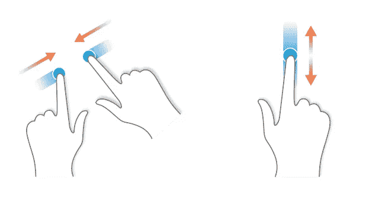

# 创建一个 useGestures 挂钩

> 原文：<https://itnext.io/creating-a-usegestures-hook-b4b02b9e00a3?source=collection_archive---------5----------------------->

## TL；博士；医生

这里是到 [npm 包](https://www.npmjs.com/package/use-gestures)和[演示站点](https://giladl82.github.io/use-gestures-app/)的链接

## 我的动力

最近我一直在用 cordova 开发这个手机应用程序😥这是我参与的最糟糕的项目之一。但有时你可能会发现塞翁失马焉知非福🙄。出于这个项目的痛苦，使用 react 的新版本和钩子作为合法的模式，我决定尝试一下，创建一个自定义钩子来处理移动手势。

## 履行

移动手势是触摸事件的结果。
现在 react 有了一个事件监听器来处理像`onTouchStart`这样的事件，但是我需要以一种更通用的方式使用它，而不仅仅是把它放在一个元素上。因此，我在这项工作中使用了两个挂钩。`useRef`和`useEffect`

这个钩子从 react 内置钩子`useRef`中获得一个 ref 对象。

> "`*useRef*` 返回一个可变 ref 对象，其`.current`属性初始化为传递的参数(`initialValue`)。返回的对象将在组件的整个生命周期内存在”“[钩子 API 引用](https://reactjs.org/docs/hooks-reference.html#useeffect)

使用`useEffect`钩子，我将触摸事件监听器附加到被引用的元素上，或者从被引用的元素上分离。

`useEffect`的定义有点长，所以我在这里跳过它，只说`useEffect`在每次渲染后运行，这是你将组件附加到外部副作用(因此得名)的方式，如通用触摸事件。

## 将触摸事件转换为手势

实现三种手势类型:平移、滑动和挤压。
**平移**和**滑动**都是简单的触摸事件，差别很小。
**滑动**事件有方向，只有当触摸移动距离大于最小值时才会被触发。
**捏**事件是两个手指触碰事件。

我已经删除了所有我说过的代码，还有一些我稍后会讲到的代码。

这里有两件事需要注意

1.  在每个事件处理器上，我们需要确定触摸是否是挤压事件(确切地说是两个触摸指针)
2.  在触摸移动和触摸结束时，我们需要检查手势是否触发了滑动事件

## 助手功能

这里我们有四个帮助函数

`getDistance`返回两个指针(触摸)之间的距离

`getAngleDeg`返回这些指针之间的角度，以度为单位。

`callHandler`获取一个事件名和事件对象到事件处理程序的监听器函数，并分派附属的监听器函数。

`getCurrentTouches`负责理解原始触摸事件，并确定我们稍后使用的自定义事件对象。

## 一个例子

这是一个使用`useGestures`钩子旋转图像的简单例子。
你可以在这个[演示页面](https://giladl82.github.io/use-gestures-app/)上找到这个例子以及更多

就是这样
我希望这篇文章对你有帮助，我也希望我的[使用手势](https://www.npmjs.com/package/use-gestures)包对你有帮助😀