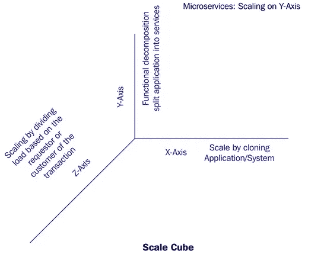
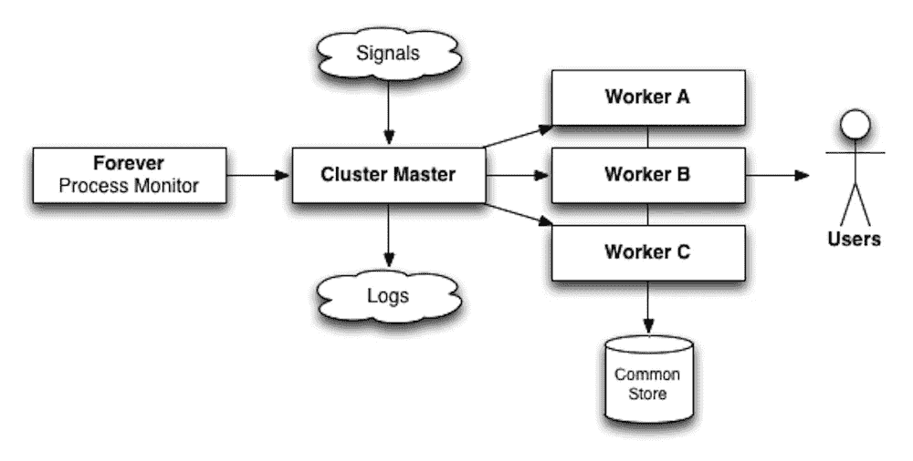
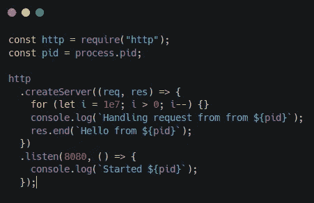
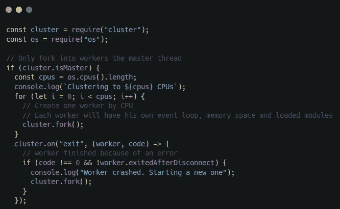
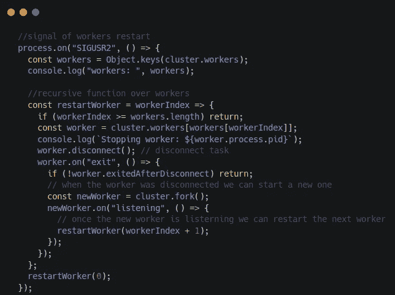
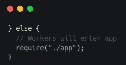
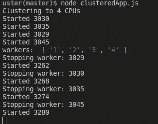
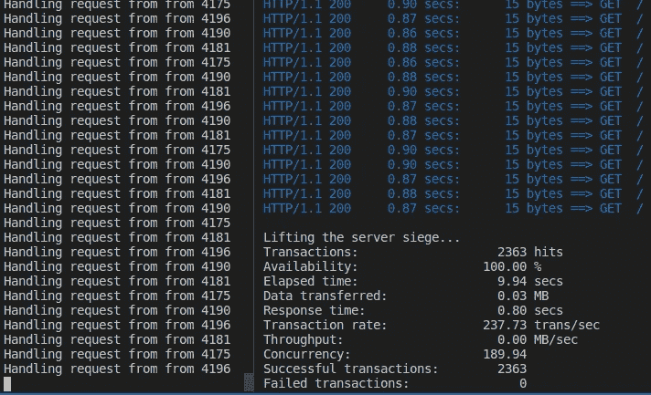

# NodeJS 的可伸缩性:创建零停机集群

> 原文：<https://itnext.io/creating-a-zero-downtime-cluster-in-nodejs-ad879ee3160?source=collection_archive---------4----------------------->

这一次我们将构建一个系统，它使用节点**集群模块**来克隆实例，并以更好的方式管理我们的请求。

在 NodeJS 中创建零停机集群

为了介绍这篇文章，我想引用书中著名的 scale cube 模型:*《可伸缩性的艺术:现代企业的可伸缩 Web 架构、流程和组织》，作者:* *Martin L. Abbott 和 Michael T* 。

缩放立方体模型

在这个可伸缩性的三维模型中，原点(0，0，0)代表可伸缩性最低的系统。它假设系统是部署在单个服务器实例上的一个整体。如图所示，一个系统可以通过在三维空间中投入适当的努力来扩展。

*   **x 轴:**克隆
*   **y 轴:**按服务/功能分解
*   **z 轴:**按数据分区分割

一个整体的、未扩展的应用程序最直观的演变是沿着 x 轴*向右移动*，这很简单，大多数时候不贵(就开发成本而言)，而且非常高效。这项技术背后的原理很简单，即克隆同一个应用程序 *n 次*并让每个实例处理工作负载的 1/n。

沿着 y 轴*扩展意味着根据应用的功能、服务或用例来分解应用。在大多数情况下，这意味着从一个单一的应用程序分解成更小的服务。*

在 *z 轴*缩放中，应用程序被分割，每个实例只负责全部数据的一部分。这是一种主要用于数据库的技术，也叫做**水平分区或分片。**

考虑到应用程序的复杂性，只有在其他两个应用程序得到充分利用，并且我们的应用程序具有真正值得在这种复杂扩展类型上投资的规模时，才应该考虑沿着 *z 轴*扩展应用程序。

*y 轴*缩放是一个包含大量信息的主题。主角会是第一个: *x 轴*。

如果你曾在任何云应用中工作过，它可能已经在使用任何**扩展机制**来克隆实例，例如通过自动扩展策略。

这很好，也很有效。但是，它**是有成本的。**任何云提供商都会向您收取以下费用:

*   使用负载平衡器
*   添加更多机器
*   垂直扩展机器

最后一种机制不太常见，但可能会发生。

虽然那东西很好，也很必要；我们能从代码方面做些什么来降低成本和增加灵活性呢？**创建集群。**🚀

为了执行它，我们需要使用来自节点的[集群模块。集群模块简化了同一应用程序新实例的**分叉**，并自动在它们之间分配传入连接，如下图所示:](https://nodejs.org/api/cluster.html)

集群模块

主进程接收信号，发出日志，并负责生成大量进程( **workers** )，每个进程代表我们想要扩展的应用程序的一个实例。他们都使用同一个商店。然后，每个传入的连接通过克隆的工作线程进行分配，在它们之间分配负载。

扩展应用程序还带来了其他优势，特别是即使在出现故障或崩溃的情况下也能保持一定的服务水平。这个属性也被称为**弹性**，它有助于系统的可用性，是维护一个 **SLA** 的关键。

有两种常见的情况会影响我们的 SLA:

*   出现错误
*   代码需要更新

在这两种情况下，应用程序都需要重启，所以有一个小窗口，我们的应用程序**不可用。**💥使用集群模块，这是一个非常简单的任务；该模式包括**一次重启一个工人。**通过这种方式，剩余的工作人员可以继续操作和维护可用的应用程序服务。我们来实现这个吧！💻

**app.js** 非常简单，如下图所示:

app.js

它通过发回包含其 **PID** 的消息来响应任何请求；这将有助于识别应用程序的哪个实例正在处理请求。此外，为了模拟一些实际的 CPU 工作，我们执行了 1000 万次空循环；如果没有这一点，考虑到我们将为这个例子运行的小规模测试，服务器负载将几乎为零。

现在让我们尝试使用集群模块来扩展我们的应用程序。为了便于解释，我分成了几个小部分。

集群应用第 1 部分

首先，在需要模块之后，我们只为主线程创建一个 if 语句。在内部，我们获得 CPU 的数量，然后，我们使用 **fork** 函数通过 CPU 创建一个 worker。后面，fork 使用 [child_process.fork()](https://nodejs.org/api/child_process.html#child_process_child_process_fork_modulepath_args_options) 来实现拆分。

我们为 [**出口事件**](https://nodejs.org/api/cluster.html#cluster_event_exit) 创建一个监听器。这一部分很重要，因为当一个错误发生时，实例会死亡，但是我们再次使用 **fork** 创建另一个实例。

集群应用第二部分

当进程终止时，我们需要管理案例。我们用的是 [**SIGUSR2**](http://people.cs.pitt.edu/~alanjawi/cs449/code/shell/UnixSignals.htm) 那是用户发出的 UNIX 信号(对不起 windows 用户)。

一旦应用程序收到该信号，它就会递归地重新启动每个工作线程。您可能会注意到，在任何时候都会有多个工作线程并行重启，因此我们会确保可用性。 *restartWorker* 函数断开工作线程并为退出事件创建一个监听器。这一次，处理程序会有所不同。[*exited after disconnect*如果工人因`.kill()`或`.disconnect()`退出，T22 为`true`。](https://nodejs.org/api/cluster.html#cluster_worker_exitedafterdisconnect)

一旦旧的工作者存在，我们就创建一个新的工作者和一个监听器，一旦它在监听，我们就知道什么时候可以重新启动下一个工作者。

集群应用第 3 部分

最后但同样重要的是；还记得文件开头的 *if* 语句吗？不是主线程的工作线程会直接进入**执行我们的 app** 。

现在我们已经有了实现，让我们执行它。

首先，我们应该用命令`node clusteredApp`运行应用程序

我们需要用`ps af`找到主流程 PID

主流程应该是一组节点流程的父流程。一旦我们有了 PID，我们就可以向它发送信号:`kill -SIGUSR2 <PID>`

现在 *clusteredApp* 应用程序的输出应该显示如下:

集群应用输出

我们可以尝试使用[围攻](https://www.joedog.org/siege-home/)来验证在工作进程重启期间，我们不会对我们的应用程序的可用性产生任何重大影响:

`siege -c200 -t10S [http://localhost:8080](http://localhost:8080)`

前面的命令将在 10 秒钟内向服务器加载 200 个并发连接。作为参考，具有 4 个处理器的系统的结果是每秒 90 个事务，平均 CPU 利用率仅为 20%

该过程大约需要 10 秒钟，尝试如上所示终止主进程，以尽可能测试系统。

围攻测试

在左侧控制台中，我们可以看到 *app.js* 处理请求的输出。右边终端显示围攻测试(10 个过程击杀)的最终输出，带有(嘿！😎)100%的可用性。

用过的代码在 [GitHub 仓库](https://github.com/boxgames1/nodejs-patterns/tree/master/scalability-architectural-patterns/zero-downtime-cluster)里。

[PM2](https://github.com/Unitech/pm2) 是一个基于集群的小工具，它提供负载平衡、进程监控、零停机重启和其他功能。这篇文章是为了学习的目的，但如果你想达到这样的目标，PM2 应该会有所帮助。

我希望您喜欢这篇提炼了 Node 魔力的文章🍄

我是奥利弗·阿隆索，在西班牙远程工作的软件工程师。你可以在[我的网络](https://oliveralonso.dev/)或 [Github 账户中找到更多关于我的资料。](https://github.com/boxgames1)

感谢阅读！