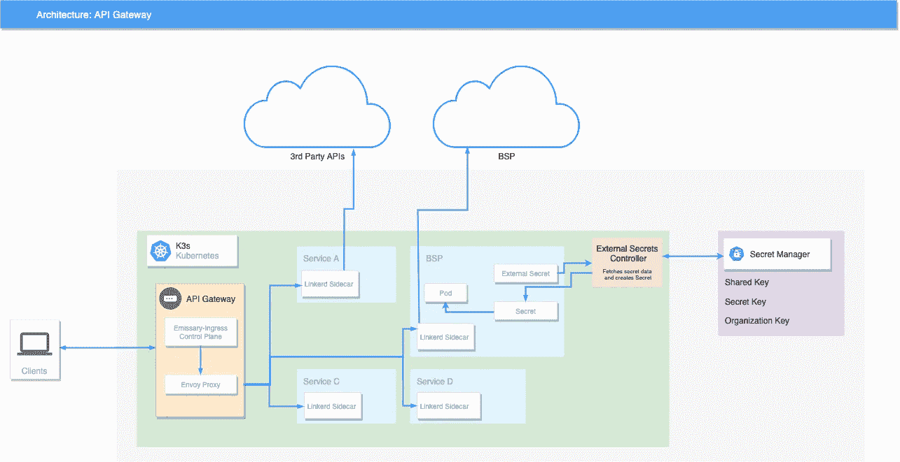
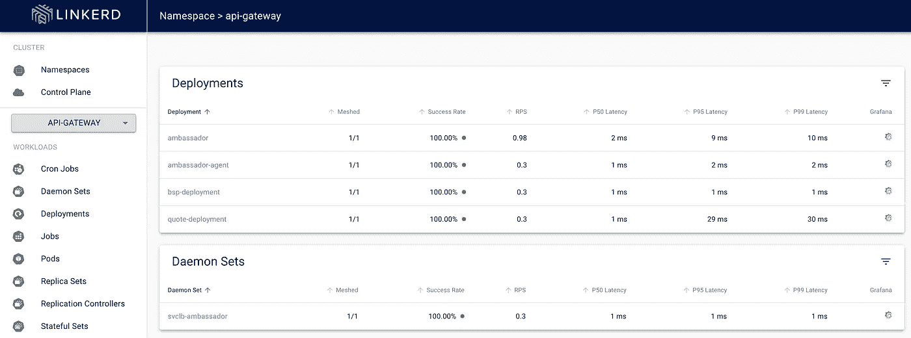

# 在 K3s 上使用使者入口和链接器创建 API 网关

> 原文：<https://itnext.io/creating-an-api-gateway-using-emissary-ingress-and-linkerd-on-k3s-612c1772d48a?source=collection_archive---------1----------------------->

了解如何使用大使使者入口和链接器在 K3s 上创建 API 网关。

# 项目架构和核心组件



我们项目的目标是创建一个轻量级 API 网关，将来自客户端的请求路由到各种服务。这些服务包括从定制设计的内部 API 到我们的应用程序所需的第三方 API。此外，我们需要网关具有相互 TLS 加密以及可观察性组件，以查看通过网关的流量。

下面是创建我们的 API 网关所需的组件和应用程序列表:

## [K3s](https://k3s.io/)

K3s 是一个轻量级的 Kubernetes 发行版，设计用于需要 Kubernetes 的好处而不需要大的安装规模的情况。K3s 可用于生产，易于安装，并且是小于 100MB 的二进制文件。对于我们的用例，我们需要一个对我们的客户来说尽可能轻量级的 Kubernetes 发行版，使 K3s 成为理想的选择。

## [LimaVM](https://github.com/lima-vm/lima)

LimaVM 是一个主要用于运行 MacOS 的 Linux 虚拟机。我们的开发工作流程完全集中在使用装有 MacOS 的机器上，但是考虑到需要运行 K3s，我们需要一种运行 Linux 的方法。鉴于 Lima 的功能性和易用性，我们决定将 LimaVM 实现到我们的工具集中。

## [大使使者入境](https://www.getambassador.io/docs/emissary/)

使者入口是一个开源的 Kubernetes-native API 网关+第 7 层负载平衡器，Kubernetes 入口建立在[特使代理](https://www.envoyproxy.io/)之上。借助使者入口，我们可以通过大使的映射 CRDs 管理流量和路由，并通过 TLS 加密以及服务器和客户端证书验证来保护微服务。

## [Linkerd](https://linkerd.io/)

Linkerd 是 Kubernetes 的一个服务网。Linkerd 的工作原理是为每个服务实例安装 sidecar 代理，然后代理处理所有进出服务的流量。Linkerd 自动将相互 TLS 添加到任何集群上的 TCP 通信中，无需额外的配置，并且使用 *linkerd-viz* 扩展，用户可以看到从一个服务到另一个服务的实时指标和调用。

## 【可选】[外部机密操作员](https://external-secrets.io/)

外部秘密运营商是一个 Kubernetes 运营商，允许集成外部秘密管理系统，如谷歌云平台(GCP)和亚马逊网络服务(AWS)。它用于将来自外部 API 的秘密同步到本地 Kubernetes 秘密中，然后可以在部署或其他 Kubernetes 资源中用作环境变量。

# 我们开始吧

## [可选]设置 LimaVM 实例

对于使用 Mac 操作系统的用户，我们建议使用 LimaVM 作为项目的虚拟机。

首先，使用[自制软件](https://brew.sh/)安装 Lima 并启动默认实例:

```
brew install limalimactl start default --tty=false
```

然后，使用命令: *lima 打开 shell。*

## *创建 K3s 集群*

要设置我们的 K3s 集群，我们将在禁用默认 Traefik 入口控制器的情况下安装 K3s，以便我们的使者入口负载平衡器可以使用外部 IP 地址。

```
curl -sfL [https://get.k3s.io](https://get.k3s.io) | sh -s — — disable=traefik
```

要检查一切都已启动并运行，请运行:

```
k3s kubectl get node
```

该命令应该输出如下内容:

```
NAME        STATUS   ROLES                  AGE   VERSION
lima        Ready    control-plane,master   9s    v1.21.5+k3s2
```

## **安装大使使者入口**

我们首先将[舵](https://helm.sh/)安装到我们的集群上:

安装舵

然后使用头盔，安装使者入口:

安装使者-入口

**注意:**对于我们的用例，我们已经决定用我们自己预先存在的名称空间“api-gateway”覆盖默认的“使者”名称空间。要创建自己的命名空间，请运行:

```
kubectl create namespace <namespace name>
```

## 安装 Linkerd

对于安全性和可观察性组件，我们将安装 Linkerd:

安装链接器

## [可选]安装外部机密

我们的一项服务需要存储在谷歌云平台的秘密管理器中的秘密。为了访问这些机密，我们需要使用外部机密操作符，它是通过以下方式安装的:

```
helm repo add external-secrets [https://charts.external-secrets.io](https://charts.external-secrets.io)
```

# 创建网关

现在一切都已经安装好了，让我们创建我们的网关！

安装后，我们应该看到我们的网关服务已经启动，并且在我们的 *api-gateway* 名称空间中使用外部 IP 地址运行。使用这个外部 IP 地址，我们将能够接受请求，并通过映射自定义资源定义(CRD)将它们路由到特定的服务。映射告诉使者入口如何通过主机和 URL 路径将传入请求从集群边缘路由到 Kubernetes 服务。

获得我们的网关服务

在创建映射之前，我们首先需要监听器和主机 CRD 来告诉使者入口监听哪个端口，并需要 TLSContext 来配置高级 TLS 选项，如客户端证书验证。

下面的代码片段是我们的监听器，它监听端口 8443 上的 HTTPS。这个侦听器将只与我们的名称空间中的主机相关联。要收听集群中的所有人，请将*从:SELF* 更改为*从:ALL*

listener.yaml

接下来，让我们创建我们的主机。

host.yaml

我们的主机是一个通配符主机，由主机名中的*表示。这意味着在您的主机名之前输入的任何内容都将被解析为您的 IP 地址。

对于我们的用例，我们需要相互的 TLS。为此，我们需要创建一个 TLS 上下文、一个自签名证书和一个客户端 CA 证书。要创建您的证书，请参阅创建您的 [tls-cert](https://www.getambassador.io/docs/emissary/latest/howtos/tls-termination/#create-a-self-signed-certificate) 和 [client-cacert](https://www.getambassador.io/docs/emissary/latest/howtos/client-cert-validation/) 的使者入口文档。创建后，这些可以放在我们的 Host 和 TLSContext 资源中。

tls-context.yaml

**注意:**对于我们的项目，我们已经决定配置 messenger-ingress，如果客户端没有通过 *cert-required: true 提供证书，就拒绝请求。*

然后，在我们的主机资源中，我们可以通过以下方式连接 TLSContext:

```
tlsContext:
    name: tls-context
```

创建之后，通过 *kubectl apply:* 应用这些资源

```
kubectl apply -f listener.yaml
kubectl apply -f host.yaml
kubectl apply -f tls-context.yaml
```

## 路由到服务

让我们从创建映射开始。

报价映射

这个映射将把来自客户端的请求通过网关路由到服务 *quote-service* 。我们的服务将通过前缀: */quote 进行访问。*

下面是我们的 quote.yaml 文件中相应的报价服务和部署。

报价服务和部署

应用您的报价映射、部署和服务:

```
kubectl apply -f mapping.yaml
kubectl apply -f quote.yaml
```

让我们通过将请求路由到报价服务来测试您的 API 网关:

```
curl -lkv --cert [your client cert] --key [your client key] --pass [your password] https://[external IP]/quote
```

curl 应该输出如下所示的内容:

恭喜你。您已经用 mTLS 创建了一个 API 网关！接下来，让我们进一步保护我们的服务，并通过 Linkerd 增加可观察性。

# 合并 Linkerd

可以通过 *Linkerd 注入*命令手动注入 linkerd，也可以通过注释自动注入。

## 自注入

要自动注入，请将 Linkerd 注释添加到您的名称空间中。应用名称空间后，在此名称空间下创建的任何内容都将被自动注入。

自动注入链接器的命名空间

```
kubectl apply -f namespace.yaml
```

## 手动注射

要直接注入使者入口:

```
kubectl get deploy emissary-ingress -o yaml \
  | linkerd inject - \
  | kubectl apply -f -
```

或者，在名称空间中注入所有部署:

```
kubectl get -n [your namespace] deploy -o yaml \
  | linkerd inject - \
  | kubectl apply -f -
```

## 形象化

要查看 Linkerd 仪表板，请运行以下命令:

```
linkerd viz dashboard
```

这将告诉您在哪里查看您的仪表板。

```
Linkerd dashboard available at:
[http://localhost:50750](http://localhost:50750)
Grafana dashboard available at:
[http://localhost:50750/grafana](http://localhost:50750/grafana)
Opening Linkerd dashboard in the default browser
Failed to open Linkerd dashboard automatically
Visit [http://localhost:50750](http://localhost:50750) in your browser to view the dashboard
```



Linkerd Viz 仪表板

上图显示了 api-gateway 名称空间中的所有部署都注入了 Linkerd。

**注意:**部署“大使”是使者-入口，只是改名了。

这就结束了使用 Linkerd 和大使使者入口创建 API 网关的工作！

对于高级机密配置，我们将使用外部机密运算符。

# [可选]外部机密运算符

对于那些将秘密存储在外部存储系统中的人，如谷歌云平台(GCP)的秘密管理器，我们可以使用[外部秘密操作符](https://external-secrets.io/)来抓取存储在 GCP 的秘密，并将其重新创建为 Kubernetes 秘密。在那里，它们可以被用作 Kubernetes 资源中的环境变量。

首先，我们需要创建一个 gcpsm-secret，它存储我们 GCP 项目的服务帐户凭证。要创建服务帐户凭证，请参见 [GCP 服务帐户文档](https://cloud.google.com/iam/docs/creating-managing-service-accounts)。

正在创建 gcpsm-secret

接下来，我们将创建一个使用 gcpsm-secret 的秘密存储。秘密存储指定如何访问外部秘密。

外部秘密秘密存储

最后，我们可以创建需要复制为 Kubernetes 秘密的秘密。在下面的例子中，我们从 GCP 秘密经理那里得到了秘密组织的密钥。*目标*指定我们想要创建的 Kubernetes 秘密的名称，在 GCP 秘密管理器中保存指定秘密的数据。

外部秘密设置

一旦应用，为了确认创建，运行:*ku bectl get secrets-n[namespace]*

查看秘密

这些秘密可以作为环境变量在您的项目中访问。一个例子是在部署中需要来自 GCP 秘密管理器的秘密。下面的代码片段显示了一个部署的一部分，该部署使用 Kubernetes 的秘密，这些秘密是用外部 Secret 操作符创建的，用于访问一个组织。

恭喜你。现在，您已经将部署配置为利用来自第三方外部存储系统的机密。现在，结合上面创建的 API-Gateway，您可以创建一个映射来将相应的服务路由到这个部署。玩得开心！

# 关于作者

摩根·戈麦斯是 NCR 公司的一名软件工程师。她是亚特兰大人，2021 年毕业于佐治亚理工学院，获得了计算媒体学士学位。

Kevin O'Brien 是 NCR 公司负责零售创新的软件工程师。他于 2021 年毕业于佐治亚理工学院，获得了计算机科学学士学位。

Alex Breazu 是 NCR 公司的一名软件工程师实习生。他是佐治亚大学机械工程专业的学生。