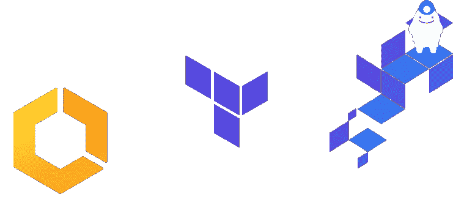

# 使用 terraform 和 terragrunt 为容器创建 ECS Fargate 服务

> 原文：<https://itnext.io/creating-an-ecs-fargate-service-for-container-applications-using-terraform-and-terragrunt-2af5db3b35c0?source=collection_archive---------0----------------------->

在 2022 年求职狂潮期间，我遇到了一个有趣的挑战，那就是 DevOps 工程师的职位。这个任务需要我部署和公开一个 docker 容器，在这个例子中是著名的 [ghost 应用程序](https://hub.docker.com/_/ghost)，使用 [AWS ECS Fargate](https://aws.amazon.com/fargate/) 。我以前曾在 Kubernetes 上做过容器编排员，完全不知道如何绕开 ECS Fargate。我意识到这是一个学习 ECS Fargate 集群以及在其上部署应用程序的绝好机会，同时使用 terraform。

 [## 无服务器计算引擎-AWS Fargate-亚马逊网络服务

### AWS Fargate 部署和管理您的应用程序，而不是基础架构。Fargate 消除了…的运营开销

aws.amazon.com](https://aws.amazon.com/fargate/) 

面临的挑战是为 ECS Fargate 集群设置一个单击式 IaC 部署，它将能够在给定一些阈值的情况下自动扩展；所有这些都要在仅仅 6 个小时内完成！然而，这项任务非常直接，非常耗费精力，因为我必须建立一个 terraform 项目，并决定使用 terragrunt 来配置它。我的第一直觉是搜索允许实现这一功能的人的博客帖子，我能够找到一个这样的博客，它做得足够好，但没有涵盖所有内容。

我把我的任务分成两部分:创建由所有的`networking`和必要的基础应用组成的`base infrastructure`来支持我的用例，创建由`application infrastructure`组成的`base infrastructure`来提供如何部署这样一个应用的通用模板。我的过程如下:

*   创建一个`VPC`、`subnets`并设置所有需要的路由表
*   创建`ECS Fargate`组件
*   - `ECS`集群
*   - `ECS`服务
*   - `ECS`任务定义
*   创建`AWS`应用负载平衡器；`ALB`
*   创建安全组来加强我的应用程序的安全性
*   创建`appautoscaling`策略和阈值，根据定义的指标自动扩展我的应用。

我通过 Anton Babenkov 的著名[模块创建了一个全新的 VPC，它允许我几乎立即配置 VPC、创建多 AZ 子网、配置网关和设置路由表。这节省了我的时间，并帮助我为我的应用程序建立了一个可分解的环境。下一步是确定其余的基础架构组件和应用程序基础架构组件，并相应地隔离它们。我的基础架构组件最终以所有网络相关组件、ECS 集群和一个应用程序负载平衡器的形式来访问我的应用程序；所有其他组件都用于应用程序基础架构。我的项目结构如下所示:](https://registry.terraform.io/modules/terraform-aws-modules/vpc/aws/latest)

我需要首先了解什么是 ECS Fargate 集群，以及在其上部署应用程序需要哪些组件。我找到了一些很好的资源，帮助我[了解 ECS 集群](https://www.freecodecamp.org/news/amazon-ecs-terms-and-architecture-807d8c4960fd/)和[区分 ECS 服务和任务](https://stackoverflow.com/a/42961623/4158615)。我把这些写在这里，让每个人都跟随；ECS 任务是运行来自用户的代码的容器，而 ECS 服务运行并确保所需数量的任务在 ECS 群集中执行。

 [## AWS ECS 中的任务和服务有什么区别？

### 任务定义是一个或多个容器配置的集合。有些任务可能只需要一个容器，而…

stackoverflow.com](https://stackoverflow.com/a/42961623/4158615) 

我创建了三个不同的可用性区域，并为每个区域配置了公共子网。VPC 模块非常灵活，因为您可以选择所需的可用性分区数量，并相应地在其中配置公共/私有子网。为了这个项目，我选择部署到所有三个区域，以实现高可用性部署。

创建 VPC 后，我们创建一个 ECS 群集，这是一个相当简单的任务；您只需要创建一个 ECS 集群资源并命名它。

现在我们有了一个 ECS 集群设置，我们需要创建一个应用程序负载平衡器，它将为我们接收请求，并将其分配给服务将创建和维护的多个任务。

*请注意，为了便于理解，安全组配置故意对外公开，但这是一种不好的做法。*

*请遵守您各自的 VPC 和子网设置，并调整您的安全组的入口和出口，以限制不必要的访问。*

接下来，我们为我们的应用程序配置 ECS 服务和任务。为了完成集群设置，我们需要两个服务角色；一个作为 ECS 服务的执行角色，另一个作为 ECS 按需横向扩展的自动扩展角色。我将服务角色模块化，并创建了两个后续的角色模块。

有了合适的服务角色，我们最终可以为 ghost 容器创建 ECS 服务和任务，并通过 ALB 公开它。

我的最后一项任务是了解[ECS 集群自动扩展是如何工作的](https://stackoverflow.com/questions/65774071/aws-ecs-cluster-auto-scaling-vs-service-auto-scaling/65782253#65782253)。要设置自动伸缩，我只需要定义基于 CPU 和内存的指标，并设置一个良好的估计阈值，这将允许服务向外扩展。可以通过创建一个`aws_appautoscaling_target`并创建相应的`aws_appautoscaling_policy`来创建一个要扩展的指标，从而实现自动扩展。

在我后来的研究中，我还意识到可能有由 EC2 实例组成的 [ECS 集群，用户可以指定 EC2 实例的种类和类型。ECS 确实有很多我在初次接触时没有注意到的技巧。](https://faun.pub/deploy-a-containerized-application-on-aws-with-terraform-bf929bb3bb6b)

这是我分享过的最难也是最长的教程之一，坦白地说，当我收到这个面试挑战时，我非常惊讶，并为自己在给定的时间内完成了它而感到自豪。我意识到在这个教程中有很多内容，可能不是每个人都能够恰当地遵循我一直在做的事情，因此我会在这篇文章中发布回购的 github url，以便好奇的人可以看一看，并能够自己加入这些点。

就个人而言，我认为在 ECS 上托管和公开容器比在 Kubernetes 集群上做同样的事情更难。ECS 可能是一个很好的服务，但是在 terraform 中，设置它并把所有的东西连接在一起以使它工作绝非易事。我可以想象在为更大的团队设置和大规模管理它时的摩擦，以及与它相比 Kubernetes 带来的简单和易于执行，以及更清晰的 API 和资源。

*PS。如果你觉得这有用，我真的很感激 github repo 上的一颗星，因为它允许我在未来创建更多相关的内容。*

 [## GitHub-aliabbasjaffri/ECS-terraform-terra grunt:这个存储库包含要部署的 terra form 代码…

### 该存储库包含 terraform 代码，用于在 ECS Fargate 集群上部署一个简单的 ghost api 容器

github.com](https://github.com/aliabbasjaffri/ecs-terraform-terragrunt)