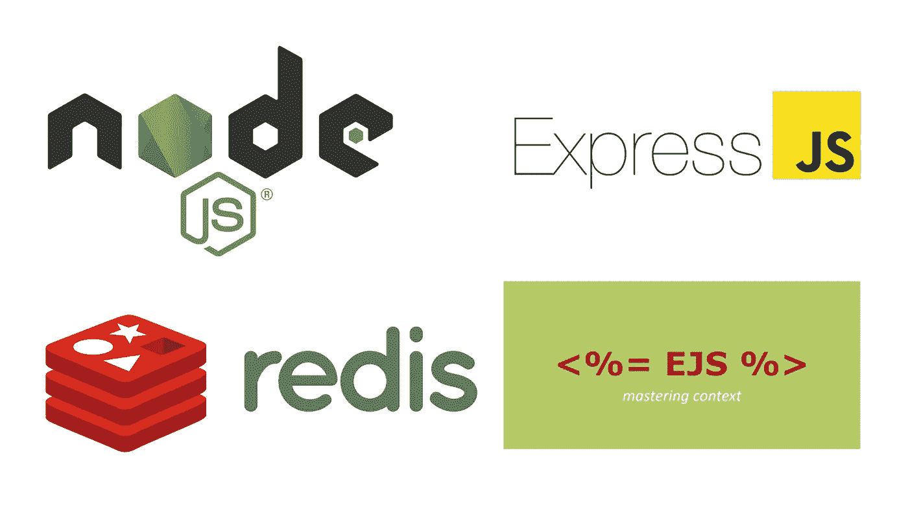
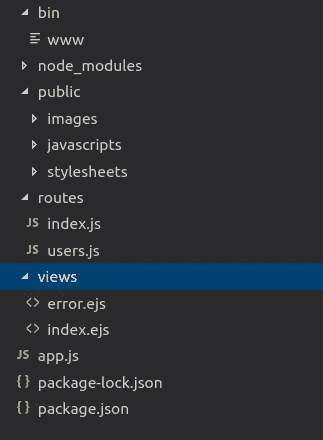

# 使用 Ejs 创建 Expressjs 应用程序，Express-session with Redis

> 原文：<https://itnext.io/creating-an-expressjs-app-using-ejs-express-session-with-redis-9fee113023c6?source=collection_archive---------2----------------------->



今天我们将学习如何使用 expressjs、Ejs 和 express-session with redis 创建简单的登录应用程序。

让我们先来看看我们正在使用的技术。

# Expressjs

> Express 是一个最小且灵活的 Node.js web 应用程序框架，为 web 和移动应用程序提供了一组强大的功能。

[](https://expressjs.com/) [## Express - Node.js web 应用程序框架

### Express 是一个最小且灵活的 Node.js web 应用程序框架，它为 web 和…

expressjs.com](https://expressjs.com/) 

# 雷迪斯

> Redis 是一个内存数据结构项目，它实现了一个分布式的、具有可选持久性的内存键值数据库。Redis 支持不同种类的抽象数据结构，如字符串、列表、映射、集合、有序集合、超对数。

我们将使用它来存储我们的会话数据。

[](https://redis.io/) [## 雷迪斯

### Redis 是一个开源的(BSD 许可的)，内存中的数据结构存储，用作数据库，缓存和消息代理…

redis.io](https://redis.io/) 

# 快速会话

> 这是一个简单的 Express 会话中间件，允许您管理 NodeJS-Express 应用程序中的会话。

[](https://www.npmjs.com/package/express-session) [## 快速会话

### Express 的简单会话中间件

www.npmjs.com](https://www.npmjs.com/package/express-session) 

# EJS

> EJS 是一种简单的模板语言，可以让你用普通的 JavaScript 生成 HTML 标记。

 [## 嵌入 EJS 的 JavaScript 模板

### e 代表有效的。EJS 是一种简单的模板语言，让你用普通的 JavaScript 生成 HTML 标记…

ejs.co](https://ejs.co/) 

# 装置

使用命令安装快速生成器

```
$ npm install -g express-generator
```

现在使用命令创建一个 node-express 项目目录

```
$ express --view=ejs '$project-name'
```

这将创建一个包含必要文件和文件夹的项目目录。现在在项目目录中运行$npm install，这将安装所需的依赖项。您的目录将如下所示



目录结构

使用命令安装 Redis

```
$ wget http://download.redis.io/redis-stable.tar.gz
$ tar xvzf redis-stable.tar.gz
$ cd redis-stable
$ make
```

现在运行这个命令来创建 redis 服务器

```
$ ./redis-server --port 6380 --slaveof 127.0.0.1 6379
```

Redis 服务器现在运行在本地主机和 6379 端口上。在 express 目录中安装这些库

## 雷迪斯

这将把节点服务器与 redis 服务器连接起来

```
$ npm i redis --save
```

## 连接-redis

这将连接 redis 和 express 会话

```
$ npm i connect-redis --save
```

## 快速会话

这将在服务器上创建会话

```
$ npm i express-session --save
```

我们已经完成了所有的安装，现在让我们开始编码。

# 编码

在项目的根文件夹中创建一个 redis.js 文件，并粘贴以下代码。

RedisStore 函数在 redis 中创建一个存储来保存会话数据并返回一个对象，该对象有多个方法，就像我们在 getAllActiveSession()函数中使用的一个方法，我们将在后面使用它。RedisStore 函数接受以下参数。

*   `client`现有客户
*   `host` Redis 服务器主机名
*   `port` Redis 服务器端口号
*   `ttl`服务器会话生存时间

我们已经创建了 redis 存储，现在将此存储连接到 express 会话。为此，请在 app.js 中编写以下代码

这里的会话是中间件，它会根据每个请求执行。现在让我们创建一个呈现登录页面的登录路由。在 app.js 中编写以下代码

res.render 函数将在 views 目录中搜索 login.ejs 文件，并将其呈现给客户端。我们还没有登录页面，现在我们将创建一个。在 views 目录中创建一个 login.ejs 文件，并编写以下代码

创建了登录页面，如果提交登录表单会发生什么？它将给出一个错误，因为我们还没有创建任何路由来处理登录提交。为此，我们将使用 POST 方法创建一个登录路由。

在这个函数中，我们将首先验证用户，如果它存在于数据库中，并且它的密码是正确的(我不会告诉你如何做，因为我假设你已经知道了。).如果用户通过身份验证，将为用户创建一个会话，页面将重定向到列表路由。

在列表路由中，我们可以看到所有活动用户的列表。列表路径将如下所示

记得我们在 redis.js 中定义了一个函数 getAllActiveSession()，这个函数从会话存储中返回用户的所有活动会话。列表路由是受授权保护的，这意味着如果您没有登录，您将无法访问此路由。为了保护这个路由，我创建了一个中间件函数 requireLogin()，它检查用户是否登录。如果没有登录，这个函数会将您重定向到登录页面。

我们获得了活动用户数据，现在我们将通过将这些数据分配给 res.locals.users，将这些数据传递给列表页面，以在客户端显示这些数据。我们可以在 views 目录中的 list.ejs 文件中访问这些数据。因此 list.ejs 文件将如下所示

参见脚本中的这个。为什么我们这样传递用户对象？因为 ejs 文件在服务器上渲染并发送 html 到客户端，如果我们不字符串化对象，我们将在客户端看到[Object object]。所以要把对象发送到客户端，首先我们要在服务器端把对象字符串化，然后在客户端解析它，然后我们就可以使用它了。

现在，您已经具备了使用 ejs 创建 express 应用程序和使用 redis 创建 express 会话的基本知识。为了得到这个 github repo 的更多细节，我还在这个项目中使用 soket 来实时更新活跃用户列表。

 [## hasanraza24/express-app

### 通过在 GitHub 上创建帐户，为 hasanraza24/express-app 开发做出贡献。

github.com](https://github.com/hasanraza24/express-app)