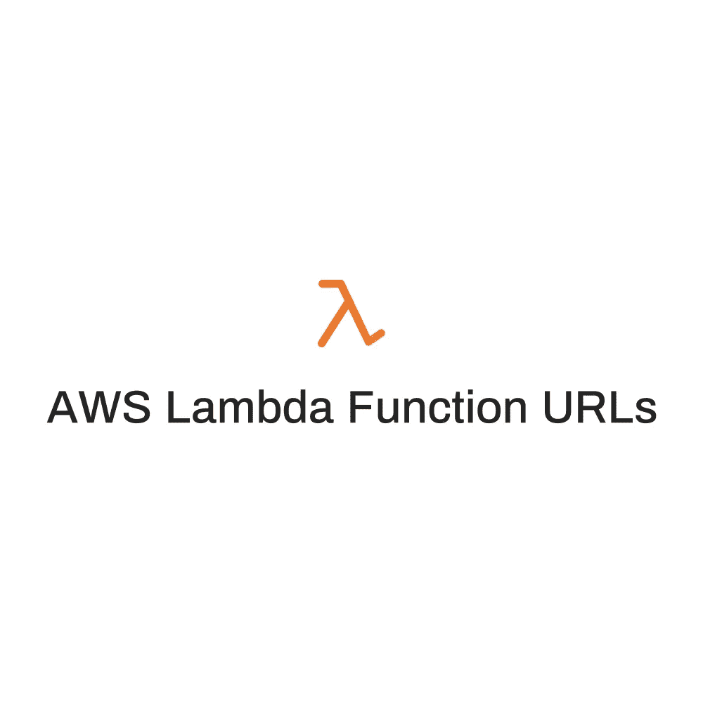
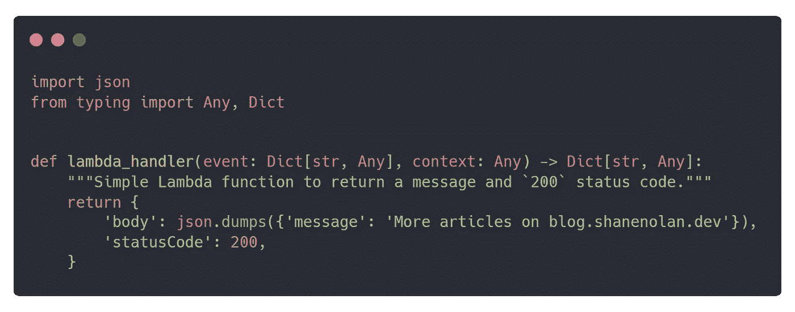
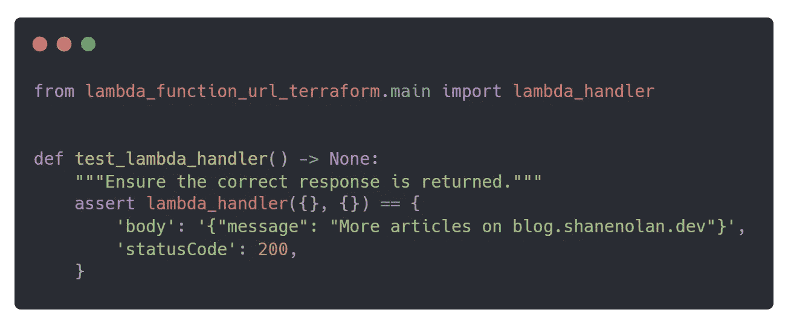
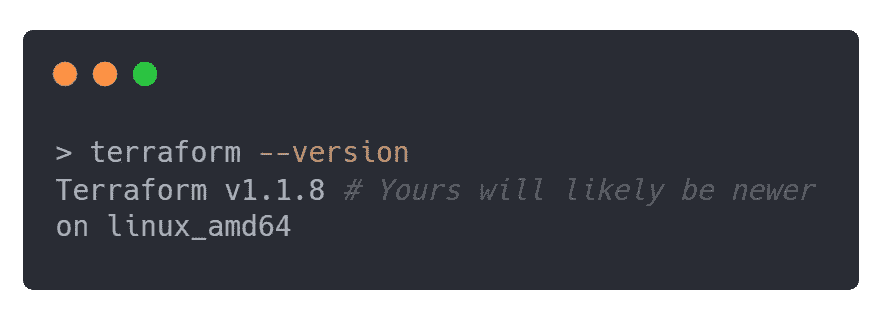
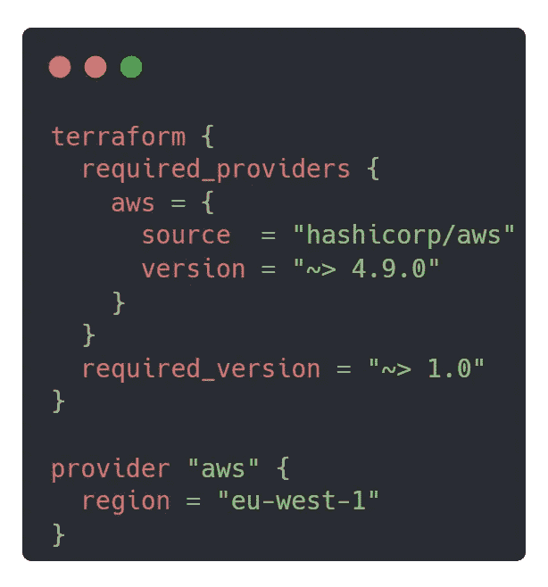
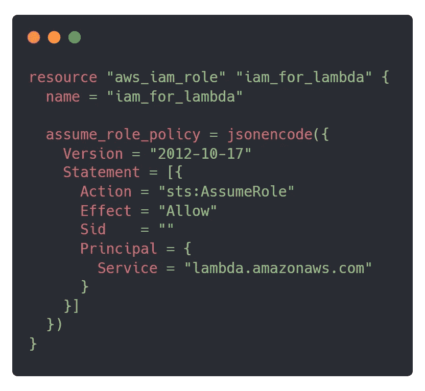
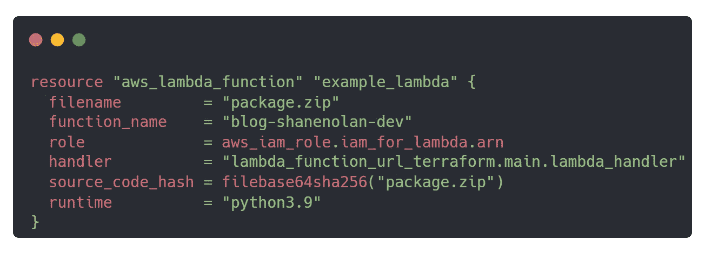
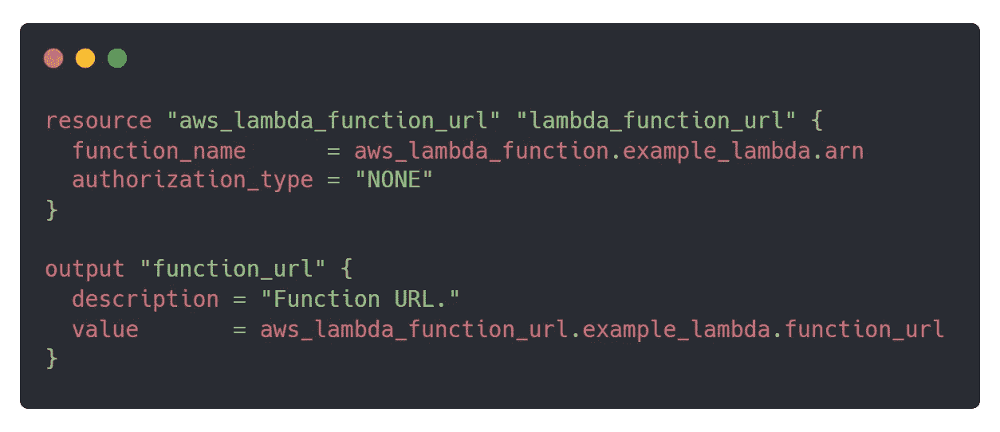

# 创建没有 API 网关的 HTTPS Lambda 端点

> 原文：<https://itnext.io/creating-an-https-lambda-endpoint-without-api-gateway-eb0db1f6af7a?source=collection_archive---------1----------------------->

## 使用功能性 URL 和 Terraform 进行自动化部署



亚马逊网络服务(AWS)最近宣布了[函数 URL](https://aws.amazon.com/about-aws/whats-new/2022/04/aws-lambda-function-urls-built-in-https-endpoints/)，这是一个新的内置功能，允许您通过 HTTPS 端点调用您的函数。默认情况下，终端使用 [AWS 身份访问管理](https://aws.amazon.com/iam/) (IAM)是安全的，但是您可以通过可选的跨源资源共享(CORS)配置和/或自定义授权逻辑来允许公共访问。最初，如果你想通过 HTTPS 公开调用一个 Lambda 函数，你需要设置和配置 [AWS API 网关](https://aws.amazon.com/api-gateway/)或 [AWS 弹性负载平衡](https://aws.amazon.com/elasticloadbalancing/)，一旦超出免费等级就要支付额外费用。幸运的是，函数 URL 不会产生额外的成本🎉。如果您正在构建一个无服务器 REST API 或者需要额外的特性，比如请求-响应[转换](https://docs.aws.amazon.com/apigateway/latest/developerguide/rest-api-data-transformations.html)，我建议您继续使用这些服务。对于 webhooks 或确定加密货币价格这样的小用例，函数 URL 更合适。

这篇博文将演示如何使用函数 URL、 [Python](https://python.org/) 和 [Terraform](https://www.terraform.io/) (一种开源基础设施作为代码工具)来创建 HTTPS Lambda 端点。如果您不想使用 Terraform，可以通过 AWS 用户界面(UI)直接创建函数 URL。你可以在这里关注 AWS 官方指南[。在这个演示中，您可以使用任何与 AWS Lambda 兼容的编程语言，因为原理是相同的。你可以在](https://aws.amazon.com/blogs/aws/announcing-aws-lambda-function-urls-built-in-https-endpoints-for-single-function-microservices/) [Github](https://github.com/ShaneNolan/lambda_function_url_terraform) 上查看该项目的源代码。

# Python Lambda 函数

首先，创建一个 Python 项目，将`main.py`作为 Lambda 的入口点。我推荐使用[这种现代 Python 开发环境](https://medium.com/@shanenullain/creating-a-modern-python-development-environment-3d383c944877)来实现更简单的实现，但是您自己的就足够了。这个项目将使用 Python 版本`3.9.0`。您可以在这里查看支持版本列表。您的项目目录结构应该如下所示:

```
.
├── .editorconfig
├── CHANGELOG.md
├── README.md
├── lambda_function_url_terraform
│   ├── __init__.py
│   └── main.py
├── poetry.lock
├── pyproject.toml
├── setup.cfg
└── tests
    ├── __init__.py
    └── test_main.py2 directories, 10 files
```

对于这个例子，`main.py` Lambda 处理程序将返回一个 JSON 对象，其主体包含一条消息和状态代码 200。



Python main.py Lambda 处理器

为了确保 Lambda 处理程序按预期工作，在`tests/test_main.py`中编写一个单元测试来验证它的响应。



验证 Lambda 处理程序响应的单元测试。

# 地形部署

如果你还没有安装 Terraform，你可以遵循[官方安装文档。](http://HashiCorp distributes Terraform as a binary package. You can also install Terraform using popular package managers.)安装后，通过执行以下命令确认安装成功:



确认 Terraforms 安装。

首先，在 Python 项目的顶层创建所需的 Terraform 部署文件`main.tf`。将`1.0.0`声明为 Terraform 版本，将`4.9.0`声明为 Hashicorp AWS provider 版本，因为那时实现了函数 URL 功能。您可以在此查看合并请求[。接下来，声明 AWS 区域，例如`eu-west-1`。曾经声明过的`main.tf`应该是这样的:](https://github.com/hashicorp/terraform-provider-aws/pull/24053)



初始地形部署代码。

在实现 Lambda 函数之前，需要创建一个具有[信任策略](https://docs.aws.amazon.com/IAM/latest/UserGuide/id_roles_terms-and-concepts.html)的 IAM 角色。在这种情况下，AWS Lambda 服务将被信任，并被允许调用 AWS 安全令牌服务(STS) `AssumeRole`操作。它的实现应该是这样的:



具有所需信任策略的 Lambda IAM 角色。

执行以下命令创建一个名为`package.zip`的 zip 文件，其中包含项目源代码及其对 Lambda 的需求:

```
# Install zip package to zip files/folders:
sudo apt-get install zippoetry build; 
poetry run pip install --upgrade -t package dist/*.whl;
(cd package; zip -r ../package.zip . -x '*.pyc';)------------------------------------------# Pip installation without Poetry or zip:
pip freeze > requirements.txt
pip install -r requirements.txt -t package
# zip the package folder.
```

一旦打包，Lambda 函数就可以实现了。根据您的设置，您可能需要修改以下属性:

*   `runtime`取决于您的 Python 版本。
*   `function_name`您要为 Lambda 函数指定的名称。
*   `handler`到你的 [Lambda 处理程序](https://docs.aws.amazon.com/lambda/latest/dg/python-handler.html)的路径。

Lambda 函数资源应该如下所示:



Terraform AWS Lambda 函数源代码。

`filename`属性是打包的项目 zip 文件的名称，包括扩展名。类似地，`source_code_hash`属性被用来确定打包的项目是否已经被更新，即代码的改变。`role`属性是对之前实现的 IAM 角色的引用。

最后，创建函数 URL 资源并保存生成的 URL。`authorization_type`被设置为`NONE`，意味着它允许公共访问。您可以选择将访问权限仅限于经过身份验证的 IAM 用户，以及 CORS 配置功能。你可以在这里阅读它们。函数 URL 和输出资源应该如下所示:



Terraform AWS Lambda 函数 URL 资源代码。

将所有的 Terraform 组件放在一起，`main.tf`应该复制这个:

带有函数 URL 的 AWS Lambda 最终 Terraform 部署文件。

使用 Terraform 进行部署只需要在基础设施编码后执行一个命令，但是首先，您需要通过执行`terraform init`在项目内部初始化 Terraform。此外，通过命令行设置您的`AWS_ACCESS_KEY_ID`、`AWS_SECRET_ACCESS_KEY`和`AWS_REGION`。如果你不熟悉如何配置你的 AWS 证书，你可以在官方的 AWS 文档中找到更多信息。

初始化后，使用`terraform apply`部署 Lambda 功能，并接受所需更改的确认。部署后，它将输出 Lambda 函数 URL🎉。


Terraform AWS Lambda 函数 URL 部署示例。

通过在浏览器中打开 URL 或使用 API 测试工具(如 [httpie](https://httpie.io/) )来测试公共端点。下面的例子使用 Terraform 通过`terraform output`检索生成的函数 URL，并通过 httpie 向 URL 提交 GET 请求。


对 Lambda 函数 URL 的请求示例。

恭喜你，你已经使用函数 URL 成功地部署了一个带有公共端点的 Lambda 函数🎉。如果你想和我联系，你可以在 [Linkedin](https://www.linkedin.com/in/shanenullain/) 或 [Github](https://github.com/ShaneNolan) 上找到我。感谢阅读😊！