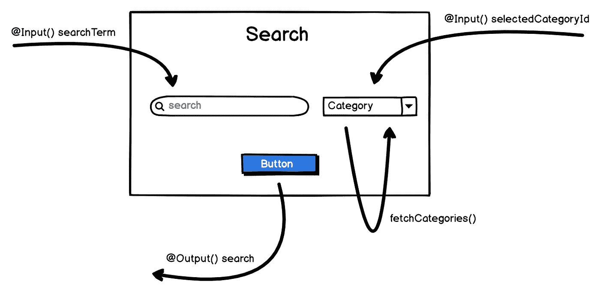

# 使用 Akita & Angular 创建独立的搜索组件

> 原文：<https://itnext.io/creating-an-independent-search-component-using-akita-angular-ea6b67da90d7?source=collection_archive---------6----------------------->

最近，我开始使用 [Akita](https://netbasal.com/introducing-akita-a-new-state-management-pattern-for-angular-applications-f2f0fab5a8) 作为我的新应用程序的状态存储。
它附带了一系列很好的概念，用于在 web 应用程序中清理商店的使用。

*   你有一个存储在所谓的“实体店”中的模型。
*   您可以使用实体 API 服务来填充“实体存储”。
*   然后，您可以使用一个查询服务在“实体存储”中查询值，该服务附带了一组现成的查询/选择器。

让我们看看如何使用这个存储来创建一个独立的搜索组件，您可以稍后将它嵌入到您的应用程序中的任何地方，而不必为它的工作注入必要的初始/功能数据。

这是[最后的结果](https://stackblitz.com/edit/angular-m2hwu4)。

# 搜索组件



搜索组件的详细说明

我们将创建一个搜索组件，它获取自己的必要数据(在我们的例子中是类别)，也可以从外部预设(`selectedCategoryId`和`searchTerm`)。

**注意**我们只接收来自外部的`id`，这意味着包装器组件不需要获取任何类别来传递所选的类别——例如，如果我们从 URL 查询参数中读取所选的类别，这一点尤其重要。

因此，让我们从创建类别模型并存储相关文件开始:

太好了。

花点时间通读，这样你就能理解每一个文件。
可能会有相当多的人创建类别商店，但这就是[关注点分离](https://en.wikipedia.org/wiki/Separation_of_concerns)的妙处。

现在让我们构建搜索组件(我使用 [Angular Material](https://material.angular.io/) 来促进开发和减少代码):

这里没什么特别的，但是让我们回顾一下 2 个与秋田相关的事情:

1.  `fetchCategories` —该方法负责获取搜索组件所需的数据，以便在选择框中显示类别。我们使用`categoryStoreService`，它将依次调用`categoryApiService`来获取类别，然后将它们设置在商店中。
2.  重要的是要记住，因为我们使用商店来管理我们的状态，并且我们的应用程序中可用的类别是一个状态，所以我们不分配从`categoryStoreService`(它传递来自`categoryApiService`的值)返回的类别，而是使用 Akita 的`query`概念来选择我们插入到商店中的类别。
    我们通过使用`this.categories$ = this.categoryQuery.selectAll();`来做到这一点

现在我们应该有一个搜索组件来处理它的依赖数据，但是也可以从外部设置。它是独立的，所以我们可以拿着它，在任何需要的地方使用它。

看一看[功能演示](https://stackblitz.com/edit/angular-m2hwu4)。

## 陷阱

我有一个谜语给你:

假设我们从一个 URL 查询参数中读取选定的类别。当页面刚刚加载时，我们将它传递给搜索组件。

搜索组件中的类别选择器会被设置为具有相应 ID 的类别吗？

是/否——试着解释你的答案。

## 回答

答案是否定的，行不通。原因如下:

当页面加载时，我们读取类别 id 并将其传递给搜索组件——搜索组件正在获取类别。

与此同时，它意识到您传递了一个类别`id`来设置类别选择器，并试图将您传递的 id 与组件中可用类别的 id 进行匹配。

但是，唉——我们仍然在获取数据，所以我们没有任何类别可以匹配！

因此，结果是选择器不会显示任何被选中的类别。

## 固定

有一个简单的方法可以解决这个问题(尽管我不确定这是否是一个最佳实践，介意分享一下你的想法吗？):

我们转换`getEntity`查询，它是与`selectEntity`同步的操作，它基本上做同样的事情——只是有一个可观察的。
因此，您可以使用传递给搜索组件的类别 id 来锁定订阅:

```
this.categoryQuery.selectEntity(changes.selectedCategoryId.currentValue).subscribe((category) => { this.selectedCategory = category });
```

现在这应该可以工作了(当然，您需要处理退订。也许使用`[take](http://reactivex.io/documentation/operators/take.html)(1)`,因为您只想为类别等待一次)

干杯。🍻