# 在 iOS 上创建无限网格

> 原文：<https://itnext.io/creating-an-infinite-grid-on-ios-2bd6db28c581?source=collection_archive---------2----------------------->

我最近遇到了一个 StackOverflow 问题([https://stack overflow . com/questions/51544588/drawing-an-infinite-grid-in-ios](https://stackoverflow.com/questions/51544588/drawing-an-infinite-grid-in-ios))，其中的挑战是使用标准的 UIScrollView 和/或 UIKit 在 iOS 上创建一个无限网格。我是这样解决的。

# 定义需求

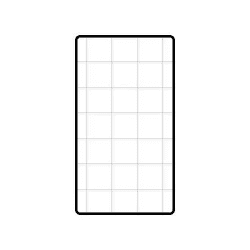

iPhone 会显示一个无限网格

*   必须只使用 UIKit 本机类
*   滚动应该有预期的滚动视图的感觉
*   用户必须有这样的印象，他们可以永远滚动
*   必须是内存高效的
*   内容必须以平铺方式生成，以便构建网格
*   初始坐标应该是可指定的

# 了解制约因素

在我们开始之前，我们必须了解限制因素是什么。

*   UIScrollView 要求在任一时间点都有一组有限子视图。
*   当你到达一个滚动视图的末尾时，滚动视图停止或反弹，我们需要它继续无限滚动。
*   在启用反弹的情况下，试图滚动越过 scrollview 的边缘会有一些“弹性”感觉，并且在某些时候 scrollview 会反弹回其内容限制内；我们不能依靠滚动通过滚动视图的边缘来达到我们的目的。
*   移动设备上的内存分配是有限的，如果一个应用程序试图分配太多的内存(想想太多的网格块)，该应用程序将被 iOS 终止。
*   UIViews 有一个最大大小，我们不能创建一个容器视图放入 scrollview 并使其无限大。

# 入门，设置滚动视图

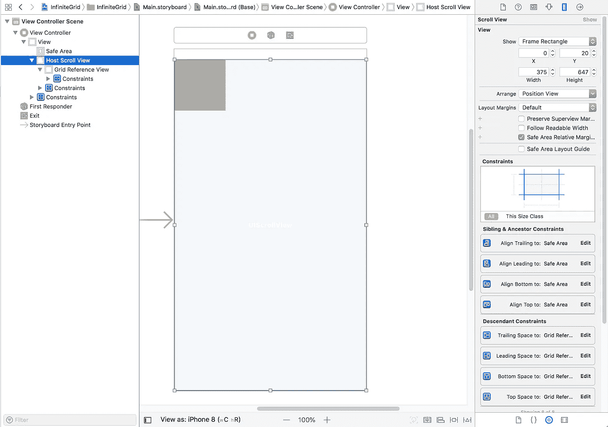

我们首先向视图控制器添加一个 UIScrollView，并对约束进行布局，使 ScrollView 覆盖整个安全区域。然后我们定义一个小的 UIView(大小不重要！)并将前导、尾随、底部和顶部约束设置为 0。

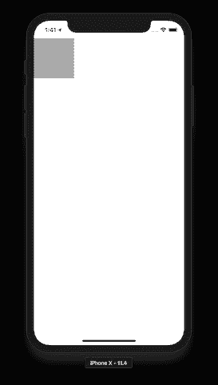

带有小参考视图的基本滚动视图

运行代码时，您会看到一个根本不滚动的 scrollview，但在我们做更多工作之前，让我们看看这个非常简单的应用程序目前使用了多少内存:

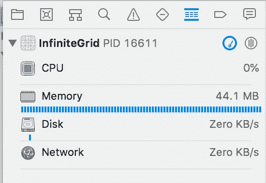

内存要求，仅基本滚动视图+参考视图

# 让我看一些滚动！

有多种方法来配置我们的 scrollview 在我们的例子中，我们将把我们的引用视图更改为一个“GridView”自定义类，并从该视图中执行所有的网格控制。让我们在项目中添加一个新文件，名为 GridView.swift:

GridView.swift，基本代码

然后，在 Interface Builder 中将引用视图类更改为 GridView:

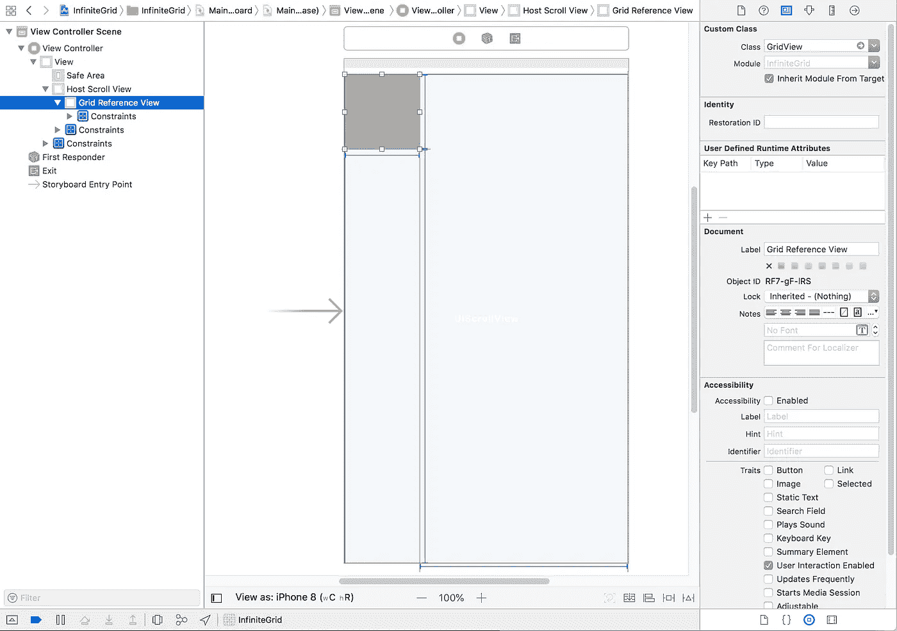

确保您连接了我们为顶部、底部、左侧和右侧布局约束定义的 IBOutlets，以及我们的项目 scrollview。让我们看看这是如何运行的:

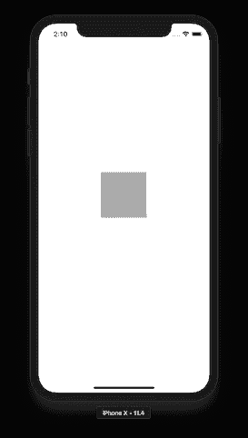

带有大滚动区的滚动视图

完美！我们现在有一个非常大的滚动区域，但不是很有用，让我们确保理解我们介绍的代码。

首先，我们添加了一个值为 10000000.0 的“**arbitraylargeoffset**；顾名思义，这个值是任意的，几乎可以设置为任何值。该值控制用户在到达 scrollview 的末尾之前可以在参考视图的任意一侧滚动多远。

由于 UIScrollView 不为可滚动区分配像素缓冲区，因此我们可以在不影响内存使用的情况下使该值变得很大。这个值越大，在我们变“魔术”之前，用户就越能够连续滚动。理论上，如果这个值足够大，在这种情况发生之前，用户会厌倦连续滚动。将这个值临时更改为 1000.0 范围内的值，应该可以让您了解为什么这个数字需要很大。

为了正确设置这个大的可滚动区域，我们接入了 **awakeFromNib()** 函数来执行我们的自定义**definescrollabearea()**函数，并将所有布局约束更新为我们的任意值。我们还执行了 **centreOurReferenceView()** 函数，因此我们从屏幕上可见的参考视图开始。

# 添加我们的网格

在我们的例子中，让我们假设当网格第一次建立时，屏幕中心的初始坐标是(0，0)。

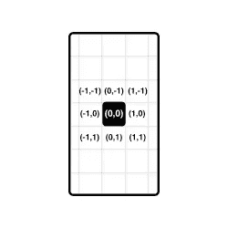

网格初始坐标

当我们在视图中添加网格块时，我们需要跟踪哪些坐标在屏幕上可见，哪些“块”与哪些坐标相关联，以及滚动视图中心的可见坐标。

因此，让我们创建一个名为 GridTile 的自定义 UIView 类:

一个非常简单的瓷砖

我们的简单图块将简单地显示一个 UILabel，其中包含分配给图块的坐标。让我们也用几行代码更新我们的 GridView.swift 文件:

GridView.swift，图块分配代码

然后更新我们的 **awakeFromNib()** 来调用我们刚刚添加的**allocateinitiatiles()**函数:

GridView.swift，更新了 awakeFromNib()

运行我们的示例代码，我们现在获得:

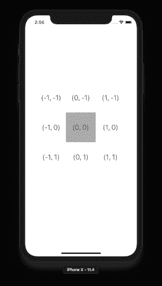

测试 allocateTile(位于:)函数

在这个例子中，GridTile.swift 代码相对简单，它是一个自定义视图，带有显示坐标的 UILabel as 子视图。在现实世界的例子中，这些可以是地图块，或者任何需要显示在无限网格中的东西。

作为我们在 GridView.swift 中添加的代码的一部分，我们有 **allocateTile(at:)** ，顾名思义，它将在指定的坐标上分配一个新的网格块。该函数使用 **frameForTile(at:)** 函数来计算该图块在网格中的放置位置。

在 **frameForTile(at:)** 中的计算故意比实际情况复杂一些。这样做的目的是为了将网格块的大小从我们在界面构建器中定义的参考视图大小中分离出来。继续更改' **tileSize** '变量，看看这会如何影响瓷砖的放置。

# 部分自动化电网建设

到目前为止，我们已经手动调用了 **allocateTile(at:)** 函数来生成一个 3x3 的网格，让我们自动执行这个操作，这样我们就可以快速地重新调整网格大小。我们来更新**allocateinitiatiles()**函数，增加 **populateGridInBounds(…)** 函数。

GridView.swfit，populateGridInBounds(…)

启动我们的示例代码，我们现在有:

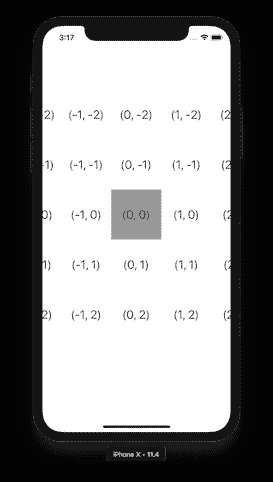

测试 populateGridInBounds(…)

现在，让我们尝试将每个方向的网格大小增加到 50 块。使用我们的新功能，这真的很简单:

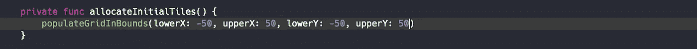

结果，正如所料，一个 101 x 101 的可滚动网格！

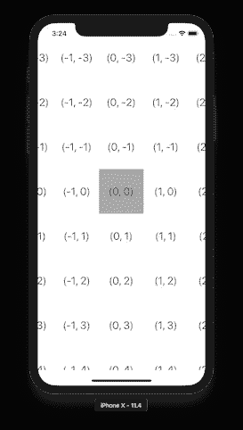

测试我们新的可滚动网格

# 完事了吗？

不幸的是，远非如此。在本教程的开始，我提到这应该是内存有效的。让我们来看看我们刚刚创造的怪物:

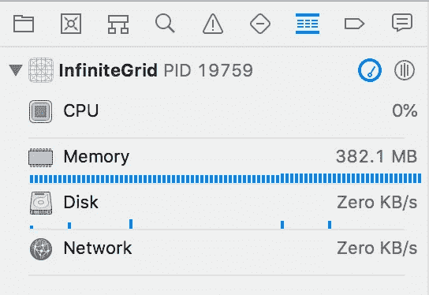

101 x 101 网格的内存消耗超过 350MB

呀！我们现在为我们的简单网格使用了超过 350MB 的内存！？

事实上，还记得我们作为子视图添加到 GridTile 中的 UILabel()吗？这些 UILabel 中的每一个都会生成一个内存缓冲区来呈现将被发送到移动显示器的标签文本。我们刚刚分配了 10，201 个标签，每个标签使用 10，000 个像素的内存缓冲区。这个解决方案不能扩展到我们的“无限”网格。

# 观察 scrollview 内容偏移量

为了开始解决内存需求问题，我们首先需要确定我们在网格中的位置，这样我们就可以确保只分配我们需要的网格块，并释放不再需要的网格块。

如果你不熟悉键值观察并想学习，请访问苹果开发者档案:[https://Developer . Apple . com/library/archive/documentation/Cocoa/Conceptual/Key Value Observing/Key Value Observing . html](https://developer.apple.com/library/archive/documentation/Cocoa/Conceptual/KeyValueObserving/KeyValueObserving.html)

让我们用一些额外的代码更新我们的 GridView.swift:

GridView.swift，观察 scrollview 内容偏移量

并且再次更新 **awakeFromNib()** :

GridView.swift，final awakeFromNib()

本质上，当 GridView 被实例化时，我们将 GridView 作为键值观察器添加到 scrollview，请求在 **contentOffset** 变量被更新时得到通知。由于每次拖动 scrollview 都会更新 **contentOffset** ，因此将调用**observe value(forkey path:…)**函数，这样我们就可以更新网格。

当前的 **adjustGrid(for:)** 函数尚未更新网格；当拖动 scrollview 时，它当前跟踪在 scrollview 中心可见的坐标。坐标现在应该打印在控制台中:

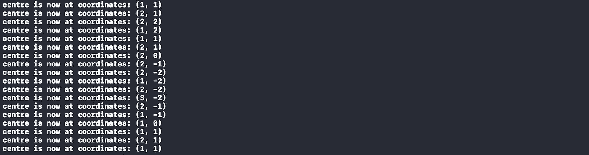

控制台日志显示中心坐标更新

# 动态网格扩展

现在我们可以检测中心坐标何时改变，让我们实现动态分配新的网格块。让我们首先用下面的代码替换 **allocateTile(at:)** 函数:

GridView.swift，检查现有图块的新 allocateTile(at:)函数

当请求分配图块时，代码将首先检查图块是否已经存在；如果有，那就没别的事可做了。更新 **adjustGrid(for:)** 函数的时间:

GridView.swift，针对动态扩展更新了 adjustGrid(for:)

更新后的 **adjustGrid(for:)** 函数现在可以计算填充屏幕宽度和高度所需的图块数量，并自动请求在计算出的坐标内填充网格。既然我们现在可以动态地做到这一点，让我们也更新我们的 **allocateInitialTiles()** 函数:

使用 adjustGrid(for:)函数的 GridView.swift，final allocateInitialTiles()

现在，让我们看看这个是什么样子的:

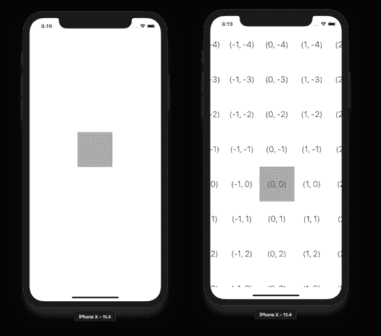

网格从空白开始，然后正确填充

乍一看，网格在最初创建时似乎是空的，然后随着中心坐标的变化，网格会正确填充。代码中的一个快速调查显示，我们手动将中心坐标设置为(0，0)，因此当 allocateInitialTiles()函数调用 adjustGrid(for:)函数时，代码假定没有任何操作，因为中心坐标是相同的。我们只需要将中心坐标设置为某个非零值:

将中心坐标的初始值更新为非零值

再次运行代码…

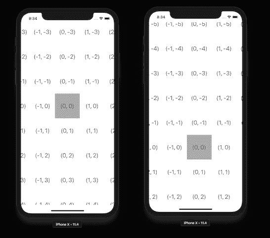

网格正确地动态填充

成功！我们的下一步是删除不需要的图块，否则当用户滚动无限网格时，我们的内存使用量会不断增加，直到 iOS 终止我们的应用程序。

# 动态网格图块取消分配

我们将创建一个 clearGridOutsideBounds(…)函数，它将与 populateGridInBounds(…)函数成对运行。将以下代码添加到 GridView.swift 中:

GridView.swift，clearGridOutsideBounds(…)函数

然后，让我们完成 adjustGrid(for:)函数:

GridView.swift，最终 adjustGrid(for:)函数

测试我们的代码更改，我们可以看到网格被正确显示，我们的控制台日志显示动态分配和取消分配按要求发生:

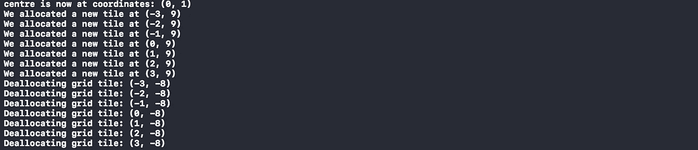

带有动态分配/取消分配详细信息的控制台日志

让我们通过滚动一会儿并检查使用了多少内存来确认我们的内存需求得到了满足:

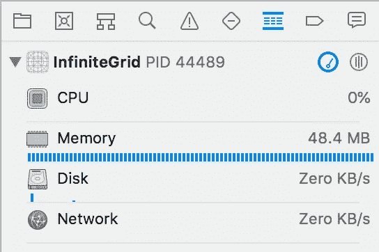

动态分配时的内存需求

# 让我们的网格变得无限

虽然我们的 **abritraryLargeNumber** 很大，但它可能会诱惑我们认为我们已经完成了，但一个专注的用户最终将能够到达我们的滚动视图的末端。这可以通过将 arbitraryLargeNumber 设置为 10000.0，然后滚动到滚动视图的顶部来轻松测试:

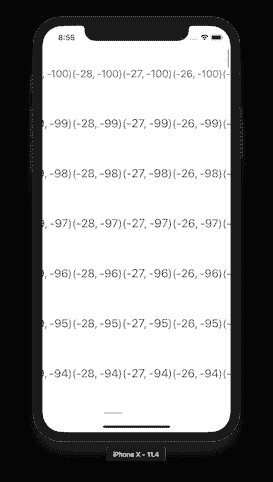

滚动视图到达顶部并弹跳

当用户到达滚动视图的顶部时，滚动视图反弹，我们的无限滚动视图只是一个非常大的有限滚动视图。

我们可以通过添加一些 scrollview 委托方法来解决这个问题，仍然在 GridView.swift 中，但是在我们的 GridView 类定义之外，让我们添加:

网格视图。Swift，scrollview 委托实施

并更新我们的 observeScrollview()

GridView.swift，最终 observeScrollview()函数

最终的结果是，每当 scrollview 不再活跃时，它就会被重置到中心位置。视觉上，唯一的变化是滚动视图指示器被重置为中间，灰色参考视图被重新定位在靠近中心的区域。

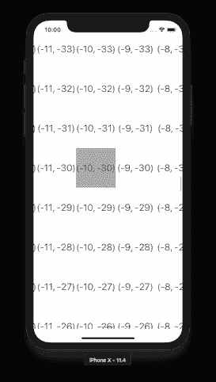

最终无限网格实现

要完成无限网格实现，应该隐藏 scrollview 指示器，并且应该将参考视图背景色设置为 UIColor.clear。

# 源代码

这个项目的源代码托管在 GitHub 上:【https://github.com/freshcode/Infinite-Grid-Swift 

# 关于作者

戴夫·普瓦里耶是一名高级软件开发人员，目前正在 [ID Fusion 软件公司](http://idfusion.com)开发一些非常有趣的 iOS 应用程序。

您的移动应用软件开发需要帮助吗？请访问我们在 http://idfusion.com 的网站