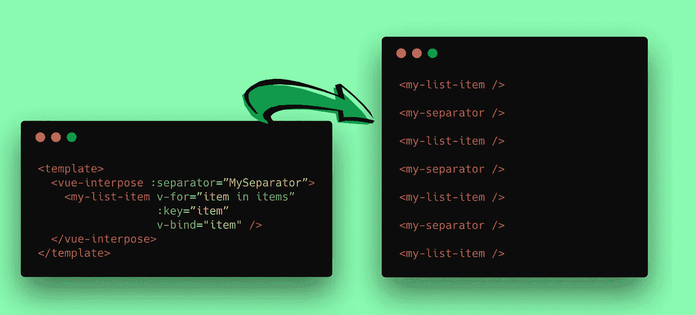

# 从 React 实现创建插入器 Vue 组件

> 原文：<https://itnext.io/creating-an-interpose-vue-component-from-a-react-implementation-80d367a695c6?source=collection_archive---------3----------------------->



昨天我偶然发现了 andrewingram 中的这个很酷的反应要点，Andrew 本人和 Matt Berridge 讨论了一个简单的插入组件来显示列表项之间的分隔符组件。

这是一个简单的用例，但这正是 UI 组件的目标:解决一个简单的任务，仅此而已。

所以，提到的要点是:

这是马特的版本，用的是 JSX，更具宣言性，也更简洁:

```
**const** Interpose = ({ children, separator: Separator }) => {
  **return** React.Children.toArray(children).map((element, index) => (
    <React.Fragment key={`interpose-${index}-fragment`}>
      {index > 0 ? <Separator /> : null}
      <element.type {...element.props} />
    </React.Fragment>
  ))
}

Interpose.propTypes = {
  separator: PropTypes.func,
}

Interpose.defaultProps = {
  separator: () => null
}

**export default** Interpose
```

# Vue 能做到吗？

于是我想:我能不能用 **Vue** 做点类似的东西？我希望能够写出类似下面这样的东西:

```
<template>
  <vue-interpose :separator=”MySeparator”>
    <my-list-item v-for=”item in items” :key=”item” v-bind="item" />
  </vue-interpose>
</template>
```

1.  分隔符组件应该作为属性传递。
2.  只要它是一个数组，插入组件和它插入的内容之间就不能有依赖关系。家长应该负责提供内容。

这是我想到的解决方案，用 JSX 的渲染函数:

如您所见，分隔符是通过 prop 提供的，而“主要内容”是使用`context.children`属性呈现的，与 React 中的`children`非常相似。

注意我如何使用`h()`方法(又名`createElement`)从我们的分离器道具创建一个真实的组件。我还没有找到将 Vue 组件作为 prop 传递的方法，所以我只能传递对象，然后从它们创建组件。

[函数参数](https://vuejs.org/v2/guide/render-function.html#Functional-Components)派上了用场，因为它创建了一个无状态/无实例组件，并为渲染函数提供了第二个`context`参数。舒服！

## **本实施的注意事项:**

*   必须在组件的`data()`中声明 MySeparator。我想注册成组件，但是找不到合适的方式。
*   *我的插入器组件在其内容周围添加了一个难看的* `*<div>*` *。我希望我有类似于* `*React.Fragment*` *(这个* `*<template>*` *标签在渲染函数中不起作用)。* **再也不是了**！[micham ciński](https://medium.com/u/dfebe6aa25f0?source=post_page-----80d367a695c6--------------------------------)教我“一个函数组件的渲染函数可以返回一个数组”，所以不用再包装了！谢谢你的建议，米歇尔！
*   如前所述，分隔符道具只是一个对象，而不是“组件”。应该有某种类型的属性验证来避免无效对象被作为属性传递。

我的假设是`scoped-slots`可以用来修复一些提到的警告。然而，我想模仿 Interpose 的 React 实现，这是我能做到的最接近的。

我错过了一些可以帮助我的很酷的 Vue 功能吗？欢迎在评论区改进我的解决方案！