# 创建和发布 VS 代码扩展

> 原文：<https://itnext.io/creating-and-publishing-vs-code-extensions-912b5b8b529?source=collection_archive---------0----------------------->

好了，我们在我们系列的第一篇文章中创建了一个片段[片段创建](https://medium.com/@noringc/snippets-for-vs-code-6b36fc4ef11f)。

是时候迈出下一步了，让我们与世界分享我们的创造。那么我们如何着手去做呢？嗯，实际上只有三个主要步骤:

*   **脚手架**扩建工程
*   **编写一个扩展**，在这里，它是关于编写代码片段的
*   **将**扩展发布到 Visual Studio 市场

当然，这些步骤中的每一步都有很多子步骤，但是不要担心，我会详细地解释它们，所以在这篇文章结束时，你可以像这样站起来庆祝:


# 为扩建工程搭建脚手架

有一个架子工可以让你在一秒钟内完成一个项目。要安装架子工，只需输入:

```
npm install -g yo generator-code
```

要搭建一个扩展项目，我们只需键入:

```
yo code
```

以上将引发一个对话，你需要在其中做出一些选择。让我们展示每个屏幕，看看我们需要选择什么:


约曼发电机安装在脚手架上

我们在上面有很多选择，但是让我们选择*新的代码片段*

接下来，我们会看到一个对话框，要求我们选择是从文件夹中导入现有片段还是创建新片段:

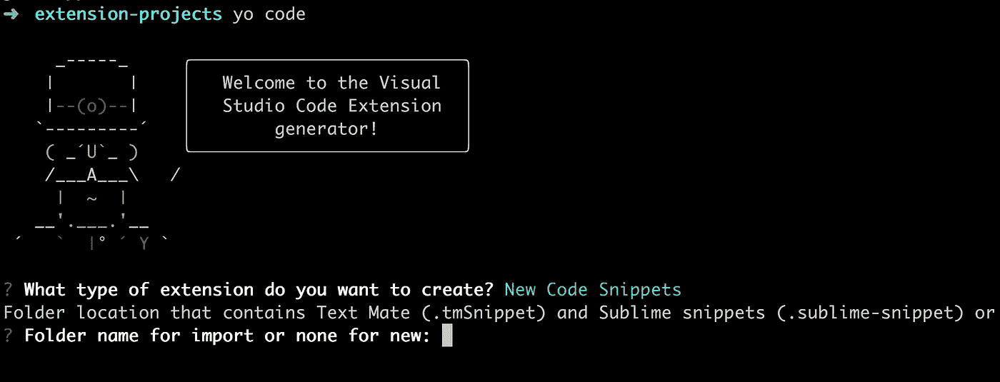

新导入或从文件夹创建

我们选择创建新的，因此我们只需点击*返回*键。接下来的步骤是给我们的扩展命名。这是它在 Visual Studio marketplace 中的显示方式，所以让我们给它起个好名字，例如:

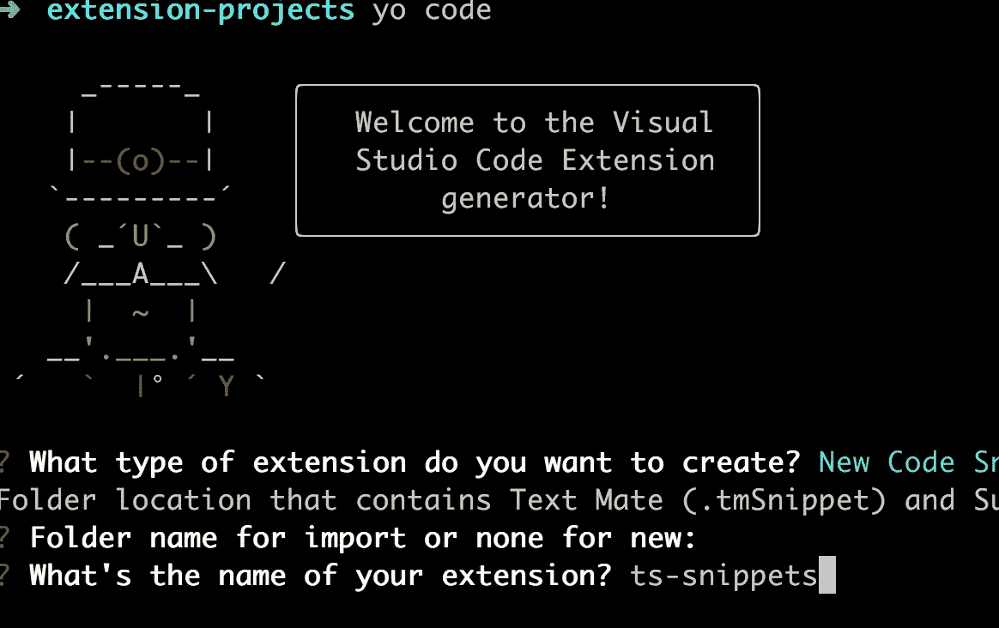

键入扩展的名称

之后的问题是`identifier`。我们只要按下*返回*键。这意味着*名称*和*标识符*将是同一个东西:

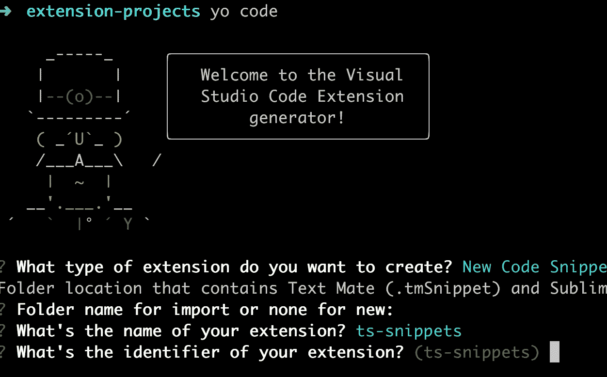

还有更多问题，你以为你说完了:傻笑:？下一个问题是要求您对您的扩展进行*描述*。这将出现在用户面前，所以要确保它是有吸引力的，这样他们才会想安装它。但是，您可以在以后更改它:

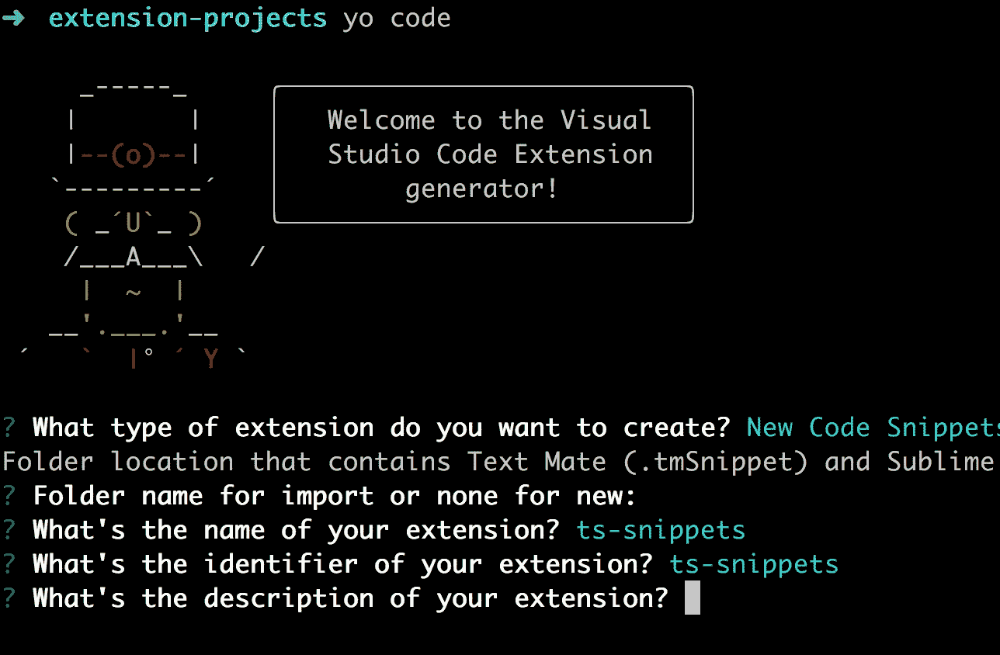

下一步是键入*出版商*。现在你可能在想。我对出版商一无所知，它想从我这里得到什么？现在为发布者想一个聪明的名字，稍后我们将创建一个发布者，我们将在 Visual Studio marketplace 中注册，一切都会好起来的:)

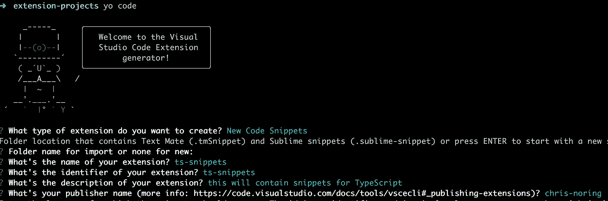

上面你可以看到它已经输入了值 *chris noring* 作为发布者，这是因为我之前已经创建了一个发布者，因为你还没有，现在只需在这里输入一些东西。

对话流中的下一步是输入语言 id，这意味着这个片段是什么语言。让我们输入 *javascript* 或 *typescript* ，记得按说明用小型大写字母输入:

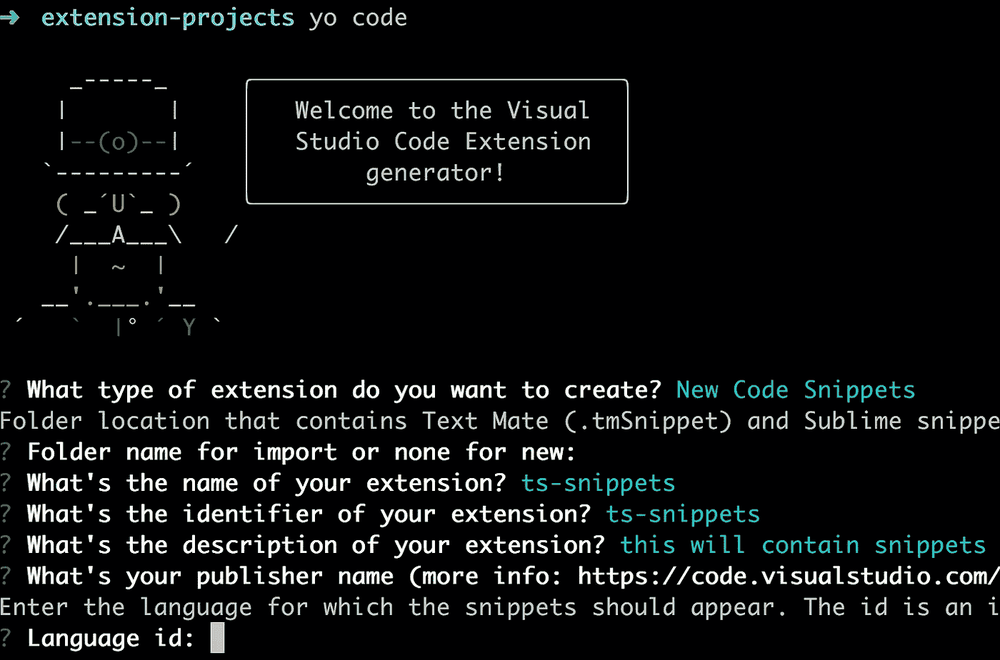

在这之后，你实际上完成了。它应该列出需要为您的扩展搭建的所有文件，如下所示:

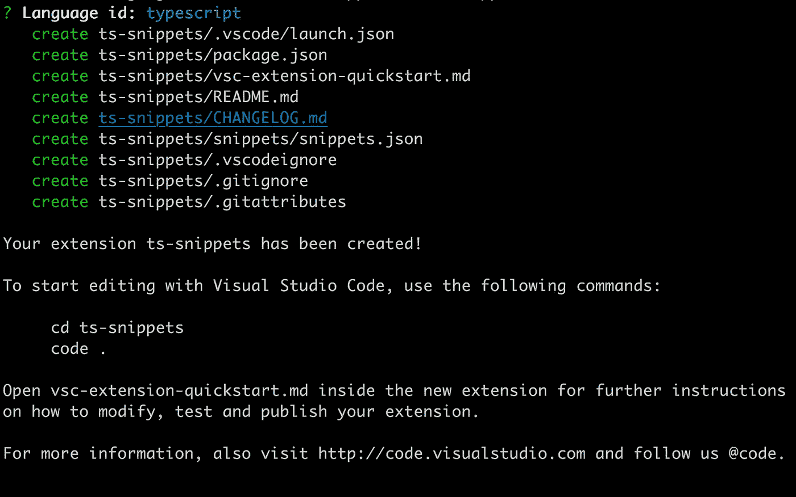

# 扩展项目剖析

好了，现在我们有了我们的项目，让我们看看我们实际得到了什么:

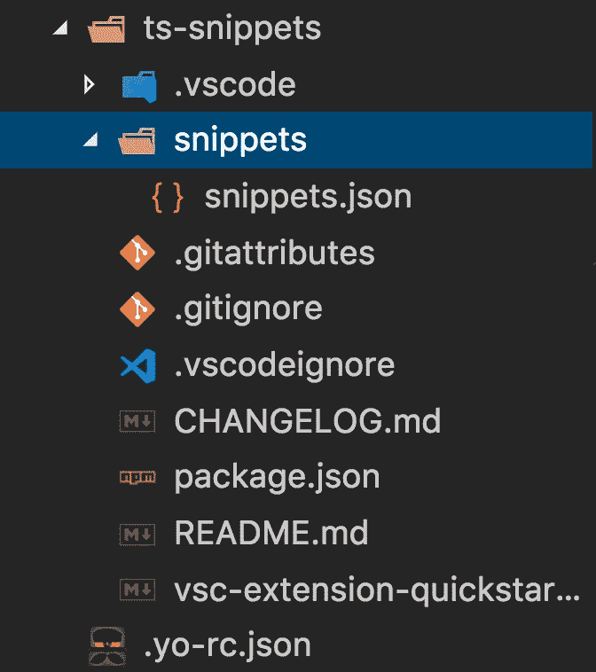

我们的项目自上而下包括以下内容:

*   这里是我们创建代码片段的地方，也是我们花费大部分时间的地方
*   **README.md** ，这包含了关于你的项目的信息。您需要更改此处的信息才能将扩展发布到 Visual Studio marketplace。那么我在这里输入什么信息呢？好吧，你应该告诉用户在安装了这个扩展之后，用户可以使用什么命令。如果你能为用户提供所有不同版本的历史记录以及它们包含的内容，那就更好了。这将向用户表明，随着时间的推移，您非常致力于改进扩展
*   **../.yo-rc.json** ，现在这个文件在项目之外，它包含了相当多的发布者名称，不需要修改它
*   **package.json** ，它包含了一些关于项目的元信息。这里重要的是改变“版本”属性，并在您随着时间的推移改进并重新发布项目时增加它。

好了，现在我们对哪些文件是重要的，以及如果需要，我们应该在哪里进行更改有了更多的了解。

# 创建我们的片段

信不信由你，但这是最简单的部分。我们已经在本系列的第一篇文章中解释了如何创建代码片段，这里再次提供链接作为待办事项链接的提示。我们将满足于只显示一些片段的屏幕转储，如下所示:

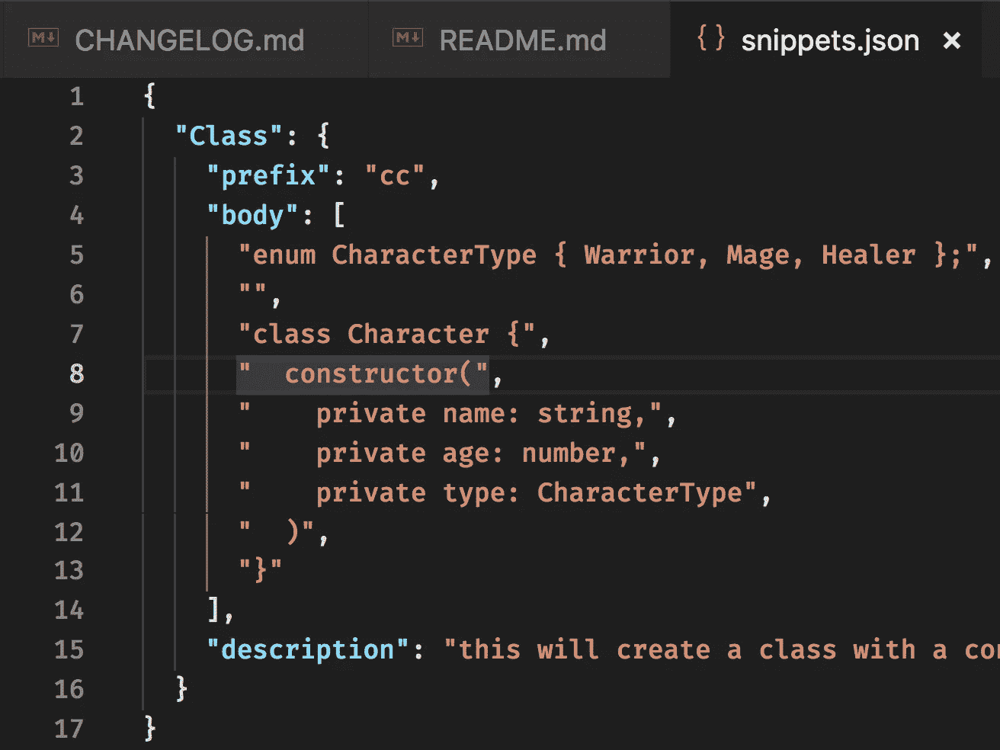

好了，现在我们有了一个片段。接下来我们来试试。

# 测试我们的片段

要试用一个代码片段，我们需要安装它。要安装它，我们需要做以下工作:

*   **运行** `package `命令
*   从命令窗口安装
*   **在合适的文件中尝试**

好了，让我们从在终端中运行 *package* 命令开始。等等，我们首先需要一个依赖项来完成这项工作:

```
npm install -g vsce
```

通过运行上面的命令，我们安装了 *vsce* ，它安装了我们需要的可执行文件。我们需要可执行文件来运行命令，如*打包*和*发布*。

## **打包安装**

好了，我们已经运行了上面的命令，并准备好*打包*，即创建一个安装文件:

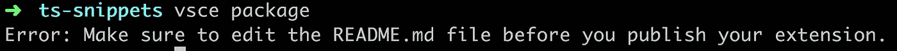

啊，一个错误，开始不好还是？嗯，这实际上是很有帮助的，它告诉我们这个扩展的用户应该得到更好的，他们应该得到一个精心设计的自述文件，它将告诉我关于这个扩展的所有信息。所以，让我们来看看 README.md，给它一些爱吧。

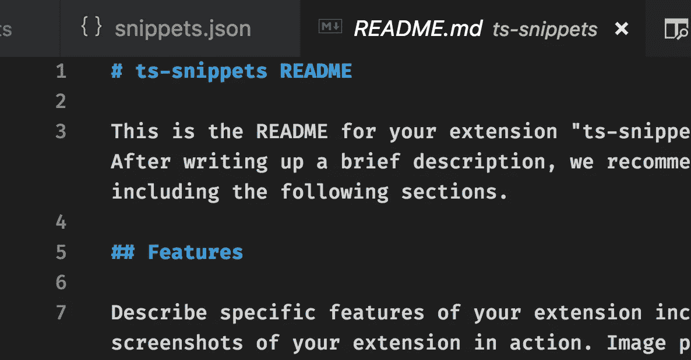

这里写了很多东西，但你实际上需要改变的是像这样的文本*这是自述文件*，就在顶部。一旦它消失了，我们可以尝试重新运行我们的“包”命令。在编辑自述文件时，简单说一下。我的看法是，给它一个最初的描述并保留一个标题是有意义的，比如*功能*和*发布说明*。*功能*在我心目中应该描述所有可用的命令以及它们的作用。*发布说明*应该包含每个版本发布的历史日志和影响，比如纠正错误或添加片段。

一旦我们对自述文件满意，让我们再次尝试运行`package`命令:

```
vsce package
```

这会抱怨我们在 *package.json* 中缺少*存储库*属性。我们实际上并不需要一个库来完成这项工作，但是有一个库是很好的。我们可以点击 *y* 继续。现在应该说它已经创建了一个安装文件，如下所示:

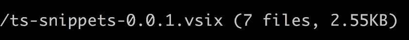

一旦我们有了这样的文件，我们就可以在我们的环境中本地安装我们的扩展了。这将让我们尝试我们的扩展，以确保一切工作如预期。要安装它，我们必须打开一个命令窗口。为此，进入*视图/命令面板*。然后开始输入“VSIX”。它应该向您显示以下内容:

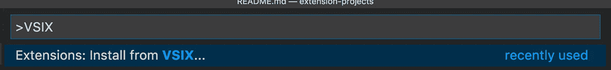

让我们选择该命令。应出现文件选择对话框，提示您选择最近创建的 *vsix* 文件。之后，VS 代码会在你的窗口底部显示一条信息消息，询问你是否想重新加载 VS 代码。点击 *yes* 之后，你的 IDE 就可以测试了。

## **试一试**

我们刚刚将代码片段安装到 VS 代码中。因为这个代码片段是为 TypeScript 准备的，所以我们需要创建一个*。ts* 文件来看。因此，让我们创建一个例子 *app.ts* ，结果应该是这样的:

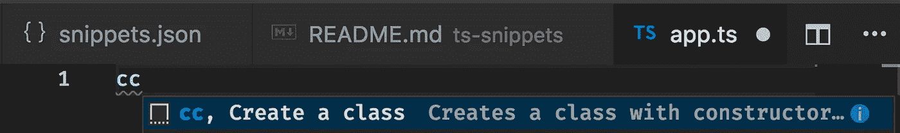

如果你看到上面的内容，这意味着你的代码片段在给自己一个*击掌*的时候按预期工作了。我们离 Visual Studio 市场和开发者名声越来越近；)

# 发布我们的片段

好了，我们现在到了期待已久的时刻。是时候发布这个扩展并开始在 Visual Studio marketplace 的*霓虹灯*中看到你的名字了:)

## **注册出版商**

还记得我们在搭建扩展项目的开始时，系统提示我们输入发布者名称吗？好了，现在是实际创建发布者的时候了。那么我们该怎么做呢？

我们需要创建一个与 Visual Studio 团队服务[链接到 VSTS](https://visualstudio.microsoft.com/team-services/) 的帐户。一旦我们在这里创建了一个帐户，我们需要得到一个*访问令牌*

**访问令牌创建**

当我们在终端中使用 *vsce* 发布我们的扩展时，需要一个访问令牌。我们可以创建一个访问令牌，方法是转到我们的 VSTS 页面，单击右上角的配置文件，然后选择菜单选项`Security`。到达目的地后，我们需要:

*   **选择**“个人访问令牌”。
*   **下一步**是选择创建一个新的此类令牌。

-给它一个合适的*名称*和*截止日期*，这一点很重要，在*组织*下拉菜单中，您需要选择*所有可访问的组织*，否则它将无法工作。下一个重要的字段是*范围*。这里你可以选择*自定义*或*完全访问*。如果你只是尝试一下，现在尝试使用*完全访问权*，但是确保稍后撤销该令牌，选择`custom defined`，并将其设置为你可以获得的最少权限。通常，你只是希望它能够有*扩展*和*市场*访问。

因此，在经历了整个访问令牌创建过程之后，我们应该有一个可以复制到剪贴板的访问令牌。

> 请确保将其复制到一个合适的位置，以便以后检索，关闭对话框后，它不会再次显示。

**更新令牌**

你的令牌迟早会用完数据。发生这种情况时，重新生成您的令牌并在终端中运行:

```
vsce publish -p <token>
```

这将使用您的新令牌，因此下次发布时，您只需输入:

```
vsce publish
```

## **发布**

好了，最后我们准备运行发布命令。该跑了:

```
vsce publish
```

这应该会将我们的扩展发送到 Visual Studio Marketplace。在终端中运行该命令，应该会显示如下内容:

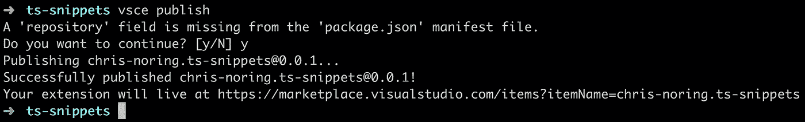

## **享受你的劳动成果**

Visual Studio 市场更新需要几分钟时间。假设几分钟过去了，让我们转到 Visual Studio Marketplace 的 URL。如果你等不及，去*https://marketplace.visualstudio.com/manage/publishers/<出版商名称>* 它应该有一个与你的扩展名称的条目，并说它正在验证你的扩展。好了，让我们来看看我们的作品:

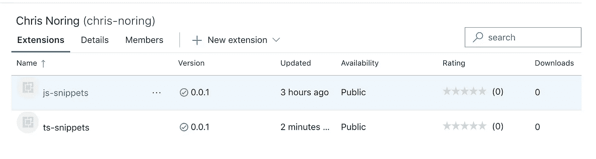

你现在应该很自豪。这就是你的扩展，*在它所有的荣耀中*，对整个世界开放。让我们通过在 Visual Studio 代码中的 extensions 选项卡下搜索来证明这一点:

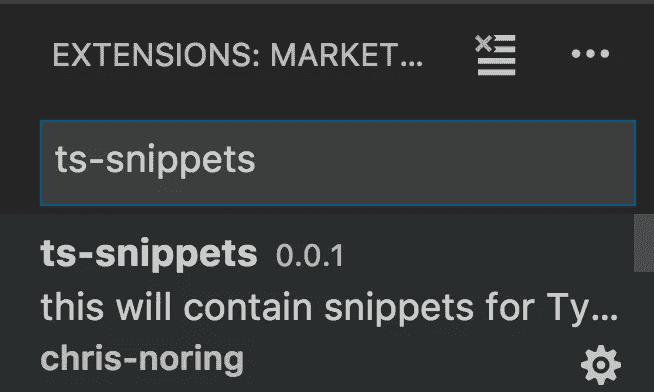

这就是了，你输入了你的扩展名，Visual Studio 代码显示给你看。你是你的延伸的骄傲父母。让我们看看详细信息页面，即我们在自述文件中写了什么:

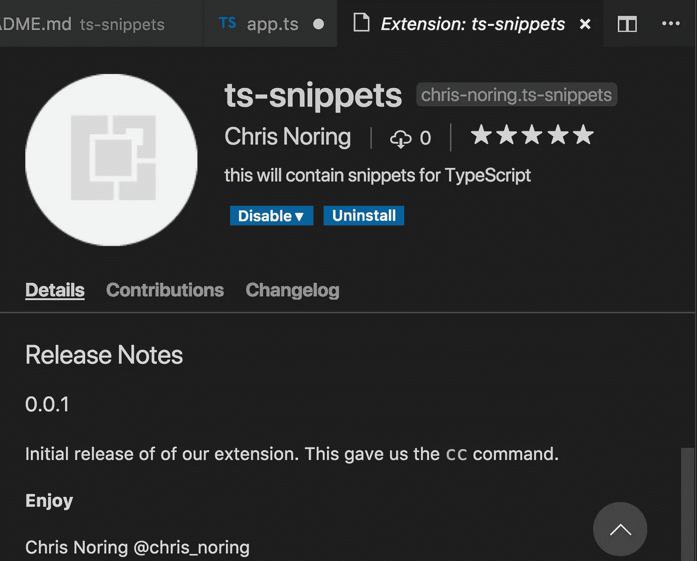

就在那里。这只是开始。现在出去，创建扩展，我知道**你能做到！！！**

## **改进扩展**

你需要做两件事来改善人们对你的延伸的看法，那就是:

*   **添加**一个存储库，这将允许用户提交拉请求，并帮助修复代码可能存在的任何问题
*   添加一个预览 gif，这会给用户一种使用你的扩展的感觉

**添加存储库**

要添加存储库，请在 Github 上创建一个。完成后，让我们像这样添加到我们的 *package.json* 文件中:

```
"repository": { "type": "git", "url”: “https://github.com/softchris/node-snippets.git"}
```

就是这样，它现在将显示在扩展页面上，人们将能够点击进入您的回购，并查看您是如何构建的，如果您想通过提交 PRs 来帮助您

**添加预览 GIF**

如果你以前下载过扩展，你可能会注意到其中一些是如何通过展示片段的介绍视频变得非常专业的。这个视频实际上是一个 GIF，将 GIF 添加到减价中非常简单:

```

```

注意上面我们是如何引用目录*图像*的。它将能够通过查看您的存储库并期望找到“图像”目录来解决这个问题。因此，这就是为什么您需要存储库集来完成这项工作。没有存储库，没有预览图像。

您的市场现在看起来会像这样:

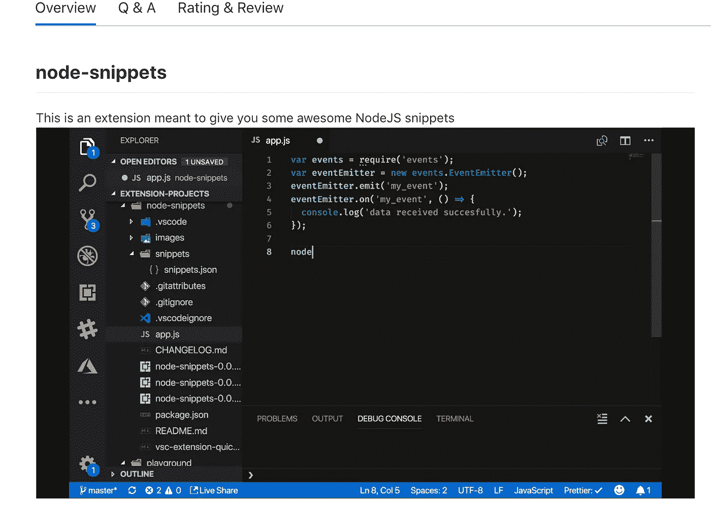

上面是一张*静止图像*，所以在这篇博文中它不会以动画的形式展示，但它会真实地工作。

我建议用 Camtasia 或一些免费选项制作所需的视频，然后在完成录制后将其转换为 gif。

# 摘要

总之，我们了解到以下情况:

*   使用架子工创建一个扩展项目
*   给我们的项目添加一些片段
*   在本地测试我们的代码片段，以确保在我们发布之前能够正常工作
*   **通过安装 *vsce* 并生成*访问令牌*来设置发布**
*   **凝视**我们在 Visual Studio 市场的美丽创造
*   **Mic 掉了**，通过 VS 代码搜索找到我们的扩展

走出去，向社区展示你的实力。想跟我说说吗？只需发微博给 [@chris_noring](https://twitter.com/chris_noring)

## **延伸阅读**

我们刚刚为代码片段创建了一个非常简单的扩展。你可以创建更多的扩展来真正提升 VS 代码。以下是了解更多信息的一些链接:

*   [我在构建自己的扩展时学到了什么](https://css-tricks.com/what-i-learned-by-building-my-own-vs-code-extension/)
*   [扩展创作](https://code.visualstudio.com/docs/extensions/overview?WT.mc_id=vscode-gitbook-chnoring)
*   [安装分机发电机](https://code.visualstudio.com/docs/extensions/yocode?WT.mc_id=vscode-gitbook-chnoring)
*   [建一个彩色的他们](https://code.visualstudio.com/docs/extensions/themes-snippets-colorizers?WT.mc_id=vscode-medium-chnoring) e
*   [发布您的扩展](https://code.visualstudio.com/docs/extensions/publish-extension?WT.mc_id=vscode-medium-chnoring)

## **我的片段**

我目前正在维护几个代码片段扩展。欢迎所有反馈:

[我的扩展](https://marketplace.visualstudio.com/publishers/chris-noring)