# 使用 SAM 创建 AWS Lambda 应用程序

> 原文：<https://itnext.io/creating-aws-lambda-applications-with-sam-dd13258c16dd?source=collection_archive---------0----------------------->

在本文中，我将解释什么是 AWS 无服务器应用程序模型(SAM ),以及如何使用它来创建 AWS Lambda 应用程序。

# 问题是

许多 AWS Lambda 教程要求您首先在 AWS 控制台中创建一个新的 Lambda 函数，此后不久，您将看到以下界面:

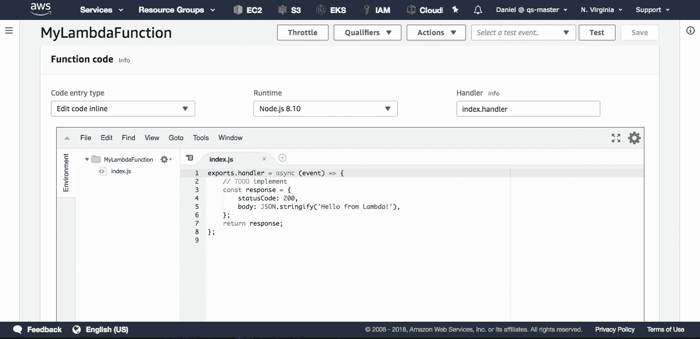

这个文本编辑器看起来很可疑。这是不是建议你在里面写 Lambda 函数的代码？在基础设施即代码(IaC)的时代，一切都被写入文件并受版本控制，Lambda 函数的代码必须放在 AWS 网站上复杂的文本编辑器中，这可能吗？

不，一点也不。真正的方法是使用 AWS **无服务器应用程序模型(SAM)** 。SAM 是 AWS 的 IaC 解决方案，用于定义和部署 Lambda 应用程序，而无需接触 AWS 控制台。本文解释了如何使用 SAM。

# 最终产品

在本文中，我们将逐步构建以下 AWS Lambda 应用程序。所有这些都将通过 SAM“作为代码”创建，无需在 AWS 控制台中单击一下:

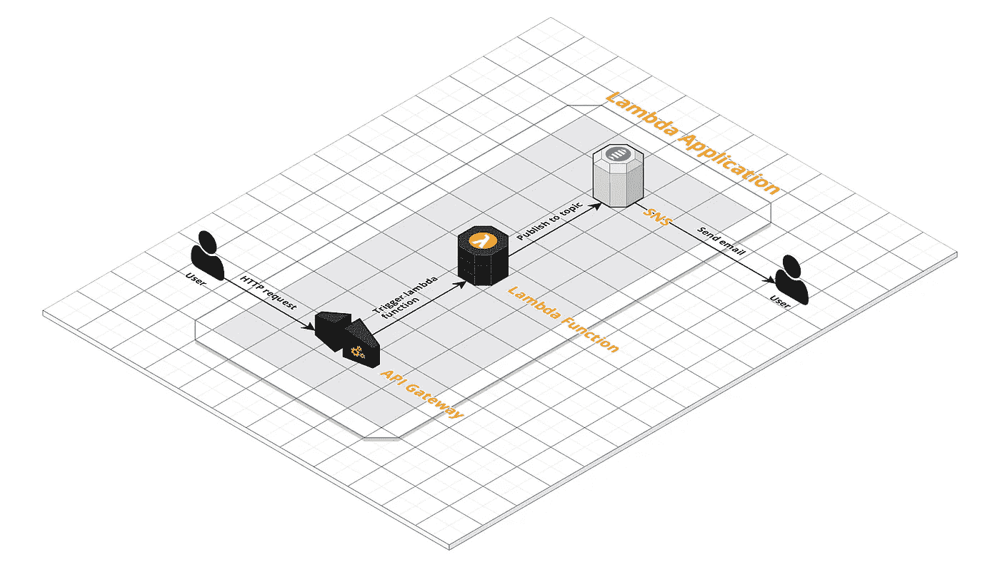

该应用程序由一个 API 网关、一个 Lambda 函数和一个简单的通知服务(SNS)主题组成。当 API 网关接收到 HTTP 请求时，它触发 Lambda 函数，Lambda 函数向 SNS 主题发布消息，这导致向该主题的所有订阅者发送电子邮件。

该应用程序的完整代码可在 [GitHub](https://github.com/weibeld/sam-hello-world) 上获得。

# AWS Lambda 基础知识

首先，一些重要的基础。

## Lambda 函数与 Lambda 应用

一个 **Lambda 函数**是一段代码(由 AWS 管理)，每当它被来自事件源的事件触发时就被执行。λ应用程序是一个云应用程序，包括一个或多个λ函数，也可能包括其他类型的服务。

几乎在所有情况下，Lambda 应用程序都包含多种类型和实例的服务。例如，上面描述的 Lambda 应用程序由一个 Lambda 函数、一个 API 网关和一个 SNS 主题组成。

## λ执行模型

λ函数由所谓的事件源触发。事件源是一个 AWS 服务。目前有十几个 AWS 服务可以用作 Lambda 函数的事件源。

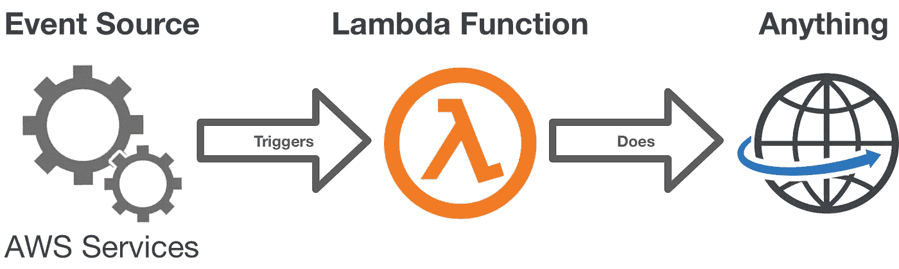

AWS Lambda 执行模型。

可以充当 Lambda 函数的事件源的 AWS 服务包括 API Gateway、S3、DynamoDB、SNS、SQS、Cognito、IoT、Kinesis 等。Lambda 函数可以有任意数量的事件源。

一旦 Lambda 函数开始运行，它基本上可以做任何你想做的事情。通常，一个 Lambda 函数使用其他 AWS 服务(这可能会触发另一个 Lambda 函数)。然而，Lambda 函数并不局限于此，它们可以执行你想要的任何代码。例如，您可以使用 AWS Lambda 函数在谷歌云平台(GCP)上创建或更新 Kubernetes 集群。

## λ运行时间

AWS 为 Lambda 函数提供了一组有限的运行时环境。它们目前包括以下内容(参见[文档](https://docs.aws.amazon.com/lambda/latest/dg/lambda-runtimes.html)):

*   Node.js (8.10 和 6.10)
*   Java (8)
*   Python (3.6 和 2.7)
*   去
*   。NET C# (2.1、2.0 和 1.0)

这意味着你必须用这些语言中的一种来编写 Lambda 函数的代码。

# 山姆是什么？


这是萨姆向你展示它能为你做什么(来自 [GitHub](https://github.com/awslabs/serverless-application-model) )。

回到我们的主题。如果你熟悉 AWS 和 CloudFormation，那么 SAM 只不过是 [CloudFormation](https://aws.amazon.com/cloudformation/) 的扩展。

## 云的形成

如果你不知道 CloudFormation，那么知道 CloudFormation 是 AWS 的基础设施即代码(IaC)解决方案是很重要的。它与 Terraform 属于同一类工具(CloudFormation 和 Terraform 之间的一个非常好的对比可以在[这里](https://cloudonaut.io/cloudformation-vs-terraform/)找到)。

使用 CloudFormation，您可以在 YAML 或 JSON 文件中声明性地指定您的云应用程序所需的 AWS 基础架构，称为**模板**，然后*部署*该模板。在部署过程中，AWS 会自动提供您在模板中指定的所有资源。

如果您之前已经部署了，并且刚刚对您的模板进行了更改，那么 AWS 会计算一个*更改集*并应用它，以便您的基础设施的状态与您的规范相匹配(就像 Kubernetes 一样)。

## SAM 扩展云形成

萨姆只是引擎盖下的云层。使用 SAM，您可以在 SAM 模板中指定 Lambda 应用程序的资源，然后部署该模板。事实上，在部署之前，您的 SAM 模板会自动转换为 CloudFormation 模板，然后进行部署。

SAM 增加了一些 CloudFormation 中没有的资源类型。最重要的是这是`AWS::Serverless::Function`资源类型，它允许简洁地定义 Lambda 函数。该资源类型具有 Lambda 函数所需的所有属性，包括作为 Lambda 函数事件源的可能事件类型列表。

SAM 的语法规范可以在这里找到:[版本 2016–10–31。](https://github.com/awslabs/serverless-application-model/blob/master/versions/2016-10-31.md#event-source-types)

## SAM 模板

最小的 SAM 模板(在 YAML)如下所示(通常保存在一个名为`template.yml`的文件中):

```
AWSTemplateFormatVersion : '2010-09-09'
Transform: AWS::Serverless-2016-10-31
Resources:
  HelloWorldFunction:
    Type: AWS::Serverless::Function
    Properties:
      Handler: index.handler
      Runtime: nodejs8.10
```

该模板指定了一个由单一资源组成的 Lambda 应用程序。这个资源是一个 Lambda 函数(名为`HelloWorldFunction`)，它使用 Node.js 8.10 运行时，这个 Lambda 函数的代码在`handler`函数的文件`index.js`中。

注意属性`Transform: AWS::Serverless-2016-10-31`。这指定了该模板的格式，并告诉 CloudFormation 如何解释它，以便它可以将其转换为标准的 CloudFormation 模板，然后可以部署到 AWS。

事实上，您可以像使用 [AWS CLI](https://docs.aws.amazon.com/cli/latest/reference/cloudformation/index.html) 部署任何 CloudFormation 模板一样部署这个 SAM 模板。然而，还有一种更好的方法，因为 SAM 也提供了自己的 CLI。

## λ功能代码

除了 SAM 模板，您还必须定义 Lambda 函数的代码。这段代码的入口点的确切格式取决于所使用的 Lambda 运行时。对于 Node.js 8.10，最小的代码文件如下所示:

```
exports.handler = async function(event, context) {
    return 'Hello World!';
};
```

例如，这段代码可以保存在与模板文件相同目录下的一个名为`index.js`的文件中。您可以选择任何想要的文件名和导出的处理函数的名称(在本例中为`handler`)，但是您必须确保它与模板中 Lambda 函数的`Handler`属性一致(例如，在本例中，该属性必须设置为`Handler: index.handler`)。

AWS 文档中的[此处](https://docs.aws.amazon.com/lambda/latest/dg/programming-model-v2.html)描述了不同支持的编程语言所需的处理函数格式。

## SAM CLI

SAM 提供了自己的 CLI，虽然不是强制性的，但在使用 SAM 时非常方便。这个 CLI 的 GitHub 库在这里是。

您可以使用以下命令简单地安装 SAM CLI:

```
pip install aws-sam-cli
```

CLI 将作为`sam`提供。

## 使用 SAM CLI 部署

您可以使用 SAM CLI 将 SAM 模板部署到 AWS。部署包括两个(或可能三个)步骤:

**1。包装**

```
sam package \
  --template-file template.yml \
  --output-template-file package.yml \
  --s3-bucket my-bucket
```

`package`命令的目的是将 Lambda 应用程序需要的任何工件上传到 AWS S3 存储桶。当您稍后将 Lambda 应用程序部署到 AWS 时，工件将自动从这个 S3 桶中检索出来。

在 Lambda 函数的情况下，最重要的工件当然是 Lambda 函数的代码(包括所有的依赖项)。上述命令的结果是你的整个项目目录(包括代码)将被压缩并上传到 S3 桶。

该命令还生成一个名为`package.yml`的输出文件。这是您的`template.yml`模板文件的副本，但是模板中每个 Lamda 函数的`CodeUri`属性都被设置为 S3 桶上的上传包的 URI。

在下一步中，您将把这个`package.yml`文件部署到 AWS。由于这个文件中的`CodeUri`属性，AWS 将能够从 S3 桶中定位和检索每个 Lambda 函数的代码。

您可以为`package`命令指定任何您想要的 S3 桶，并且您可以在多个应用中多次使用同一个桶。如果您还没有 S3 存储桶，那么您可以在 AWS 控制台中或者使用带有`aws s3 mb s3://my-bucket`的 AWS CLI 轻松创建一个。这是部署过程中潜在的第三步。

**2。展开**

```
sam deploy \
  --template-file package.yml \
  --stack-name my-sam-application \
  --capabilities CAPABILITY_IAM
```

该命令将在`package.yml`文件中定义的模板部署到 AWS。因为 SAM 是基于 CloudFormation 的，所以这个命令创建一个新的 CloudFormation 堆栈，或者更新一个现有的 cloud formation 堆栈。您必须使用`--stack-name`选项来指定这个 CloudFormation 堆栈的名称。

`--capabilities CAPABILITY_IAM`选项是授权您的堆栈创建 [IAM](https://aws.amazon.com/iam/) 角色所必需的，SAM 应用程序默认会这样做。

**注:**

`sam package`和`sam deploy`命令实际上只是`aws cloudformation package`和`aws cloudformation deploy`命令的别名。因此，如果您没有安装 SAM CLI，您可以只使用后面这些命令来代替前面的命令。

如果你想查看`sam package` 和`sam deploy`的完整用法，你可以分别在`aws cloudformation package help`和`aws cloudformation deploy help`下找到。

## 删除 Lambda 应用程序

SAM CLI 不提供删除 Lambda 应用程序的命令。然而，由于 Lambda 应用程序只是一个 CloudFormation 堆栈，所以您可以通过使用 AWS CLI 删除 CloudFormation 堆栈来删除它:

```
aws cloudformation delete-stack --stack-name my-sam-application
```

## SAM 替代方案

SAM 不是唯一允许定义 Lambda 应用程序并将其部署到 AWS 的工具。一个值得注意的选择是 [**无服务器框架**](https://serverless.com/) 。SAM 和无服务器框架的主要区别在于，后者并不特定于 AWS，而是可以用于各种云提供商。SAM 和无服务器框架之间的一个很好的比较可以在[这里](https://sanderknape.com/2018/02/comparing-aws-sam-with-serverless-framework/)找到。

[**Terraform**](https://www.terraform.io/) 也可以用来部署无服务器应用到 AWS。

根据您的使用情况，后一种工具可以用于多个云提供商可能是一种优势。然而，如果您无论如何都要使用 AWS，那么 SAM 是一个很好的解决方案，因为它提供了与 AWS 概念的优化集成，例如 IAM 权限，这可以产生更简单的模板。

# 用 SAM 构建 Lambda 应用程序

现在让我们构建我在本文开头的[部分介绍的 Lambda 应用程序。这是架构图:](#f683)


最终的 Lambda 应用程序。

该应用程序允许向特定的 API 端点发出 HTTP 请求，然后将电子邮件发送到特定的电子邮件地址。

在下文中，我们将分三步来构建这个应用程序:

*   [**第一步:单 Lambda 函数**](#282e)
*   [**第二步:添加事件源**](#568f)
*   [**第三步:添加一个动作**](#c5c3)

我们将使用 **Node.js 8.10** 作为 Lambda 函数的运行时。也就是 Lambda 函数代码会用 JavaScript 写。

所有三个步骤的代码都可以在 [GitHub](https://github.com/weibeld/sam-hello-world) 上获得。

# 步骤 1:单一 Lambda 函数

作为第一步，我们将创建一个中间 Lambda 应用程序，它只包含一个 Lambda 函数，没有其他内容。这将是它的样子:

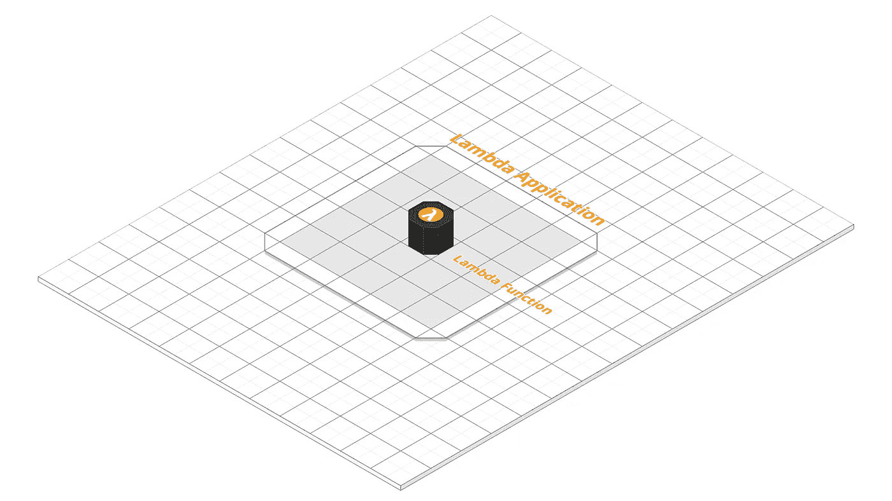

Lambda 应用程序的第 1 阶段。

## 代码

用以下文件创建一个新目录:

```
sam-hello-world/
  |-- template.yml
  |-- index.js
```

这些文件的内容如下:

`**template.yml**` **:**

```
AWSTemplateFormatVersion : '2010-09-09'
Transform: AWS::Serverless-2016-10-31
Resources:
  HelloWorldFunction:
    Type: AWS::Serverless::Function
    Properties:
      Handler: index.handler
      Runtime: nodejs8.10
```

`**index.js**` **:**

```
exports.handler = async function(event, context) {
  return 'Hello World!';
};
```

该模板定义了一个 Lambda 应用程序，其中包含一个名为`HelloWorldFunction`的 Lambda 函数。当这个函数被触发时，`index.js`中的处理函数被执行，它简单地返回字符串`Hello World!`。

## 部署它

让我们使用 SAM CLI 将该应用程序部署到 AWS:

```
sam package \
  --template-file template.yml \
  --output-template-file package.yml \
  --s3-bucket my-bucketsam deploy \
  --template-file package.yml \
  --stack-name sam-hello-world-1 \
  --capabilities CAPABILITY_IAM
```

当`sam deploy`完成时，我们的 Lambda 应用程序启动并运行在 AWS 上。

**注意:**如果您以前从未使用过 [AWS CLI](https://aws.amazon.com/cli/) ，您现在应该安装并配置它，因为 SAM CLI 依赖于 AWS CLI 的配置和保存的凭证。使用`[pip install awscli](https://docs.aws.amazon.com/cli/latest/userguide/installing.html)`安装 AWS CLI，并使用`[aws configure](https://docs.aws.amazon.com/cli/latest/userguide/cli-chap-getting-started.html#cli-quick-configuration)`进行配置。这将创建文件`~/.aws/config`和`~/.aws/credentials`，它们也由 SAM CLI 使用。

## AWS 控制台:Lambda

您可以通过在 AWS 控制台的[](https://console.aws.amazon.com/lambda/)**中导航到 **Lambda** 服务并点击*应用程序来检查应用程序是否已经部署。***

**在那里，您应该会看到名为`sam-hello-world-1`的全新 Lambda 应用程序:**

**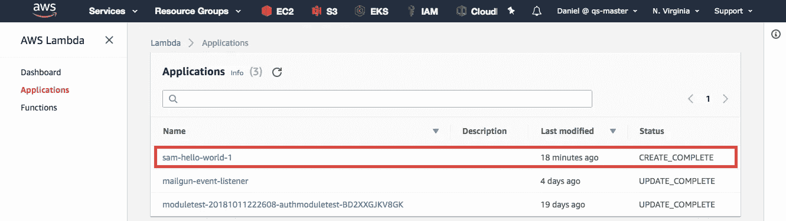**

**如果您单击该应用程序，您会看到该应用程序包含的所有资源。在我们的例子中，这只是一个名为`HelloWorldFunction`的 Lambda 函数:**

**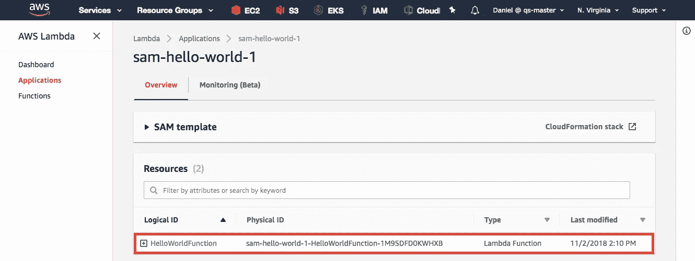**

**如果您单击该功能，您会看到关于该功能的所有详细信息。在那里，您还会再次遇到复杂的文本编辑器，其中预加载了您的函数代码，由于 SAM，您**没有**可以使用的:**

**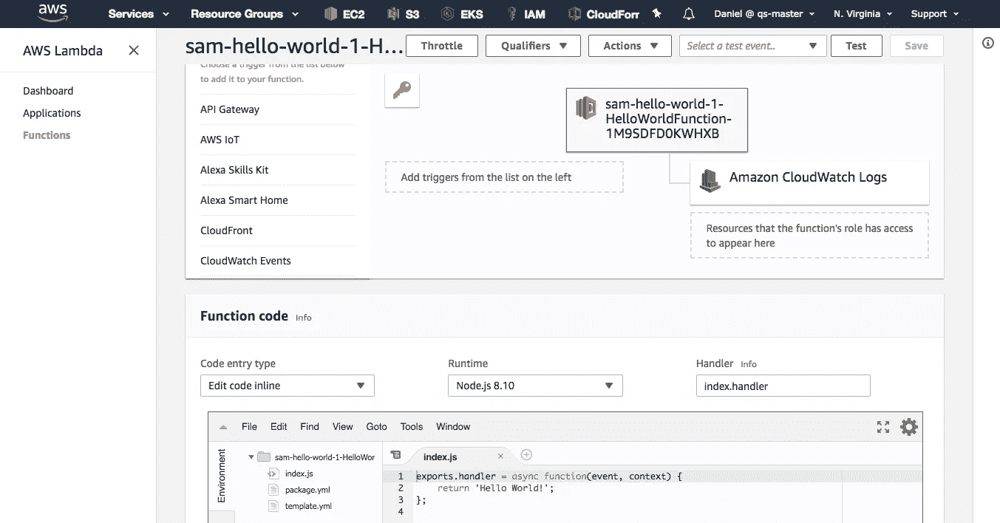**

## **AWS 控制台:云形成**

**如上所述，使用 SAM 部署 Lambda 应用程序会创建(或更新)一个 **CloudFormation** 堆栈。通过在 AWS 控制台的**[**https://console.aws.amazon.com/cloudformation/**](https://console.aws.amazon.com/cloudformation/)*导航到 CloudFormation 服务，您可以看到已经为您的 Lambda 应用程序创建的堆栈。*****

****在那里，您应该看到名为`sam-hello-world-1`的堆栈，它对应于您的 Lambda 应用程序(您在`sam deploy`命令中指定了这个名称):****

****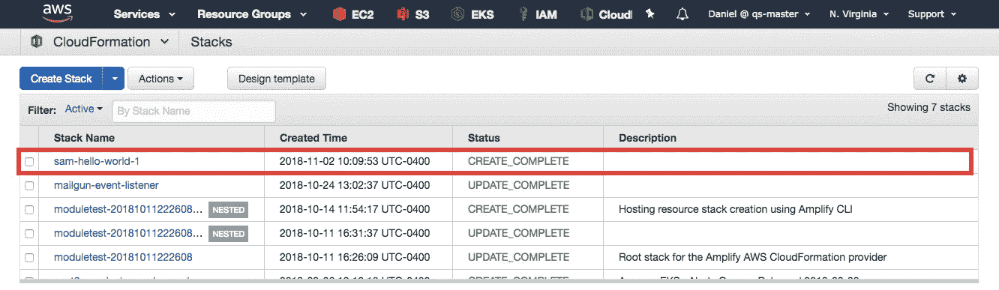****

****如果单击堆栈，您会看到它包含的确切资源集:****

****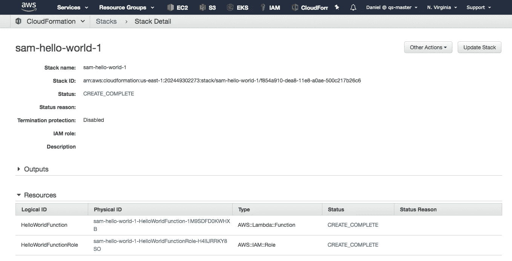****

****如您所见，堆栈包含一个 Lambda 函数和一个 IAM 角色。这些都是构成您当前 Lambda 应用程序的资源。****

****因此，我们现在可以确信我们的 Lambda 应用程序已经被正确地部署到 AWS 上了。现在，让我们扩展它。****

# ****步骤 2:添加事件源****

****上一步中创建的 Lambda 应用程序由一个 Lambda 函数组成，该函数没有任何关联的事件源。这意味着这个 Lambda 函数永远不会被事件触发，也就意味着它永远不会运行。****

****让我们通过设置来改变这一点，这样每当用户向特定的 API 端点发出 HTTP 请求时，就会触发 Lambda 函数。这是我们的扩展应用程序的外观:****

****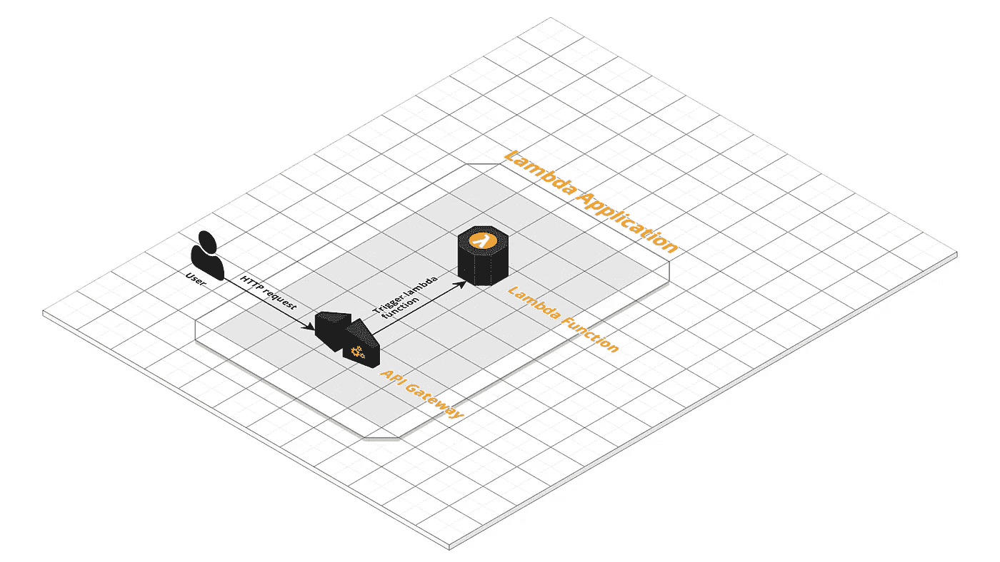****

****Lambda 应用程序的第 2 阶段。****

## ****代码****

****按如下方式更改项目中的两个文件源文件。****

****`**template.yml**`T23:****

```
**AWSTemplateFormatVersion : '2010-09-09'
Transform: AWS::Serverless-2016-10-31
Resources:
  HelloWorldFunction:
    Type: AWS::Serverless::Function
    Properties:
      Handler: index.handler
      Runtime: nodejs8.10
 **Events:
        HelloWorldApi:
          Type: Api
          Properties:
            Path: /
            Method: GET****
```

****`**index.js**` **:******

```
**exports.handler = async function(event, context) {
  return { statusCode: 200, body: 'Hello World!' };
};**
```

## ****解释:template.yml****

****对于`template.yml`，与之前版本的唯一区别是为 Lambda 函数添加了`Events`属性(上面以粗体突出显示)。****

****属性为我们的 Lambda 函数定义了一个事件源。我们将这个事件源定义为一个 API ( `Type: Api`)，并进行设置，以便每当对这个 API 的`/`端点发出 GET 请求时，就发出事件，并触发我们的 Lambda 函数。****

****当我们稍后将这个应用程序部署到 AWS 时，这个模板将导致一个 [API 网关](https://aws.amazon.com/api-gateway/) API 被创建并与我们的 Lambda 应用程序相关联。****

******注:******

****我们如何知道存在什么类型的事件源？一般来说，我们如何知道模板文件的语法、可用属性等等？答案是，由[**SAM 规范**](https://github.com/awslabs/serverless-application-model/blob/master/versions/2016-10-31.md) 。它定义了创建 SAM 模板所需的一切。例如，这里的列出并描述了所有可用的事件源[。](https://github.com/awslabs/serverless-application-model/blob/master/versions/2016-10-31.md#event-source-types)****

## ****解释:index.js****

****关于`index.js`，与之前版本的不同之处在于，我们返回的不是一个字符串，而是一个具有`statusCode`和`body`属性的对象。****

****由于 API 网关事件源的实现方式，这是必要的。它使用一个代理，该代理从 Lambda 函数中期待一个这种形式的对象。然后，代理将使用`statusCode`值作为 HTTP 响应的状态代码，使用`body`值作为响应的有效负载。****

****实际上，这意味着 API 网关端点的调用者将收到一个带有状态代码 200 和`Hello World!`主体的 HTTP 响应。事实上，这表明 Lambda 函数已经被正确地触发和执行。****

## ****部署它****

****让我们将新的 Lambda 应用程序部署为`sam-hello-world-2`:****

```
**sam package \
  --template-file template.yml \
  --output-template-file package.yml \
  --s3-bucket my-bucketsam deploy \
  --template-file package.yml \
  --stack-name sam-hello-world-2 \
  --capabilities CAPABILITY_IAM**
```

****如果您愿意，您也可以使用与以前版本相同的名称`sam-hello-world-1`，而不是`sam-hello-world-2`，在这种情况下，以前版本的应用程序将被覆盖。****

## ****触发该功能****

****如果您现在转到 AWS 控制台中**[**https://console.aws.amazon.com/lambda/**](https://console.aws.amazon.com/lambda/)下的 Lambda 服务，您应该会在那里看到您的新 Lambda 应用程序`sam-hello-world-2`。******

****如果您选择该应用程序，您可以看到它包含一个额外的资源，即 API 网关:****

****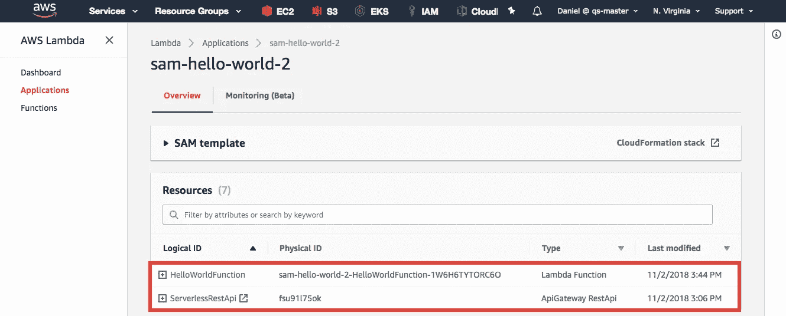****

****如果您选择 Lambda 函数，您会看到 API Gateway 已经被添加为 Lambda 函数的事件源。如果单击 API Gateway 事件源，可以看到触发 Lambda 函数的 API 端点 URL:****

****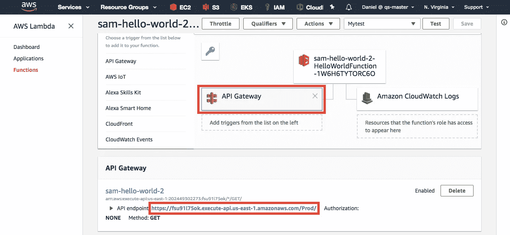****

****继续并在您的浏览器中打开此 URL，或使用`curl`发出请求。您应该收到一个带有状态代码 200 和一个`Hello World!`主体的 HTTP 响应。这意味着你的 Lambda 函数已经被成功触发并执行了！****

## ****CloudWatch 日志****

****如果你想知道更多关于你的 Lambda 函数何时以及如何执行的细节呢？这没有问题，因为 AWS Lambda 会自动为每个 Lambda 函数创建 [CloudWatch](https://aws.amazon.com/cloudwatch/) 日志。****

****默认情况下，这些日志包括 Lambda 函数每次执行的 *start* 和 *end* 事件，以及包含每次执行的持续时间和已用内存的 *report* 语句。此外，你在 Lambda 函数代码中写给`stdout`的所有东西(比如用`console.log`)也会被发送到 CloudWatch 日志中。****

****要查看 CloudWatch，您可以转到 AWS 控制台中的功能详细信息，然后单击*监控*选项卡。在那里你会看到一个标签为*的按钮在 CloudWatch 中查看日志:*****

****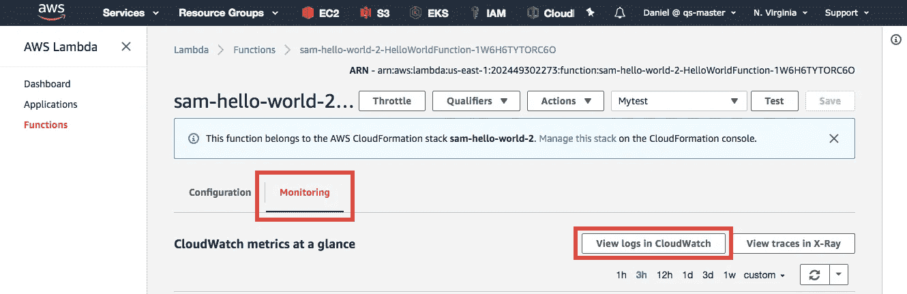****

****单击该按钮将带您进入为此功能创建的 CloudWatch 日志组。在这里，您可以看到在函数的生命周期内生成的完整日志:****

****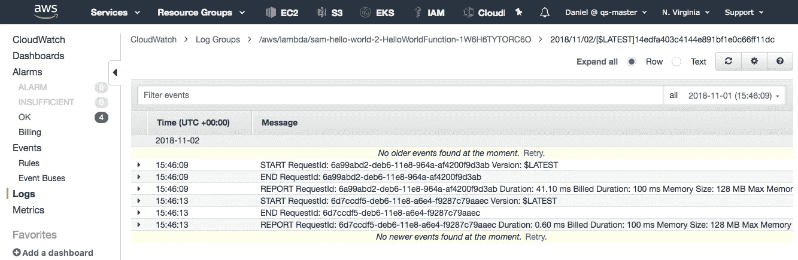****

****所以，现在我们的 Lambda 应用程序包含了一个 Lambda 函数和一个 API 网关作为事件源。但是这个函数还没有做任何有用的事情，它只是向 API 的调用者返回一个字符串。让我们增加一些动作。****

# ****步骤 3:添加操作****

****我们最后的 Lambda 应用程序会在上一步的 API 端点收到 GET 请求时向给定的电子邮件地址发送一封电子邮件。****

****我们将通过让 Lambda 函数向目标电子邮件地址订阅的[简单通知服务(SNS)](https://aws.amazon.com/sns/) 主题发布消息来实现这一点。****

****这是最终应用程序的样子:****

********

****Lambda 应用程序的第 3 阶段(最终版)。****

## ****代码****

****按如下方式修改这两个源文件。****

****`**template.yml**`T20:****

```
**AWSTemplateFormatVersion : '2010-09-09'
Transform: AWS::Serverless-2016-10-31
Resources:
  HelloWorldFunction:
    Type: AWS::Serverless::Function
    Properties:
      Handler: index.handler
      Runtime: nodejs8.10
      Events:
        HelloWorldApi:
          Type: Api
          Properties:
            Path: /
            Method: GET
 **Policies:
        - SNSPublishMessagePolicy:
            TopicName: !GetAtt HelloWorldTopic.TopicName
      Environment:
        Variables:
          SNS_TOPIC_ARN: !Ref HelloWorldTopic
  HelloWorldTopic:
    Type: AWS::SNS::Topic
    Properties:
      Subscription:
        - Endpoint: youremail@example.com
          Protocol: email****
```

****`**index.js**` **:******

```
**const aws = require('aws-sdk');
aws.config.update({region: 'us-east-1'});
const sns = new aws.SNS()exports.handler = async function(event, context) { const params = {
    Message: 'Hello World!',
    Subject: 'SNS Notification from Lambda',
    TopicArn: process.env.SNS_TOPIC_ARN
  }; try {
    await sns.publish(params).promise()
    return { statusCode: 200, body: 'Message sent' };
  } catch(err) {
    return { statusCode: 500, body: JSON.stringify(err) };
  }
};**
```

## ****解释:template.yml****

****`template.yml`中有不少新行(粗体突出显示)。但是让我们更仔细地看看。实际上添加的是 Lambda 函数的两个属性，`Policies`和`Environment`，以及一个名为`HelloWorldTopic`的全新资源。****

******SNS 话题:******

****让我们先看看新的`HelloWorldTopic`资源。是`AWS::SNS::Topic`类型的，也就是 SNS 话题。实际上，这意味着当我们部署这个 Lambda 应用程序时，将会创建一个新的 SNS 主题。该主题还有一个立即定义的订阅，它包含一个电子邮件地址并使用电子邮件协议。****

****请注意，您无法在 [SAM 规范](https://github.com/awslabs/serverless-application-model/blob/master/versions/2016-10-31.md#event-source-types)中找到资源类型`AWS::SNS::Topic`。那么它来自哪里呢？答案是它是一个 **CloudFormation 资源类型**而不是 SAM 资源类型。SAM 是 CloudFormation 的超集，因此您可以在 SAM 模板中使用传统的 CloudFormation 资源。****

****你可以在 AWS 文档的这里找到所有可用的云信息资源类型[的规范。例如，`AWS::SNS::Topic`资源类型在这里被指定为](https://docs.aws.amazon.com/AWSCloudFormation/latest/UserGuide/aws-template-resource-type-ref.html)。****

******环境:******

****让我们看看`HelloWorldFunction` Lambda 函数的新`Environment`属性。这个属性除了指定一个名为`SNS_TOPIC_ARN`的环境变量之外什么也不做，这个变量可以从函数的源代码中获得(例如 Node.js 中的`process.env`)。****

****这个环境变量的值是`HelloWorldTopic` SNS 主题的 ARN。Lambda 函数代码需要这个 ARN 来发布这个主题的消息，我们接下来会看到。****

****注意，这里我们使用了另一个称为**内在函数**的 CloudFormation 特性。内在函数是内置的 CloudFormation 函数，可以从 CloudFormation(或 SAM)模板中调用。内在函数的完整列表可在[这里](https://docs.aws.amazon.com/AWSCloudFormation/latest/UserGuide/intrinsic-function-reference.html)获得。****

****在我们的例子中，我们使用`[Ref](https://docs.aws.amazon.com/AWSCloudFormation/latest/UserGuide/intrinsic-function-reference-ref.html)`固有函数，它返回作为参数提供的资源的 ARN。这里确实有必要使用一个内部函数，因为在第一次部署时，新 SNS 主题的 ARN(尚未创建)是未知的。****

******政策:******

****最后，让我们看看 Lambda 函数的新的`Policies`属性。简而言之，该属性授予 Lambda 函数向`HelloWorldTopic` SNS 主题发布消息的权限。****

****这是必要的，因为在默认情况下，Lambda 函数被分配了一个没有任何权限的 [IAM 角色](https://docs.aws.amazon.com/IAM/latest/UserGuide/id_roles.html)(除了写入 CloudWatch 日志)。这意味着对于 Lambda 函数必须访问的每个 AWS 服务，您必须为 Lambda 函数的角色添加适当的权限。****

****在我们的例子中，我们通过使用一个名为 [**策略模板**](https://github.com/awslabs/serverless-application-model/blob/master/docs/policy_templates.rst) 的 SAM 特性授予该功能所需的权限。策略模板是一组预定义的 IAM 策略，可以通过简单的字符串引用。****

****在我们的模板中，我们使用了`SNSPublishMessagePolicy`策略模板，它符合我们的要求，即授予发布消息到特定 SNS 主题的权限。此策略模板需要一个名为`TopicName`的参数，该参数必须是应该授予发布权限的 SNS 主题的名称。所有可用的 SAM 策略模板的规范都可以在[文件](https://github.com/awslabs/serverless-application-model/blob/develop/samtranslator/policy_templates_data/policy_templates.json)中找到。****

****注意，我们使用另一个 CloudFormation 内部函数`[GetAtt](https://docs.aws.amazon.com/AWSCloudFormation/latest/UserGuide/intrinsic-function-reference-getatt.html)`来检索`HelloWorldTopic` SNS 主题的名称。这是必要的，因为该名称是自动生成的，并且在初始部署时是未知的。****

## ****解释:index.js****

****`index.js`中的 Lambda 函数代码向应用程序的 SNS 主题(代码从`SNS_TOPIC_ARN`环境变量中检索其 ARN)发布一条消息，然后向 API 的调用者返回一个`Message sent`响应(或者在发布到 SNS 时出现错误的情况下，返回一个错误响应)。****

****通常，从 AWS Lambda 函数访问 AWS 服务的方式与从任何其他代码访问 AWS 服务的方式相同，即使用 AWS SDK。这意味着，我们在 Lambda 函数中用来向 SNS 主题发布消息的代码与我们在任何其他应用程序中使用的代码是相同的。****

****Node.js 的 AWS SDK 的 API 参考可以在[这里](https://docs.aws.amazon.com/AWSJavaScriptSDK/latest/index.html)找到。SNS `publish`方法的具体参考就是这里的。****

****AWS Lambda 的一个非常方便的特性是，默认情况下，AWS SDK 依赖项在所有运行时环境中都可用。得益于此，我们可以在 Node.js 代码中执行`require('aws-sdk')`，而不必先执行`npm install aws-sdk`。这使我们的 Lambda 应用程序包保持精简，因为不需要`node_modules`目录和`package.json`文件。****

## ****部署它****

****让我们部署最终的 Lambda 应用程序:****

```
**sam package \
  --template-file template.yml \
  --output-template-file package.yml \
  --s3-bucket my-bucketsam deploy \
  --template-file package.yml \
  --stack-name sam-hello-world-3 \
  --capabilities CAPABILITY_IAM**
```

## ****确认 SNS 订阅****

****如果您用自己的电子邮件地址替换了模板中的虚拟电子邮件地址，那么在部署完成后，您应该会收到一封电子邮件，提示您确认订阅新创建的 SNS 主题。****

****您必须这样做，否则您将不会收到发布到该主题的所有后续消息的电子邮件。当新创建 SNS 主题(和您的订阅)时，您只需在第一次部署时这样做一次。****

## ****测试一下****

****和上一步一样，检索 Lambda 应用程序的 API 网关的 API 端点 URL，并用浏览器或`curl`向它发出 GET 请求。观察你的电子邮件收件箱。几秒钟后，您应该会收到一封来自 SNS 的电子邮件，其中包含您的内容。****

****至此，您已经成功构建了一个 AWS Lambda 应用程序，它包含一个 Lambda 函数、一个事件源和一个访问另一个 AWS 服务的动作。这一切都是因为萨姆。恭喜你！****