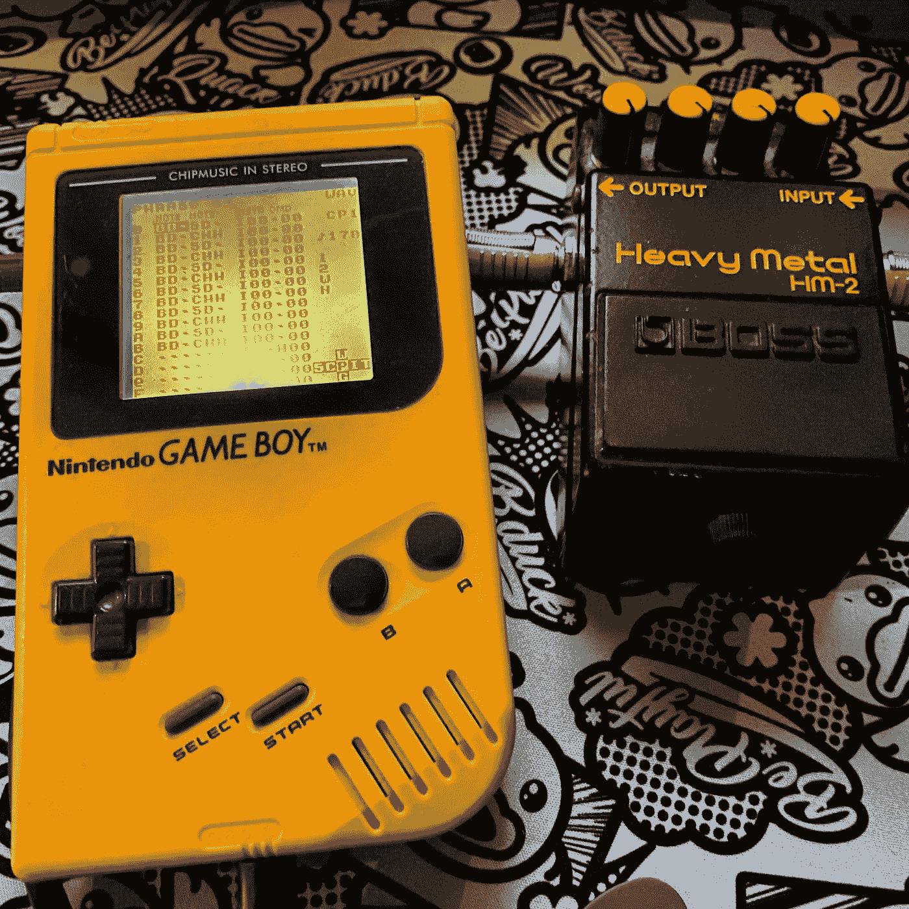
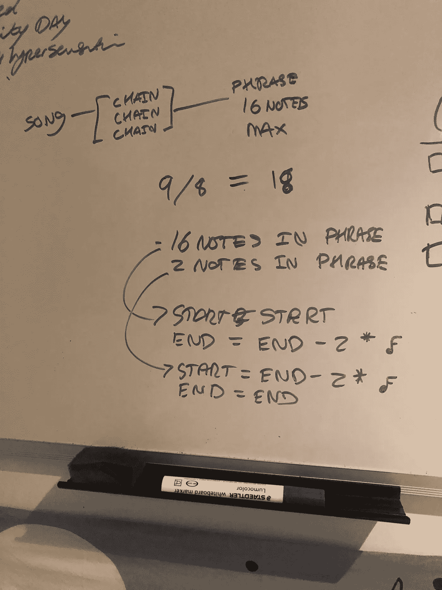
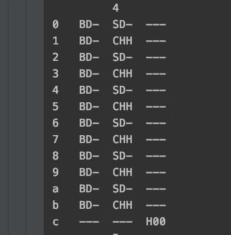
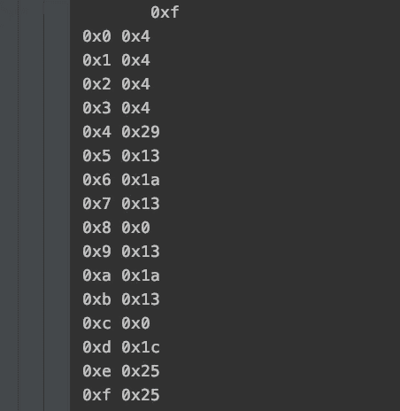

# 用 Python、MIDI 和 LSDJ 创作 chiptunes

> 原文：<https://itnext.io/creating-chiptunes-with-python-midi-and-lsdj-3db936ddd469?source=collection_archive---------2----------------------->

游戏机上的技术死亡金属？为什么不呢！

像任何人一样，我热爱音乐。像所有书呆子一样，我喜欢在旧游戏机上制作的音乐。

为了在我的老游戏机任天堂 Gameboy 上制作音乐，我使用了一款名为“小声音 DJ (LSDJ)”的软件。

简单地说，LSDJ 允许你将音符编程为乐句(本质上是音乐的小节)，然后创建乐句链，这些乐句链就变成了一首歌。

# 使用限制

Gameboy 只支持四个通道(还有第五个，但很难使用)，两个脉冲通道，一个波形和一个噪声通道，虽然它可以同时播放所有四个通道，但各个通道本身都是单声道的。

这些限制实际上是吸引我到 chiptune 音乐的原因，你必须创建自己的方法来实现简单的音乐结构，如和弦或非常见时间的拍号。

LSDJ 提供工具来弥补这种功能的缺乏，例如，9/8 拍的拍号可以通过两个 16 个音符的乐句来实现，第二个乐句在第二个音符之后结束(所以是 18/16)，和弦可以通过快速弹奏和弦中的音符来实现。

Chiptune 艺术家不仅受到他们可用的音乐工具的限制，还受到硬件资源的限制。

LDSJ 可以支持多达 254 个 16 音乐句和 254 个 16 音乐句链，这实际上足以满足大多数需求，但对于上面的 9/8 示例，由于需要两个乐句，它突然减半为 127 个乐句，如果我们假设所有四个通道都将被使用，则每个乐器只有 31 个乐句，即 558 个乐句。

LSDJ 再次提供了一些工具来解决这一限制，当添加一个短语到一个链中时，可以选择移调音符，这样你就可以最大限度地重复使用短语，比如改变音调。

# 加强我的游戏

我在 LSDJ 创作/编程的大部分歌曲都比较直接，要么是在普通时间，要么有简单的歌曲结构。

然而，我最近决定给自己一个挑战，尝试一首 Necrophagist 的《烹饪过敏》，这首歌我已经用吉他学了一年多了。

我在今年年初的最初尝试并没有取得很大进展，因为我无法在一个会话中编程这首歌，并且在有时间将它选回来后失去了我的位置。

我正在学习吉他部分，并从 MIDI 文件转录 Gameboy 部分，因此决定尝试通过我拥有的 [USB-Boy 接口](https://thursdaycustoms.bigcartel.com/product/usb-boy)将 MIDI 数据从 Logic 中继到 LDSJ，但我永远无法让它正常工作(尽管这是一个逻辑问题，而不是接口问题)。

[我以前处理过 MIDI 数据](https://medium.com/@colinwren/visualising-midi-files-with-python-b221feacd762)，并决定重新审视我以前的项目，但我没有将 MIDI 数据可视化，而是将其转换成音符、短语和链，以便将歌曲转录到 LSDJ。

# 我画出了所有正确的音符，只是顺序不一定正确

MIDI 数据只是一系列事件，是通过将 MIDI 滴答声解析为音符值(如半八分音符(第 16 个音符))来确定音乐结构的唯一方法。

创建一个 dict，将 tick 值作为键，将该 tick 处的音符作为值

然而，音乐并不是被写成一系列流动的音符，而是由包含一系列音符的小节组成，这些音符被分解成一定的小节。

这可能会成为我最喜欢的数学

幸运的是，MIDI 存储了拍号事件以及它们发生的节拍，因此为了展示歌曲的蓝图，只需将音符映射到它们所属的乐句/小节，并将这些乐句/小节映射到链。

基于拍号将音符映射到乐句

创建了音符到小节的映射后，我删除了重复的短语，以减少需要输入和存储在链中的短语数量。

我是这样做的:创建一个 base64 字符串的短语中的音符，然后使用一个`dict`来创建一个集合，同时在一个数组中保留短语的顺序。

删除重复的短语并创建链式映射

# 打印东西

当然，在对象中有歌曲结构是没有用的，它们需要被转换成一种方式，使输入到 LSDJ 变得简单。

LSDJ 乐句屏幕显示三/四列(鼓有两个音符)；注释、仪器和命令以及 16 行，尽管这些行是十六进制的，所以 0-F。

显示鼓需要更多的努力，因为 MIDI 文件会返回音高，但 LSDJ 对不同的鼓使用短代码，例如`bd`代表低音鼓，`chh`代表近踩镲。

为了显示正确的鼓，我创建了一个不同音高和它们相关的鼓的地图，此外，LSDJ 的鼓可以同时播放两种声音，所以我扩展了短语视图以显示两种音符。

打印鼓乐句

强烈的节奏

为了更容易找到我的位置(有很多短语)，我决定以一种非常基本的方式复制列和行结构，这非常有效，因为你可以清楚地看到什么是要去哪里，我在哪个短语中。

如果这个短语不得不提前结束(由于 6/8 等等)，那么我必须确保最后一行在命令行中包含一个`H00`(这告诉 LSDJ 跳到下一个短语)。

对于链，我做了类似的显示，但只有行号和短语。

印刷链条

包含爆破节拍短语的链

# 把所有的放在一起

在解决了剧本中的大部分问题后，我决定咬紧牙关，看看我编写的每一个程序是否真的会产生类似这首歌的效果……的确如此！

鼓声的一个例子

除了我不知道哪些乐句包含哪些音符(因为这是由计算机处理的)这一事实之外，我花了两个多小时为封面编写鼓和两个脉冲通道乐器的程序，当我第一次按下播放时，它完美地工作了。

为了在添加多个通道时更容易抵消短语和链，我最终构建了一些命令行参数来处理这一点，但由于 LSDJ 数字是十六进制的，我必须在输入数字之前进行一些转换。

如果我完全诚实，我绝对惊讶它第一次工作，我已经预料到它会失败，但我的手指很高兴我不需要再花 2 个小时在笔记中编程！

然后，我开始录制单独的低音音轨和独奏音轨，并用我的半速游戏机录制鼓和吉他音轨，将它们混合在一起。

这一过程的最终结果如下:

最后一首歌！

# 后续步骤

这个剧本一点也不完美，我列出了一些我想做的改进:

*   某些歌曲利用了这些(尤其是在独唱中)，我想自动化这个，因为它需要以双倍的速度运行命令
*   **和弦**——以特定节拍播放所有音符，并自动创建一个播放和弦音符的表格，这将非常棒
*   **多声道导入**——不是一次处理一个文件，而是处理一个多声道 MIDI 文件或单独的文件，而是通过一个 YAML 文件或其他东西，这样会更容易使用
*   JSON/HTML 显示 —我想把这个脚本变成一个 web 服务，输出是 JSON，然后可以输入 React 显示。我的目标是，任何人都可以上传一个 MIDI 文件，并获得他们需要的 LSDJ 命令，把它放在他们的游戏机上
*   **LSDJ 保存文件生成**——我可以使用 LSDJ 保存文件的 Python 库，最终节省更多的时间，因为我只需要将它添加到我的盒式磁带中，然后按下 play
*   **发布** —这样别人就可以用了！