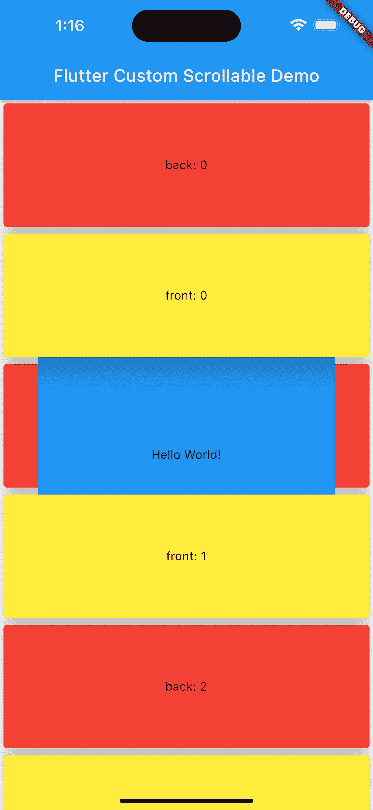

# 使用 Flutter 创建自定义可滚动小部件(不是 CustomScrollView)

> 原文：<https://itnext.io/creating-custom-scrollable-widget-with-flutter-not-customscrollview-229cb8f6c1fc?source=collection_archive---------1----------------------->



如你所知，在 Flutter 中有许多可滚动的小部件。ListView、GridView 等等。

但是，有时这些小工具并不能满足我们的需求。例如，创建如下所示的视图，内置可滚动的小部件是不可能的。(至少我不会)。

此外，通过尝试这个示例，您可以通过了解您所使用的可滚动小部件的错误原因以及这些小部件的工作逻辑来提高自己。

在下面的示例中，黄色框在蓝色框上方滚动，红色框在蓝色框下方滚动。

[](https://youtube.com/shorts/wXEl-Q927sI) [## Flutter 自定义可滚动小部件示例

### 阅读以了解如何创建这个小部件…

youtube.com](https://youtube.com/shorts/wXEl-Q927sI) 

在这些情况下，我们将使用一个小部件(以及其他可滚动的小部件):“scrollable”。

> 也有人通过手势检测器和原始滚动信息来完成如此复杂的滚动。然而，为了实现无限滚动，使用滚动控制器并添加滚动物理特性，最好使用可滚动的而不是手势检测器。

让我们通过这个例子来考察“可滚动”的用法。

## 可滚动堆栈

首先，我用 Stack 创建了随像素信息随深度移动的小部件。

这个小部件创建了我们想要的视图。但是还不能滚动。

当我们正确实现“pixels”getter 时，小部件将是可滚动的。

这不是我们的主题，但是如果你想看看我是如何在这里创建盒子的:[镖靶](https://dartpad.dev/?id=bf41c410306591caf9442a3642713627)

```
 class ScrollableStack extends StatefulWidget {
  const ScrollableStack({super.key});

  @override
  State<ScrollableStack> createState() => _ScrollableStackState();
}

class _ScrollableStackState extends State<ScrollableStack> {

  // We will use this to get scroll position
  double get pixels => 0;

  @override
  Widget build(BuildContext context) {
    return Stack(
      alignment: Alignment.center,
      children: [
        Positioned(
            top: -pixels,
            left: 0,
            right: 0,
            height: 100,
            child: ...
        )
      ],
    );
  }
}
```

## 使用可滚动

“可滚动”小部件采用一个名为“viewportBuilder”的参数。这样我们就可以得到一个“视图端口偏移量”。

我们必须向滚动轴中的“ViewportOffset”声明一个维度和内容维度。

> 在我的例子中，内容的总高度是 3000。可以动态设置。

```
Scrollable(
    controller: controller,
    viewportBuilder: (c, offset) {
      offset!.applyViewportDimension(viewportHeight);
      offset!.applyContentDimensions(0, 3000 - viewportHeight);

      return ScrollableStack();
    })
```

现在，我们理解了您之前可能收到的错误的原因。

我们的小部件在布局中必须有约束，这样我们才能给出视口的尺寸。现在我们需要知道极限，才能给出尺寸，如果我们不知道，就会出错。例如，如果我们在一个列中使用滚动视图(没有用展开的来包装它)，布局将没有垂直边界，并且滚动视图将给出一个错误，因为它不能获得垂直大小。

我使用 LayoutBuilder 来获取小部件的高度:

```
LayoutBuilder(builder: (context, constraints) {
  assert(constraints.hasBoundedHeight,"Widget has not vertical boundaries");
  return Scrollable(
      viewportBuilder: (c, o) {
        offset = o;
        offset!.applyViewportDimension(constraints.maxHeight);
        offset!.applyContentDimensions(0, 3000 - constraints.maxHeight);
        return ScrollableStack();
      });
});
```

现在，我们可以为视口偏移创建监听器函数。

```
class _ScrollableStackState extends State<ScrollableStack> {
  ViewportOffset? offset;

  void _addListener(ViewportOffset offset) {
    this.offset = offset;
    offset.addListener(_listener);
  }

  void _removeListener(ViewportOffset offset) {
    offset.removeListener(_listener);
  }

  void _listener() {
    setState(() {});
  }

  // ...
}
```

到达“_ScrollableStackState”方法:

```
class _MyHomePageState extends State<MyHomePage> {

  /// Create key 
  final GlobalKey<_ScrollableStackState> _scrollableStackKey =
      GlobalKey<_ScrollableStackState>();

  @override
  Widget build(BuildContext context) {
    return Scaffold(
      body: LayoutBuilder(builder: (context, constraints) {
          return Scrollable(
              controller: controller,
              viewportBuilder: (c, o) {
                /// ...
                return ScrollableStack(
                  /// give the key
                  key: _scrollableStackKey,
                );
              });
        }),
     );
  }
}
```

达到:

```
Scrollable(
    controller: controller,
    viewportBuilder: (c, o) {
      /// ...
      /// listen at the second frame
      WidgetsBinding.instance.addPostFrameCallback((timeStamp) {
        _scrollableStackKey.currentState?._addListener(viewportOffset);
      });
      return ScrollableStack(
        key: _scrollableStackKey,
      );
    });
```

获取正确的像素:

```
 class _ScrollableStackState extends State<ScrollableStack> {
  ViewportOffset? offset;

  void _addListener(ViewportOffset offset) //..

  void _removeListener(ViewportOffset offset) //..

  void _listener() //..

  /// Get pixels
  double get pixels => offset?.pixels ?? 0;

  @override
  Widget build(BuildContext context) // ...
}
```

好吧！

我们的可滚动部件已经准备好了。

我在这篇文章里写了一个非常简短的总结。如果你感兴趣，你可以回顾一下要点，看看如何管理性能，让第一个滚动开始，等等。

要旨:【https://dartpad.dev/?id=bf41c410306591caf9442a3642713627 