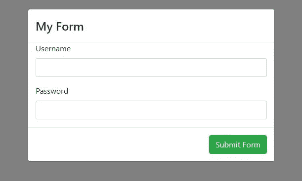

# 用 ng-bootstrap 在模态内部创建表单

> 原文：<https://itnext.io/creating-forms-inside-modals-with-ng-bootstrap-221e4f1f5648?source=collection_archive---------0----------------------->



在模态内部创建表单有很多好处。将它们与有价值的内容一起使用可能会给你的项目带来很多吸引力。随着 ngx-和 ng-bootstrap 的出现，我们可以轻松地将任何 bootstrap 组件集成到我们的应用程序中。

本文涵盖以下主题:

*   创建角度项目
*   添加 ng-bootstrap 并创建一个简单的模式
*   将表单添加到我们的模态中
*   摘要

所以，让我们开始吧！

## 创建项目

启动新项目的最佳方式是使用 Angular CLI。CLI 负责初始应用程序的代码搭建、构建我们的应用程序、创建组件等等。要访问 Angular CLI toolkit，您首先需要安装它。

使用以下命令:

`npm install @angular/cli -g`

然后使用以下内容初始化新的角度项目:

`ng new ngModalForm`

一旦完成，访问目录并运行`ng serve`。这将在`localhost:4200`为我们的应用服务。当在 URL 中粘贴并输入这段代码时，您应该会看到一个基本页面。

## 添加 ng 引导

正如我前面提到的，我们将在项目中使用 ng-bootstrap 库。ng 自举依赖于角度和自举。既然我们已经有了 Angular sat up，我们只需要 Bootstrap。

运行以下命令:

```
npm i bootstrap
```

这将安装软件包，但我们仍然需要设置它。在您的`angular-cli.json`文件中，在样式数组中添加以下几行:

```
"styles": [
"styles.css",
  "../node_modules/bootstrap/dist/css/bootstrap.min.css"
],...
```

*注意！我遇到了我使用的引导版本(4 . 0 . 0-beta 3)的问题。你需要降级到 beta 2 才能让它工作。只需更新* `*package.json*` *内的依赖关系，运行* `*npm i*` *。*

然后使用以下命令安装 ng-bootstrap:

```
npm i --save @ng-bootstrap/ng-bootstrap
```

安装后，在 app.module 中导入模块:

```
import { NgbModule } from '@ng-bootstrap/ng-bootstrap';

@NgModule({
  declarations: [AppComponent, ...],
  imports: [
    NgbModule.forRoot(),
    ...
  ],
  bootstrap: [AppComponent]
})
export class AppModule {
}
```

这允许我们简单地将`NgbModule`导入到其他想要使用该库工具包的组件中。

## 添加模态

让我们首先创建一个包含一些简单内容的模型。

为组件创建一个新组件:`ng g c FormModal`。这将创建新组件，并将其添加到模块声明中。但是我们也需要将它添加到`entryComponents`声明中。

```
...
bootstrap: [AppComponent],
entryComponents: [
  FormModalComponent
]
...
```

我们需要做的下一件事是在我们刚刚创建的`FormModalComponent`中为`NgbActiveModal`注册一个服务提供者。

```
import { NgbActiveModal } from '@ng-bootstrap/ng-bootstrap';
```

我们还需要在构造函数中创建对服务的引用:

```
constructor(
  public activeModal: NgbActiveModal
) { }
```

和一个用于关闭模态的方法，并将一些数据传递回触发器方法。

```
closeModal() {
  this.activeModal.close('Modal Closed');
}
```

我们需要对组件做的最后一件事是在`form-modal.component.html`中添加内容。

```
<div class="modal-header">
  <h4 class="modal-title">Modal Title</h4>
  <button type="button" class="close" aria-label="Close"
   (click)="activeModal.dismiss('Cross click')">
  </button>
</div>
<div class="modal-body">
  <p>My modal content</p>
</div>
<div class="modal-footer">
  <button (click)="activeModal.dismiss('Close clicked')">
    Close Clicked
  </button>
</div>
```

那么，模态组件已经设置好了，但是我们如何初始化它呢？我们将通过`app.component.ts`文件来实现这一点。

从导入`NgbModal`和`FormModalComponent`开始。

```
import { NgbModal } from '@ng-bootstrap/ng-bootstrap';
import { FormModalComponent } from './form-modal/form-modal.component';
```

在构造函数中创建引用:

```
constructor(
  private modalService: NgbModal
) { }
```

和一种用于初始化模型的方法。

```
openFormModal() {
  const modalRef = this.modalService.open(FormModalComponent);

  modalRef.result.then((result) => {
    console.log(result);
  }).catch((error) => {
    console.log(error);
  });
}
```

最后，添加一个附带 click 事件的按钮。

```
<button (click)="openFormModal()">Open Modal</button>
```

瞧啊！点击“打开模式”按钮将启动模式。

## 添加表单

当在我们的模态中实现表单时，我们想要实现几件事情。

*   向表单传递一个 id(以防您想要检索一些可编辑的信息)。
*   将结果传递回触发模式的组件。

从在`app.module`中添加这些声明开始。

```
import { FormsModule, ReactiveFormsModule } from '@angular/forms';...
imports: [
  BrowserModule,
  NgbModule.forRoot(),
  FormsModule,
  ReactiveFormsModule
],
...
```

我们可能希望向模态组件传递一个 id。这是通过在`openFormModal`方法中添加下面一行来实现的。

```
openFormModal() {
  const modalRef = this.modalService.open(FormModalComponent);
  modalRef.componentInstance.id = 10; // should be the id

  modalRef.result.then((result) => {
    console.log(result);
  }).catch((error) => {
    console.log(error);
  });
}
```

使用`Input`捆绑，在`FormModalComponent`中取回。

```
import { Component, OnInit, Input } from '@angular/core';
...
@Input id: number;
```

现在，您可以访问模态内部的 id。

所以我们来添加表单。

```
<div class="modal-header">
  <h4 class="modal-title">My Form</h4>
  <button type="button" class="close" aria-label="Close"
   (click)="activeModal.dismiss('Cross click')">
  </button>
</div>
<form [formGroup]="myForm" (ngSubmit)="submitForm()">
  <div class="modal-boy">
    <div class="container">
      <div class="form-group">
        <label for="username">Username</label>
        <input type="text" 
          class="form-control"
          formControlName="username" />
      </div>
      <div class="form-group">
        <label for="password">Password</label>
        <input type="password" class="form-control">
      </div>
    </div>
  </div>
  <div class="modal-footer">
    <button class="btn btn-success"
      [disabled]="!myForm.valid">
      Submit Form
    </button>
  </div>
</form>
```

和组件。

```
import { Component, Output, EventEmitter, Input } from '@angular/core';
import { FormGroup, FormBuilder, FormControl, Validators } from '@angular/forms';
import { NgbActiveModal } from '@ng-bootstrap/ng-bootstrap';@Component({
  selector: 'app-form-modal',
  templateUrl: './form-modal.component.html'
})
export class FormModalComponent { @Input()id: number;
  myForm: FormGroup; constructor(
   public activeModal: NgbActiveModal,
   private formBuilder: FormBuilder
  ) {
    this.createForm();
  } private createForm() {
    this.myForm = this.formBuilder.group({
      username: '',
      password: ''
    });
  } private submitForm() {
    this.activeModal.close(this.myForm.value);
  }
}
```

这将把表单值记录到控制台，但是你可以随心所欲。

## 摘要

因此，我们已经实现了在 ng-boostrap 模型内部创建表单的目标。使用这种方法，您可以将 id 传递给表单组件，检索可编辑的信息。您还可以将值传递回初始化它的组件，更新一个表或给用户一个响应。