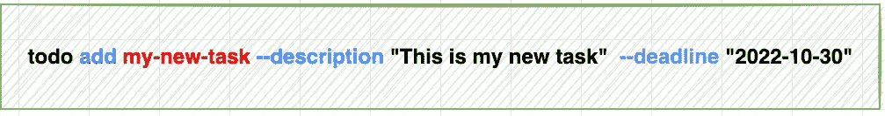

# 使用 Cobra 创建 go CLI 应用程序

> 原文：<https://itnext.io/creating-go-cli-applications-using-cobra-95aa33d64e71?source=collection_archive---------2----------------------->

obra 是一个用于创建强大的现代 CLI 应用程序的库。它正被用于许多流行的开源项目。在本文中，我将探索如何使用 Cobra 构建一个简单的 todo CLI 应用程序。


照片由 [NIvedh P](https://unsplash.com/es/@nivedh_pkt?utm_source=medium&utm_medium=referral) 在 [Unsplash](https://unsplash.com?utm_source=medium&utm_medium=referral) 上拍摄

**在开始之前，让我们分解一下将要构建的命令。**



*   **todo** :这是 CLI 应用程序名称
*   **添加:**todo 应用程序子命令下的子命令是嵌套的，这意味着每个命令可以有零到多个子命令
*   **我的新任务**:这是命令行参数，每个子命令可以有零个参数
*   **—描述**:这是一个命令行标志，标志有两种类型。持久标志:意味着这个标志将对它所分配到的命令以及该命令下的每个命令可用。另一种类型是本地标志，它只适用于特定的命令。

**安装:**

您需要安装 cobra-cli 二进制文件

```
go install github.com/spf13/cobra-cli@latest
```

Go 会自动将它安装到您的`$GOPATH/bin`目录中，这个目录应该在您的 PATH 中。

**构建您的应用程序框架**

1.  创建一个新目录“todo”
2.  `cd`进入目录
3.  跑`go mod init github/afarid/todo`

例如

```
mkdir todo
cd todo
go mod init github.com/afarid/todo
```

4-生成基本骨架

```
cobra-cli init --viper
cobra-cli add add ## command to add a new todo to todo list
cobra-cli add remove ## command to remove a todo from todo list
cobra-cli add update ## command to update description of a todo
cobra-cli add list ## command to list all todos. optionally, with deadline 
```

*   `cobra-cli init --viper`:创建一个基本的目录结构，并使用 viper 进行配置管理，稍后，我将解释如何使用 viper 和 cobra
*   `cobra-cli add <command>`:这些都是 TODO 应用程序下的子命令。

完成这一步后，您的目录结构应该是这样的。

```
todo
|-- LICENSE
|-- cmd
|   |-- add.go
|   |-- list.go
|   |-- remove.go
|   |-- root.go
|   `-- update.go
|-- go.mod
|-- go.sum
`-- main.go
```

**编写第一条命令“添加”:**

1-打开`cmd/root.go`文件并添加以下代码

*   第 1–9 行:我们定义了配置文件的结构。
*   Lind 14–17:将`.todo.yaml`的内容赋给变量`todos`

2-打开`cmd/add.go`并添加以下代码行

*   第 5 行:提取 todo 名称的值作为命令行参数
*   第 6:7 行提取截止日期和描述的值作为标志
*   第 8 行:15 将当前待办事项添加到待办事项列表中
*   第 16 行，将 todos 列表写入配置文件，默认为`$HOME/.toddo.yaml`，这可以在`root.go`文件中覆盖

**让我们尝试执行第一个添加的命令**

```
touch $HOME/.todos.yaml ## This is for 1st run only
go run main.go add my1stTask --description "Tide my room" --deadline "30-10-2022"
go run main.go add my2ndTask --description "Read xyz book" --deadline "31-10-2022"
```

执行该命令后,`$HOME/.todos.yaml`的内容应该是这样的

```
todos:
    - name: my1stTask
      description: Tide my room
      deadline: 30-10-2022
    - name: my2ndTask
      description: Read xyz book
      deadline: 31-10-2022
```

**执行第二个命令“列表”**

1-打开`cmd/list.go`，添加下面的代码片段

*   第 4:9 行，只是打印包含待办事项列表的`todos.Todos`的内容。

**让我们尝试执行第二个命令**

```
go run main.go list
```

输出应该是这样的

```
[
  {
    "Name": "my1stTask",
    "Description": "Tide my room",
    "Deadline": "30-10-2022"
  },
  {
    "Name": "my2ndTask",
    "Description": "Read xyz book",
    "Deadline": "31-10-2022"
  }
]
```

**执行第三个命令“移除”**

1-打开`cmd/remove.go`，添加以下代码片段

第 5 行:提取 todo 名称作为参数。

Line: 6:12:迭代 todos 并删除匹配`todoName`的那个

第 13 行，将待办事项列表写入配置文件

**现在尝试删除一个之前添加的待办事项。**

```
go run main.go remove my2ndTask
```

打印现有待办事项

```
go run main.go list            
[
  {
    "Name": "my1stTask",
    "Description": "Tide my room",
    "Deadline": "30-10-2022"
  }
]
```

你会注意到`my2ndTaks`被移除了。

**更新现有任务的描述和截止日期**

这与前面的命令不同，因为我们需要检查标志是否被传递。我们可以通过使用`Changed()`来实现这一点

```
if cmd.Flags().Lookup("description").Changed {
   description, _ := cmd.Flags().GetString("description")
   todos.Todos[index].Description = description
}
```

这里我们有条件地更新描述，如果只有`--description`通过，与`deadline`相同

```
if cmd.Flags().Lookup("deadline").Changed {
   deadline, _ := cmd.Flags().GetString("deadline")
   todos.Todos[index].Deadline = deadline

}
```

更新函数的最终代码片段应该是这样的

现在尝试更新已添加的待办事项的描述

```
go run main.go update my1stTask --description "This is an updated description"
```

然后列出所有任务

```
go run main.go list
[
  {
    "Name": "my1stTask",
    "Description": "This is an updated description",
    "Deadline": "30-10-2022"
  }
]
```

您会发现描述是唯一更新的字段，因为我们没有通过`--deadline`标志

我们到达了这篇文章的结尾，希望它是有用的，你可以在这里找到这篇文章中的代码 GitHub repo[https://github.com/afarid/simple-todo-cobra](https://github.com/afarid/simple-todo-cobra)