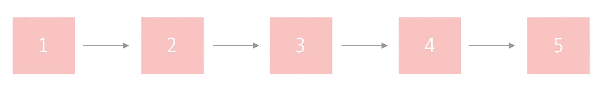
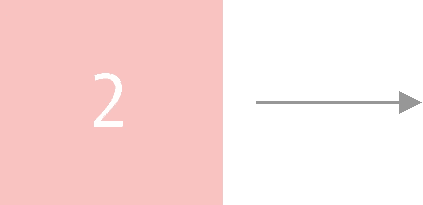
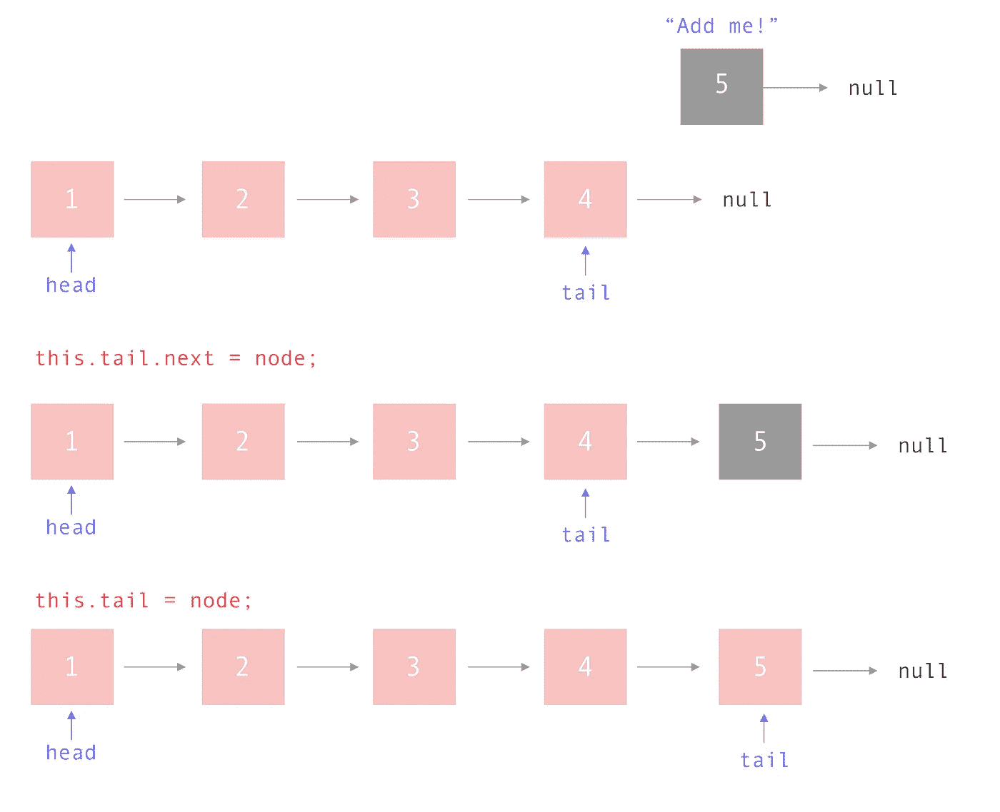
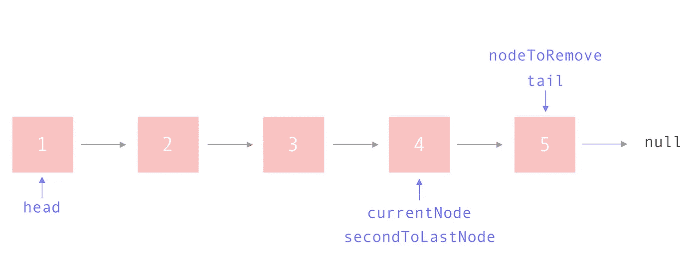
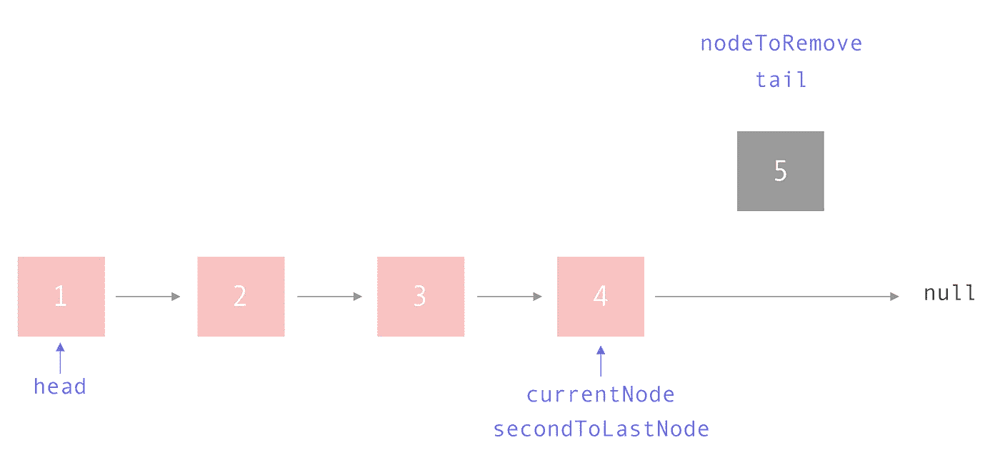
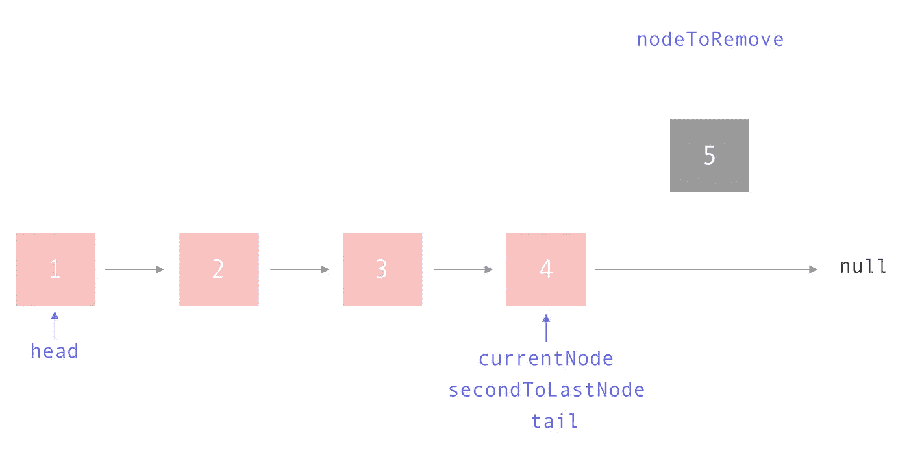

# 用 JavaScript 创建链表

> 原文：<https://itnext.io/creating-linked-lists-in-javascript-2980b0559324?source=collection_archive---------3----------------------->



# 什么是链表？

单链表是一种表示一系列节点的数据结构，其中每个节点指向列表中的下一个节点。相反，双向链表的节点指向它前后的元素。

与数组不同，链表不提供对列表中特定索引的固定时间访问。因此，如果您需要列表中的第三个元素，您必须遍历第一个和第二个节点才能到达它。

链表的一个好处是能够在固定的时间内从列表的开始和结尾添加和删除项目。

这些是在技术面试中会被问到的流行数据结构，所以让我们直接进入主题。

单链表可以是 **LIFO(后进先出)**或 **FIFO(先进先出)。**如果列表使用 LIFO 方法，节点将从同一端添加和删除。如果使用 FIFO，节点将被添加到一端，并从另一端删除。

此外，可以对链表进行排序。这意味着当每个节点被添加到列表中时，它被放置到相对于其他节点的适当位置。

# 结节

链表只是一系列节点，所以让我们从节点对象开始。



一个节点有两条信息:

*   指向列表中下一个项目的指针或引用(对于单链表)
*   节点的值

对于我们的节点，我们将创建一个函数，该函数接受一个值，并返回一个包含上述两个值的对象:指向下一个节点的指针和该节点的值。注意，我们可以只声明`value`而不是`value: value`。这是因为变量具有相同的名称。你可以在这里了解更多关于对象属性简写[的信息。](https://alligator.io/js/object-property-shorthand-es6/)

# 节点列表

现在，让我们深入研究 NodeList 类。这只是:一个节点列表。


我们的节点列表将包含五个方法:

*   `push(value)`:将一个值推到链表的末尾
*   `pop()`:从列表中弹出最后一个值
*   `get(index)`:从给定的索引中返回一个项目
*   `delete(index)`:从给定索引中删除一个项目
*   `isEmpty()`:返回一个布尔值，表示列表是否为空
*   `printList()`:一个方法，不是链表自带的，它将打印出我们的列表；它主要用于调试目的

## 构造器

我将使用 JavaScript 类语法，尽管您也可以使用闭包来创建链表。所以让我们来设置构造函数。

我们在构造函数中需要三条信息:

*   `head`:对列表开头节点的引用
*   `tail`:对列表末尾节点的引用
*   `length`:列表中有多少个节点

## IsEmpty

`isEmpty()`方法是一个 helper 函数，如果列表为空，它将返回 true。

## 打印列表

这个实用程序方法将打印列表中的节点。这仅仅是为了调试的目的。

## 推

我们的 push 方法需要在添加新节点之前检查列表是否为空。我们如何知道列表是否为空？两种方式:

*   我们的`isEmpty()`方法返回 true(列表的长度为零)
*   `head`指针为空

对于本例，我们将检查 head 是否为 null，尽管这两种解决方案都很好。

如果列表中没有条目，我们可以简单地设置指向新节点的`head`和`tail`指针，并更新列表的长度。

如果列表不为空，我们必须执行以下操作:

*   设置`tail.next`指向新节点
*   设置`tail`指向新节点
*   增加列表长度



以下是我们完整的推送方法:

## 流行音乐

我们的 pop 方法需要在移除列表中的最后一项之前检查以下两件事:

*   检查列表是否为空
*   检查列表中是否只有一个项目

我们可以使用我们的`isEmpty`方法来检查一个列表是否包含节点。

我们如何知道列表中是否只有一个节点？如果`head`和`tail`指向同一个节点。但是在这种情况下我们需要做什么呢？移除唯一的节点意味着我们实际上是在重置列表。

如果列表中有多个元素，我们可以执行以下操作:

```
while there are nodes in the list
  if the next node in the list is the tail
    update tail to point to the current node
    set the current node to point to null
    decrement the length of the list
    return the previous tail element
```

它看起来会像这样:

如果你很难想象这一点，让我们走一遍。

**第 6–10 行:**如果列表中的下一个节点是最后一个项目，则当前项目是新的“tail ”,因此我们需要保存它的引用。



**第 15 行:**更新`secondToLastNode`指向空。这是从列表中“弹出”最后一个元素的行为。



**第 16 行:**更新`tail`指向`secondToLastNode`。



**第 17 行:**减少列表的长度，因为我们刚刚删除了一个节点。

**第 18 行:**返回我们刚刚弹出的节点。

这是我们的完整 pop 方法:

## 得到

我们的 get 方法必须检查三种情况:

*   请求的索引超出了列表的界限
*   列表是空的
*   我们要求第一个元素

如果请求的索引不在列表中，则返回 null。

如果列表为空，则返回 null。你可以组合这些 if 语句，但是为了清楚起见，我把它们分开了。

如果我们请求第一个元素，返回头部。

否则，我们就一个接一个地遍历列表，直到找到我们要找的索引。

下面是完整的`get(index)`方法:

## 删除

我们的删除方法还必须考虑三种特殊的用例:

*   我们要删除的索引超出了列表的界限
*   列表是空的
*   我们想删除头部

如果我们要删除的索引不在列表中，返回 null。

如果列表为空，则返回 null。您可以将这个逻辑与确定索引是否超出列表边界的逻辑结合起来，但是为了清楚起见，我将它们分开。

如果我们想要删除头部，将`head`设置为列表中的下一个值，减少长度，并返回我们刚刚删除的值。

如果这些布尔值都不为真，则删除节点的逻辑如下:

```
while the iterator isn't the index we're looking for
  increase the iterator
  move the previous and current pointers up by one
save the current value as the node to be deleted
update the previous node's pointer to point to the next node
if the next value is null
  set tail to the new last node
decrement list length
return the deleted node
```

如果你需要可视化的帮助，请参考 Pop 部分的图表。

**delete 方法和 pop 方法的区别在于，pop 方法总是删除列表中的最后一项。相反，delete 方法可以删除介于 0 和列表长度之间的索引。**

下面是完整的删除方法:

如果你想玩代码，请随意使用我的[代码笔](https://codepen.io/emmawedekind/pen/zXbWzq?editors=0012)。