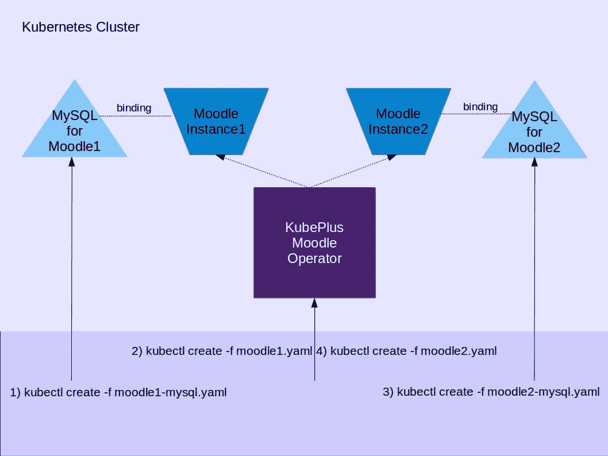

# 使用 Operator 模式在 Kubernetes 上创建多租户 Moodle 服务

> 原文：<https://itnext.io/creating-multi-tenant-moodle-service-on-kubernetes-using-operator-pattern-a4fd418d47ad?source=collection_archive---------1----------------------->

我们目前正在支持 [WisdmLabs](https://wisdmlabs.com/) 在 Kubernetes 上建立一个基于 Moodle 的电子学习平台。最近，我们完成了在 Kubernetes 集群上创建多租户 Moodle 环境的早期原型。在这里，我们提出了我们所面临的挑战和我们在实施过程中所做的选择。

[Moodle](https://moodle.org/) 是一个用 PHP 实现的开源电子学习平台。它是通过部署在 web 服务器(Nginx，Apache)上来安装的。它使用关系数据库来存储其运行时状态。它的基本功能可以通过安装各种插件来扩展。这些都可以在 [Moodle 插件库](https://moodle.org/plugins/)中找到。每个插件本质上都是一个 zip 文件，安装它相当于将插件的解压代码添加到 Moodle 安装目录下的一个合适的子目录中。

以下是运行在 Kubernetes 上的 Moodle 环境的基本要求，以满足计划中的托管电子学习平台的目标。

*   多租户:一个 Kubernetes 集群应该能够托管多个 Moodle 实例。这个需求源于这样一个事实，为每个 Moodle 实例创建一个新的集群是非常昂贵的(无论是价格还是时间)。此外，使用 Kubernetes 名称空间，可以在单个集群中实现多租户。
*   插件安装:在 Moodle 实例的整个生命周期中，应该可以很容易地安装插件。例如，在创建 Moodle 实例时，你可能想安装一些插件。然后，在已经运行的 Moodle 实例上，很少其他插件需要安装。此外，当 Moodle 版本需要更新时，应该可以在版本升级后重新安装之前安装在该实例上的所有插件。

**主要挑战**

*   **多租户:**

实现多租户 Moodle 设置有两个主要挑战。首先，每个 Moodle 实例需要在一个单独的端口上可用，以确保不同实例之间的流量得到适当的隔离。这意味着，每个 Moodle 实例的 web 服务器配置文件(定义监听端口)需要用所选的端口号进行更新。此外，可能需要重新启动 web 服务器进程，以使配置更改生效。第二，为了让 Moodle 实例可以公开访问，它的所有资源(表单动作、链接、URL 等等。)需要被创建并嵌入一个公共可访问的端点。Moodle 代码定义了一个可以为此设置的配置参数(wwwroot)，但是这个参数需要在触发 Moodle 安装之前设置*。*

*   **插件安装:**

插件安装的主要挑战是，每个插件在 Moodle 安装目录中都有一个唯一的子目录，它需要安装在这个目录中。当以非容器形式运行 Moodle 时，这个过程很简单——你下载所需插件的 zip 文件，并将其展开到 Moodle 安装目录下的适当子目录中。对于 Kubernetes 上的容器化设置，这变得很棘手，因为需要从外部访问正在运行的容器中的插件安装子目录。

总的来说，作为创建每个新 Moodle 实例的一部分，我们需要执行以下操作:

a)分配端口，b)更新实例的 web 服务器配置文件以包括端口号，c)启动 web 服务器，d)为实例创建可公开访问的端点，e)设置 wwwroot 变量，f)触发安装，g)一旦安装完成，安装任何插件。此外，支持在已经运行的 Moodle 实例上安装插件。

我们意识到 [Kubernetes 操作符模式](https://coreos.com/blog/introducing-operators.html)最适合这里，因为上述所有步骤本质上都是工作流动作，可以作为操作符中的 Moodle 实例状态协调逻辑有效地实现。一旦有了这样的操作符，管理员就可以使用简单的 kubectl 命令来创建 Moodle 实例并管理其上的插件。这也将使得上层 UI 层只使用一个接口与 Kubernetes 进行交互变得非常容易。

**KubePlus Moodle 操作员:**

下面是这个正在进行中的 Moodle 操作器的链接—[kube plus Moodle 操作器](https://github.com/cloud-ark/kubeplus-operators/tree/master/moodle)。

操作员由 Moodle 自定义资源和相关的自定义控制器组成。每个 Moodle 实例都需要一个 Mysql 实例。目前，Mysql 实例是使用标准的 Kubernetes yaml 定义作为单独的部署创建的。该计划是在未来使用 Mysql 运营商。

Moodle 操作符内部发生了什么？

*   Moodle 定制资源的[规范定义了一个字段来包含要安装在实例上的插件列表。对于每个支持的插件，运营商知道插件需要安装在 Moodle 安装目录上的确切位置。](https://github.com/cloud-ark/kubeplus-operators/blob/master/moodle/artifacts/moodle1.yaml)
*   当收到“kubectl create/apply”命令时，操作员首先创建 Moodle 实例，然后安装插件，或者如果实例已经存在，则只安装插件，从而协调 Moodle 实例的状态。
*   为了创建 Moodle 实例，操作员使用我们的自定义 Docker 映像，该映像由 Nginx 和 Moodle 组成。该图中 Nginx 的/etc/Nginx/sites-available/default . conf 文件被定义为监听一个端口，该端口的值由操作员作为环境变量注入。对于每个 Moodle 实例创建，操作者分配一个端口，创建服务(类型 NodePort)和入口对象，使用入口路径构造 wwwroot，并在启动容器时注入所选端口号和 wwwroot 作为环境变量。为了使对 Nginx 的配置更改生效，它在 Moodle 实例的部署对象中的 PostStart 容器生命周期挂钩中定义了 Nginx reload 动作。

您可以使用我们的 [KubePlus Plaform toolkit](https://github.com/cloud-ark/kubeplus) 来尝试 Moodle 操作器。在 Minikube 上部署 Moodle 实例的步骤可以在[这里](https://github.com/cloud-ark/kubeplus/blob/master/examples/moodle/steps.txt)找到。如果您遇到任何问题，请在这里报告它们[。我们的 Moodle 操作系统仍在研发中。我们还希望为运营商增加 Moodle 实例备份/恢复功能。](https://github.com/cloud-ark/kubeplus/issues)

为了实现计划中的托管电子学习平台的最终目标，Moodle 只是必需的运营商之一。它没有按照要求存在于社区中，因此我们最终自己开发了它。然而，我们将使用其他一些社区构建的运营商来构建这个端到端的应用平台。如前所述，我们将包括一个 Mysql 操作符。我们还想为每个 Moodle 实例支持 https 端点。为此，我们正在考虑使用 Traefik 或 T2 的证书管理器。

**总结:**

在这篇文章中，我们概述了在 Kubernetes 上开发多租户 Moodle 服务所面临的挑战。构建 Moodle 操作符使我们能够为在集群上部署和管理多个 Moodle 实例提供显著的易用性。

[www.cloudark.io](https://cloudark.io/)